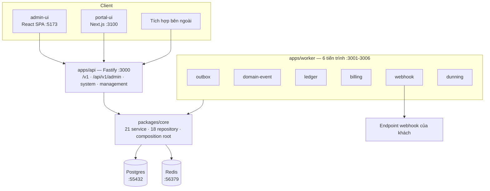

# Flow của Pinstripe

Mỗi file trong thư mục này mô tả **một luồng chạy hết một vòng**: bắt đầu từ đâu, đi qua file nào, chạm bảng nào, phát event gì, hỏng thì ra sao. Mỗi bước trỏ thẳng vào `file:line` để vừa đọc vừa mở code.

Tài liệu này trả lời câu hỏi **"chạy thế nào"**. Câu hỏi **"tại sao chọn cách đó"** nằm ở [docs/adr/](../adr/); bối cảnh domain ở [docs/RESEARCH.md](../RESEARCH.md); cách chạy máy ở [README.md](../../README.md).

## Bản đồ

Điểm đáng nhớ: **API và worker dùng chung một `corePlugin`** ([core.plugin.ts](../../packages/core/src/plugins/core.plugin.ts)), nên cùng service, cùng hành vi. Khác nhau chỉ ở chỗ ai gọi.

## Thứ tự đọc cho người mới

1. [01 — Request lifecycle](./01-request-lifecycle.md) — khung chung của mọi route
2. [02 — Event pipeline](./02-event-pipeline.md) — outbox, cách mọi thay đổi lan ra
3. [03 — Customer và catalog](./03-catalog-and-customer.md) — khuôn CRUD đơn giản nhất
4. [10 — Ledger](./10-ledger.md) — quy tắc tiền, nền của mọi thứ phía dưới

Bốn file đó là đủ để đọc hiểu phần còn lại theo nhu cầu.

## Muốn hiểu X thì đọc file nào

| Câu hỏi                                                           | File                                   |
| ----------------------------------------------------------------- | -------------------------------------- |
| Request đi qua những gì? API key, idempotency, lỗi trả về ra sao? | [01](./01-request-lifecycle.md)        |
| Webhook được gửi thế nào? Tại sao có outbox?                      | [02](./02-event-pipeline.md)           |
| CRUD, phân trang con trỏ, soft delete, version của giá            | [03](./03-catalog-and-customer.md)     |
| Trạng thái subscription, trial, gia hạn; khi nào khách bị chặn    | [04](./04-subscription-entitlement.md) |
| Nạp event dùng, chống trùng; tính tiền theo bậc, chia tỷ lệ       | [05](./05-metering-and-rating.md)      |
| Nháp → phát hành → thu → huỷ; credit note khác refund chỗ nào     | [06](./06-invoicing.md)                |
| Gọi PSP, xử lý bị từ chối, hoàn tiền                              | [07](./07-payments-and-refunds.md)     |
| Job nền tạo hoá đơn; mẫu scheduler + shard                        | [08](./08-billing-run.md)              |
| Thu hồi nợ, lịch retry, khi nào bỏ cuộc                           | [09](./09-dunning.md)                  |
| Bút toán kép, bất biến, đảo bút toán, số dư                       | [10](./10-ledger.md)                   |
| MRR, churn; đối chiếu PSP với sổ cái                              | [11](./11-reporting-reconciliation.md) |
| Nhảy thời gian để thử hành vi theo kỳ                             | [12](./12-test-clock.md)               |
| React Query, query key, form; portal-ui đọc dữ liệu thế nào       | [13](./13-frontend-data-flow.md)       |
| Chỗ nào dễ tự bắn vào chân; cần biết gì trước khi viết test       | [PITFALLS](../PITFALLS.md)             |

## Bốn quy tắc lặp lại ở mọi flow

Nắm bốn điều này thì đọc file nào cũng nhanh hơn:

1. **Thời gian luôn qua `fastify.clock`**, không bao giờ `new Date()`. Đó là cái làm test clock chạy được — [12](./12-test-clock.md).
2. **Ghi dữ liệu và ghi event nằm trong cùng transaction.** Service truyền `tx` xuống `outboxService.recordEvents(events, tx)` — [02](./02-event-pipeline.md).
3. **`find*` trả `null`, `get*` ném lỗi.** Repository luôn `find*`; service `get*` là nơi biến `null` thành `NotFoundError`.
4. **Tiền là số nguyên đơn vị nhỏ nhất**, đi qua `Money` với chính sách làm tròn tường minh — không bao giờ là float.

## Ba khe hở đã biết

Các flow chỉ ra chi tiết; liệt kê ở đây để không ai phải phát hiện lại:

| Vấn đề                                                               | Ở đâu                              |
| -------------------------------------------------------------------- | ---------------------------------- |
| Hàng outbox kẹt ở `publishing` hoặc `failed` không có cơ chế tự cứu  | [02](./02-event-pipeline.md)       |
| Confirm payment và ghi nhận trả tiền ở hai transaction khác nhau     | [07](./07-payments-and-refunds.md) |
| Dunning không bao giờ chuyển subscription sang `past_due` / `unpaid` | [09](./09-dunning.md)              |

Danh sách đầy đủ những gì chặn production nằm ở [ROADMAP.md](../ROADMAP.md).
