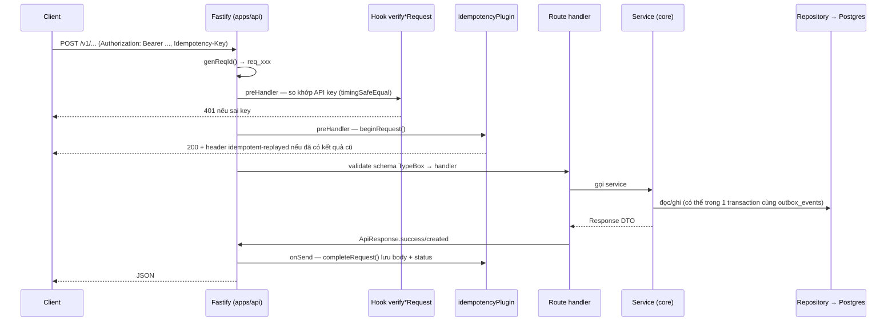

# Flow 01 — Vòng đời một HTTP request

Mọi route trong `apps/api` đều đi qua đúng chuỗi này. Các flow nghiệp vụ (03–12) chỉ mô tả phần "service làm gì"; phần khung trước và sau nằm ở đây.

## Khi nào chạy

Mỗi request tới `apps/api`, bất kể nhóm route nào.

## Sơ đồ



## Từng bước

| #   | Nơi xảy ra                                                                              | Làm gì                                                                                                      |
| --- | --------------------------------------------------------------------------------------- | ----------------------------------------------------------------------------------------------------------- |
| 1   | [server.ts:4](../../apps/api/src/server.ts)                                             | `buildApp()` rồi `fastify.listen(fastify.serverAddress)` — địa chỉ do config plugin decorate                |
| 2   | [app.ts:10-16](../../apps/api/src/app.ts)                                               | Tạo Fastify với `TypeBoxTypeProvider`, `genReqId` sinh `req_<random>` (id này đi vào mọi body lỗi)          |
| 3   | [app.ts:18](../../apps/api/src/app.ts)                                                  | `corePlugin` — composition root, xem bảng bên dưới                                                          |
| 4   | [app.ts:19](../../apps/api/src/app.ts)                                                  | `apiKeyPlugin` đọc 4 key từ config ra `fastify.apiKeys`                                                     |
| 5   | [app.ts:21-22](../../apps/api/src/app.ts)                                               | `errorHandlerPlugin` rồi `apiRoutes`                                                                        |
| 6   | [routes/routes.ts:9-13](../../apps/api/src/routes/routes.ts)                            | Gắn 5 nhóm route theo prefix                                                                                |
| 7   | [v1.routes.ts:22](../../apps/api/src/routes/v1/v1.routes.ts)                            | `addHook('preHandler', verifyApiRequest)` — chạy trước mọi route con                                        |
| 8   | [verify-api-request.ts:20-28](../../apps/api/src/hooks/verify-api-request.ts)           | `readBearerToken` — thiếu header `Authorization: Bearer` → `UnauthorizedError`                              |
| 9   | [verify-api-request.ts:9-18](../../apps/api/src/hooks/verify-api-request.ts)            | `matchesSecret` dùng `timingSafeEqual`, so độ dài trước để tránh throw                                      |
| 10  | [v1.routes.ts:24](../../apps/api/src/routes/v1/v1.routes.ts)                            | Đăng ký `idempotencyPlugin` cho toàn bộ `/v1`                                                               |
| 11  | [idempotency.plugin.ts:14-38](../../apps/api/src/plugins/idempotency.plugin.ts)         | `preHandler`: chỉ chạy khi method là POST/PUT/PATCH/DELETE **và** có header `idempotency-key`               |
| 12  | [idempotency.service.ts:37-75](../../packages/core/src/services/idempotency.service.ts) | `beginRequest` — hash params + body SHA-256, INSERT hàng `idempotency_keys` trạng thái `in_progress`        |
| 13  | Route handler                                                                           | Validate body/query bằng schema TypeBox rồi gọi service                                                     |
| 14  | [api-response.ts:3-15](../../apps/api/src/utils/api-response.ts)                        | `ApiResponse.success` (200) / `created` (201) / `accepted` (202)                                            |
| 15  | [idempotency.plugin.ts:40-58](../../apps/api/src/plugins/idempotency.plugin.ts)         | `onSend`: status ≥ 500 → `releaseRequest` (cho phép thử lại); còn lại → `completeRequest` lưu status + body |

## 5 nhóm route và key tương ứng

| Prefix               | Hook                      | Key trong `.env`     | Dùng cho                                                                            |
| -------------------- | ------------------------- | -------------------- | ----------------------------------------------------------------------------------- |
| `/healthz`           | không                     | —                    | health check, [public.routes.ts](../../apps/api/src/routes/public/public.routes.ts) |
| `/v1`                | `verifyApiRequest`        | `SECRET_API_KEY`     | API nghiệp vụ, có idempotency                                                       |
| `/api/v1/admin`      | `verifyAdminRequest`      | `ADMIN_API_KEY`      | ledger + reporting, có idempotency                                                  |
| `/api/v1/system`     | `verifySystemRequest`     | `SYSTEM_API_KEY`     | chỗ dành cho callback PSP (hiện mới có `/ping`)                                     |
| `/api/v1/management` | `verifyManagementRequest` | `MANAGEMENT_API_KEY` | vận hành: `POST /outbox/relay` chạy tay outbox relay                                |

Bốn hook đều gọi chung `readBearerToken` + `matchesSecret`, chỉ khác key đem ra so.

## Composition root

`corePlugin` đăng ký 7 plugin theo đúng thứ tự phụ thuộc — [core.plugin.ts:11-17](../../packages/core/src/plugins/core.plugin.ts):

| Thứ tự | Plugin                                                                                         | Decorate ra                                                                                 |
| ------ | ---------------------------------------------------------------------------------------------- | ------------------------------------------------------------------------------------------- |
| 1      | [config.plugin.ts](../../packages/core/src/plugins/config.plugin.ts)                           | `config`, `clock`, `redisKeyFactory`, `serverAddress`, `workerAddress`, `workflowSchedules` |
| 2      | [database.plugin.ts](../../packages/core/src/plugins/database.plugin.ts)                       | `database` (Drizzle + postgres.js), đóng ở hook `onClose`                                   |
| 3      | [redis.plugin.ts](../../packages/core/src/plugins/redis.plugin.ts)                             | `redis` (ioredis, có `keyPrefix`)                                                           |
| 4      | [queue.plugin.ts](../../packages/core/src/plugins/queue.plugin.ts)                             | `queues` — `QueueRegistry`, connection Redis riêng                                          |
| 5      | [psp.plugin.ts](../../packages/core/src/plugins/psp.plugin.ts)                                 | `psp` — `MockPspClient`                                                                     |
| 6      | [repository-registry.plugin.ts](../../packages/core/src/plugins/repository-registry.plugin.ts) | 18 repository                                                                               |
| 7      | [service-registry.plugin.ts](../../packages/core/src/plugins/service-registry.plugin.ts)       | 21 service                                                                                  |

Không có `new XService()` rải rác trong code nghiệp vụ: service nhận nguyên `fastify` và lấy phụ thuộc qua `this.fastify.<tên>`. Kiểu của các decorate nằm ở [fastify.augmentation.ts](../../packages/core/src/plugins/fastify.augmentation.ts).

`apps/worker` dùng lại đúng `corePlugin` này ([context.ts:12](../../apps/worker/src/context.ts)) — nên service trong worker và trong API là cùng một lớp, cùng hành vi.

## Idempotency — ba nhánh

`beginRequest` quyết định dựa trên hàng `idempotency_keys` đã có:

| Tình huống                      | Kết quả                                                                                       |
| ------------------------------- | --------------------------------------------------------------------------------------------- |
| Chưa có key → INSERT thành công | trả ticket, request chạy bình thường                                                          |
| Có key, `requestHash` khác      | `IdempotencyConflictError` — cùng key nhưng khác body hoặc khác path param                    |
| Có key, status `in_progress`    | `IdempotencyInProgressError` — đang chạy song song                                            |
| Có key, status `succeeded`      | replay: trả lại `responseStatusCode` + `responseBody`, kèm header `idempotent-replayed: true` |

Hash lấy từ path params + body (`JSON.stringify({ params, body })`, SHA-256) — [idempotency.service.ts](../../packages/core/src/services/idempotency.service.ts). Params nằm trong hash vì `route` lưu route template (`/v1/invoices/:invoiceId/finalize`), không phải URL thật. Hàng hết hạn sau `IDEMPOTENCY_RETENTION_HOURS`. Chi tiết: [docs/technique/02-idempotency.md](../technique/02-idempotency.md).

## Lỗi trả ra sao

[error-handler.plugin.ts:26-58](../../apps/api/src/plugins/error-handler.plugin.ts) map mọi lỗi về một hình dạng kiểu Stripe:

```json
{
  "error": {
    "type": "...",
    "code": "...",
    "param": "...",
    "message": "...",
    "requestId": "req_xxx"
  }
}
```

| Loại lỗi                | Status              | type                                                              |
| ----------------------- | ------------------- | ----------------------------------------------------------------- |
| `AppError` (và lớp con) | `error.statusCode`  | `error.type`                                                      |
| Lỗi validation schema   | 400                 | `invalid_request_error`, code `parameter_invalid`                 |
| Còn lại                 | `statusCode ?? 500` | `api_error`, message bị nuốt thành `An unexpected error occurred` |
| Không khớp route        | 404                 | `invalid_request_error`, code `resource_missing`                  |

Chỉ `AppError` mới lộ message ra ngoài — lỗi lạ luôn bị che, chi tiết chỉ nằm trong log kèm `requestId`.

## Đọc tiếp

- [02 — Event pipeline](./02-event-pipeline.md): điều xảy ra sau khi service ghi `outbox_events` trong cùng transaction với dữ liệu nghiệp vụ.
- ADR liên quan: [0001 phase 0 foundation](../adr/0001-phase-0-foundation.md), [0006 rule compliance](../adr/0006-rule-compliance.md).
