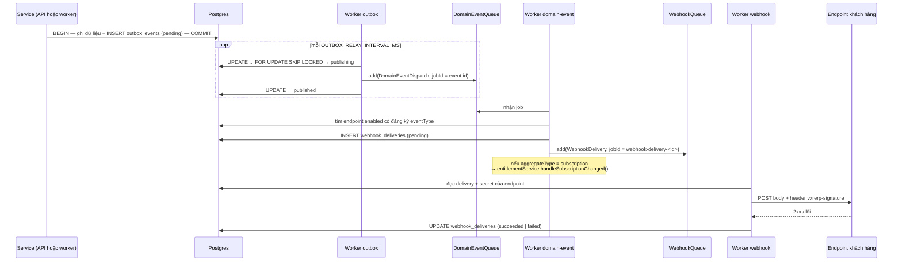

# Flow 02 — Outbox → domain event → webhook

Đây là đường đi chung của mọi thay đổi trạng thái trong hệ thống. Flow 03–12 kết thúc ở chỗ "ghi `outbox_events`"; từ đó trở đi là file này.

## Khi nào chạy

- Nhánh ghi: mỗi khi một service gọi `outboxService.recordEvents(...)`, luôn trong **cùng transaction** với dữ liệu nghiệp vụ.
- Nhánh đọc: worker `outbox` quét định kỳ mỗi `OUTBOX_RELAY_INTERVAL_MS`; hoặc gọi tay `POST /api/v1/management/outbox/relay`.

## Sơ đồ

## Chặng 1 — ghi outbox cùng transaction

| #   | Nơi xảy ra                                                                                          | Làm gì                                                                                                     |
| --- | --------------------------------------------------------------------------------------------------- | ---------------------------------------------------------------------------------------------------------- |
| 1   | [outbox.service.ts:22-41](../../packages/core/src/services/outbox.service.ts)                       | `recordEvents(events, executor)` — sinh id `evt_...`, đóng dấu `occurredAt` bằng `clock.now()`             |
| 2   | [outbox-event.repository.ts:36-47](../../packages/core/src/repositories/outbox-event.repository.ts) | INSERT dùng `executor ?? this._db.master` — truyền transaction vào là ghi chung, không truyền là ghi riêng |

Điểm mấu chốt: `executor` chính là lý do outbox pattern hoạt động. Nếu service ghi invoice và sự kiện trong cùng `db.transaction(...)`, hai việc đó cùng commit hoặc cùng rollback — không bao giờ có chuyện invoice tồn tại mà event biến mất, hay ngược lại.

Hàng mới luôn ở trạng thái `pending` — mặc định của cột, [outbox-events.schema.ts:13](../../packages/core/src/database/schemas/outbox-events.schema.ts).

## Chặng 2 — relay

| #   | Nơi xảy ra                                                                                          | Làm gì                                                                                                                                |
| --- | --------------------------------------------------------------------------------------------------- | ------------------------------------------------------------------------------------------------------------------------------------- |
| 3   | [outbox.workflow.ts:39-49](../../apps/worker/src/workflows/outbox.workflow.ts)                      | `upsertJobScheduler('outbox-relay-scheduler', { every: outboxRelayIntervalMs })`                                                      |
| 4   | [outbox-relay.processor.ts:9](../../apps/worker/src/workflows/processors/outbox-relay.processor.ts) | gọi `outboxService.relayOutboxEvents(batchSize)`                                                                                      |
| 5   | [outbox-event.repository.ts:59-91](../../packages/core/src/repositories/outbox-event.repository.ts) | `claimOutboxEvents` — một câu `UPDATE ... WHERE id IN (SELECT ... FOR UPDATE SKIP LOCKED) RETURNING`, chuyển `pending` → `publishing` |
| 6   | [outbox.service.ts:78-93](../../packages/core/src/services/outbox.service.ts)                       | `dispatchDomainEvent` — đẩy job với `jobId: event.id`                                                                                 |
| 7   | [outbox.service.ts:70-73](../../packages/core/src/services/outbox.service.ts)                       | những id đẩy thành công → `published` (ghi `publishedAt`)                                                                             |
| 8   | [outbox.service.ts:56-67](../../packages/core/src/services/outbox.service.ts)                       | đẩy lỗi → `failed`, tăng `attemptCount`, lưu `lastError`                                                                              |

`FOR UPDATE SKIP LOCKED` là thứ cho phép chạy nhiều tiến trình relay song song mà không gửi trùng: hàng nào đang bị một tiến trình khác giữ thì bỏ qua, không chờ.

`jobId: event.id` là lớp chống trùng thứ hai — BullMQ từ chối job trùng id, nên một event bị relay hai lần cũng chỉ sinh một job dispatch.

## Chặng 3 — dispatch

| #   | Nơi xảy ra                                                                                                                | Làm gì                                                                                                        |
| --- | ------------------------------------------------------------------------------------------------------------------------- | ------------------------------------------------------------------------------------------------------------- |
| 9   | [domain-event-dispatch.processor.ts:12](../../apps/worker/src/workflows/processors/domain-event-dispatch.processor.ts)    | `webhookService.handleDomainEvent(job.data)`                                                                  |
| 10  | [webhook.service.ts:130-136](../../packages/core/src/services/webhook.service.ts)                                         | lấy tối đa 200 endpoint `enabled`, lọc theo `enabledEvents` chứa `eventType`                                  |
| 11  | [webhook.service.ts:142-166](../../packages/core/src/services/webhook.service.ts)                                         | dựng payload `{ id, type, createdAt, data: { object } }` rồi INSERT `webhook_deliveries` trạng thái `pending` |
| 12  | [webhook.service.ts:177-188](../../packages/core/src/services/webhook.service.ts)                                         | đẩy `WebhookDelivery` với `attempts: WEBHOOK_MAX_ATTEMPTS`, backoff mũ từ `WEBHOOK_BACKOFF_MS`                |
| 13  | [domain-event-dispatch.processor.ts:21-30](../../apps/worker/src/workflows/processors/domain-event-dispatch.processor.ts) | nếu `aggregateType = subscription` → `entitlementService.handleSubscriptionChanged(aggregateId)`              |

Bước 13 là consumer nội bộ duy nhất hiện có. Mọi `aggregateType` khác chỉ sinh webhook rồi dừng ở nhánh `log.debug('... no consumer for this event yet')`.

## Chặng 4 — giao webhook

| #   | Nơi xảy ra                                                                                                      | Làm gì                                                                 |
| --- | --------------------------------------------------------------------------------------------------------------- | ---------------------------------------------------------------------- |
| 14  | [webhook-delivery.processor.ts:17](../../apps/worker/src/workflows/processors/webhook-delivery.processor.ts)    | `resolveDeliveryAttempt(deliveryId)` — lấy url + body + chữ ký         |
| 15  | [webhook.service.ts:203](../../packages/core/src/services/webhook.service.ts)                                   | ký bằng secret của endpoint tại thời điểm gửi                          |
| 16  | [webhook-signature.ts:10-15](../../packages/core/src/utils/webhook-signature.ts)                                | HMAC-SHA256 trên `<timestamp>.<body>`, header dạng `t=<unix>,v1=<hex>` |
| 17  | [webhook-delivery.processor.ts:45-53](../../apps/worker/src/workflows/processors/webhook-delivery.processor.ts) | `fetch` POST, header `vxrerp-signature`, timeout `WEBHOOK_TIMEOUT_MS`  |
| 18  | [webhook.service.ts:207-220](../../packages/core/src/services/webhook.service.ts)                               | ghi kết quả: `succeeded` + `deliveredAt`, hoặc `failed` + `lastError`  |
| 19  | [webhook-delivery.processor.ts:36](../../apps/worker/src/workflows/processors/webhook-delivery.processor.ts)    | thất bại thì `throw` để BullMQ retry                                   |

Chỉ status 2xx (`response.ok`) mới tính là thành công. `attemptCount` lấy từ `job.attemptsMade + 1`, nên hàng trong DB phản ánh đúng lần thử thứ mấy.

## Bảng DB chạm vào

| Bảng                 | Vai trò                                                                                                                                   |
| -------------------- | ----------------------------------------------------------------------------------------------------------------------------------------- |
| `outbox_events`      | hàng chờ, `status` ∈ pending / publishing / published / failed ([events.types.ts:1-6](../../packages/core/src/contracts/events.types.ts)) |
| `webhook_endpoints`  | url, `secret` (`whsec_...`), `enabled_events`                                                                                             |
| `webhook_deliveries` | một hàng cho mỗi (event × endpoint), giữ nguyên payload đã gửi                                                                            |

## Danh mục event

25 loại, khai báo ở [events.types.ts:24-50](../../packages/core/src/contracts/events.types.ts) — `customer.*`, `product.*`, `price.*`, `ledger.transaction.*`, `subscription.*`, `test_clock.advanced`, `meter.created`, `invoice.*`, `credit_note.created`, `payment_intent.succeeded|failed`, `refund.created`. Chuỗi trong `enabledEvents` của endpoint phải khớp đúng các giá trị này.

## Thất bại thì sao

| Hỏng ở đâu                          | Hệ quả                                                     | Cách xử lý                                                    |
| ----------------------------------- | ---------------------------------------------------------- | ------------------------------------------------------------- |
| Transaction nghiệp vụ rollback      | không có hàng outbox nào                                   | không cần làm gì, đúng như mong muốn                          |
| Relay chết giữa chừng sau khi claim | hàng kẹt ở `publishing`                                    | **chưa có cơ chế tự cứu** — cần đặt lại về `pending` bằng tay |
| Đẩy job lỗi                         | hàng thành `failed`, có `lastError`                        | không tự retry; phải đặt lại `pending`                        |
| Endpoint trả non-2xx                | delivery `failed`, BullMQ retry tới `WEBHOOK_MAX_ATTEMPTS` | hết lượt thì job nằm ở failed set của queue                   |
| Endpoint chậm                       | `AbortSignal.timeout` cắt, tính là lỗi                     | như trên                                                      |

Hai dòng in đậm là rủi ro vận hành đã biết — xem [ROADMAP.md](../ROADMAP.md) phần chặn production.

## Đọc tiếp

- ADR liên quan: [0001 foundation](../adr/0001-phase-0-foundation.md), [0011 dunning + webhooks](../adr/0011-phase-8-dunning-webhooks.md).
