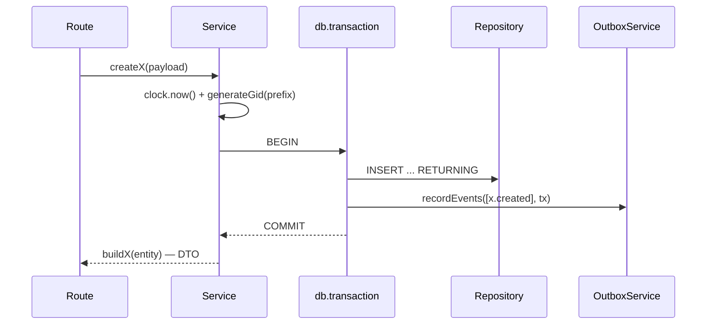

# Flow 03 — Customer và catalog (product, price)

Ba resource nền: mọi thứ sau này (subscription, invoice, payment) đều trỏ về chúng. Cả ba theo cùng một khuôn CRUD, nên đọc kỹ `customer` là hiểu hai cái còn lại.

## Khi nào chạy

Khi client gọi `POST/GET /v1/customers`, `/v1/products`, `/v1/prices` — hoặc khi erp-ui thao tác trên các trang tương ứng.

## Khuôn chung của một lệnh ghi

Ba chi tiết lặp lại ở mọi service:

- **Thời gian lấy từ `fastify.clock`**, không bao giờ `new Date()` trực tiếp — đó là thứ cho phép test clock (flow 12) hoạt động.
- **Id sinh ở service**, không để DB sinh — `generateGid(ObjectPrefixEnum.X)` ra `cus_...`, `prod_...`, `price_...`. Định dạng và lý do chọn ở [docs/technique/01-identifier-gid-uuidv7-typeid.md](../technique/01-identifier-gid-uuidv7-typeid.md).
- **Event ghi trong cùng `tx`** — xem [flow 02](./02-event-pipeline.md).

## Customer

| #   | Nơi xảy ra                                                                                  | Làm gì                                                              |
| --- | ------------------------------------------------------------------------------------------- | ------------------------------------------------------------------- |
| 1   | [customers.routes.ts:14-22](../../apps/api/src/routes/v1/customers/customers.routes.ts)     | `POST /` — body theo `createCustomerSchema`, trả 201                |
| 2   | [customer.service.ts:27-34](../../packages/core/src/services/customer.service.ts)           | `createCustomer` — lấy `now`, sinh id, gọi `writeCustomer`          |
| 3   | [customer.service.ts:42-78](../../packages/core/src/services/customer.service.ts)           | transaction: INSERT + `customer.created`                            |
| 4   | [customer.service.ts:79-88](../../packages/core/src/services/customer.service.ts)           | bắt `isUniqueViolation` → `ConflictError` với `param: 'email'`      |
| 5   | [customer.repository.ts:54-62](../../packages/core/src/repositories/customer.repository.ts) | `createCustomer(payload, executor)` — `executor ?? this._db.master` |

Các thao tác còn lại:

| Route                 | Service                                                                        | Ghi chú                                                                                             |
| --------------------- | ------------------------------------------------------------------------------ | --------------------------------------------------------------------------------------------------- |
| `GET /:customerId`    | [getCustomer:91-99](../../packages/core/src/services/customer.service.ts)      | repo trả `null` → service `throw NotFoundError`. Đây là ranh giới `find*` (repo) ↔ `get*` (service) |
| `POST /:customerId`   | [updateCustomer:101-131](../../packages/core/src/services/customer.service.ts) | `getCustomer` trước để có 404 đúng, rồi UPDATE + `customer.updated`                                 |
| `DELETE /:customerId` | [deleteCustomer:133-152](../../packages/core/src/services/customer.service.ts) | **soft delete**: `archiveCustomer` chỉ set `deletedAt`; trả `{ object, id, deleted: true }`         |
| `GET /`               | [findCustomers:154-170](../../packages/core/src/services/customer.service.ts)  | phân trang con trỏ, xem bên dưới                                                                    |

Soft delete xuyên suốt repository: mọi `findCustomer(s)` đều kèm `isNull(customers.deletedAt)` — [customer.repository.ts:25,36](../../packages/core/src/repositories/customer.repository.ts). Unique index trên email cũng chỉ áp cho hàng chưa xoá: `where deleted_at is null and email is not null` — [customers.schema.ts:27-29](../../packages/core/src/database/schemas/customers.schema.ts). Nhờ vậy một email đã xoá có thể dùng lại.

## Phân trang con trỏ

Kiểu Stripe, không dùng offset:

1. Service đổi `after` / `before` (là **id**) thành một `RowCursor { createdAt, id }` — [customer.service.ts:172-184](../../packages/core/src/services/customer.service.ts). Id không tồn tại → 404 ngay.
2. Repo so sánh bộ đôi: `(created_at, id) < (cursor.createdAt, cursor.id)` — [customer.repository.ts:38-43](../../packages/core/src/repositories/customer.repository.ts). Index `customers_created_at_id_idx` phục vụ đúng thứ tự này.
3. Service query `limit + 1` hàng, `hasMore = rows.length > limit`, rồi cắt về `limit` — [customer.service.ts:158-169](../../packages/core/src/services/customer.service.ts).

Vỏ response luôn là `{ url, hasMore, data }`. Không có trường `object`, xem [ADR 0021](../adr/0021-iso-timestamps-and-no-object-field.md).

## Product

Giống hệt customer nhưng không có email nên không có nhánh conflict — [product.service.ts:20-59](../../packages/core/src/services/product.service.ts). Không có `DELETE`; muốn ẩn thì `POST /:productId` với `active: false`.

## Price — phần khác biệt đáng chú ý

Price là nơi duy nhất trong nhóm này có logic thật:

| Điều                     | Ở đâu                                                                               | Nội dung                                                                       |
| ------------------------ | ----------------------------------------------------------------------------------- | ------------------------------------------------------------------------------ |
| Kiểm tra product tồn tại | [price.service.ts:32](../../packages/core/src/services/price.service.ts)            | gọi `productService.getProduct` — service gọi service, không đi tắt xuống repo |
| Ràng buộc hình dạng      | [assertPriceShape:232-272](../../packages/core/src/services/price.service.ts)       | 6 quy tắc, mỗi vi phạm là một `BadRequestError` có `param`                     |
| Ràng buộc ở DB           | [prices.schema.ts:65-84](../../packages/core/src/database/schemas/prices.schema.ts) | 5 `CHECK` constraint lặp lại đúng các quy tắc đó — tầng phòng thủ thứ hai      |
| Đánh version             | [resolveNextVersion:208-216](../../packages/core/src/services/price.service.ts)     | cùng `lookupKey` → version tăng dần, unique index `(lookup_key, version)`      |
| Chọn giá theo thời điểm  | [resolvePrice:172-182](../../packages/core/src/services/price.service.ts)           | `findEffectivePrice(lookupKey, at)` — giá có `effectiveAt <= at` mới nhất      |

Sáu quy tắc hình dạng:

| Điều kiện                  | Bắt buộc                                          |
| -------------------------- | ------------------------------------------------- |
| `usageType = metered`      | phải có `meterId`                                 |
| `usageType ≠ metered`      | cấm `meterId`                                     |
| `billingScheme = per_unit` | phải có `unitAmount`                              |
| `billingScheme = tiered`   | phải có `tiers`                                   |
| `billingScheme = tiered`   | phải có `tiersMode`                               |
| có `tiers`                 | bậc cuối phải `upTo: null` (bắt hết phần còn lại) |

`resolvePrice` + version là nền cho tính bất biến của invoice: hoá đơn đã phát hành trỏ tới một `price.id` cụ thể, nên sửa bảng giá sau đó không làm đổi hoá đơn cũ.

## Bảng DB

| Bảng        | Điểm cần nhớ                                                                         |
| ----------- | ------------------------------------------------------------------------------------ |
| `customers` | `balance` (bigint, đơn vị nhỏ nhất) mặc định 0; `currency` NOT NULL; soft delete     |
| `products`  | có cột `deleted_at` nhưng flow hiện tại không dùng                                   |
| `prices`    | `unit_amount` bigint nullable (chỉ per_unit dùng); `tiers` jsonb; 5 CHECK constraint |

Tiền luôn là số nguyên đơn vị nhỏ nhất (cent / đồng), không bao giờ float — tiện ích ở [utils/money.ts](../../packages/core/src/utils/money.ts).

## Event phát ra

`customer.created` / `.updated` / `.deleted`, `product.created` / `.updated`, `price.created` / `.updated`. Hiện chưa có consumer nội bộ nào — chỉ đi ra webhook ([flow 02](./02-event-pipeline.md)).

## Đọc tiếp

- [04 — Subscription và entitlement](./04-subscription-entitlement.md)
- [technique 05 — Product và price](../technique/05-product-and-price.md) — vì sao tách hai bảng, một catalog thật đổ vào đó ra sao
- ADR: [0002 customer + catalog](../adr/0002-phase-1-customer-catalog.md), [0004 nullability policy](../adr/0004-nullability-policy.md)
