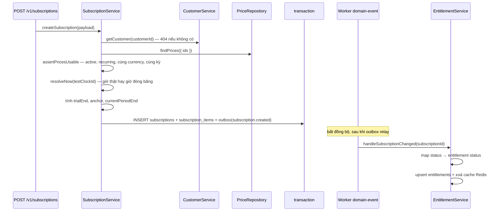
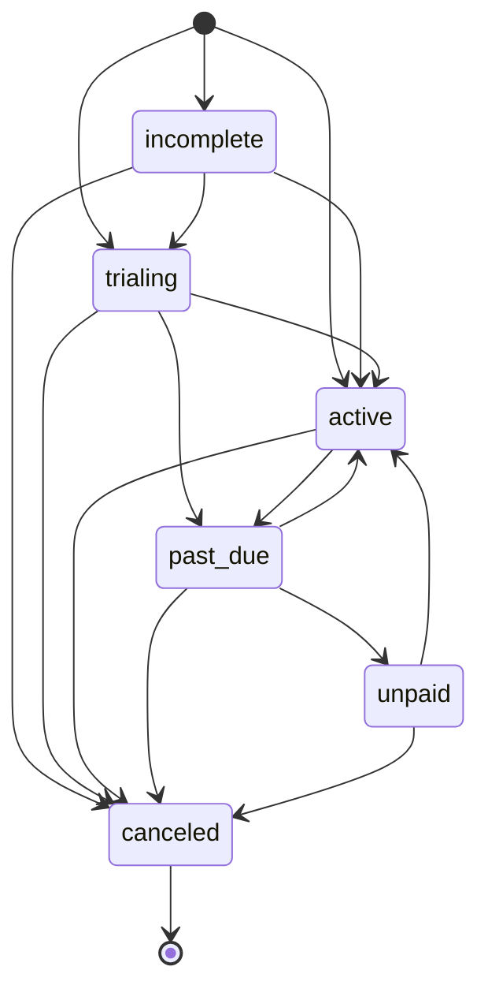

# Flow 04 — Subscription và entitlement

Subscription giữ **trạng thái thanh toán**; entitlement trả lời **khách này còn được dùng sản phẩm không**. Hai thứ được tách hẳn, nối với nhau bằng một event chạy bất đồng bộ — đó là điểm dễ hiểu nhầm nhất của flow này.

## Khi nào chạy

- `POST /v1/subscriptions` — tạo mới.
- `POST /v1/subscriptions/:subscriptionId` — đổi item / `cancelAtPeriodEnd` / metadata.
- `DELETE /v1/subscriptions/:subscriptionId` — huỷ.
- Gia hạn kỳ (`advanceSubscriptions`): **chỉ** khi test clock nhảy giờ — [flow 12](./12-test-clock.md). Billing run không đẩy kỳ, nó chỉ tạo hoá đơn nháp — [flow 08](./08-billing-run.md).
- Đồng bộ entitlement: worker `domain-event` mỗi khi có event `subscription.*`.

## Sơ đồ tạo subscription

**Entitlement không được ghi trong request.** Client tạo subscription xong gọi ngay `GET /v1/entitlements` có thể chưa thấy gì — phải đợi outbox relay (mặc định vài giây) rồi worker `domain-event` xử lý.

## Tạo — từng bước

| #   | Nơi xảy ra                                                                                            | Làm gì                                                                                            |
| --- | ----------------------------------------------------------------------------------------------------- | ------------------------------------------------------------------------------------------------- |
| 1   | [subscription.service.ts:43](../../packages/modules/billing/src/services/subscription.service.ts)     | `customerService.getCustomer` — lấy `currency` và `testClockId` của khách                         |
| 2   | [subscription.service.ts:44](../../packages/modules/billing/src/services/subscription.service.ts)     | `resolvePrices` — thiếu bất kỳ price nào là `NotFoundError`                                       |
| 3   | [subscription.service.ts:45](../../packages/modules/billing/src/services/subscription.service.ts)     | `resolveNow(customer.testClockId)` — xem mục dưới                                                 |
| 4   | [assertPricesUsable:467-510](../../packages/modules/billing/src/services/subscription.service.ts)     | 5 kiểm tra, xem bảng                                                                              |
| 5   | [resolveTrialEnd:441-451](../../packages/modules/billing/src/services/subscription.service.ts)        | `trialEnd` tường minh, hoặc `trialPeriodDays` cộng vào `now`, hoặc `null`                         |
| 6   | [subscription.service.ts:51-53](../../packages/modules/billing/src/services/subscription.service.ts)  | `anchor` = `billingCycleAnchor` ?? `trialEnd` ?? `now`                                            |
| 7   | [subscription.service.ts:71-76](../../packages/modules/billing/src/services/subscription.service.ts)  | status `trialing` hay `active`; `currentPeriodEnd` = `trialEnd` hoặc `advancePeriod(anchor, ...)` |
| 8   | [subscription.service.ts:66-103](../../packages/modules/billing/src/services/subscription.service.ts) | transaction: subscription + items + `subscription.created`                                        |

### 5 kiểm tra trên price

| Kiểm tra                                   | Lỗi khi vi phạm                                                    |
| ------------------------------------------ | ------------------------------------------------------------------ |
| `price.active`                             | `Price ... is archived and cannot be subscribed to`                |
| `price.type = recurring`                   | `... is one time and cannot be subscribed to`                      |
| `price.currency = customer.currency`       | `... is in X but the customer bills in Y`                          |
| có ít nhất 1 price                         | `A subscription needs at least one price`                          |
| mọi price cùng `(interval, intervalCount)` | `Every price on a subscription must share the same billing period` |

Tất cả là `BadRequestError` với `param: 'items'`.

## Máy trạng thái

Bảng chuyển trạng thái khai báo tại [subscriptions.types.ts:22-44](../../packages/modules/billing/src/contracts/subscriptions.types.ts):

`assertTransition` — [subscription.service.ts:512-516](../../packages/modules/billing/src/services/subscription.service.ts) — chặn mọi bước không nằm trong bảng bằng `ConflictError`. `canceled` là trạng thái cuối: danh sách đích rỗng, nên không đường nào quay ra.

## Gia hạn kỳ

`advanceSubscriptions` / `advanceSubscription` / `rollPeriod` — [subscription.service.ts:276-348](../../packages/modules/billing/src/services/subscription.service.ts). Hiện chỉ có **một** nơi gọi: [test-clock.service.ts:96](../../packages/modules/billing/src/services/test-clock.service.ts). Tham số đầu là `testClockId`, nên subscription của khách không gắn test clock chưa bao giờ được đẩy kỳ tự động — đây là một khoảng trống đã biết, không phải thiết kế cố ý.

1. Lấy các subscription chưa huỷ, thuộc test clock đó, có `currentPeriodEnd <= now` (tối đa 500).
2. Lặp `rollPeriod` tới khi `currentPeriodEnd > now`, tối đa `MAX_PERIOD_ROLLS = 120` lần — chặn vòng lặp vô hạn khi nhảy thời gian quá xa.
3. Mỗi lần roll:
   - `cancelAtPeriodEnd = true` → chuyển `canceled`, `endedAt = periodEnd`, event `subscription.canceled`.
   - đang `trialing` → `active`, event `subscription.trial_ended`.
   - còn lại → `active`, kỳ mới, event `subscription.renewed`.

`advancePeriod` — [billing-period.ts:31-45](../../packages/modules/billing/src/utils/billing-period.ts) — cộng theo day/week/month/year; `addMonths` kẹp ngày về ngày cuối tháng đích, nên 31/01 + 1 tháng ra 28/02 chứ không tràn sang 03/03.

Mốc thời gian của kỳ mới là `periodEnd` cũ, **không phải** `now` — nhờ vậy nhảy nhiều kỳ liền vẫn ra đúng lưới thời gian, không bị trôi.

## Entitlement

| #   | Nơi xảy ra                                                                                                  | Làm gì                                                                           |
| --- | ----------------------------------------------------------------------------------------------------------- | -------------------------------------------------------------------------------- |
| 1   | [billing-domain-event.plugin.ts](../../packages/modules/billing/src/plugins/billing-domain-event.plugin.ts) | mọi event có `aggregateType = subscription`                                      |
| 2   | [entitlement.service.ts:37](../../packages/modules/billing/src/services/entitlement.service.ts)             | tra `ENTITLEMENT_BY_SUBSCRIPTION_STATUS`                                         |
| 3   | [entitlement.service.ts:40-50](../../packages/modules/billing/src/services/entitlement.service.ts)          | `revoked` → `revokeEntitlements` cho cả subscription rồi xoá cache               |
| 4   | [entitlement.service.ts:52-73](../../packages/modules/billing/src/services/entitlement.service.ts)          | còn lại → `upsertEntitlement` một hàng cho mỗi `productId` của các price đang có |

Bảng ánh xạ — [entitlement.service.ts:18-25](../../packages/modules/billing/src/services/entitlement.service.ts):

| Subscription | Entitlement | Nghĩa                                      |
| ------------ | ----------- | ------------------------------------------ |
| `incomplete` | `blocked`   | chưa trả tiền lần đầu                      |
| `trialing`   | `active`    | dùng được                                  |
| `active`     | `active`    | dùng được                                  |
| `past_due`   | `active`    | **vẫn cho dùng** trong lúc dunning thử lại |
| `unpaid`     | `blocked`   | hết đường dunning                          |
| `canceled`   | `revoked`   |                                            |

Hàng `past_due → active` là một quyết định nghiệp vụ, không phải sơ suất: khách quá hạn vẫn được phục vụ trong lúc [flow 09 dunning](./09-dunning.md) thử thu lại, chỉ cắt khi rơi xuống `unpaid`.

## Cache entitlement

`getEntitlementStatus` — [entitlement.service.ts:76-97](../../packages/modules/billing/src/services/entitlement.service.ts) — cache Redis TTL 300 giây, key dựng bởi `redisKeyFactory` với namespace `entitlement`. Không tìm thấy hàng `active` thì trả `revoked` và cache luôn kết quả đó. Mọi lần ghi entitlement đều `invalidateCache` — [entitlement.service.ts:115-129](../../packages/modules/billing/src/services/entitlement.service.ts).

Lưu ý: `GET /v1/entitlements` **không** đi qua cache, nó đọc thẳng DB. Cache chỉ phục vụ `getEntitlementStatus` (một khách, một product).

## Bảng DB

| Bảng                 | Điểm cần nhớ                                                                                                                                                                                                                                     |
| -------------------- | ------------------------------------------------------------------------------------------------------------------------------------------------------------------------------------------------------------------------------------------------ |
| `subscriptions`      | `currentPeriodStart/End`, `chargedThroughDate`, `trialStart/End`, `canceledAt`, `endedAt`, `testClockId` — các cột nullable ở đây đều là trạng thái thật ("chưa xảy ra")                                                                         |
| `subscription_items` | `replaceSubscriptionItems` thay toàn bộ, không patch từng dòng. `created_at`/`deleted_at` là vòng đời; `billed_from`/`billed_through`/`invoiced_through` là **cửa sổ tính tiền** và dưới `prorationBehavior: none` chúng cố ý lệch khỏi vòng đời |
| `entitlements`       | upsert theo unique index `(subscriptionId, productId)` — một khách có thể có hai hàng cho cùng product nếu quyền đến từ hai subscription                                                                                                         |

## Đổi item giữa kỳ

`updateSubscription` nhận `prorationBehavior`, chỉ hợp lệ khi payload có `items` — gửi kèm mà không
đổi item thì 400.

| Giá trị                        | Item bị gỡ                                 | Item mới                                  | Hoá đơn                           |
| ------------------------------ | ------------------------------------------ | ----------------------------------------- | --------------------------------- |
| `create_prorations` (mặc định) | `billed_through = now`, bill lát đã dùng   | `billed_from = now`                       | cả hai chờ cuối kỳ                |
| `none`                         | `billed_through = periodStart`, không bill | `billed_from = periodStart`, bill trọn kỳ | chờ cuối kỳ                       |
| `always_invoice`               | như `create_prorations`                    | như `create_prorations`                   | lát đã đóng xuất hoá đơn **ngay** |

`none` là thứ một lần tăng giá cho toàn bộ khách hàng cần: giá mới áp trọn kỳ, không cắt lát.

Hệ bill in arrears nên item bị gỡ sinh dòng **dương** cho phần đã dùng, không phải credit âm kiểu
Stripe — [ADR 0013](../adr/0013-arrears-proration.md).

## Đọc tiếp

- [05 — Metering và rating](./05-metering-and-rating.md)
- [08 — Billing run](./08-billing-run.md) — nơi tạo hoá đơn nháp cho kỳ đã kết thúc
- [technique 04 — Entitlement](../technique/04-entitlement.md) — entitlement là gì, vì sao cần một bảng riêng, cách app tiêu thụ gate tính năng
- ADR: [0005 subscription + entitlement](../adr/0005-phase-3-subscription-entitlement.md)
