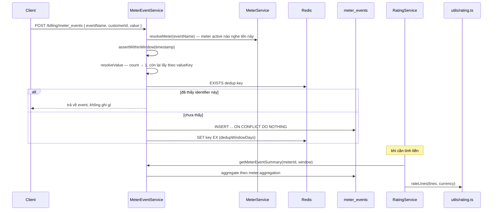

# Flow 05 — Metering và rating

Hai nửa của bài toán "khách dùng bao nhiêu, thành bao nhiêu tiền". Metering là đường ghi (nhận event dùng, chống trùng, lưu append-only); rating là đường đọc thuần tuý (không ghi gì, chỉ tính).

## Khi nào chạy

- Metering: `POST /v1/billing/meter_events`, `POST /v1/billing/meter_event_batches`.
- Rating: `ratingService.rateUpcomingInvoice(subscriptionId)` — gọi từ `GET /v1/invoices/upcoming` và từ luồng phát hành hoá đơn ([flow 06](./06-invoicing.md)).

## Sơ đồ



## Meter

Meter là định nghĩa: "event tên X, gom theo cách Y, lấy số ở khoá Z".

| Cột           | Ý nghĩa                                                                                                                                         |
| ------------- | ----------------------------------------------------------------------------------------------------------------------------------------------- |
| `event_name`  | tên event client gửi lên; unique khi `deleted_at is null` — [meters.schema.ts:21-23](../../packages/core/src/database/schemas/meters.schema.ts) |
| `aggregation` | `count` / `sum` / … quyết định cách gom                                                                                                         |
| `value_key`   | khoá trong `payload` chứa số, mặc định `'value'` — [meter.service.ts:88](../../packages/core/src/services/meter.service.ts)                     |
| `status`      | `active` — chỉ meter active mới nhận event                                                                                                      |

`resolveMeter(eventName)` — [meter.service.ts:39-50](../../packages/core/src/services/meter.service.ts) — không tìm ra thì `NotFoundError`, tức là gửi event vào một tên chưa khai báo meter là lỗi 404, không phải lặng lẽ bỏ qua.

## Nạp event — từng bước

| #   | Nơi xảy ra                                                                             | Làm gì                                                                                                                     |
| --- | -------------------------------------------------------------------------------------- | -------------------------------------------------------------------------------------------------------------------------- |
| 1   | [meter-event.service.ts:29](../../packages/core/src/services/meter-event.service.ts)   | `resolveMeter(payload.eventName)`                                                                                          |
| 2   | [buildMeterEvent:124-144](../../packages/core/src/services/meter-event.service.ts)     | `timestamp` = client gửi hoặc `receivedAt`; `identifier` = client gửi hoặc id sinh mới                                     |
| 3   | [assertWithinWindow:186-201](../../packages/core/src/services/meter-event.service.ts)  | `timestamp` cũ hơn `METER_DEDUP_WINDOW_DAYS` → `BadRequestError`                                                           |
| 4   | [resolveValue:203-218](../../packages/core/src/services/meter-event.service.ts)        | `count` → luôn 1; ngược lại lấy `payload.value` hoặc `_.get(payload.payload, meter.valueKey)`, không phải số hữu hạn → 400 |
| 5   | [isIdentifierKnown:150-154](../../packages/core/src/services/meter-event.service.ts)   | Redis `EXISTS` trên key `(meterId, identifier)`                                                                            |
| 6   | [meter-event.service.ts:38](../../packages/core/src/services/meter-event.service.ts)   | INSERT; unique index `(meter_id, identifier)` là chốt chặn thật                                                            |
| 7   | [rememberIdentifiers:171-184](../../packages/core/src/services/meter-event.service.ts) | pipeline `SET key '1' EX windowSeconds`, **chỉ** cho hàng thực sự chèn được                                                |

Bước 3 và bước 7 dùng chung một hằng số, và đó là chủ ý: Redis chỉ nhớ identifier trong đúng `dedupWindowDays`, nên một event có timestamp cũ hơn cửa sổ đó không còn cách nào biết là đã nhận hay chưa — thà từ chối còn hơn tính tiền hai lần.

Chống trùng hai lớp: Redis là lớp nhanh (tránh chạm DB), unique index là lớp đúng (Redis mất dữ liệu vẫn không nhân đôi). Lớp Redis có thể sai sót; lớp index thì không.

Batch (`ingestMeterEventBatch` — [meter-event.service.ts:45-81](../../packages/core/src/services/meter-event.service.ts)) làm y hệt nhưng gom: một `MGET` cho cả lô, một INSERT, rồi trả `{ accepted, duplicates }`.

## Append-only

`meter_events` không có `updated_at`, không có `deleted_at`, và migration `0008_meter_events_append_only` gắn trigger chặn UPDATE/DELETE ở tầng DB. Sai số liệu thì sửa bằng cách ghi event bù, không sửa lịch sử.

## Tổng hợp

`getMeterEventSummary` — [meter-event.service.ts:83-122](../../packages/core/src/services/meter-event.service.ts):

- Cửa sổ `[windowStart, windowEnd)`, `windowEnd <= windowStart` → 400.
- `receivedBefore` / `receivedAfter` lọc theo **lúc nhận**, không phải lúc xảy ra — đó là cách chụp lại đúng những gì hệ thống đã biết tại một thời điểm, cần cho việc đối chiếu hoá đơn đã phát hành.
- Gom theo `meter.aggregation` trong repository, trả `{ value, eventCount }`.

## Rating

`rateUpcomingInvoice` — [rating.service.ts:13-35](../../packages/core/src/services/rating.service.ts) — thuần đọc: không transaction, không outbox, không ghi gì.

| #   | Nơi xảy ra                                                                    | Làm gì                                                                        |
| --- | ----------------------------------------------------------------------------- | ----------------------------------------------------------------------------- |
| 1   | [rating.service.ts:20-21](../../packages/core/src/services/rating.service.ts) | lấy `subscription_items` và price tương ứng                                   |
| 2   | [buildLine:59-83](../../packages/core/src/services/rating.service.ts)         | mỗi item thành một `RatingLine`                                               |
| 3   | [resolveUsage:85-104](../../packages/core/src/services/rating.service.ts)     | price metered → hỏi `getMeterEventSummary` cho đúng kỳ; không gắn meter → 400 |
| 4   | [rateLines:203-208](../../packages/core/src/utils/rating.ts)                  | tính từng dòng rồi `Money.sum`                                                |

### Loại dòng

[resolveLineItemType:115-125](../../packages/core/src/services/rating.service.ts):

Mỗi item mang một **cửa sổ tính tiền** riêng, dựng từ `billed_from` / `billed_through` /
`invoiced_through` bởi [resolveBillingWindow](../../packages/core/src/utils/rating.ts):

```
start = max(billed_from, periodStart, invoiced_through)
end   = min(billed_through ?? periodEnd, periodEnd)
```

Cửa sổ rỗng (`end <= start`) thì item **không sinh dòng nào** — đó là cách một lần gỡ với
`prorationBehavior: none` biến mất khỏi kỳ này, và cũng là cách một lát đã xuất hoá đơn tức thì
không bị tính lại.

| Điều kiện                              | `type`         | `quantity` lấy từ               |
| -------------------------------------- | -------------- | ------------------------------- |
| price metered                          | `usage`        | tổng hợp meter **trong cửa sổ** |
| cửa sổ hẹp hơn kỳ (`window.isPartial`) | `proration`    | `item.quantity`                 |
| còn lại                                | `subscription` | `item.quantity`                 |

Cửa sổ hẹp hơn kỳ ở **cả hai đầu**: item thêm giữa kỳ bắt đầu muộn, item bị gỡ giữa kỳ kết thúc
sớm. Hệ bill in arrears nên item bị gỡ sinh một dòng **dương** cho phần đã dùng, không phải credit
âm kiểu Stripe — [ADR 0013](../adr/0013-arrears-proration.md).

Chỉ dòng **không** metered mới có `usageStart/usageEnd`, tức là chỉ nó mới bị chia tỷ lệ. Dòng
metered thay vào đó **dịch cửa sổ đo**: `prorationFactor` luôn bằng 1. Hợp lý: usage đã tự nó chỉ
đếm phần thực dùng, chia thêm lần nữa là trừ hai lần.

### Cách tính một dòng

[rateLine:184-201](../../packages/core/src/utils/rating.ts):

1. `transformQuantity` — chia `divideBy` rồi làm tròn lên/xuống (bán theo lô: 1000 request = 1 đơn vị) — [rating.ts:65-79](../../packages/core/src/utils/rating.ts).
2. `ratePrice` — [rating.ts:135-163](../../packages/core/src/utils/rating.ts):
   - `ratedQuantity = 0` → 0, không chạm bậc giá.
   - `per_unit` → `unitAmount × ratedQuantity`.
   - `tiered` + `volume` → tìm **một** bậc chứa toàn bộ lượng, tính hết theo bậc đó — [rateVolumeTiers:120-133](../../packages/core/src/utils/rating.ts).
   - `tiered` + `graduated` → cộng dồn từng bậc, mỗi bậc chỉ tính phần lượng nằm trong nó — [rateGraduatedTiers:97-118](../../packages/core/src/utils/rating.ts).
3. `resolveProrationFactor` — [rating.ts:165-182](../../packages/core/src/utils/rating.ts) — tỷ lệ mili-giây, `_.clamp(..., 0, 1)`; không có `usageStart/End` thì bằng 1.
4. Nhân hệ số, `isCredit` thì `negate()`.

Mọi phép nhân đi qua `Money` với chính sách `HALF_UP` — [rating.ts:14](../../packages/core/src/utils/rating.ts). Tiền không bao giờ là float trần trụi; làm tròn xảy ra **một lần mỗi dòng**, rồi mới cộng tổng, nên tổng luôn bằng đúng tổng các dòng hiển thị.

`buildMonthlyAmount` — [recurring-amount.ts:16-26](../../packages/core/src/utils/recurring-amount.ts) — quy mọi kỳ về một tháng (MRR), dùng cho báo cáo ở [flow 11](./11-reporting-reconciliation.md), không dính tới việc tính hoá đơn.

## Bảng DB

| Bảng           | Điểm cần nhớ                                                                                              |
| -------------- | --------------------------------------------------------------------------------------------------------- |
| `meters`       | unique `event_name` khi chưa xoá                                                                          |
| `meter_events` | `value` là `double precision` (lượng dùng, không phải tiền); unique `(meter_id, identifier)`; append-only |

## Đọc tiếp

- [06 — Invoicing](./06-invoicing.md) — nơi kết quả rating thành `invoice_line_items`
- [technique 07 — Metering](../technique/07-metering.md) — meter và meter event là gì, hai trục thời gian, giới hạn của bản hiện tại và kiến trúc ở quy mô lớn
- ADR: [0007 metering](../adr/0007-phase-4-metering.md), [0008 rating](../adr/0008-phase-5-rating.md)
