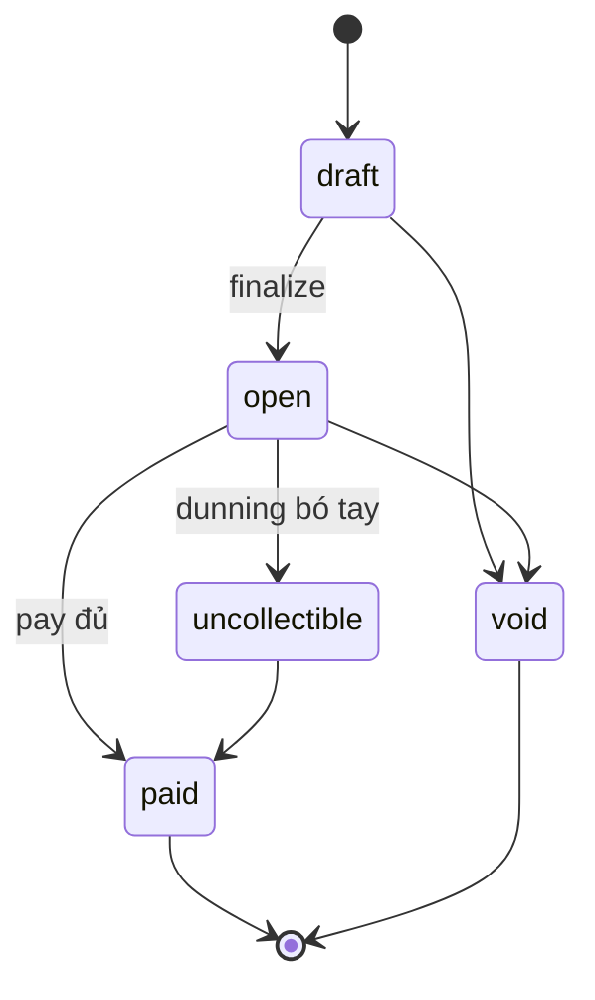

# Flow 06 — Hoá đơn và credit note

Vòng đời một hoá đơn: nháp → phát hành → thu tiền → (huỷ hoặc ghi giảm). Đây là nơi rating ([flow 05](./05-metering-and-rating.md)) biến thành con số cố định, và là nơi mọi bút toán sổ cái ([flow 10](./10-ledger.md)) được sinh ra.

## Khi nào chạy

| Route                                       | Việc                                                    |
| ------------------------------------------- | ------------------------------------------------------- |
| `GET /v1/invoices/upcoming?subscriptionId=` | xem trước, **không** ghi gì — gọi thẳng `ratingService` |
| `POST /v1/invoices`                         | tạo nháp cho kỳ hiện tại                                |
| `POST /v1/invoices/:invoiceId/finalize`     | chốt số tiền, cấp số hoá đơn                            |
| `POST /v1/invoices/:invoiceId/pay`          | ghi nhận tiền về                                        |
| `POST /v1/invoices/:invoiceId/void`         | huỷ                                                     |
| `POST /v1/credit_notes`                     | ghi giảm phần chưa trả                                  |

Ngoài ra `ensureDraftInvoice` được [billing run](./08-billing-run.md) gọi định kỳ.

## Máy trạng thái

[invoices.types.ts:23-33](../../packages/core/src/contracts/invoices.types.ts):



`paid` và `void` là trạng thái cuối. `uncollectible` vẫn quay lại `paid` được — khách trả muộn thì vẫn ghi nhận.

## Tạo nháp

`ensureDraftInvoice` — [invoice.service.ts:53-110](../../packages/core/src/services/invoice.service.ts) — idempotent theo kỳ:

1. `findPeriodInvoice` tìm hoá đơn có `periodStart` trùng `subscription.currentPeriodStart` — có rồi thì trả về, `isCreated: false`.
2. Chưa có → INSERT nháp (`subtotal`/`total`/`amountPaid` = 0, `number` = `null`) + event `invoice.created`.
3. Đụng unique violation (hai tiến trình chạy cùng lúc) → tìm lại, trả hoá đơn của kẻ thắng cuộc.

Bước 3 là lý do billing run chạy nhiều shard song song vẫn không tạo hoá đơn trùng.

## Finalize — bước quan trọng nhất

| #   | Nơi xảy ra                                                                        | Làm gì                                                                                        |
| --- | --------------------------------------------------------------------------------- | --------------------------------------------------------------------------------------------- |
| 1   | [invoice.service.ts:115](../../packages/core/src/services/invoice.service.ts)     | `assertTransition(status → open)`                                                             |
| 2   | [invoice.service.ts:123-127](../../packages/core/src/services/invoice.service.ts) | `subscription.currentPeriodStart` phải còn khớp `invoice.periodStart`, lệch → `ConflictError` |
| 3   | [invoice.service.ts:129](../../packages/core/src/services/invoice.service.ts)     | `ratingService.rateUpcomingInvoice` — tính tiền **tại thời điểm này**                         |
| 4   | [invoice.service.ts:131](../../packages/core/src/services/invoice.service.ts)     | `dueAt = now + INVOICE_DUE_DAYS`                                                              |
| 5   | [invoice.service.ts:149-156](../../packages/core/src/services/invoice.service.ts) | `claimNextNumber(INVOICE)` trong transaction — cấp số từ `number_sequences`                   |
| 6   | [invoice.service.ts:158](../../packages/core/src/services/invoice.service.ts)     | INSERT `invoice_line_items` — bản chụp bất biến của kết quả rating                            |
| 7   | [invoice.service.ts:160-173](../../packages/core/src/services/invoice.service.ts) | UPDATE: `number = INV-000123`, `status = open`, `subtotal`/`total`, `nextAttemptAt = dueAt`   |
| 8   | [postReceivable:336-362](../../packages/core/src/services/invoice.service.ts)     | bút toán: **Nợ** `accounts_receivable` (theo khách) / **Có** `revenue`                        |
| 9   | [invoice.service.ts:180](../../packages/core/src/services/invoice.service.ts)     | event `invoice.finalized`                                                                     |

Bước 2 chặn một lỗi cụ thể: subscription đã sang kỳ mới trong lúc hoá đơn còn nháp thì rating sẽ trả về số của kỳ **mới**, dán nhầm vào hoá đơn của kỳ **cũ**.

Số hoá đơn cấp bằng `claimNextNumber` bên trong transaction — [invoice.service.ts:511-513](../../packages/core/src/services/invoice.service.ts) định dạng `INV-` + 6 chữ số. Bảng `number_sequences` bảo đảm dãy số liên tục, không nhảy cóc (yêu cầu kế toán ở nhiều nơi).

Sau finalize, migration `0011_invoice_immutability` khoá các cột tiền ở tầng DB — muốn sửa thì void hoặc ghi credit note, không UPDATE.

## Thu tiền

`payInvoice` — [invoice.service.ts:188-239](../../packages/core/src/services/invoice.service.ts):

```
owed = total − amountPaid − amountCredited
```

- `amount` không truyền thì mặc định bằng `owed`; vượt `owed` → `BadRequestError`.
- `isSettled = amountPaid + amountCredited === total` — chỉ khi đó mới chuyển `paid`, ghi `paidAt` và bắn `invoice.paid`. Trả thiếu thì hoá đơn vẫn `open`, chỉ tăng `amountPaid`.
- Bút toán: **Nợ** `cash` / **Có** `accounts_receivable` — [postCashReceipt:364-391](../../packages/core/src/services/invoice.service.ts).
- `externalId` của bút toán là `settlementReference` nếu có (do [flow 07](./07-payments-and-refunds.md) truyền vào), không thì `invoice_payment:<id>:<amountPaid>`. Đây là khoá chống ghi sổ hai lần.

## Void

`voidInvoice` — [invoice.service.ts:241-280](../../packages/core/src/services/invoice.service.ts):

- `amountPaid > 0` → `ConflictError`, buộc dùng credit note. Không bao giờ xoá dấu vết tiền đã nhận.
- Chỉ hoá đơn đang `open` mới đảo bút toán (`reverseReceivable`: **Nợ** `revenue` / **Có** `accounts_receivable`) — nháp chưa từng ghi sổ nên không có gì để đảo.

## Credit note

`createCreditNote` — [credit-note.service.ts:25-87](../../packages/core/src/services/credit-note.service.ts):

| Kiểm tra                                   | Lý do                                                                        |
| ------------------------------------------ | ---------------------------------------------------------------------------- |
| hoá đơn không được là `draft`              | nháp thì sửa thẳng, không cần ghi giảm                                       |
| `amount <= total − amountPaid − đã credit` | credit note chỉ xoá phần **chưa trả**; tiền đã nhận phải trả lại bằng refund |

Ghi xong: cấp số `CN-000045` từ cùng cơ chế `number_sequences`, bút toán **Nợ** `revenue` / **Có** `accounts_receivable`, event `credit_note.created`. Nếu credit vừa đúng phần còn lại thì `settleInvoice` chuyển hoá đơn sang `paid` và bắn `invoice.paid` — [credit-note.service.ts:79-81, 116-139](../../packages/core/src/services/credit-note.service.ts).

Ranh giới credit note ↔ refund là điểm hay lẫn: **chưa thu thì credit, đã thu thì refund.**

## Các con số trong response

`buildInvoiceWithLineItems` — [invoice.service.ts:523-566](../../packages/core/src/services/invoice.service.ts) — bổ sung ba số không nằm trong bảng `invoices`:

| Trường            | Nguồn                                 |
| ----------------- | ------------------------------------- |
| `amountCredited`  | tổng credit note của hoá đơn          |
| `amountRefunded`  | tổng refund                           |
| `amountRemaining` | `total − amountPaid − amountCredited` |

Chúng được tính lại mỗi lần đọc, không lưu — nên không bao giờ lệch với bảng nguồn.

## Bảng DB

| Bảng                 | Điểm cần nhớ                                                                               |
| -------------------- | ------------------------------------------------------------------------------------------ |
| `number_sequences`   | một hàng cho mỗi loại (`invoice`, `credit_note`); `claimNextNumber` chạy trong transaction |
| `invoices`           | `number` nullable tới khi finalize; `due_at`, `next_attempt_at` phục vụ dunning            |
| `invoice_line_items` | bản chụp; sửa giá về sau không đổi hoá đơn cũ                                              |
| `credit_notes`       | chỉ ghi thêm, không sửa                                                                    |

## Đọc tiếp

- [07 — Payments và refunds](./07-payments-and-refunds.md)
- [10 — Ledger](./10-ledger.md) — chi tiết 4 bút toán nói ở trên
- ADR: [0009 invoicing](../adr/0009-phase-6-invoicing.md)
