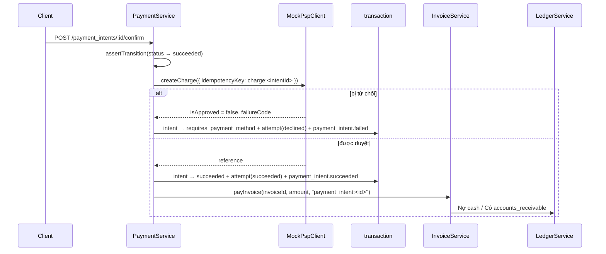
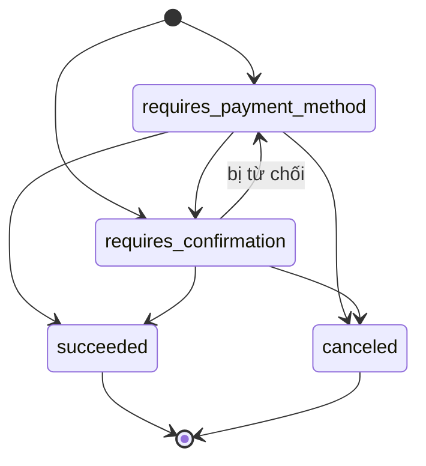

# Flow 07 — Payment intent và refund

Nơi hệ thống chạm vào thế giới bên ngoài (nhà xử lý thanh toán). Bài toán trung tâm: giữ cho trạng thái nội bộ và trạng thái ở PSP không lệch nhau, dù request hỏng ở bất kỳ điểm nào.

## Khi nào chạy

| Route                                  | Việc                                       |
| -------------------------------------- | ------------------------------------------ |
| `POST /v1/payment_intents`             | tạo ý định thu tiền cho một hoá đơn `open` |
| `POST /v1/payment_intents/:id/confirm` | gọi PSP, ghi nhận kết quả                  |
| `POST /v1/payment_intents/:id/cancel`  | bỏ ý định                                  |
| `POST /v1/refunds`                     | hoàn tiền một phần hay toàn bộ             |

Dunning ([flow 09](./09-dunning.md)) cũng đi qua chính hai hàm này.

## Sơ đồ confirm

## Máy trạng thái

[payments.types.ts:21-34](../../packages/core/src/contracts/payments.types.ts):

Bị từ chối **không** phải trạng thái cuối — intent quay về `requires_payment_method` để thử thẻ khác. Đó là lý do dunning dùng lại được cùng một intent.

## Tạo intent

[payment.service.ts:32-83](../../packages/core/src/services/payment.service.ts):

| Kiểm tra              | Lỗi                                                                           |
| --------------------- | ----------------------------------------------------------------------------- |
| hoá đơn phải `open`   | `ConflictError` — nháp chưa có số tiền, `paid`/`void` thì không còn gì để thu |
| `amountRemaining > 0` | `Invoice ... has nothing left to pay`                                         |
| `amount <= owed`      | `BadRequestError`                                                             |

`owed` lấy từ `invoiceService.getInvoice(...).amountRemaining` — [resolveOwed:270-274](../../packages/core/src/services/payment.service.ts) — tức là đã trừ cả credit note. Trạng thái khởi tạo tuỳ có `paymentMethod` hay chưa: có thì `requires_confirmation`, không thì `requires_payment_method`.

Lưu ý: tạo intent **không** ghi outbox. Chỉ `confirm` mới phát event.

## Confirm

| #   | Nơi xảy ra                                                                        | Làm gì                                                                                                                |
| --- | --------------------------------------------------------------------------------- | --------------------------------------------------------------------------------------------------------------------- |
| 1   | [payment.service.ts:91](../../packages/core/src/services/payment.service.ts)      | `assertTransition(... → succeeded)`                                                                                   |
| 2   | [payment.service.ts:93-100](../../packages/core/src/services/payment.service.ts)  | gọi PSP với `idempotencyKey: charge:<paymentIntentId>`                                                                |
| 3   | [payment.service.ts:103-108](../../packages/core/src/services/payment.service.ts) | từ chối → `recordDeclinedAttempt`                                                                                     |
| 4   | [payment.service.ts:110-148](../../packages/core/src/services/payment.service.ts) | duyệt → transaction: intent `succeeded` + `pspReference`, INSERT `payment_attempts`, event `payment_intent.succeeded` |
| 5   | [payment.service.ts:150-154](../../packages/core/src/services/payment.service.ts) | `payInvoice(invoiceId, { amount }, 'payment_intent:<id>')`                                                            |

`idempotencyKey` gắn với **id của intent**, nên confirm lại một intent đã charge thành công sẽ nhận lại đúng reference cũ thay vì trừ tiền lần nữa — [mock-psp.client.ts:93-107](../../packages/core/src/clients/mock-psp.client.ts).

Tham số thứ ba của `payInvoice` là `settlementReference`, thành `externalId` của bút toán ledger ([flow 06](./06-invoicing.md)) — một intent chỉ ghi sổ được một lần.

### Điểm yếu đã biết

Bước 4 và bước 5 nằm ở **hai transaction khác nhau**. Tiến trình chết giữa chúng thì intent là `succeeded` mà hoá đơn chưa được ghi nhận trả tiền. Không có cơ chế tự vá; [flow 11](./11-reporting-reconciliation.md) là công cụ phát hiện, còn việc sửa là thủ công. Đây là rủi ro ghi trong [docs/RESEARCH.md](../RESEARCH.md).

## Ghi nhận thất bại

`recordDeclinedAttempt` — [payment.service.ts:222-268](../../packages/core/src/services/payment.service.ts) — trong một transaction: intent về `requires_payment_method` kèm `failureCode`/`failureMessage`, thêm một hàng `payment_attempts` outcome `declined`, phát `payment_intent.failed`.

Mỗi lần thử để lại đúng một hàng attempt, thành công hay thất bại. `payment_attempts` là append-only (migration `0013_payment_append_only`), nên lịch sử thử thẻ không bao giờ mất.

## PSP giả lập

[mock-psp.client.ts](../../packages/core/src/clients/mock-psp.client.ts) — toàn bộ trạng thái nằm trong `Map` trong bộ nhớ, **khởi động lại là mất**.

Kích thất bại bằng `paymentMethod` — [mock-psp.client.ts:15-19](../../packages/core/src/clients/mock-psp.client.ts):

| `paymentMethod`              | Kết quả              |
| ---------------------------- | -------------------- |
| `pm_card_ok` (mặc định)      | duyệt                |
| `pm_card_declined`           | `card_declined`      |
| `pm_card_insufficient_funds` | `insufficient_funds` |
| `pm_card_error`              | `processing_error`   |

Client tự khai báo lỗi riêng (`MockPspChargeNotFoundError`, `MockPspRefundTooLargeError`) chứ không import lớp lỗi HTTP của app — đúng quy ước sdk-client. Hệ quả: hai lỗi này không được `errorHandlerPlugin` nhận diện và sẽ ra 500.

## Refund

[refund.service.ts:22-87](../../packages/core/src/services/refund.service.ts):

| Kiểm tra                                   | Lỗi                                              |
| ------------------------------------------ | ------------------------------------------------ |
| intent phải `succeeded`                    | `... never took money and has nothing to refund` |
| phải có `pspReference`                     | `... succeeded without a processor reference`    |
| `amount <= paymentIntent.amount − đã hoàn` | `BadRequestError`                                |

Thứ tự: gọi PSP **trước**, ghi DB sau — [refund.service.ts:51-59](../../packages/core/src/services/refund.service.ts). PSP lỗi thì không có hàng nào được ghi (đúng); DB lỗi sau khi PSP thành công thì tiền đã đi mà không có bản ghi — cùng một khe hở như ở confirm.

Bút toán: **Nợ** `revenue` / **Có** `cash` — [postRefund:122-143](../../packages/core/src/services/refund.service.ts). Event `refund.created`.

## Bảng DB

| Bảng               | Điểm cần nhớ                                                 |
| ------------------ | ------------------------------------------------------------ |
| `payment_intents`  | unique `psp_reference` — một charge không gắn vào hai intent |
| `payment_attempts` | append-only, một hàng mỗi lần thử                            |
| `refunds`          | unique `psp_reference`; chỉ ghi thêm                         |

## Đọc tiếp

- [09 — Dunning](./09-dunning.md) — nơi gọi lại hai hàm này theo lịch
- [10 — Ledger](./10-ledger.md)
- ADR: [0010 payments](../adr/0010-phase-7-payments.md)
