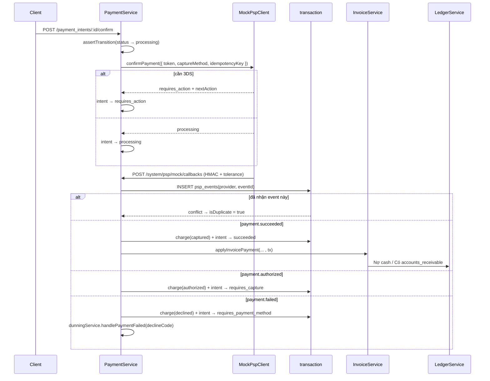
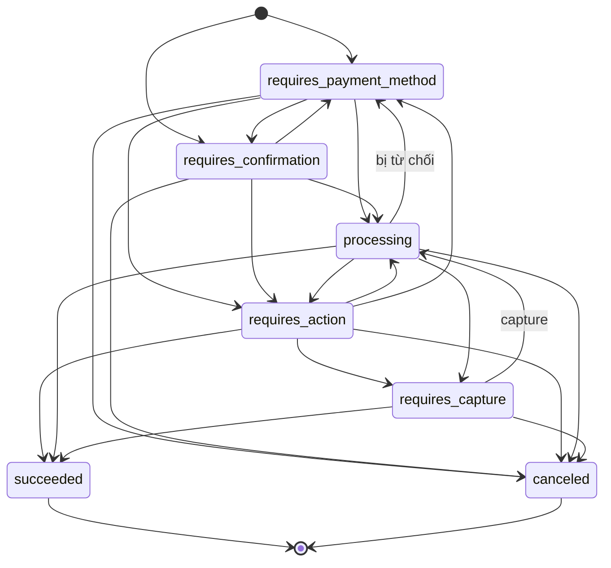

# Flow 07 — Payment method, intent, charge và refund

Nơi hệ thống chạm vào thế giới bên ngoài (nhà xử lý thanh toán). Bài toán trung tâm: giữ cho trạng thái nội bộ và trạng thái ở PSP không lệch nhau, dù request hỏng ở bất kỳ điểm nào.

Từ phase 18, confirm là **bất đồng bộ**: gọi confirm chỉ gửi lệnh, tiền vào là một callback riêng.

## Khi nào chạy

| Route                                         | Việc                                                     |
| --------------------------------------------- | -------------------------------------------------------- |
| `POST /v1/payment_methods`                    | token hoá một thẻ, lưu metadata PSP trả về               |
| `POST /v1/payment_methods/:id/attach`         | gắn vào một customer, tuỳ chọn đặt làm mặc định          |
| `POST /v1/payment_methods/:id/detach`         | tháo ra và xoá mọi chỗ trỏ tới nó                        |
| `POST /v1/setup_intents`                      | lưu thẻ mà không thu tiền                                |
| `POST /v1/setup_intents/:id/confirm`          | gửi lệnh lưu thẻ, chờ callback                           |
| `POST /v1/payment_intents`                    | tạo ý định thu tiền cho một hoá đơn `open`, hoặc độc lập |
| `POST /v1/payment_intents/:id/confirm`        | gửi lệnh thu tiền → `processing` / `requires_action`     |
| `POST /v1/payment_intents/:id/capture`        | thu một authorization đang giữ                           |
| `POST /v1/payment_intents/:id/cancel`         | bỏ ý định, kèm `cancellationReason`                      |
| `POST /api/v1/system/psp/:provider/callbacks` | PSP báo kết quả — lái máy trạng thái                     |
| `POST /v1/refunds`                            | hoàn tiền một phần hay toàn bộ                           |

Dunning ([flow 09](./09-dunning.md)) cũng đi qua chính các hàm này.

## Sơ đồ confirm và callback

Điểm quan trọng: **toàn bộ nhánh `payment.succeeded` nằm trong một transaction** — charge, intent, `invoice_payments`, bút toán ledger, event. Không còn khe hở hai transaction.

## Máy trạng thái

[payments.types.ts](../../packages/modules/billing/src/contracts/payments.types.ts):

`processing` **không** có đường về chính nó: confirm lần hai trên một intent đang bay là `ConflictError`, không phải một charge nữa.

Bị từ chối **không** phải trạng thái cuối — intent quay về `requires_payment_method` để thử thẻ khác. Đó là lý do dunning dùng lại được cùng một intent.

## Payment method

[payment-method.service.ts](../../packages/modules/billing/src/services/payment-method.service.ts):

- `createPaymentMethod` nhận `{ type, token }`. Không nhận số thẻ — xem [ADR 0019](../adr/0019-payment-model.md).
- `attachPaymentMethod` từ chối chuyển sang customer thứ hai, và từ chối gắn lại thứ đã detach.
- `detachPaymentMethod` set `customers.default_payment_method_id` và mọi
  `subscriptions.default_payment_method_id` trỏ tới nó về null, trong cùng transaction.
- `getChargeablePaymentMethod` là cửa duy nhất confirm đi qua: nó throw `ConflictError` cho một
  payment method đã detach.

## Setup intent

Lưu thẻ mà không thu tiền. Cùng hình dạng bất đồng bộ như payment intent: confirm → `processing`
hoặc `requires_action`; callback `setup.succeeded` gắn payment method vào customer và đặt làm mặc
định, `setup.failed` đưa intent về `requires_payment_method` kèm `failureCode`.

Không có `payment_intents` nào được tạo trong luồng này — đó chính là điều phân biệt nó.

## Tạo intent

[payment.service.ts](../../packages/modules/billing/src/services/payment.service.ts):

| Kiểm tra                               | Lỗi                                                                           |
| -------------------------------------- | ----------------------------------------------------------------------------- |
| hoá đơn phải `open`                    | `ConflictError` — nháp chưa có số tiền, `paid`/`void` thì không còn gì để thu |
| `amountRemaining > 0`                  | `Invoice ... has nothing left to pay`                                         |
| `amount <= owed`                       | `BadRequestError`                                                             |
| không invoice thì phải có `customerId` | `BadRequestError`                                                             |
| không invoice thì phải có `amount`     | `BadRequestError`                                                             |

`owed` lấy từ `invoiceService.getInvoice(...).amountRemaining`, tức là đã trừ cả credit note. Trạng
thái khởi tạo tuỳ có `paymentMethodId` hay chưa: có thì `requires_confirmation`, không thì
`requires_payment_method`.

Một intent **độc lập** (`invoiceId` để trống) thu tiền mà không gắn vào hoá đơn nào: callback thành
công tạo charge và chuyển intent sang `succeeded`, nhưng không có `applyInvoicePayment` nào chạy.

Lưu ý: tạo intent **không** ghi outbox. Chỉ callback mới phát event.

## Confirm

| #   | Nơi xảy ra             | Làm gì                                                                     |
| --- | ---------------------- | -------------------------------------------------------------------------- |
| 1   | `confirmPaymentIntent` | `assertTransition(... → processing)`                                       |
| 2   | `resolvePaymentMethod` | payload → intent → `customers.default_payment_method_id`, theo thứ tự đó   |
| 3   | `MockPspClient`        | `confirmPayment` với `idempotencyKey: charge:<intentId>:<số charge đã có>` |
| 4   | `confirmPaymentIntent` | ghi `pspReference`, `nextAction`, status `processing` / `requires_action`  |

`idempotencyKey` đếm số charge đã có trên intent, nên: confirm lặp khi chưa có callback nào về sẽ
nhận lại đúng reference cũ (không charge hai lần), còn thử lại **sau** một decline là một lần thử
mới với key mới.

## Callback

`handleProviderEvent(provider, payload)` — [payment.service.ts](../../packages/modules/billing/src/services/payment.service.ts):

1. INSERT `psp_events(provider, event_id)` với `ON CONFLICT DO NOTHING`. Không insert được nghĩa là
   event này đã áp rồi → trả `isDuplicate: true` và **không làm gì nữa**.
2. `SELECT … FOR UPDATE` intent theo `pspReference`. Intent đã `succeeded` thì bỏ qua.
3. Tạo charge, cập nhật intent, và với `payment.succeeded` có hoá đơn thì
   `invoiceService.applyInvoicePayment(..., tx)` trong **cùng** transaction.

`settlementReference` là `payment_intent:<id>`, và `invoice_payments` có unique index trên
`settlement_reference` — một intent chỉ áp vào hoá đơn được một lần, kể cả khi PSP đổi
`eventId`. Cùng chuỗi ấy là `externalId` của bút toán ledger ([flow 06](./06-invoicing.md)) và là
khoá đối soát của [flow 11](./11-reporting-reconciliation.md).

Xác thực: `verifyPspCallbackRequest` tính HMAC trên **raw body** và kiểm tolerance
`PSP_CALLBACK_TOLERANCE_SECONDS`. Route này là ngoại lệ được liệt kê của `verifySystemRequest` — PSP
không giữ API key của chúng ta, chữ ký là credential.

## Charge

`charges` thay `payment_attempts`. Mỗi lần thử là một dòng:

| Cột                            | Nghĩa                                                      |
| ------------------------------ | ---------------------------------------------------------- |
| `status`                       | `pending` (đã auth, chưa capture) / `succeeded` / `failed` |
| `outcome`                      | `approved` / `authorized` / `declined` / `errored`         |
| `captured`, `amount_captured`  | capture tách rời auth khi `capture_method = manual`        |
| `amount_refunded`              | phase 19 đưa refund về cấp charge                          |
| `balance_transaction_id`       | để rỗng ở phase 18; phase 19 mới có `balance_transactions` |
| `failure_code`, `decline_code` | mã của ta, đã map từ mã thô của PSP                        |

## PSP giả lập

[mock-psp.client.ts](../../packages/modules/billing/src/clients/mock-psp.client.ts) — toàn bộ trạng thái nằm trong `Map` trong bộ nhớ, **khởi động lại là mất**, và **không chia sẻ giữa các tiến trình**.

Kích hành vi bằng **token**, không bằng id của payment method:

| Token                          | Kết quả                                         |
| ------------------------------ | ----------------------------------------------- |
| `tok_visa_ok`                  | duyệt                                           |
| `tok_visa_3ds`                 | `requires_action`, chờ `completeAuthentication` |
| `tok_card_declined`            | `card_declined` / `generic_decline`             |
| `tok_card_insufficient_funds`  | `insufficient_funds`                            |
| `tok_card_expired`             | `expired_card`                                  |
| `tok_card_lost`                | `lost_card` — hard decline                      |
| `tok_card_stolen`              | `stolen_card` — hard decline                    |
| `tok_card_error`               | `processing_error`                              |
| `tok_bank_ok`, `tok_wallet_ok` | duyệt, không có card metadata                   |

Event mô phỏng xếp trong `takePendingEvents()`. `paymentService.drainProviderEvents()` là đường lấy
chúng ra và áp qua đúng `handleProviderEvent`; trong worker, `PaymentWorkflow` gọi nó theo lịch
`PSP_CALLBACK_POLL_INTERVAL_MS`.

Client tự khai báo lỗi riêng (`MockPspUnknownTokenError`, `MockPspChargeNotFoundError`, `MockPspRefundTooLargeError`) chứ không import lớp lỗi HTTP của app — đúng quy ước sdk-client. Hệ quả: các lỗi này không được `errorHandlerPlugin` nhận diện và sẽ ra 500.

## Refund

[refund.service.ts](../../packages/modules/billing/src/services/refund.service.ts):

| Kiểm tra                                    | Lỗi                                              |
| ------------------------------------------- | ------------------------------------------------ |
| charge phải `succeeded`                     | `... never took money and has nothing to refund` |
| phải có `pspReference`                      | `... settled without a processor reference`      |
| `amount <= charge.amountCaptured − đã hoàn` | `BadRequestError`                                |

Từ phase 19 refund nhận `chargeId`: một charge chịu được nhiều refund miễn còn phần chưa hoàn, và
phần đã hoàn tính trên các refund `pending` + `succeeded` của chính charge đó.

Thứ tự: gọi PSP **trước**, ghi DB sau. PSP lỗi thì không có hàng nào được ghi (đúng); DB lỗi sau khi
PSP thành công thì tiền đã đi mà không có bản ghi — khe hở này ở refund vẫn còn, khác với confirm.

Refund sinh ra ở trạng thái `pending` và phát `refund.created`. Callback `refund.succeeded` mới ghi
bút toán **Nợ** `revenue` / **Có** `psp_receivable`, cộng `charges.amount_refunded`, và phát
`refund.updated`; `refund.failed` chỉ ghi transition và phát `refund.updated`. Trạng thái sống trong
`refund_transitions` vì `refunds` là append-only — xem [ADR 0020](../adr/0020-money-flow.md).

## Bảng DB

| Bảng                   | Điểm cần nhớ                                                                       |
| ---------------------- | ---------------------------------------------------------------------------------- |
| `payment_methods`      | chỉ `psp_token` + metadata; `detached_at` là mốc không thể quay lại                |
| `payment_intents`      | unique `psp_reference` — một charge không gắn vào hai intent                       |
| `charges`              | một hàng mỗi lần thử; **không** append-only, capture và refund sửa tại chỗ         |
| `setup_intents`        | unique `psp_reference`                                                             |
| `psp_events`           | unique `(provider, event_id)` — lớp chống gửi trùng                                |
| `refunds`              | unique `psp_reference`; chỉ ghi thêm                                               |
| `refund_transitions`   | append-only; transition mới nhất là trạng thái hiện tại của refund                 |
| `balance_transactions` | một hàng cho mỗi chuyển động số dư PSP — xem [ADR 0020](../adr/0020-money-flow.md) |

## Đọc tiếp

- [09 — Dunning](./09-dunning.md) — nơi gọi lại các hàm này theo lịch, và nơi smart retry sống
- [10 — Ledger](./10-ledger.md)
- ADR: [0010 payments](../adr/0010-phase-7-payments.md), [0019 payment model](../adr/0019-payment-model.md), [0020 dòng tiền](../adr/0020-money-flow.md)
