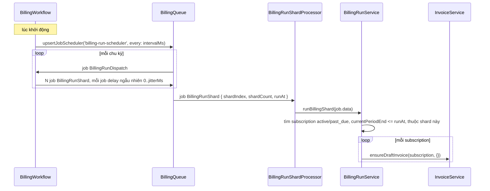

# Flow 08 — Billing run

Công việc nền tạo hoá đơn nháp cho những subscription vừa hết kỳ. Đây là ví dụ đầy đủ nhất về mẫu **scheduler → dispatch → fan-out shard** mà dunning ([flow 09](./09-dunning.md)) dùng lại nguyên xi.

## Khi nào chạy

Tiến trình `WORKFLOW_NAME=billing` tự lên lịch khi khởi động; chu kỳ `BILLING_RUN_INTERVAL_MS`.

## Sơ đồ

## Một worker, hai loại job

[billing.workflow.ts:24-36](../../apps/worker/src/workflows/billing.workflow.ts) — cùng một `Worker` xử lý hai tên job trên cùng queue:

| Tên job              | Việc                               |
| -------------------- | ---------------------------------- |
| `BillingRunDispatch` | không đụng DB, chỉ đẩy N job shard |
| `BillingRunShard`    | làm việc thật                      |

Tách vậy vì scheduler chỉ tạo **một** job mỗi chu kỳ. Nếu job đó tự làm hết thì chỉ một tiến trình chạy và không scale được. Job dispatch quạt ra thành `BILLING_RUN_SHARD_COUNT` job, để mọi worker trong queue cùng chia việc.

## Fan-out

[dispatchShards:59-82](../../apps/worker/src/workflows/billing.workflow.ts):

| Chi tiết           | Giá trị                                      | Lý do                                                                                        |
| ------------------ | -------------------------------------------- | -------------------------------------------------------------------------------------------- |
| `jobId`            | `billing-run-<shardIndex>-<runAt.getTime()>` | trùng id thì BullMQ từ chối — hai tiến trình cùng nhận job dispatch cũng chỉ ra một bộ shard |
| `delay`            | `_.random(0, BILLING_RUN_JITTER_MS)`         | rải ra, tránh N shard cùng đập vào DB một lúc                                                |
| `removeOnComplete` | `true`                                       | job chạy đều đặn, không giữ lịch sử                                                          |
| `runAt`            | `clock.now()` lúc dispatch                   | mọi shard dùng **chung một mốc thời gian**, nên kết quả không phụ thuộc shard nào chạy trước |

## Chia shard

`runBillingShard` — [billing-run.service.ts:22-50](../../packages/core/src/services/billing-run.service.ts) — truyền `shardCount` / `shardIndex` xuống repository, ở đó thành một mệnh đề SQL: `abs(hashtext(subscriptions.id)) % shardCount = shardIndex` — [subscription.repository.ts:57-58](../../packages/core/src/repositories/subscription.repository.ts). Mỗi subscription thuộc đúng một shard, nên các shard không giẫm lên nhau và không cần khoá.

Bộ lọc:

| Điều kiện          | Giá trị                                                                                                        |
| ------------------ | -------------------------------------------------------------------------------------------------------------- |
| `status`           | `active` hoặc `past_due` — [billing-run.service.ts:5](../../packages/core/src/services/billing-run.service.ts) |
| `currentPeriodEnd` | `<= runAt`                                                                                                     |
| shard              | `(shardIndex, shardCount)`                                                                                     |
| số lượng           | `BILLING_RUN_BATCH_SIZE`                                                                                       |

`trialing` không nằm trong danh sách: đang dùng thử thì chưa có gì để tính tiền.

## Việc thật

Với mỗi subscription đến hạn, gọi `invoiceService.ensureDraftInvoice(subscription, {})` — [billing-run.service.ts:37](../../packages/core/src/services/billing-run.service.ts). Hàm này idempotent theo kỳ ([flow 06](./06-invoicing.md)), nên chạy lại một shard không tạo hoá đơn trùng. `isCreated` chỉ dùng để đếm cho log.

Chỉ dừng ở **nháp**. Billing run không finalize, không thu tiền, và không đẩy kỳ subscription — tất cả những việc đó phải gọi tay hoặc qua test clock.

## Thất bại thì sao

| Hỏng ở đâu             | Hệ quả                                                                                                                                       |
| ---------------------- | -------------------------------------------------------------------------------------------------------------------------------------------- |
| một shard lỗi          | BullMQ retry (5 lần, backoff mũ — [queue-registry.ts:8-9](../../packages/core/src/queues/queue-registry.ts)); các shard khác không ảnh hưởng |
| job dispatch lỗi       | bỏ lỡ một chu kỳ; chu kỳ sau quét lại đúng các subscription đó vì điều kiện `currentPeriodEnd <= runAt` vẫn đúng                             |
| worker chết giữa chừng | như trên — không có trạng thái nào bị kẹt, vì việc duy nhất nó làm là idempotent                                                             |

Điều kiện lọc dựa trên trạng thái dữ liệu, không dựa trên "đã chạy chưa", nên bỏ lỡ một chu kỳ không mất việc — chu kỳ sau nhặt lại.

## Đọc tiếp

- [09 — Dunning](./09-dunning.md) — cùng khuôn, việc khác
- [02 — Event pipeline](./02-event-pipeline.md) — mẫu scheduler đơn giản hơn (không fan-out)
