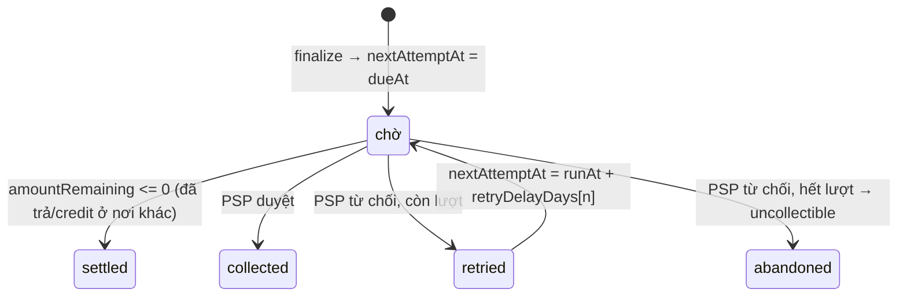

# Flow 09 — Dunning (thu hồi nợ)

Việc nền thử thu lại những hoá đơn `open` đã tới hạn, giãn dần theo lịch retry, và bỏ cuộc khi hết lượt. Khung chạy giống hệt [flow 08](./08-billing-run.md); file này chỉ nói phần khác.

## Khi nào chạy

Tiến trình `WORKFLOW_NAME=dunning`, chu kỳ `DUNNING_INTERVAL_MS`, scheduler `dunning-run-scheduler`.

## Khác gì billing run

|                | Billing                                          | Dunning                                                                                                                        |
| -------------- | ------------------------------------------------ | ------------------------------------------------------------------------------------------------------------------------------ |
| Quét bảng      | `subscriptions`                                  | `invoices`                                                                                                                     |
| Điều kiện      | `active`/`past_due`, `currentPeriodEnd <= runAt` | `open`, `nextAttemptAt <= runAt`                                                                                               |
| Băm shard theo | `subscriptions.id`                               | `invoices.customerId` — [invoice.repository.ts:120-121](../../packages/modules/billing/src/repositories/invoice.repository.ts) |
| Số shard       | `BILLING_RUN_SHARD_COUNT`                        | **cũng** `BILLING_RUN_SHARD_COUNT` — [dunning.workflow.ts:60](../../apps/worker/src/workflows/dunning.workflow.ts)             |
| Jitter         | `BILLING_RUN_JITTER_MS`                          | `DUNNING_JITTER_MS`                                                                                                            |

Băm theo `customerId` là chủ ý: mọi hoá đơn của một khách rơi vào cùng shard, nên không có hai shard cùng quẹt thẻ của một khách tại cùng thời điểm.

Dunning **không** có biến môi trường riêng cho số shard — nó dùng lại `billingRunShardCount`. Đổi một chỗ là đổi cả hai.

## Vòng đời một hoá đơn quá hạn

`nextAttemptAt` là "đồng hồ" duy nhất: `null` nghĩa là không thử nữa. Nó được đặt lần đầu ở bước finalize (`= dueAt` — [invoice.service.ts:169](../../packages/modules/billing/src/services/invoice.service.ts)).

## Từng bước

`collectInvoice` — [dunning.service.ts:66-118](../../packages/modules/billing/src/services/dunning.service.ts):

| #   | Điều kiện                                    | Làm gì                                                                                   | Kết quả     |
| --- | -------------------------------------------- | ---------------------------------------------------------------------------------------- | ----------- |
| 1   | `amountRemaining <= 0`                       | `nextAttemptAt = null`                                                                   | `settled`   |
| 2   | —                                            | `resolvePaymentMethod(customerId)`                                                       |             |
| 3   | —                                            | `createPaymentIntent` + `confirmPaymentIntent` ([flow 07](./07-payments-and-refunds.md)) |             |
| 4   | intent `succeeded`                           | `nextAttemptAt = null`                                                                   | `collected` |
| 5   | `retryDelayDays[attemptCount]` không tồn tại | `abandonInvoice`                                                                         | `abandoned` |
| 6   | còn lượt                                     | `attemptCount += 1`, `nextAttemptAt = runAt + delay ngày`                                | `retried`   |

Bước 1 bắt trường hợp hoá đơn đã được trả hoặc ghi giảm ở đường khác trong lúc chờ — không quẹt thẻ thừa.

### `offset_ticket` / `debit_wallet`

Sau bước 1, hoá đơn có collection method thu qua nền tảng đối tác rẽ sang `collectFromPartner` thay vì bước 2-3. Provider được chọn theo `customer.partnerPlatform` — [ADR 0023](../adr/0023-partner-collection-methods.md):

| #   | Điều kiện                             | Làm gì                                                                                        | Kết quả                 |
| --- | ------------------------------------- | --------------------------------------------------------------------------------------------- | ----------------------- |
| a   | có `collection_attempts` `pending`    | gọi lại đối tác với **cùng** `idempotencyKey`                                                 |                         |
| b   | chưa có                               | tạo attempt `pending` (commit), gọi `offsetTicketSales` / `debitWallet` với `amountRemaining` |                         |
| c   | `appliedAmount > 0`                   | `applyInvoicePayment` + `DEBIT <clearing> / CREDIT accounts_receivable`, attempt `succeeded`  |                         |
| d   | trả đủ                                | `handleInvoicePaymentSucceeded`                                                               | `settled`               |
| e   | thiếu (0 hoặc một phần) / lỗi đối tác | attempt `failed` nếu 0 / lỗi; `scheduleRetryOrAbandon` như thẻ không có payment method        | `retried` / `abandoned` |

## Lịch retry

`DUNNING_RETRY_DELAY_DAYS` là chuỗi phân tách bằng dấu phẩy, parse ở [config.plugin.ts:50](../../packages/platform/src/plugins/config.plugin.ts). Tra bằng `retryDelayDays[attemptCount]` với `attemptCount` là số lần đã thử **sau** lần này — nên với `"0,3,5,7"`:

| Lần thử | `attemptCount` | Tra `retryDelayDays[attemptCount]` | Kết quả        |
| ------- | -------------- | ---------------------------------- | -------------- |
| 1       | 1              | `3`                                | hẹn sau 3 ngày |
| 2       | 2              | `5`                                | hẹn sau 5 ngày |
| 3       | 3              | `7`                                | hẹn sau 7 ngày |
| 4       | 4              | `undefined`                        | bỏ cuộc        |

Phần tử `[0]` không bao giờ được đọc ở đây — lịch hẹn đầu tiên do `dueAt` quyết định. Số lần thử tối đa bằng `length` của mảng.

## Phương thức thanh toán

`resolvePaymentMethod` — [dunning.service.ts:120-124](../../packages/modules/billing/src/services/dunning.service.ts) — đọc `customer.metadata.defaultPaymentMethod`, không có thì `pm_card_ok`.

Nghĩa là **chưa có bảng payment method thật**: nó là một khoá metadata. Muốn giả lập khách bị từ chối thẻ, đặt `metadata.defaultPaymentMethod = 'pm_card_declined'` ([flow 07](./07-payments-and-refunds.md) có bảng mã).

## Bỏ cuộc

`abandonInvoice` — [dunning.service.ts:126-160](../../packages/modules/billing/src/services/dunning.service.ts) — trong một transaction: `status = uncollectible`, `nextAttemptAt = null`, event `invoice.marked_uncollectible`, kèm một dòng log mức `warn`.

`uncollectible` **không** phải trạng thái cuối — khách trả muộn thì vẫn chuyển sang `paid` được ([flow 06](./06-invoicing.md)).

## Khoảng trống đã biết

Dunning đổi trạng thái **hoá đơn**, nhưng không đụng tới **subscription**. Không có chỗ nào chuyển subscription sang `past_due` hay `unpaid`, nên hai nhánh đó của máy trạng thái ở [flow 04](./04-subscription-entitlement.md) — cùng với việc chặn entitlement khi `unpaid` — hiện chưa có ai kích hoạt.

## Đọc tiếp

- [07 — Payments](./07-payments-and-refunds.md)
- ADR: [0011 dunning + webhooks](../adr/0011-phase-8-dunning-webhooks.md)
