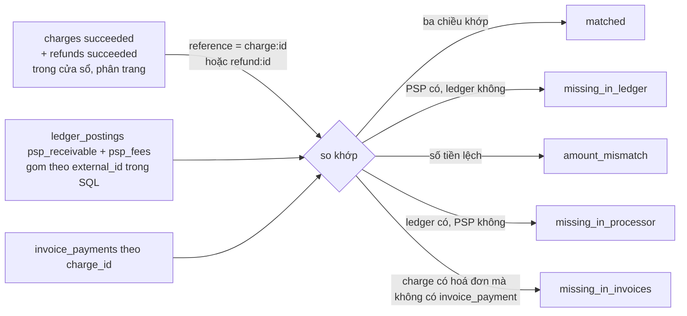

# Flow 11 — Báo cáo và đối chiếu

Hai đường đọc thuần tuý dưới `/api/v1/admin`, cần `ADMIN_API_KEY`. Không ghi gì, không phát event.

| Route                                        | Service                                                                                 |
| -------------------------------------------- | --------------------------------------------------------------------------------------- |
| `GET /api/v1/admin/reporting/revenue`        | [reporting.service.ts](../../packages/core/src/services/reporting.service.ts)           |
| `GET /api/v1/admin/reporting/reconciliation` | [reconciliation.service.ts](../../packages/core/src/services/reconciliation.service.ts) |

## Revenue summary

`getRevenueSummary` — [reporting.service.ts:15-71](../../packages/core/src/services/reporting.service.ts). Cửa sổ mặc định là 30 ngày lùi từ `windowEnd` (mặc định `clock.now()`); currency mặc định `VND`.

Sáu truy vấn độc lập rồi ghép lại:

| Trường                                         | Nguồn                        | Cách tính                                                                                                                                                         |
| ---------------------------------------------- | ---------------------------- | ----------------------------------------------------------------------------------------------------------------------------------------------------------------- |
| `mrr`                                          | `findRecurringCommitments`   | tổng `buildMonthlyAmount(unitAmount × quantity, interval, intervalCount)` trên item của subscription **`active`** (không tính `trialing`) có `recurring_interval` |
| `arr`                                          | —                            | `mrr × 12`                                                                                                                                                        |
| `activeSubscriptions`, `trialingSubscriptions` | `countSubscriptions`         | đếm theo trạng thái                                                                                                                                               |
| `canceledInWindow`                             | `countCanceledSubscriptions` | huỷ trong cửa sổ                                                                                                                                                  |
| `churnRate`                                    | —                            | `canceled / (canceled + active)`, làm tròn 4 chữ số                                                                                                               |
| `invoicedInWindow`, `outstanding`              | `aggregateInvoiceTotals`     | từ bảng `invoices`                                                                                                                                                |
| `refundedInWindow`                             | `aggregateRefundTotal`       | từ bảng `refunds`                                                                                                                                                 |
| `collectedInWindow`                            | `aggregateCashMovement`      | **từ sổ cái**, không từ `payment_intents`                                                                                                                         |

MRR chỉ quy đổi giá `per_unit` — [buildMonthlyAmount](../../packages/core/src/utils/recurring-amount.ts) cần một `unitAmount` cụ thể, nên giá theo bậc và giá metered không có đóng góp ổn định để đưa vào. Đây là giới hạn cần biết khi đọc con số.

`churnRate` dùng mẫu số `canceled + active` chứ không phải số đầu kỳ — một xấp xỉ, không phải churn kế toán chuẩn.

## Reconciliation

Câu hỏi nó trả lời: **những gì nhà xử lý thanh toán nói đã xảy ra, sổ cái có ghi đủ và đúng không.** Đây là công cụ phát hiện khe hở "PSP đã trừ tiền nhưng DB chưa ghi" nói ở [flow 07](./07-payments-and-refunds.md).

Từ phase 19 nó đối chiếu **ba chiều**: PSP ↔ sổ cái ↔ hoá đơn.

| #   | Nơi xảy ra                                  | Làm gì                                                                                                                                                          |
| --- | ------------------------------------------- | --------------------------------------------------------------------------------------------------------------------------------------------------------------- |
| 1   | `findSettledCharges` / `findSettledRefunds` | duyệt **từng trang** (`PAGE_SIZE = 200`) theo con trỏ `(createdAt, id)` cho tới khi hết — không còn cắt cụt                                                     |
| 2   | `resolveProcessorMovements`                 | dựng `reference` = `charge:<id>` / `refund:<id>`; refund mang **số âm**                                                                                         |
| 3   | `resolveLedgerMovements`                    | tổng hợp posting `psp_receivable` + `psp_fees` **bằng `group by external_id` trong SQL**, debit cộng / credit trừ                                               |
| 4   | `resolveInvoiceSettlements`                 | tổng `invoice_payments.amount` theo `charge_id` của đúng những charge vừa quét                                                                                  |
| 5   | `reconcileMovement`                         | không có trong ledger → `missing_in_ledger`; lệch số → `amount_mismatch`; charge có hoá đơn mà không có settlement → `missing_in_invoices`; còn lại → `matched` |
| 6   | `aggregateReconciliationReport`             | duyệt ngược: có trong ledger mà PSP không có → `missing_in_processor`                                                                                           |

Vì một charge ghi `psp_receivable` phần **net** và `psp_fees` phần **phí**, tổng hai tài khoản mới bằng số gộp mà PSP báo — đó là lý do phía sổ cái đọc cả hai mã tài khoản chứ không chỉ một.

Khoá so khớp chính là `externalId` mà [flow 07](./07-payments-and-refunds.md) đặt vào bút toán (`charge:<id>`, `refund:<id>`). Chuỗi này là hợp đồng ngầm giữa ba service — đổi định dạng ở một nơi là làm hỏng đối chiếu ở nơi kia.

Response trả `processorTotal`, `ledgerTotal`, `invoiceTotal`, `difference`, `scanned`, `matched` và danh sách `exceptions`.

### Giới hạn

- "Phía PSP" thực ra là bảng nội bộ `charges` / `refunds`, không phải gọi ra PSP thật. Nó bắt được lệch giữa **tầng thanh toán, sổ cái và hoá đơn**, chưa bắt được lệch giữa hệ thống và nhà cung cấp.
- Payout và dispute không nằm trong đối chiếu này: chúng không phải giao dịch của khách, và bút toán của chúng mang `externalId` khác tiền tố nên bị bỏ qua có chủ đích.

## Đọc tiếp

- [10 — Ledger](./10-ledger.md)
- ADR: [0012 portal, reporting, reconciliation](../adr/0012-phase-9-portal-reporting.md)
- ADR: [0020 dòng tiền](../adr/0020-money-flow.md)
