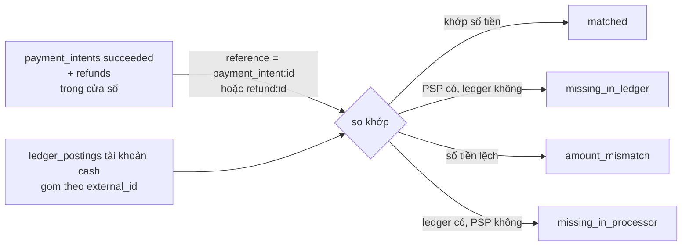

# Flow 11 — Báo cáo và đối chiếu

Hai đường đọc thuần tuý dưới `/api/v1/admin`, cần `ADMIN_API_KEY`. Không ghi gì, không phát event.

| Route                                        | Service                                                                                 |
| -------------------------------------------- | --------------------------------------------------------------------------------------- |
| `GET /api/v1/admin/reporting/revenue`        | [reporting.service.ts](../../packages/core/src/services/reporting.service.ts)           |
| `GET /api/v1/admin/reporting/reconciliation` | [reconciliation.service.ts](../../packages/core/src/services/reconciliation.service.ts) |

## Revenue summary

`getRevenueSummary` — [reporting.service.ts:15-71](../../packages/core/src/services/reporting.service.ts). Cửa sổ mặc định là 30 ngày lùi từ `windowEnd` (mặc định `clock.now()`); currency mặc định `VND`.

Sáu truy vấn độc lập rồi ghép lại:

| Trường                                         | Nguồn                        | Cách tính                                                                                                                                                         |
| ---------------------------------------------- | ---------------------------- | ----------------------------------------------------------------------------------------------------------------------------------------------------------------- |
| `mrr`                                          | `findRecurringCommitments`   | tổng `buildMonthlyAmount(unitAmount × quantity, interval, intervalCount)` trên item của subscription **`active`** (không tính `trialing`) có `recurring_interval` |
| `arr`                                          | —                            | `mrr × 12`                                                                                                                                                        |
| `activeSubscriptions`, `trialingSubscriptions` | `countSubscriptions`         | đếm theo trạng thái                                                                                                                                               |
| `canceledInWindow`                             | `countCanceledSubscriptions` | huỷ trong cửa sổ                                                                                                                                                  |
| `churnRate`                                    | —                            | `canceled / (canceled + active)`, làm tròn 4 chữ số                                                                                                               |
| `invoicedInWindow`, `outstanding`              | `aggregateInvoiceTotals`     | từ bảng `invoices`                                                                                                                                                |
| `refundedInWindow`                             | `aggregateRefundTotal`       | từ bảng `refunds`                                                                                                                                                 |
| `collectedInWindow`                            | `aggregateCashMovement`      | **từ sổ cái**, không từ `payment_intents`                                                                                                                         |

MRR chỉ quy đổi giá `per_unit` — [buildMonthlyAmount](../../packages/core/src/utils/recurring-amount.ts) cần một `unitAmount` cụ thể, nên giá theo bậc và giá metered không có đóng góp ổn định để đưa vào. Đây là giới hạn cần biết khi đọc con số.

`churnRate` dùng mẫu số `canceled + active` chứ không phải số đầu kỳ — một xấp xỉ, không phải churn kế toán chuẩn.

## Reconciliation

Câu hỏi nó trả lời: **những gì nhà xử lý thanh toán nói đã xảy ra, sổ cái có ghi đủ và đúng không.** Đây là công cụ phát hiện khe hở "PSP đã trừ tiền nhưng DB chưa ghi" nói ở [flow 07](./07-payments-and-refunds.md).

| #   | Nơi xảy ra                                                                                       | Làm gì                                                                                                     |
| --- | ------------------------------------------------------------------------------------------------ | ---------------------------------------------------------------------------------------------------------- |
| 1   | [resolveProcessorMovements:99-139](../../packages/core/src/services/reconciliation.service.ts)   | lấy intent `succeeded` (lọc theo `updatedAt`) và refund (lọc theo `createdAt`), tối đa 1000 mỗi loại       |
| 2   | [reconciliation.service.ts:118, 131](../../packages/core/src/services/reconciliation.service.ts) | dựng `reference` = `payment_intent:<id>` / `refund:<id>`; refund mang **số âm**                            |
| 3   | [resolveLedgerMovements:141-163](../../packages/core/src/services/reconciliation.service.ts)     | lấy posting tài khoản `cash` trong cửa sổ, gom theo `external_id`, debit cộng / credit trừ                 |
| 4   | [reconciliation.service.ts:37-65](../../packages/core/src/services/reconciliation.service.ts)    | duyệt phía PSP: không có trong ledger → `missing_in_ledger`; lệch số → `amount_mismatch`; bằng → `matched` |
| 5   | [reconciliation.service.ts:67-82](../../packages/core/src/services/reconciliation.service.ts)    | duyệt ngược: có trong ledger mà PSP không có → `missing_in_processor`                                      |

Khoá so khớp chính là `externalId` mà [flow 06](./06-invoicing.md) và [flow 07](./07-payments-and-refunds.md) đặt vào bút toán (`payment_intent:<id>`, `refund:<id>`). Chuỗi này là hợp đồng ngầm giữa ba service — đổi định dạng ở một nơi là làm hỏng đối chiếu ở nơi kia, mà không có test nào bắt được.

Response trả `processorTotal`, `ledgerTotal`, `difference`, `matched` và danh sách `exceptions`.

### Giới hạn

- `SCAN_LIMIT = 1000` — [reconciliation.service.ts:11](../../packages/core/src/services/reconciliation.service.ts) — lấy 1000 hàng **mới nhất rồi mới lọc theo cửa sổ**, nên cửa sổ cũ hoặc dữ liệu nhiều có thể sót. Không phân trang.
- "Phía PSP" thực ra là bảng nội bộ `payment_intents` / `refunds`, không phải gọi ra PSP thật. Nó bắt được lệch giữa **tầng thanh toán và sổ cái**, chưa bắt được lệch giữa hệ thống và nhà cung cấp.

## Đọc tiếp

- [10 — Ledger](./10-ledger.md)
- ADR: [0012 portal, reporting, reconciliation](../adr/0012-phase-9-portal-reporting.md)
