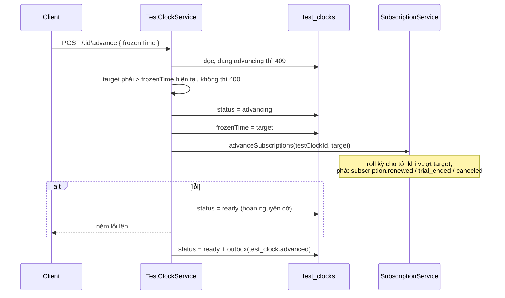

# Flow 12 — Test clock

Cách duy nhất để thấy hành vi theo thời gian (hết trial, sang kỳ mới) mà không phải chờ thật. Nó hoạt động được là nhờ một quy ước xuyên suốt: **không chỗ nào trong code nghiệp vụ gọi `new Date()` để lấy giờ hiện tại.**

## Khi nào chạy

| Route                                                    | Việc                            |
| -------------------------------------------------------- | ------------------------------- |
| `POST /v1/test_helpers/test_clocks`                      | tạo đồng hồ đóng băng ở một mốc |
| `GET /v1/test_helpers/test_clocks`, `GET /:testClockId`  | xem                             |
| `POST /v1/test_helpers/test_clocks/:testClockId/advance` | nhảy tới mốc mới                |

Gắn đồng hồ vào khách bằng `testClockId` lúc tạo customer; subscription kế thừa từ khách — [subscription.service.ts:83](../../packages/core/src/services/subscription.service.ts).

## Hai nguồn thời gian

| Nguồn                                           | Dùng ở đâu                    |
| ----------------------------------------------- | ----------------------------- |
| `fastify.clock.now()` — `SystemClock`, giờ thật | mặc định ở mọi service        |
| `testClock.frozenTime`                          | khi thực thể có `testClockId` |

Chọn giữa hai cái ở `resolveNow` — [subscription.service.ts:398-410](../../packages/core/src/services/subscription.service.ts): không có `testClockId` thì `clock.now()`, có thì đọc `frozenTime` của đồng hồ.

`SystemClock` được decorate một lần ở [config.plugin.ts:34](../../packages/core/src/plugins/config.plugin.ts). Mọi service lấy giờ qua nó — đó là lý do có thể kiểm soát thời gian mà không phải vá `Date` toàn cục.

Lưu ý: hiện chỉ `SubscriptionService` có `resolveNow`. Các service khác (invoice, payment, dunning) luôn dùng giờ thật ngay cả với thực thể có `testClockId`.

## Advance

| #   | Nơi xảy ra                                                                              | Làm gì                                                            |
| --- | --------------------------------------------------------------------------------------- | ----------------------------------------------------------------- |
| 1   | [test-clock.service.ts:76-78](../../packages/core/src/services/test-clock.service.ts)   | đang `advancing` → `ConflictError` (khoá chống chạy chồng)        |
| 2   | [test-clock.service.ts:82-87](../../packages/core/src/services/test-clock.service.ts)   | đồng hồ chỉ đi tới; lùi hoặc bằng → `BadRequestError`             |
| 3   | [test-clock.service.ts:89-92](../../packages/core/src/services/test-clock.service.ts)   | `status = advancing`                                              |
| 4   | [test-clock.service.ts:95-96](../../packages/core/src/services/test-clock.service.ts)   | ghi `frozenTime = target`, rồi `advanceSubscriptions(id, target)` |
| 5   | [test-clock.service.ts:97-103](../../packages/core/src/services/test-clock.service.ts)  | lỗi → đưa `status` về `ready` rồi ném tiếp                        |
| 6   | [test-clock.service.ts:105-129](../../packages/core/src/services/test-clock.service.ts) | transaction: `status = ready` + event `test_clock.advanced`       |

Bước 4 **không** nằm trong transaction. Tiến trình chết giữa bước 4 và 6 thì `frozenTime` đã nhảy nhưng `status` kẹt ở `advancing`, và mọi lần advance sau đó bị 409. Đây là trạng thái kẹt duy nhất trong flow này; gỡ bằng cách sửa `status` về `ready` trong DB.

Bước 5 chỉ hoàn nguyên `status`, **không** hoàn nguyên `frozenTime` — đồng hồ vẫn ở mốc mới dù việc đẩy subscription hỏng giữa chừng.

## Nó kéo theo cái gì

`advanceSubscriptions` → `rollPeriod` ([flow 04](./04-subscription-entitlement.md)) cho mọi subscription của đồng hồ này có `currentPeriodEnd <= target`, tối đa 120 lần roll mỗi subscription. Mỗi lần roll phát một event, nên sau khi advance:

1. Outbox relay đẩy `subscription.renewed` / `trial_ended` / `canceled` ([flow 02](./02-event-pipeline.md)).
2. Worker `domain-event` đồng bộ lại entitlement.
3. Billing run ở chu kỳ tới thấy kỳ đã kết thúc và tạo hoá đơn nháp ([flow 08](./08-billing-run.md)) — **nếu** `currentPeriodEnd` thật sự nhỏ hơn giờ thật, vì billing run dùng `clock.now()` chứ không dùng `frozenTime`.

Điểm 3 là hệ quả của việc chỉ `SubscriptionService` biết test clock: đẩy đồng hồ về tương lai xa rồi chờ billing run sẽ không cho kết quả như mong đợi. Muốn thấy hoá đơn thì gọi `POST /v1/invoices` thẳng.

## Kịch bản thử tay

1. Tạo test clock ở hiện tại.
2. Tạo customer với `testClockId` đó.
3. Tạo product + price recurring monthly, rồi subscription có `trialPeriodDays: 7`.
4. Advance đồng hồ lên +8 ngày → subscription từ `trialing` sang `active`, event `subscription.trial_ended`.
5. Advance lên +40 ngày → thêm một lần roll, event `subscription.renewed`.
6. `GET /v1/invoices/upcoming?subscriptionId=...` xem số tiền của kỳ mới.

Trang `/test-clocks` của erp-ui làm đúng các bước này qua UI.

## Đọc tiếp

- [technique 03 — Test clock](../technique/03-test-clock.md) — vì sao thiết kế như vậy, cách dùng, giới hạn
- [04 — Subscription](./04-subscription-entitlement.md)
- ADR: [0005 subscription + entitlement](../adr/0005-phase-3-subscription-entitlement.md)
