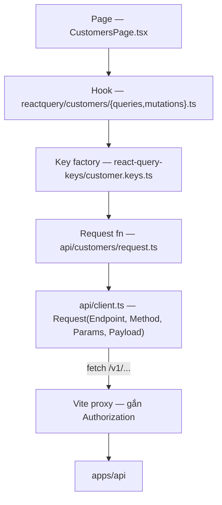

# Flow 13 — Luồng dữ liệu ở frontend

Hai app đọc cùng một API nhưng qua hai bề mặt khác nhau: admin-ui là SPA đi bằng cookie session vào `/v1` và `/api/v1/admin`, portal-ui chỉ được đi vào `/portal/*` bằng session của khách hàng.

## admin-ui

React 19 + Vite + TanStack Query. Bốn tầng, mỗi tầng một việc:



### Tầng client

[api/client.ts](../../apps/admin-ui/src/api/client.ts) — request ghép từ các setter thay vì một object cấu hình:

```ts
Request<CustomerResponse>(Endpoint('/v1/customers'), Method('POST'), Payload(payload));
```

- `set(field, value)` bỏ qua giá trị `nil` — [client.ts:36-44](../../apps/admin-ui/src/api/client.ts) — nên truyền `Params(undefined)` là vô hại.
- `buildUrl` loại mọi query param `nil` — [client.ts:72-86](../../apps/admin-ui/src/api/client.ts).
- Lỗi: đọc vỏ `{ error: {...} }` của API ([flow 01](./01-request-lifecycle.md)) và ném `PinstripeApiError` giữ nguyên `statusCode`, `type`, `code`, `param`, `requestId` — [client.ts:108-123](../../apps/admin-ui/src/api/client.ts). Nhờ đó toast hiển thị đúng message server trả.

### Xác thực

Client **không** giữ API key. Vite proxy gắn header — [vite.config.ts:16-27](../../apps/admin-ui/vite.config.ts):

| Đường dẫn | Header gắn thêm            |
| --------- | -------------------------- |
| `/v1/*`   | `Bearer ${SECRET_API_KEY}` |
| `/api/*`  | `Bearer ${ADMIN_API_KEY}`  |

Đây là cơ chế **chỉ dùng cho dev**. Build production không có proxy, nên admin-ui hiện chưa có đường xác thực thật — một trong các mục chặn production ở [ROADMAP.md](../ROADMAP.md).

### Query key

Dùng `@lukemorales/query-key-factory`. Mỗi domain một file khai báo cả key lẫn `queryFn` — [customer.keys.ts](../../apps/admin-ui/src/react-query-keys/customer.keys.ts) — rồi `mergeQueryKeys` gom thành một object `queries` — [index.ts:15-28](../../apps/admin-ui/src/react-query-keys/index.ts).

Hook chỉ việc trải ra:

```ts
useQuery({ ...queries.customer.customers(query), enabled });
```

Lợi ích thật nằm ở phía invalidate: `queries.customer.customers._def` là prefix của **mọi** biến thể danh sách, nên một lệnh invalidate quét hết các trang và bộ lọc.

### Mutation

Khuôn giống nhau ở mọi file — [mutations.ts](../../apps/admin-ui/src/reactquery/customers/mutations.ts):

1. `mutationFn` gọi request function, tham số tên `payload`.
2. `onSuccess`: invalidate **trước**, toast **sau**.
3. `onError`: `toast.show(error.message, { isError: true })` — message lấy thẳng từ `PinstripeApiError`.
4. `shouldBeSuccessToast` cho phép tắt toast khi mutation là một bước trong chuỗi dài hơn.

Update một bản ghi thì invalidate cả key chi tiết lẫn `_def` của danh sách — [mutations.ts:36-37](../../apps/admin-ui/src/reactquery/customers/mutations.ts).

### Cấu hình chung

[QueryProvider.tsx](../../apps/admin-ui/src/providers/QueryProvider.tsx): `retry: 1`, `refetchOnWindowFocus: false`. Provider ghép trong [ProviderRegistry.tsx](../../apps/admin-ui/src/providers/ProviderRegistry.tsx): `QueryProvider` → `AdminPinstripeProvider` → `RoutesProvider`, cộng `<Toaster>` của sonner.

Route khai trong [routes/def.tsx](../../apps/admin-ui/src/features/dashboard/routes/def.tsx) bằng path của [routes/paths.ts](../../apps/admin-ui/src/features/dashboard/routes/paths.ts). Mọi màn nằm sau `RequireSession`, trong layout chung `AppLayout`.

### Form

React Hook Form + Zod. Mỗi form một file cấu hình dưới `src/common/forms/` (`customer-form.ts`, `product-form.ts`, `meter-form.ts`, `subscription-form.ts`, `test-clock-form.ts`, `reverse-transaction-form.ts`…), ghép với component tương ứng dưới `src/features/dashboard/components/<X>Form/`.

## portal-ui

Next.js 15 App Router, port 3100, HeroUI v3 như admin-ui. Quyết định đầy đủ ở
[ADR 0026](../adr/0026-customer-portal-auth-and-bff.md).

```
trình duyệt ── PinstripeClient({ baseUrl: '/bff' }) + hook @pinstripe/sdk/react/portal
   │  cookie pinstripe_portal_session (httpOnly)
   ▼
app/bff/portal/[...path] ── allowlist · Origin check · cookie ↔ Bearer · portal key cho links/sessions
   ▼
API /portal/*
```

- `/login` gửi email → `POST /bff/portal/links`. `/login/verify?linkKey=…` chỉ redeem khi người dùng
  bấm "Tiếp tục đăng nhập" → `POST /bff/portal/sessions`; BFF giữ `sessionKey` trong cookie và trả body
  với `sessionKey: null`.
- `middleware.ts` chuyển về `/login` khi thiếu cookie; `RequirePortalSession` bắt 401 của `/portal/me`
  khi phiên hết hạn giữa chừng.
- `/customers/*` (trang cũ đọc bằng secret key) redirect về `/login`. Không còn rewrite `/api/*`.
- Người dùng có quyền ở nhiều nhà xe thấy bộ chọn nhà xe trên topbar (`useUpdatePortalSessionMutation`
  → `POST /bff/portal/sessions/current`); vai trò và email đăng nhập hiện trên topbar và trang Tài khoản.
- Màn: `/` Tổng quan (`usePortalInvoiceTotalsQuery`, 5 hóa đơn gần nhất, gói đang dùng), `/invoices`
  (tab `?view=all|upcoming|overdue|paid`, phân trang cursor, xuất CSV), `/invoices/[invoiceId]` (chi tiết,
  tải PDF qua `/bff/portal/invoices/:id/pdf`, thẻ chuyển khoản + VietQR, các lần thanh toán),
  `/payments`, `/subscriptions`, `/account` (kế toán phụ trách, số dư tín dụng, thẻ đã lưu).
- Component bảng/thẻ (`DataTable`, `StatItem`, `DetailList`…) là bản riêng trong
  `apps/portal-ui/src/common`, không import từ admin-ui. Số ngày trễ đếm theo ngày lịch giờ Việt Nam.
- Env của portal: `PINSTRIPE_API_URL`, `PINSTRIPE_PORTAL_API_KEY` trong `apps/portal-ui/.env.local`,
  chỉ đọc ở `src/libs/portal-bff.ts`.

Phía API, mọi route `/portal/*` lấy `customerId` từ session chứ không từ tham số:

- `POST /portal/links` (key scope `portal`) gửi magic link tới `customers.email`; link trỏ về
  `${PORTAL_BASE_URL}/login/verify?linkKey=…`, dùng một lần, hết hạn sau `PORTAL_LINK_TTL_MINUTES`.
- `POST /portal/sessions` đổi `linkKey` lấy `sessionKey`; các route đọc dùng
  `Authorization: Bearer <sessionKey>`: `GET /portal/me`, `/invoices` (lọc `status`, `isOverdue`),
  `/invoices/:invoiceId`, `/invoices/:invoiceId/pdf`, `/invoices/:invoiceId/bank_transfer`,
  `/invoice_totals`, `/invoice_exports`, `/payments`, `/subscriptions`, `/payment_methods`. Hóa đơn
  `draft` và hóa đơn của khách khác luôn là 404.
- Hai route đăng nhập bị giới hạn tần suất (`PORTAL_RATE_LIMIT` lần / `PORTAL_RATE_WINDOW_SECONDS`)
  theo IP người dùng cuối và theo email. IP đọc từ header `x-pinstripe-client-ip`
  (`PORTAL_CLIENT_IP_HEADER`), chỉ được tin vì request đó đã xác thực bằng portal key.
- `POST /v1/billing_portal/sessions` trả cùng loại link dùng một lần — không bao giờ đặt `sessionKey`
  vào URL.

## Contract dùng chung

Cả hai frontend import type thẳng từ `@pinstripe/core/contracts` — cùng nguồn với schema TypeBox mà API dùng để validate. Đổi contract ở core là cả hai app báo lỗi biên dịch ngay, không lệch âm thầm.

Hệ quả vận hành: `@pinstripe/core` phải được build trước thì app mới chạy được — xem [shared-package-build](../../.claude/rules/agentkit/profiles/monorepo-turborepo/shared-package-build.md).

## Đọc tiếp

- [01 — Request lifecycle](./01-request-lifecycle.md) — phía bên kia của mỗi lời gọi
- ADR: [0012 portal + reporting](../adr/0012-phase-9-portal-reporting.md)
