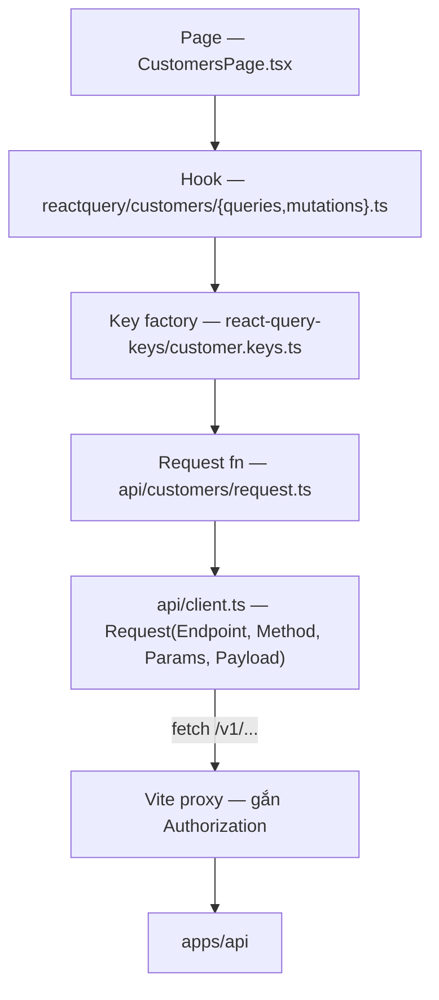

# Flow 13 — Luồng dữ liệu ở frontend

Hai app đọc cùng một API nhưng theo hai kiểu hoàn toàn khác: admin-ui là SPA có cache phía client, portal-ui render trên server không cache.

## admin-ui

React 19 + Vite + TanStack Query. Bốn tầng, mỗi tầng một việc:



### Tầng client

[api/client.ts](../../apps/admin-ui/src/api/client.ts) — request ghép từ các setter thay vì một object cấu hình:

```ts
Request<CustomerResponse>(Endpoint('/v1/customers'), Method('POST'), Payload(payload));
```

- `set(field, value)` bỏ qua giá trị `nil` — [client.ts:36-44](../../apps/admin-ui/src/api/client.ts) — nên truyền `Params(undefined)` là vô hại.
- `buildUrl` loại mọi query param `nil` — [client.ts:72-86](../../apps/admin-ui/src/api/client.ts).
- Lỗi: đọc vỏ `{ error: {...} }` của API ([flow 01](./01-request-lifecycle.md)) và ném `PinstripeApiError` giữ nguyên `statusCode`, `type`, `code`, `param`, `requestId` — [client.ts:108-123](../../apps/admin-ui/src/api/client.ts). Nhờ đó toast hiển thị đúng message server trả.

### Xác thực

Client **không** giữ API key. Vite proxy gắn header — [vite.config.ts:16-27](../../apps/admin-ui/vite.config.ts):

| Đường dẫn | Header gắn thêm            |
| --------- | -------------------------- |
| `/v1/*`   | `Bearer ${SECRET_API_KEY}` |
| `/api/*`  | `Bearer ${ADMIN_API_KEY}`  |

Đây là cơ chế **chỉ dùng cho dev**. Build production không có proxy, nên admin-ui hiện chưa có đường xác thực thật — một trong các mục chặn production ở [ROADMAP.md](../ROADMAP.md).

### Query key

Dùng `@lukemorales/query-key-factory`. Mỗi domain một file khai báo cả key lẫn `queryFn` — [customer.keys.ts](../../apps/admin-ui/src/react-query-keys/customer.keys.ts) — rồi `mergeQueryKeys` gom thành một object `queries` — [index.ts:15-28](../../apps/admin-ui/src/react-query-keys/index.ts).

Hook chỉ việc trải ra:

```ts
useQuery({ ...queries.customer.customers(query), enabled });
```

Lợi ích thật nằm ở phía invalidate: `queries.customer.customers._def` là prefix của **mọi** biến thể danh sách, nên một lệnh invalidate quét hết các trang và bộ lọc.

### Mutation

Khuôn giống nhau ở mọi file — [mutations.ts](../../apps/admin-ui/src/reactquery/customers/mutations.ts):

1. `mutationFn` gọi request function, tham số tên `payload`.
2. `onSuccess`: invalidate **trước**, toast **sau**.
3. `onError`: `toast.show(error.message, { isError: true })` — message lấy thẳng từ `PinstripeApiError`.
4. `shouldBeSuccessToast` cho phép tắt toast khi mutation là một bước trong chuỗi dài hơn.

Update một bản ghi thì invalidate cả key chi tiết lẫn `_def` của danh sách — [mutations.ts:36-37](../../apps/admin-ui/src/reactquery/customers/mutations.ts).

### Cấu hình chung

[main.tsx:11-13](../../apps/admin-ui/src/main.tsx): `retry: 1`, `refetchOnWindowFocus: false`. Provider: `QueryClientProvider` → `BrowserRouter` → `App`, cộng `<Toaster>` của sonner.

12 trang, mặc định chuyển hướng về `/customers` — [App.tsx:18-35](../../apps/admin-ui/src/App.tsx). Tất cả nằm trong layout chung `AppLayout`.

### Form

React Hook Form + Zod. Mỗi form một file cấu hình dưới `src/forms/` (`customer-form.ts`, `product-form.ts`, `meter-form.ts`, `subscription-form.ts`, `test-clock-form.ts`, `reverse-transaction-form.ts`), ghép với component tương ứng dưới `src/components/<X>Form/`.

## portal-ui

Next.js 15 App Router, port 3100. Không có provider client nào, không TanStack Query, không cache.

[lib/pinstripe.ts](../../apps/portal-ui/src/lib/pinstripe.ts) dựng đúng một `PinstripeClient` bằng `createPinstripeClient` từ `@pinstripe/sdk/node`. Không có HTTP client viết tay — xem [sdk-convention](../../.claude/rules/local/sdk-convention.md).

- Client chạy **trên server**; `createPinstripeClient` đọc `PINSTRIPE_API_URL` và `PINSTRIPE_SECRET_API_KEY` từ `process.env`. API key không bao giờ tới trình duyệt.
- Lỗi là `PinstripeError` của SDK, giữ `statusCode` / `type` / `requestId` đọc từ vỏ lỗi của API.
- Trang gọi ba method: `customers.get`, `subscriptions.find`, `invoices.find`, mỗi danh sách `limit=20`, không phân trang.

### Lỗ hổng cần biết

`app/customers/[customerId]/page.tsx` **không kiểm tra người xem là ai**. Bất kỳ ai biết một `customerId` đều đọc được hoá đơn và subscription của khách đó. Đây là mục chặn production số một trong [ROADMAP.md](../ROADMAP.md) — đừng đưa portal-ui ra mạng công cộng trước khi có xác thực.

## Contract dùng chung

Cả hai frontend import type thẳng từ `@pinstripe/core/contracts` — cùng nguồn với schema TypeBox mà API dùng để validate. Đổi contract ở core là cả hai app báo lỗi biên dịch ngay, không lệch âm thầm.

Hệ quả vận hành: `@pinstripe/core` phải được build trước thì app mới chạy được — xem [shared-package-build](../../.claude/rules/agentkit/profiles/monorepo-turborepo/shared-package-build.md).

## Đọc tiếp

- [01 — Request lifecycle](./01-request-lifecycle.md) — phía bên kia của mỗi lời gọi
- ADR: [0012 portal + reporting](../adr/0012-phase-9-portal-reporting.md)
