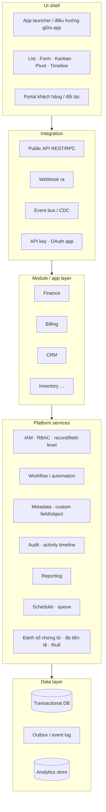

# ERP — tổng quan và kiến trúc tham chiếu

- **Ngày research.** 2026-09-22.
- **Vai trò của file.** Khung chung cho cả bộ research: định nghĩa, domain, kiến trúc tham chiếu và
  bộ tiêu chí mà [`01-odoo.md`](01-odoo.md), [`02-hubspot.md`](02-hubspot.md),
  [`03-salesforce.md`](03-salesforce.md) cùng dùng, để [`04-comparison.md`](04-comparison.md) so được
  từng ô với nhau và [`05-internal-architecture.md`](05-internal-architecture.md) đối chiếu được với
  repo.

## 1. ERP là gì

ERP (Enterprise Resource Planning) là một hệ thống ghép các nghiệp vụ hành chính và vận hành của
doanh nghiệp — tài chính, mua hàng, bán hàng, kho, sản xuất, nhân sự — lên **một mô hình dữ liệu dùng
chung**, để một giao dịch nhập một lần và đi xuyên qua mọi bộ phận. Giá trị của ERP không nằm ở từng
màn hình mà ở chỗ các nghiệp vụ **nói chuyện với nhau**: đơn bán sinh phiếu xuất kho, phiếu xuất sinh
bút toán giá vốn, hoá đơn sinh công nợ phải thu.

Gartner mô tả hai bước tiến hoá gần đây của khái niệm:

- **Postmodern ERP** (2013): ERP nguyên khối tách thành các ứng dụng liên kết lỏng, phần lớn trên cloud,
  cân bằng giữa tích hợp do vendor cung cấp và sự linh hoạt của doanh nghiệp.
- **Composable ERP**: một chiến lược công nghệ thích ứng, dựng nền năng lực hành chính và vận hành từ
  các khối có thể lắp ghép, để doanh nghiệp đổi hướng nhanh hơn — nhấn vào tính module, API và việc
  trộn ứng dụng của nhiều vendor.

Nhận định: cả hai khái niệm nói cùng một điều mà repo này đã chọn ở quy mô nhỏ — **module hoá thật, nối
với nhau bằng hợp đồng (API, event) thay vì bằng bảng dùng chung**. Khác biệt là ở đây các khối nằm
trong một codebase chứ không phải nhiều vendor (xem ADR 0030).

## 2. ERP, CRM và "business platform" — ba thứ khác nhau

Ba hệ được yêu cầu khảo sát không cùng loại. Không nói rõ điều này thì bảng so sánh sẽ so táo với cam.

| Loại                               | Trọng tâm                                                                                | Có sẵn sổ cái kế toán / kho?             | Ví dụ trong bộ này |
| ---------------------------------- | ---------------------------------------------------------------------------------------- | ---------------------------------------- | ------------------ |
| **ERP**                            | Vận hành + tài chính end-to-end trên một mô hình dữ liệu                                 | Có                                       | Odoo               |
| **CRM**                            | Khách hàng, pipeline bán hàng, marketing, chăm sóc                                       | Không (chỉ tích hợp)                     | HubSpot            |
| **Business platform (PaaS + CRM)** | Một runtime để dựng ứng dụng doanh nghiệp bất kỳ trên metadata; CRM là ứng dụng đầu tiên | Không có gốc; có qua đối tác AppExchange | Salesforce         |

Hệ quả cho bộ research:

- **Odoo** là đối chứng cho phần _ERP lõi_: kế toán, kho, mua bán, cách các app phụ thuộc nhau.
- **HubSpot** là đối chứng cho phần _CRM và trải nghiệm vận hành_: object/association/property,
  pipeline, workflow không cần code, app marketplace — và là hệ mà vxrerp **đang thay thế**, nên báo
  cáo phải trả lời được "vì sao không ở lại HubSpot".
- **Salesforce** là đối chứng cho phần _platform_: metadata-driven, multi-tenant, custom object,
  phân quyền nhiều tầng, event bus, packaging.

## 3. Các domain chuẩn của một ERP

| Domain                | Chuỗi nghiệp vụ                                       | Thực thể lõi                                                          |
| --------------------- | ----------------------------------------------------- | --------------------------------------------------------------------- |
| Finance / GL          | Record-to-Report                                      | Tài khoản, bút toán, kỳ kế toán, công nợ, đối soát, báo cáo tài chính |
| Order-to-Cash         | Báo giá → đơn → giao → hoá đơn → thu tiền             | Customer, quote, order, invoice, payment                              |
| Subscription billing  | Plan → subscription → rating → invoice → dunning      | Product, price, subscription, usage, invoice, credit note             |
| Procure-to-Pay        | Đề nghị mua → PO → nhận hàng → hoá đơn NCC → trả tiền | Vendor, PO, receipt, bill                                             |
| Inventory / Logistics | Nhập, xuất, chuyển, kiểm kê                           | Warehouse, location, stock move, lot                                  |
| Manufacturing         | BOM → lệnh sản xuất → tiêu hao                        | BOM, work order                                                       |
| HR / Payroll          | Tuyển → hợp đồng → chấm công → lương                  | Employee, contract, timesheet, payslip                                |
| CRM / Sales           | Lead → opportunity → deal → khách hàng                | Contact, company, deal, activity                                      |
| Service / Project     | Ticket, dự án, timesheet                              | Ticket, task                                                          |

Với vxrerp, domain đã có là **Subscription billing** (`@vxrerp/billing`, gồm ledger, invoice,
payment, dunning) và khung **CRM** (`@vxrerp/crm`). Finance/GL tổng quát, Procure-to-Pay và HR chưa
có; các báo cáo từng hệ ghi rõ hệ đó phủ domain nào.

## 4. Kiến trúc tham chiếu của một ERP

Mọi ERP/platform trưởng thành đều có đủ các lớp dưới đây, dù đặt tên khác nhau. Đây là "bản đồ" để
đặt từng hệ lên cùng một khung.

| Lớp                               | Câu hỏi kiến trúc phải trả lời                                                                                                     | Vì sao quan trọng                                                                               |
| --------------------------------- | ---------------------------------------------------------------------------------------------------------------------------------- | ----------------------------------------------------------------------------------------------- |
| **Data layer**                    | Một DB cho mọi module hay tách? Có ranh giới giữa bảng của các module không? Tenant cách ly thế nào?                               | Quyết định chi phí tách module sau này và rủi ro một module đọc trộm bảng của module khác       |
| **Module / app layer**            | Module khai báo phụ thuộc thế nào? Module mở rộng module khác bằng cách nào (kế thừa, hook, event)? Cài / gỡ module có được không? | Là chỗ coupling tích tụ — Odoo và Salesforce trả lời câu này rất khác nhau                      |
| **Metadata & extensibility**      | Người dùng/đối tác thêm field, object, view mà không sửa code được không? Schema là code hay dữ liệu?                              | Quyết định tốc độ đáp ứng nghiệp vụ mới vs độ an toàn kiểu dữ liệu                              |
| **Workflow / automation**         | Logic nghiệp vụ sống ở code, ở low-code, hay cả hai? Ai được sửa?                                                                  | Tách ranh giới dev vs người vận hành                                                            |
| **IAM & phân quyền**              | RBAC theo object? record-level (chỉ thấy khách của mình)? field-level?                                                             | ERP chứa tiền và dữ liệu cá nhân; thiếu record-level là khoảng trống thường gặp nhất khi tự xây |
| **Integration**                   | API có ổn định, có version, có idempotency? Webhook ký thế nào? Có event bus/CDC không?                                            | ERP không bao giờ đứng một mình: PSP, e-invoice, data warehouse, hệ vận hành Vexere             |
| **Audit & activity**              | Ai đổi gì, lúc nào? Có timeline hoạt động trên từng bản ghi không?                                                                 | Yêu cầu tài chính/pháp lý và nhu cầu vận hành hằng ngày                                         |
| **Reporting**                     | Báo cáo chạy trên DB giao dịch hay kho riêng? Người dùng tự dựng báo cáo được không?                                               | Báo cáo nặng trên DB giao dịch là nguồn sự cố hiệu năng phổ biến                                |
| **Nền tảng nghiệp vụ dùng chung** | Đánh số chứng từ, đa tiền tệ, thuế, đa công ty, lịch chạy                                                                          | Mọi module cần; làm sai một lần là sai ở mọi module                                             |
| **UI shell**                      | Điều hướng giữa nhiều app, mẫu màn hình chuẩn                                                                                      | Người dùng nội bộ dùng cả ngày; nhất quán quan trọng hơn đẹp                                    |
| **Triển khai & tenancy**          | Single-tenant, multi-tenant, on-prem, SaaS? Nâng cấp phiên bản thế nào?                                                            | Quyết định chi phí vận hành và chi phí nâng cấp dài hạn                                         |

## 5. Các phong cách kiến trúc thường gặp

| Phong cách                          | Mô tả                                                                                                                            | Đại diện                    | Được                                                  | Mất                                                           |
| ----------------------------------- | -------------------------------------------------------------------------------------------------------------------------------- | --------------------------- | ----------------------------------------------------- | ------------------------------------------------------------- |
| **Monolith addon**                  | Một process, một DB; module là package cắm vào, được sửa/kế thừa model của nhau                                                  | Odoo                        | Tích hợp chặt, một giao dịch xuyên module, dựng nhanh | Coupling ngầm giữa module, nâng cấp khó                       |
| **Multi-tenant metadata-driven**    | Một kernel chung đọc metadata của từng tenant để dựng object, logic, API lúc runtime; data của mọi tenant trong một schema chung | Salesforce                  | Tuỳ biến không cần deploy, nâng cấp đồng loạt         | Governor limit, lock-in, logic tuỳ biến bị giới hạn           |
| **SaaS product có object model mở** | Sản phẩm đóng; mở rộng qua custom object/property, workflow, app marketplace và API                                              | HubSpot                     | Dùng ngay, UX tốt, không vận hành                     | Không sở hữu data model, không có ERP lõi, giá theo seat/tier |
| **Modular monolith**                | Một codebase/deploy, ranh giới module do code và lint giữ, module giao tiếp qua hợp đồng                                         | vxrerp (ADR 0030)           | Ranh giới rõ, vẫn đơn giản vận hành, tách được sau    | Cần kỷ luật; không có tuỳ biến runtime cho người dùng         |
| **Microservices / composable**      | Mỗi domain một service/DB, nối bằng API và event                                                                                 | ERP composable nhiều vendor | Scale và deploy độc lập                               | Chi phí phân tán cao, giao dịch xuyên domain khó              |

## 6. Bộ tiêu chí đánh giá dùng chung

Mỗi báo cáo hệ thống viết theo cùng 13 mục (xem [`README.md`](README.md)). Bảng so sánh ở
[`04-comparison.md`](04-comparison.md) chấm trên các tiêu chí sau:

1. Phạm vi ERP lõi
2. Kiến trúc triển khai và tenancy
3. Data model và custom object/field
4. Cơ chế module hoá và phụ thuộc
5. Extensibility: code, metadata hay low-code
6. Workflow / automation
7. Phân quyền: RBAC, record-level, field-level
8. API và event
9. Ecosystem / marketplace
10. Reporting
11. UI shell
12. Đa công ty, đa tiền tệ, thuế — gồm khả năng đáp ứng hoá đơn điện tử Việt Nam (NĐ 123/2020, sửa
    đổi bởi NĐ 70/2025; xem `docs/RESEARCH.md`)
13. Chi phí: license và TCO
14. Vendor lock-in
15. Độ phù hợp với Vexere

## 7. Đặt vxrerp lên kiến trúc tham chiếu — hiện trạng

Đây là baseline mà [`05-internal-architecture.md`](05-internal-architecture.md) sẽ kiểm chứng; chưa
phải đánh giá.

| Lớp                      | Hiện trạng vxrerp                                                                                                                    | Nguồn trong repo                            |
| ------------------------ | ------------------------------------------------------------------------------------------------------------------------------------ | ------------------------------------------- |
| Data layer               | Một Postgres; mỗi module một schema (`platform`, `billing`, `crm`); không FK chéo module; migration riêng từng package               | ADR 0030 §3–4                               |
| Module layer             | `@vxrerp/platform` + module; platform không import module, module không import nhau; lint chặn                                       | ADR 0030 §1, §8; `erp-module-convention.md` |
| Giao tiếp module         | Domain event qua outbox, module đăng ký handler vào platform                                                                         | ADR 0030 §6                                 |
| Metadata & extensibility | Không có tuỳ biến runtime; shared kernel là enum đóng                                                                                | ADR 0030 §2                                 |
| IAM                      | better-auth cho dashboard, API key theo module; `ROLE_PERMISSIONS` hằng số; permission theo route, fail closed; chưa có record-level | ADR 0024, 0028; `auth-convention.md`        |
| Integration              | API `/v1` + `@vxrerp/sdk` kiểu Stripe; webhook và API key thuộc module                                                               | ADR 0028; `sdk-convention.md`               |
| Workflow                 | Code + BullMQ worker; lịch chạy theo module                                                                                          | ADR 0030 §5                                 |
| Audit                    | Audit log, event log ở platform                                                                                                      | ADR 0030 §1                                 |
| Reporting                | Resource `reporting` trên DB giao dịch                                                                                               | `sdk-convention.md`                         |
| UI shell                 | erp-ui: app launcher theo kiểu Odoo, mỗi feature một sidebar                                                                         | ADR 0025, 0030 §7                           |
| Tenancy                  | Single-tenant, nội bộ                                                                                                                | ADR 0030                                    |

## Nguồn

Truy cập ngày 2026-09-22.

- Gartner — [Definition of Postmodern ERP](https://www.gartner.com/en/information-technology/glossary/postmodern-erp)
- Gartner — [Enterprise Resource Planning insights](https://www.gartner.com/en/information-technology/topics/enterprise-resource-planning)
- TechTarget — [Evolution of postmodern ERP to composable ERP explained](https://www.techtarget.com/searcherp/podcast/Evolution-of-postmodern-ERP-to-composable-ERP-explained)
- Salesforce Architects — [Platform Multitenant Architecture](https://architect.salesforce.com/docs/architect/fundamentals/guide/platform-multitenant-architecture.html)
- Salesforce — [The Force.com Multitenant Architecture (whitepaper)](https://www.developerforce.com/media/ForcedotcomBookLibrary/Force.com_Multitenancy_WP_101508.pdf)
- Trong repo: `docs/adr/0024-dashboard-auth-and-session-authorization.md`,
  `docs/adr/0025-admin-ui-architecture.md`, `docs/adr/0028-api-surface-consolidation.md`,
  `docs/adr/0030-erp-modular-monolith.md`, `docs/RESEARCH.md`
