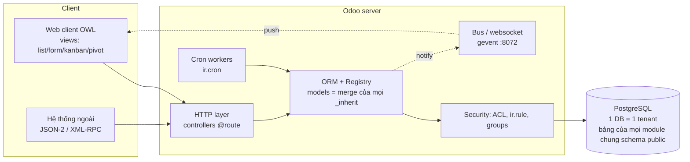

# Odoo — báo cáo kiến trúc

> Phiên bản khảo sát: **Odoo 19.0** (major, phát hành 09/2025) cùng các bản Online 19.x; Odoo 20 dự kiến công bố tại Odoo Experience 24–26/09/2026, chưa phát hành tại ngày viết. Ngày research: 2026-09-22. Báo cáo 1/3 (Odoo / HubSpot / Salesforce), cùng template.

Quy ước: `[Sn]` trỏ tới nguồn ở mục 13. Câu mở đầu bằng **Nhận định:** là suy luận của người viết, không phải fact từ nguồn.

## 1. Tóm tắt

- **Định vị.** Odoo là bộ ứng dụng doanh nghiệp tích hợp (ERP + CRM + eCommerce + HR…) chạy trên một framework chung (ORM Python + PostgreSQL + web client). Khách hàng mục tiêu là SME đến mid-market; mọi app cùng dùng chung một database và một mô hình dữ liệu, nên "tích hợp" giữa Sales, Kho, Kế toán là gọi ORM trong cùng process chứ không qua API. [S1][S2]
- **License.** Hai edition:
  - _Community_ — LGPL v3, mã nguồn mở trên `github.com/odoo/odoo`. [S3][S4]
  - _Enterprise_ — "Odoo Enterprise Edition License v1.0": cần subscription đúng số user, cấm phân phối lại bản sao hay bản sửa; module tự viết vẫn được phát hành dưới license tương thích (LGPL, MIT…). [S3]
  - Manifest của module mặc định mang license `LGPL-3`. [S5]
- **Mô hình giá** (bảng giá niêm yết, khác nhau theo quốc gia) [S6][S7]:

  | Gói          | Nội dung chính                                                             | Hosting                         |
  | ------------ | -------------------------------------------------------------------------- | ------------------------------- |
  | One App Free | 1 app, không giới hạn user                                                 | chỉ Odoo Online                 |
  | Standard     | mọi app; **không** Studio, **không** multi-company, **không** external API | chỉ Odoo Online                 |
  | Custom       | mọi app + Studio + multi-company + external API                            | Online, Odoo.sh hoặc on-premise |

  Tài liệu JSON-2 API ghi rõ external API chỉ có ở gói Custom. [S8] Odoo.sh tính thêm theo worker, dung lượng và staging. [S7]

- **Triển khai.** Ba hình thức: _Odoo Online_ (SaaS multi-tenant, chỉ module chuẩn + Studio, nhận bản trung gian 19.1, 19.2…), _Odoo.sh_ (PaaS dạng git branch → build → staging/production, cho phép custom module), _on-premise_ (tự vận hành, Community hoặc Enterprise). [S9][S10]
- **Vòng đời.** Mỗi năm một major. Standard support kéo dài 3 năm (19.0 hết hạn 09/2028, 18.0 hết hạn 09/2027); bản Online trung gian ra mỗi 2–3 tháng và không được extended support. [S10] Odoo Online/Odoo.sh buộc khách nâng major định kỳ. [S11]

## 2. Phạm vi chức năng

- **App gốc** (addons trong repo `odoo/odoo` và `odoo/enterprise`): Accounting/Invoicing, Sales, CRM, Inventory, Purchase, Manufacturing (MRP), PLM, Quality, Maintenance, Project, Timesheets, Helpdesk (Ent), HR (Employees, Payroll, Recruitment, Time Off…), Marketing (Email, SMS), eCommerce/Website, POS, Documents, Sign, Knowledge, Spreadsheet… [S1][S2]
- **Localization.** Mỗi quốc gia là một bộ module `l10n_<cc>*`. Việt Nam có hệ tài khoản VAS và module `l10n_vn_edi_viettel` tích hợp hoá đơn điện tử **SInvoice của Viettel**: cấu hình username/password trong Accounting, khai template/symbol, gửi hoá đơn sang SInvoice. [S12][S13] Đã có bug thật: người dùng không phải admin gặp `AccessError` khi gửi hoá đơn, vì field credential bị giới hạn cho admin — sửa trong PR #285416. [S14]
- **Hệ sinh thái bên ngoài.**
  - _OCA_ (Odoo Community Association) giữ hàng trăm repo module cộng đồng, gồm cả OpenUpgrade. [S15]
  - _Odoo Apps Store_ (`apps.odoo.com`) bán hoặc phát module của bên thứ ba; ví dụ ở VN có các module SInvoice/EDI của Viindoo cạnh module chính thức. [S16]
- **Nhận định:** "app" trong Odoo chỉ là module có `application: True` và một menu gốc; về kỹ thuật app không khác module thư viện (`mail`, `product`, `account`). Ranh giới app là ranh giới UX, không phải ranh giới dữ liệu.

## 3. Kiến trúc kỹ thuật

**Nhiều tầng, một process.** Server Python (HTTP + ORM + business logic) đọc/ghi một PostgreSQL database cho mỗi "database Odoo". Web client là SPA viết bằng **OWL** (Odoo Web Library, framework component giống React/Vue, template QWeb), gọi server qua các route JSON-RPC nội bộ. [S17][S18]

- **Registry và model metadata.** Mỗi database có một registry trong bộ nhớ chứa mọi model đã cài. Metadata cũng được lưu thành dữ liệu: `ir.model` (model), `ir.model.fields` (field), `ir.model.data` (XML ID → record). Nhờ vậy Studio và UI kỹ thuật tạo được field/model lúc chạy. [S19][S20]
- **Addon/module.** Mỗi module là một thư mục có `__manifest__.py`. Khoá quan trọng: `depends` (thứ tự nạp và cây phụ thuộc), `data`/`demo` (file XML/CSV nạp vào DB), `assets` (JS/CSS), `auto_install` (tự cài khi mọi dependency đã có, dùng cho module "cầu nối" như `sale_stock`), `external_dependencies`, và các hook `pre_init`/`post_init`/`uninstall`. [S5]
- **Cài đặt / nâng cấp module.** Cài module sẽ: import Python → dựng lại registry → tạo hoặc alter bảng theo field → nạp file `data`. Nâng cấp (`-u module`) chạy lại cùng quy trình, cộng với các migration script trong `migrations/<version>/pre-*.py`, `post-*.py`, `end-*.py`. [S21][S22]
- **Kế thừa model — ba kiểu** [S19][S23]:

  | Kiểu       | Khai báo                                      | Kết quả                                                                                          |
  | ---------- | --------------------------------------------- | ------------------------------------------------------------------------------------------------ |
  | Extension  | `_inherit = 'sale.order'`, không đặt `_name`  | Sửa ngay model gốc: thêm field vào **cùng bảng**, override method (gọi `super()`)                |
  | Classical  | `_name = 'x.new'` + `_inherit = 'sale.order'` | Model mới, bảng mới, copy định nghĩa                                                             |
  | Delegation | `_inherits = {'res.partner': 'partner_id'}`   | Model con giữ FK tới cha; field của cha đọc được như của con (ví dụ `res.users` → `res.partner`) |

  Class Python cuối cùng của một model được ghép từ mọi module đã cài, theo thứ tự `depends`. Vì vậy module A có thể override `action_confirm` của `sale.order`, và module B override chồng lên — chuỗi `super()` nối lại tất cả.

- **Views và view inheritance.** View là record `ir.ui.view` chứa kiến trúc XML (form/list/kanban/search…). Module khác sửa view bằng `inherit_id` + `xpath` (hoặc selector theo `field name=`) với `position="after|before|inside|replace|attributes"`. [S24][S25]
- **QWeb** là template engine dùng chung cho report PDF, website và (phía client) template OWL. [S26][S18]
- **Controllers.** `odoo.http.Controller` + decorator `@route(type='http'|'jsonrpc', auth='user'|'public'|'bearer'…)`. Từ 19.0, `type='json'` đổi tên thành `type='jsonrpc'`. [S27][S8]
- **Cron.** `ir.cron` là record trỏ tới một server action hoặc method, chạy trong cron thread/worker riêng; số luồng giới hạn bởi `max_cron_threads`. [S28][S29]
- **Worker / multiprocessing / bus.** Chế độ prefork gồm N HTTP worker (khuyến nghị `CPU×2+1`), mỗi worker bị giới hạn `limit_memory_soft/hard`, `limit_time_cpu/real`. Có thêm một process gevent phục vụ longpolling/websocket (cổng 8072, `/websocket`) cho bus: chat, notification, cập nhật realtime. [S29]
- **Đa công ty.** Trong một database: record mang `company_id`; field quan hệ khai `check_company=True` và model bật `_check_company_auto` để chặn liên kết chéo công ty; `allowed_company_ids` trong context quyết định user đang thao tác trên công ty nào; record rule đa công ty lọc theo đó. Field `company_dependent` lưu giá trị riêng cho từng công ty. [S30][S31]
- **Đa database.** Một server phục vụ nhiều database. `dbfilter` (có biến `%h` hostname, `%d` subdomain) chọn database theo host; `list_db=False` giấu màn chọn database. [S29] Odoo Online là multi-tenant theo kiểu **một database mỗi khách**. **Nhận định:** tenant isolation của Odoo nằm ở tầng database, không ở tầng row.

## 4. Data model & extensibility

- **Field.** Kiểu vô hướng (`Char`, `Text`, `Html`, `Integer`, `Float`, `Monetary`, `Date`, `Datetime`, `Boolean`, `Selection`, `Binary`, `Json`, `Properties`) và kiểu quan hệ `Many2one`, `One2many` (nghịch đảo của một Many2one), `Many2many` (bảng trung gian tự sinh), `Many2oneReference`. [S19]
- **Computed field.** `compute='_compute_x'` + `@api.depends(...)`. Mặc định field không lưu (tính khi đọc); `store=True` lưu vào cột và ORM tự tính lại khi dependency đổi, kể cả dependency qua quan hệ (`partner_id.country_id`). Có `inverse` (ghi ngược) và `search` (cho phép lọc field không lưu). `related=` là một dạng computed. [S19]
- **Custom field lúc chạy.** Studio (Enterprise) tạo field thành record `ir.model.fields` với `state='manual'`. Tên kỹ thuật **bắt buộc** bắt đầu bằng `x_`; Studio mặc định dùng tiền tố `x_studio_`. ORM tạo cột thật trong bảng của model. Model custom cũng có tiền tố `x_`. [S20]
  - **Nhận định:** đây là custom field "thật" (cột SQL, index được, lọc/group được), khác kiểu EAV. Cái giá là mỗi field custom là một DDL trên bảng dùng chung và phải được mang theo qua mỗi lần upgrade.
- **Upgrade version** [S11][S21][S22][S15]:
  - Enterprise/Online/Odoo.sh: dịch vụ **Upgrade** của Odoo nhận bản dump, trả về database test đã nâng; khách kiểm thử rồi mới nâng production. Odoo lo module chuẩn, còn **khách tự chịu phần custom module**.
  - Custom module viết script trong `migrations/<version>/` (`pre-` chạy trước khi cập nhật module, `post-` sau, `end-` sau khi mọi module đã cập nhật), dùng thư viện `upgrade-util`.
  - Community: OCA **OpenUpgrade** cung cấp script cho từng module chuẩn. Độ phủ 18→19 tập trung vào nhóm lõi (base, product, account, stock, sale, POS, purchase, mrp, hr, project, website); module chưa có script thì migration có thể hỏng hoặc sai dữ liệu.

## 5. Workflow / automation / business logic

- **Logic nằm trong method của model.** Trạng thái thường là field `Selection` `state` + các method `action_*` (`action_confirm`, `action_post`), được gọi từ button (`type="object"`) trên form. Không có engine workflow riêng; engine workflow cũ đã bị bỏ từ nhiều bản trước. [S19][S24]
- **Ràng buộc và phản ứng UI.** `@api.constrains` kiểm tra khi ghi và ném `ValidationError`. `@api.onchange` chỉ chạy trên form chưa lưu (UI), không chạy khi ghi qua API. Ràng buộc SQL (`models.Constraint`, trước đây `_sql_constraints`). [S19]
  - **Nhận định:** logic đặt trong `onchange` là một anti-pattern kinh điển, vì import/API bỏ qua nó. Odoo khuyến khích dùng computed field có `store`/`readonly=False` thay cho onchange.
- **Server actions** (`ir.actions.server`): chạy code Python (sandbox `safe_eval`), tạo/sửa record, gửi email/SMS, thêm follower, tạo activity, gửi webhook. [S28]
- **Automation rules** (`base_automation`, trước đây gọi là Automated Actions): trigger theo tạo/sửa, field đổi giá trị, stage/state, theo thời gian (dựa trên một field ngày), khi nhận email, hoặc **On webhook** (URL kèm secret). Hành động là một hay nhiều server action. [S32][S33]
- **Studio** dựng UI cho tất cả những thứ trên: field, view, automation, report, approval rule. [S20][S32]
- **Chatter và activity.**
  - `mail.thread` gắn vào record: luồng message, follower, email vào/ra, và **tracking**: field khai `tracking=True` tự log giá trị cũ → mới vào chatter.
  - `mail.activity.mixin` thêm activity (việc cần làm có hạn, người phụ trách, loại) và trạng thái activity trên list/kanban.
  - Các mixin khác: `mail.alias.mixin` (email tạo record), `portal.mixin`, `utm.mixin`, `rating.mixin`. [S34]

## 6. Phân quyền & bảo mật

Mô hình nhiều lớp, theo thứ tự đánh giá [S35]:

| Lớp    | Cơ chế                                                                                      | Ngữ nghĩa                                                                                             |
| ------ | ------------------------------------------------------------------------------------------- | ----------------------------------------------------------------------------------------------------- |
| Nhóm   | `res.groups` (có `implied_ids` để kế thừa nhóm)                                             | user thuộc nhiều nhóm                                                                                 |
| Model  | `ir.model.access` (CSV `ir.model.access.csv`): read/write/create/unlink theo (model, group) | **cộng dồn**: có ở một nhóm là có quyền                                                               |
| Record | `ir.rule` với domain (`domain_force`) và các cờ perm                                        | rule **global** (không gắn nhóm) giao nhau (AND); rule **theo nhóm** hợp nhau (OR) rồi AND với global |
| Field  | `groups='base.group_system'` trên field                                                     | user ngoài nhóm không đọc/ghi được field                                                              |
| UI     | `groups=` trên view element / menu                                                          | chỉ ẩn, không phải bảo mật                                                                            |

- **Đa công ty** là một trường hợp của record rule: rule global kiểu `company_id in company_ids`. [S30]
- **`sudo()`** trả về environment superuser, bỏ qua ACL và record rule. Tài liệu bảo mật cảnh báo các lỗi: public method bị gọi được qua RPC, SQL thô (injection, bỏ qua rule), dựng domain từ input, `eval`, HTML không escape. [S35]
- **Audit.** Không có bảng audit log chung trong core. Lịch sử thay đổi là `mail.tracking.value` trên chatter, chỉ cho field có `tracking` và model kế thừa `mail.thread`. `create_uid/create_date/write_uid/write_date` có trên mọi bảng. [S34] Tính toàn vẹn của sổ kế toán (hash chain, "Data inalterability") là tính năng riêng của Accounting. [S2]
  - **Nhận định:** audit của Odoo có tính "nghiệp vụ" (người dùng đọc được trên chatter), còn audit bảo mật (ai đọc gì, ai gọi API gì) thường phải thêm module OCA (`auditlog`).
- **External API dùng đúng các lớp trên.** JSON-2 đánh giá mọi thao tác theo access rights, record rule và field access **của user sở hữu API key**. Tài liệu khuyên tạo "bot user" riêng với quyền tối thiểu. API key có thời hạn bắt buộc. [S8]

## 7. Integration

- **JSON-2 API (mới ở 19.0)** [S8]:
  - `POST /json/2/<model>/<method>`, header `Authorization: bearer <api key>`, `X-Odoo-Database` khi server có nhiều DB; body JSON gồm `ids`, `context` và tham số của method.
  - Nó gọi thẳng **method public của model ORM** (`search_read`, `create`, `write`, `action_confirm`…). Không có tài nguyên REST do người thiết kế định nghĩa.
  - **Mỗi call là một transaction SQL riêng**; không nối được nhiều call vào một transaction. Tài liệu khuyên gọi một method làm trọn nghiệp vụ, nhất là với đặt chỗ và thanh toán.
  - Mỗi DB có trang `/doc` sinh động liệt kê model, field và method.
  - Chỉ có ở gói Custom.
- **XML-RPC / JSON-RPC cũ** (`/xmlrpc`, `/xmlrpc/2`, `/jsonrpc`, ba service `common`/`db`/`object`) đã **deprecated**, dự kiến gỡ ở **Odoo 22 (mùa thu 2028)** và **Online 21.1 (mùa đông 2027)**. Controller `@route(type='jsonrpc')` nội bộ không bị ảnh hưởng. [S36] (Một số blog cộng đồng ghi mốc khác, "Online 19.1" hay "Odoo 20"; tài liệu chính thức ghi 22 / Online 21.1.) [S37]
- **Webhook** [S33]:
  - _Vào_: automation rule trigger "On webhook" sinh URL chứa secret (xoay được), nhận POST JSON, và một đoạn code xác định record đích.
  - _Ra_: action "Send Webhook Notification" POST JSON gồm các field được chọn tới URL đích khi rule chạy.
  - **Nhận định:** đây là webhook cấp automation, cấu hình theo từng rule. Không có hạ tầng webhook endpoint có đăng ký event, ký HMAC và retry/backoff như kiểu Stripe. Việc giao nhận chạy đồng bộ trong transaction/cron của rule — chưa kiểm chứng chi tiết retry.
- **Bus.** `bus.bus` + websocket để đẩy notification tới client đang mở; dùng cho UI, không phải kênh tích hợp. [S29]
- **Giới hạn.**
  - API bám mô hình ORM nội bộ, nên đổi tên field hay method giữa các version sẽ làm gãy integration.
  - Không có versioning API tách khỏi version sản phẩm.
  - Odoo Online giới hạn tài nguyên và không cho custom code Python.

## 8. Reporting / analytics

- **Pivot và Graph view** là view chuẩn trên mọi model: group theo nhiều chiều, đo trên field số và field `store=True`. Có thể đặt model báo cáo là một SQL view (`_auto = False` + `init()` tạo `CREATE VIEW`), ví dụ `sale.report`. [S24][S19]
- **QWeb PDF report.** `ir.actions.report` + template QWeb render HTML rồi chuyển sang PDF bằng wkhtmltopdf; dùng cho hoá đơn, phiếu giao hàng. [S26]
- **Spreadsheet / Dashboards** (Enterprise): bảng tính trong Odoo, chèn pivot/list/chart nối dữ liệu sống từ model; app Dashboards dựng từ spreadsheet. [S38]
- **Báo cáo kế toán** (P&L, Balance Sheet, VAT) là engine riêng `account.report` với dòng và biểu thức cấu hình được. [S2]

## 9. UI/UX shell

- **Home menu / app launcher.** Enterprise mở màn lưới icon app; mỗi ô là một `ir.ui.menu` gốc. Chọn app thì thanh menu trên chỉ còn menu con của app đó. Community hiển thị dropdown app thay cho lưới. [S1][S24]
- **Menu → Action → View.** `ir.ui.menu` trỏ tới một action. `ir.actions.act_window` khai `res_model`, `view_mode` (`list,form,kanban,calendar,pivot,graph,activity…`), `domain`, `context` mặc định. Ngoài ra có `ir.actions.server`, `ir.actions.client` (component OWL tuỳ ý), `ir.actions.report`, `ir.actions.act_url`. [S28]
- **Search view** gồm field tìm, filter định sẵn, group-by, favorite. Filter nằm trong URL/action context; từ 17–18 URL đã thân thiện hơn (`/odoo/<app>/<id>`). [S24]
  - Chưa kiểm chứng chi tiết định dạng URL 19.
- **Breadcrumb.** Mỗi lần mở action hay record sẽ đẩy thêm một nấc vào stack breadcrumb, nên người dùng đi sâu list → form → record liên quan rồi quay lại được.
- **Form** có status bar (button + `statusbar` widget), smart button đếm record liên quan, và **chatter** ở cạnh phải hoặc dưới form. [S24][S34]

## 10. Deploy, vận hành, multi-tenancy, hiệu năng/giới hạn

- **On-premise** [S29]:
  - Chạy sau reverse proxy (`proxy_mode`), prefork workers, một process gevent cho websocket.
  - `dbfilter` định tuyến host → database.
  - Giới hạn memory/time mỗi worker để tự recycle.
  - Cron chạy trong worker riêng với `max_cron_threads`; job dài cần tự chia batch và commit.
- **Odoo.sh.** Mỗi git branch là một build (dev/staging/production), staging dùng bản sao dữ liệu production, có shell/log/backup, tính phí theo worker và dung lượng. [S9][S7]
- **Multi-tenancy.** Tenant = database. Odoo Online là hàng loạt database trên hạ tầng chung, dùng dbfilter/host. Đa công ty là multi-entity **trong** một tenant, không phải cô lập tenant. [S29][S30]
- **Hiệu năng.**
  - ORM có prefetch và cache theo environment; tài liệu hiệu năng khuyên batch và tránh `search` trong vòng lặp. [S39]
  - Computed field `store=True` có dependency sâu có thể gây recompute hàng loạt khi ghi.
  - **Nhận định:** tầng HTTP là đồng bộ và theo worker; tải lớn trên Odoo thường nghẽn ở PostgreSQL và ở các cron batch, không ở web.
- **Nâng cấp hằng năm.**
  - Major mỗi năm, 3 năm standard support; Online/Odoo.sh buộc nâng lên major mới theo lịch. [S10][S11]
  - Chi phí nằm ở custom module: mỗi override `_inherit`/xpath gắn chặt vào hình dạng của version mà nó được viết cho. Nguồn cộng đồng mô tả trường hợp 8/15 customization xung đột khi nâng version. [S40]
  - **Nhận định:** số liệu đó là giai thoại marketing, dùng như minh hoạ, không phải thống kê.

## 11. Điểm mạnh / điểm yếu / anti-pattern

**Điểm mạnh**

- **Một mô hình dữ liệu tích hợp.** Sale order → picking → invoice → bút toán nằm cùng DB và cùng transaction, nên tính nhất quán kế toán–kho là mặc định. [S2]
- **Metadata-driven.** Menu, action, view, ACL, rule, cron đều là record, nên Studio/UI dựng được ứng dụng không cần code, và mọi màn hình list/form/pivot đồng nhất. [S20][S24]
- **Phân quyền record-level có sẵn và khai báo được** (`ir.rule` bằng domain), áp dụng thống nhất cho UI lẫn API. [S35][S8]
- **Chatter/activity** là mixin chung, nên mọi model nghiệp vụ có timeline, email, việc cần làm. [S34]
- **Localization sâu**, gồm hoá đơn điện tử VN qua SInvoice. [S12][S13]

**Điểm yếu và anti-pattern**

- **Monkey-patching qua `_inherit` extension.** Bất kỳ module nào cũng thêm cột vào bảng và override method của model của module khác. Class cuối cùng là tổ hợp theo thứ tự `depends`, nên hành vi của `sale.order.action_confirm` phụ thuộc vào tập module đang cài. [S19][S23]
  - **Nhận định:** không có ranh giới module ở tầng dữ liệu. Bảng `sale_order` chứa cột của `sale_stock`, `sale_project`, `x_studio_*`…, tất cả trong schema `public`, không có "owner" rõ ràng.
- **View inheritance bằng xpath** gãy âm thầm khi view gốc đổi cấu trúc; lỗi chỉ lộ ra lúc cài hoặc nâng cấp. [S25][S40]
- **Chi phí nâng cấp** chuyển sang khách hoặc partner cho mọi custom code; Community phụ thuộc độ phủ của OpenUpgrade. [S11][S15]
- **API = ORM công khai.** Mọi method public gọi được từ ngoài (tài liệu bảo mật cảnh báo trực tiếp); API không có contract ổn định độc lập với version, và giao thức cũ bị gỡ trong vài năm. [S35][S36]
- **`sudo()` và SQL thô** là lỗ hổng thường gặp; bug `l10n_vn_edi_viettel` cho thấy chiều ngược lại: field-level `groups` chặn nhầm một luồng nghiệp vụ hợp lệ. [S35][S14]
- **Webhook sơ khai** so với các nền tảng API-first (xem mục 7).
- **`onchange` chứa logic** bị bỏ qua khi import/API (xem mục 5).

## 12. Bài học áp dụng cho vxrerp

Bối cảnh repo: modular monolith, schema-per-module, không FK chéo module, domain event, enum shared kernel đóng, `ROLE_PERMISSIONS` hằng số + permission theo route (ADR 0028, 0030, `erp-module-convention.md`).

| Chủ đề                      | Nên học từ Odoo                                                                                                                                                                | KHÔNG nên học                                                                                       | Lý do                                                                                                                                                                                                                          |
| --------------------------- | ------------------------------------------------------------------------------------------------------------------------------------------------------------------------------ | --------------------------------------------------------------------------------------------------- | ------------------------------------------------------------------------------------------------------------------------------------------------------------------------------------------------------------------------------ |
| Ranh giới module            | Khai phụ thuộc tường minh như `depends`; module "cầu nối" `auto_install` (như `sale_stock`) là ý hay cho tích hợp billing↔crm                                                  | `_inherit` extension: module thêm cột vào bảng và override method của module khác                   | vxrerp đã chọn schema-per-module + import ban. Cho CRM thêm cột vào `billing.customers` là tái tạo đúng coupling khiến upgrade Odoo đắt. Tích hợp đi qua domain event hoặc một module/handler cầu nối sở hữu bảng của chính nó |
| Tích hợp giữa module        | Transaction chung khi cần nhất quán mạnh (Odoo làm được vì một DB)                                                                                                             | Gọi thẳng ORM của app khác                                                                          | Ta vẫn một DB, nên outbox + event cùng transaction là đủ; giữ event là hợp đồng duy nhất giữa module                                                                                                                           |
| Shared kernel               | Odoo cũng có "kernel" (`base`, `mail`, `product`) mà mọi app phụ thuộc                                                                                                         | Để kernel phình ra chứa khái niệm nghiệp vụ (`res.partner` gánh khách hàng, nhà cung cấp, contact…) | `platform` giữ đúng hạ tầng; enum đóng (`PermissionEnum`, `DomainEventTypeEnum`) là giá rẻ và được kiểm tra bởi type. Đừng có một `partner` dùng chung cho mọi module                                                          |
| Phân quyền                  | Mô hình 3 lớp **model → record → field**, rule khai báo bằng domain, global AND / group OR, và **API dùng chung một đường authorize** (vxrerp đã làm được ý này theo ADR 0028) | `sudo()` rải rác; rule là domain string eval runtime khó test                                       | Khi cần record-level (sales chỉ thấy khách của mình, nhà xe chỉ thấy dữ liệu của mình): thêm lớp "scope" do repository áp vào `where`, khai tập trung theo resource, có test; fail closed như `resolveOperationPermission`     |
| Custom field                | Nhu cầu là thật (Studio `x_`); ý "field có tiền tố riêng, tách khỏi field lõi" rất đáng học                                                                                    | DDL runtime lên bảng lõi                                                                            | Nếu cần: một bảng `custom_field_definitions` + giá trị JSONB có schema trên từng entity (tương tự `Properties` field của Odoo), validate theo definition. Migration drizzle của module vẫn là nguồn sự thật                    |
| Chatter / activity timeline | Mixin dùng chung: tracking field khai báo (`tracking=True`), message, follower, activity có hạn                                                                                | Gắn timeline vào bảng của từng module                                                               | Đặt `timeline`/`activity` ở `platform`, tham chiếu entity bằng GID (`ObjectPrefixEnum`), sinh entry từ domain event + `audit_logs` sẵn có; module chỉ khai field nào được track                                                |
| Audit                       | Tách _audit nghiệp vụ_ (người dùng đọc) khỏi _audit bảo mật_                                                                                                                   | Chỉ dựa vào tracking của chatter như Odoo core                                                      | vxrerp đã có `audit_logs` ở platform; giữ nó là nguồn và dựng chatter từ đó                                                                                                                                                    |
| App launcher                | Đã học đúng: menu gốc = app, sidebar chỉ menu của app đang mở, app ẩn nếu không có quyền với mục nào                                                                           | Coi app = module kỹ thuật                                                                           | Trong Odoo app chỉ là UX; ở vxrerp `FeatureDefinition` cũng nên giữ là UX. Một module có thể không có app, một app có thể ghép nhiều màn                                                                                       |
| Views/Actions               | Công thức màn đồng nhất (list/form/pivot + search view + breadcrumb) giảm chi phí UI                                                                                           | Metadata view trong DB + xpath inheritance                                                          | `DataTable`/`EntityDrawer`/nuqs của erp-ui là phiên bản code-first của cùng ý tưởng, type-check được                                                                                                                           |
| External API                | Một method nghiệp vụ = một transaction; tài liệu `/doc` sinh từ metadata; khuyến nghị bot user quyền tối thiểu                                                                 | API = mọi method public của ORM, không versioning                                                   | SDK kiểu Stripe + `operationId` + `openapi.json` là contract ổn định hơn. Giữ API key theo module + permission như hiện tại                                                                                                    |
| Webhook                     | Trigger webhook vào/ra từ automation là tính năng người dùng muốn                                                                                                              | Webhook không ký, không retry                                                                       | vxrerp đã có outbox + webhook có module; nên làm HMAC + retry + delivery log (đang có `webhookDeliveries`)                                                                                                                     |
| Multi-company / pháp nhân   | `company_id` + `check_company` + rule theo `allowed_company_ids` là mẫu chuẩn nếu Vexere cần nhiều pháp nhân xuất hoá đơn                                                      | Làm multi-company "để sẵn" khi chưa có nhu cầu                                                      | Thêm `company_id` về sau là migration lớn: quyết định sớm nếu có khả năng nhiều pháp nhân (VAS, mẫu hoá đơn riêng)                                                                                                             |
| Hoá đơn điện tử VN          | Tách adapter theo nhà cung cấp (`l10n_vn_edi_viettel`); credential ở cấu hình công ty; template/symbol là dữ liệu                                                              | Để quyền field chặn luồng gửi hoá đơn (bug #285416)                                                 | Làm một client `sinvoice.client.ts` theo `sdk-client-convention`, gọi qua queue với idempotency; credential chỉ đọc trong plugin/service, không lộ ra UI                                                                       |
| Upgrade                     | Migration script theo version, pre/post                                                                                                                                        | Nâng cấp "big bang" hằng năm                                                                        | Ta là monorepo tự phát hành liên tục; migration drizzle nhỏ, thường xuyên, mỗi module một journal                                                                                                                              |

**Nhận định tổng:** Odoo chứng minh rằng một DB và một transaction cho mọi nghiệp vụ là lợi thế lớn của ERP. vxrerp giữ được lợi thế đó (một Postgres). Cái cần tránh là thứ Odoo trả giá: **mở rộng bằng cách vá model của nhau**. Ranh giới schema + event của vxrerp là điểm khác biệt đáng giữ, kể cả khi nó làm vài tích hợp chậm hơn lúc đầu.

## 13. Nguồn

Tất cả truy cập ngày 2026-09-22.

- [S1] Odoo — trang chủ/ứng dụng: https://www.odoo.com/
- [S2] Odoo 19 User Docs — Accounting: https://www.odoo.com/documentation/19.0/applications/finance/accounting.html
- [S3] Licenses — Odoo 19.0: https://www.odoo.com/documentation/19.0/legal/licenses.html
- [S4] Source code odoo/odoo: https://github.com/odoo/odoo
- [S5] Module manifests — Odoo 19.0: https://www.odoo.com/documentation/19.0/developer/reference/backend/module.html
- [S6] Odoo Pricing: https://www.odoo.com/pricing
- [S7] ERP Research — Odoo pricing 2026 (bên thứ ba, số liệu tham khảo): https://www.erpresearch.com/pricing/odoo
- [S8] External JSON-2 API — Odoo 19.0: https://www.odoo.com/documentation/19.0/developer/reference/external_api.html
- [S9] Odoo.sh — Odoo 19.0: https://www.odoo.com/documentation/19.0/administration/odoo_sh.html
- [S10] Standard and extended support — Odoo 19.0: https://www.odoo.com/documentation/19.0/administration/standard_extended_support.html
- [S11] Upgrade — Odoo 19.0: https://www.odoo.com/documentation/19.0/administration/upgrade.html
- [S12] Vietnam fiscal localization — Odoo 19.0: https://www.odoo.com/documentation/19.0/applications/finance/fiscal_localizations/vietnam.html
- [S13] Odoo blog — Integration with S-Invoice in Vietnam: https://www.odoo.com/blog/odoo-news-5/odoo-localization-integration-with-s-invoice-in-vietnam-1501
- [S14] odoo/odoo PR #285416 — l10n_vn_edi_viettel access error: https://github.com/odoo/odoo/pull/285416
- [S15] OCA OpenUpgrade: https://github.com/OCA/OpenUpgrade và https://oca.github.io/OpenUpgrade/
- [S16] Odoo Apps Store — ví dụ l10n_vn_viin_edi: https://apps.odoo.com/apps/modules/17.0/l10n_vn_viin_edi
- [S17] Web framework overview — Odoo 19.0: https://www.odoo.com/documentation/19.0/developer/reference/frontend/framework_overview.html
- [S18] Owl components — Odoo 19.0: https://www.odoo.com/documentation/19.0/developer/reference/frontend/owl_components.html
- [S19] ORM API — Odoo 19.0: https://www.odoo.com/documentation/19.0/developer/reference/backend/orm.html
- [S20] Studio — Fields — Odoo 19.0: https://www.odoo.com/documentation/19.0/applications/studio/fields.html
- [S21] Upgrade scripts — Odoo 19.0: https://www.odoo.com/documentation/19.0/developer/reference/upgrades/upgrade_scripts.html
- [S22] Command-line interface — Odoo 19.0: https://www.odoo.com/documentation/19.0/developer/reference/cli.html
- [S23] Tutorial — Interact with other modules (inheritance): https://www.odoo.com/documentation/19.0/developer/tutorials/server_framework_101/13_other_module.html
- [S24] View architectures — Odoo 19.0: https://www.odoo.com/documentation/19.0/developer/reference/user_interface/view_architectures.html
- [S25] View records (inheritance) — Odoo 19.0: https://www.odoo.com/documentation/19.0/developer/reference/user_interface/view_records.html
- [S26] QWeb reports — Odoo 19.0: https://www.odoo.com/documentation/19.0/developer/reference/backend/reports.html
- [S27] Web controllers — Odoo 19.0: https://www.odoo.com/documentation/19.0/developer/reference/backend/http.html
- [S28] Actions — Odoo 19.0: https://www.odoo.com/documentation/19.0/developer/reference/backend/actions.html
- [S29] System configuration (deploy) — Odoo 19.0: https://www.odoo.com/documentation/19.0/administration/on_premise/deploy.html
- [S30] Multi-company guidelines — Odoo 19.0: https://www.odoo.com/documentation/19.0/developer/howtos/company.html
- [S31] Multi-company (user docs) — Odoo 19.0: https://www.odoo.com/documentation/19.0/applications/general/companies/multi_company.html
- [S32] Automation rules — Odoo 19.0: https://www.odoo.com/documentation/19.0/applications/studio/automated_actions.html
- [S33] Webhooks — Odoo 19.0: https://www.odoo.com/documentation/19.0/applications/studio/automated_actions/webhooks.html
- [S34] Mixins and useful classes — Odoo 19.0: https://www.odoo.com/documentation/19.0/developer/reference/backend/mixins.html
- [S35] Security in Odoo — Odoo 19.0: https://www.odoo.com/documentation/19.0/developer/reference/backend/security.html
- [S36] External RPC API (deprecation notice) — Odoo 19.0: https://www.odoo.com/documentation/19.0/developer/reference/external_rpc_api.html
- [S37] Odoo Experience 2025 — "XMLRPC is dead. All Hail JSON-2": https://www.odoo.com/event/odoo-experience-2025-6601/track/xmlrpc-is-dead-all-hail-json-2-8760 ; n8n issue #21545: https://github.com/n8n-io/n8n/issues/21545
- [S38] Spreadsheet — Odoo 19.0: https://www.odoo.com/documentation/19.0/applications/productivity/spreadsheet.html
- [S39] Performance — Odoo 19.0: https://www.odoo.com/documentation/19.0/developer/reference/backend/performance.html
- [S40] Carbon — Odoo upgrade problems, explained (bên thứ ba): https://carbon.ms/learn/odoo-upgrade-problems ; Nerithonx — Is Odoo customization upgrade-safe: https://nerithonx.com/blog/is-odoo-customization-upgrade-safe/
- [S41] Odoo 20 preview / lịch Odoo Experience 2026 (bên thứ ba): https://www.odoo-bs.com/blog/global-5/odoo-20-preview-493
