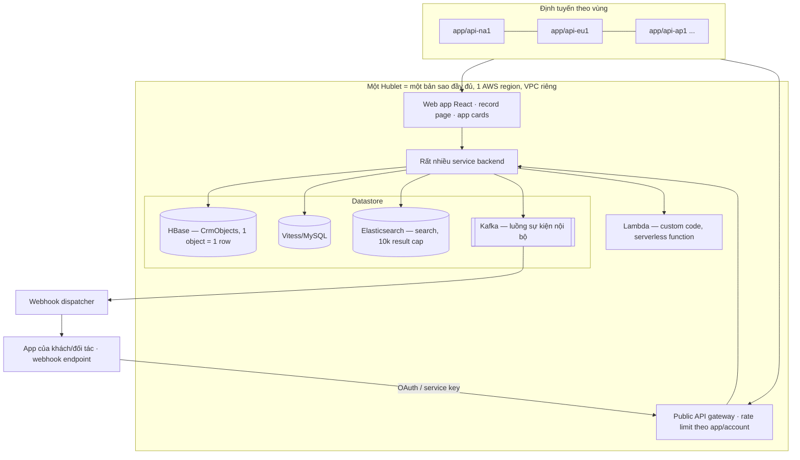

# HubSpot — báo cáo kiến trúc

- **Thời điểm khảo sát.** 2026-09-22. Mọi số liệu giá và giới hạn là của thời điểm này; HubSpot đổi
  tên sản phẩm và gói giá nhiều lần trong 12 tháng qua, nên chúng có hạn dùng ngắn.
- **Phiên bản.** REST API date-based `2026-09` (bản hiện hành, phát hành tháng 9/2026) và `2026-03`;
  API semver cũ (`/crm/v3`, `/crm/v4`) vẫn chạy. Developer Platform (projects) `2026.09`.
- **Tên sản phẩm dùng trong báo cáo.** _Data Hub_ (trước là Operations Hub), _Revenue Hub_ (trước là
  Commerce Hub), _Smart CRM_ (lớp CRM dùng chung).
- **Vai trò.** Đối chứng cho phần CRM và trải nghiệm vận hành, và là hệ vxrerp đang thay thế — xem
  khung tiêu chí ở [`00-erp-overview.md`](00-erp-overview.md).

## 1. Tóm tắt

**Định vị.** HubSpot là một bộ SaaS **CRM-first** cho doanh nghiệp vừa và nhỏ đến mid-market: một CRM
dùng chung (Smart CRM) cộng các "Hub" bán theo tier — Marketing, Sales, Service, Content, Data,
Revenue. Nó **không phải ERP**: không có sổ cái kế toán (GL), không có kho, mua hàng hay nhân sự gốc.
Phần gần ERP nhất là Revenue Hub — báo giá, hợp đồng, hoá đơn, thanh toán, subscription — và phần đó
vẫn là quote-to-cash của bộ phận bán hàng, không phải kế toán
([Revenue tools](https://knowledge.hubspot.com/get-started/collect-payments-with-revenue-tools)).

**License và giá.** Đóng mã nguồn, chỉ có SaaS. Giá theo **seat × tier × hub**, cộng HubSpot Credits
cho tính năng AI và phí onboarding bắt buộc ở tier cao. Ví dụ Sales Hub: Starter $20/seat/tháng (trả
tháng), Professional $90–100/seat/tháng kèm onboarding một lần $1.500, Enterprise liên hệ sales kèm
onboarding $3.500; seat chỉ xem miễn phí
([Sales pricing](https://www.hubspot.com/pricing/sales)). Credits $0,01/credit, reset hằng tháng. Một
mô hình mới "Flexible Seats-and-Credits" đang được triển khai cho khách mới qua đối tác
([Partner kit](https://offers.hubspot.com/new-pricing-model-partners-2026)).

**Triển khai.** Multi-tenant SaaS trên AWS, chia thành các "Hublet" độc lập theo vùng — Mỹ, Canada,
EU (Frankfurt), Úc; **không có vùng châu Á**
([Data hosting FAQ](https://knowledge.hubspot.com/account-security/hubspot-cloud-infrastructure-and-data-hosting-frequently-asked-questions)).

**Nhận định:** HubSpot mạnh nhất ở chỗ một người vận hành không biết code dựng được object, pipeline,
workflow và báo cáo trong vài giờ. Đó chính là thứ vxrerp sẽ mất khi rời đi, và là tiêu chí công bằng
nhất để đo "có nên ở lại không".

## 2. Phạm vi chức năng

| Nhóm          | Có gì                                                                                                               | Ghi chú                                                                                                                                                       |
| ------------- | ------------------------------------------------------------------------------------------------------------------- | ------------------------------------------------------------------------------------------------------------------------------------------------------------- |
| Smart CRM     | Contact, company, deal, ticket, lead, activity (email, call, meeting, note, task), custom object, pipeline, segment | Nền chung mọi Hub dùng                                                                                                                                        |
| Marketing Hub | Email, form, landing page, ads, campaign, attribution                                                               | Tính tiền thêm theo số "marketing contact"                                                                                                                    |
| Sales Hub     | Sequence, meeting, forecast, playbook, quote cơ bản                                                                 |                                                                                                                                                               |
| Service Hub   | Help desk, ticket, knowledge base, customer portal, feedback                                                        |                                                                                                                                                               |
| Data Hub      | Data sync hai chiều, data quality, custom code action, Data Studio (dataset từ nguồn ngoài)                         | Thay Operations Hub từ Fall 2025 Spotlight ([HubSpot news](https://www.hubspot.com/company-news/connect-your-data))                                           |
| Revenue Hub   | CPQ, price book, quote, contract, invoice, payment link, subscription, credit memo, billing portal                  | Đổi tên từ Commerce Hub ngày 16–17/6/2026 ([Community](https://community.hubspot.com/t/commerce-hub-is-now-revenue-hub-what-s-new-and-why-it-matters/150411)) |
| Content Hub   | CMS, blog, website                                                                                                  |                                                                                                                                                               |
| **Không có**  | GL, bút toán, kỳ kế toán, công nợ theo sổ cái, kho, mua hàng, sản xuất, HR, payroll, thuế theo luật địa phương      | Chỉ qua app marketplace (QuickBooks, Xero, NetSuite…)                                                                                                         |

**Revenue Hub — kiểm chứng tại 2026-09.** Trang giá liệt kê invoicing có nhắc nợ tự động, contract,
billing portal, B2B checkout, payment link, subscription ở mọi tier; CPQ, price book có tiered pricing
và quy trình duyệt quote ở Professional/Enterprise
([Revenue pricing](https://www.hubspot.com/pricing/revenue)). Subscription là tính năng miễn phí, thu
định kỳ qua HubSpot Payments hoặc Stripe, hoặc qua hoá đơn tự động
([Subscriptions KB](https://knowledge.hubspot.com/subscriptions/set-up-the-hubspot-subscriptions-tool)).
HubSpot Payments chỉ có ở **Mỹ, Canada, Anh**; nơi khác phải dùng Stripe làm processor với phí nền
tảng 0,75% ([Revenue pricing](https://www.hubspot.com/pricing/revenue)). Contracts đang public beta
năm 2026 theo tổng hợp của đối tác
([RevPartners](https://blog.revpartners.io/en/revops-articles/hubspot-revenue-hub)).

**Nhận định:** Revenue Hub không có khái niệm meter/usage rating, dunning nhiều bước theo luật riêng,
ledger bất biến hay hoá đơn điện tử theo NĐ 123/2020 — những thứ `@vxrerp/billing` đã có hoặc bắt buộc
phải có. Đây là khoảng trống lớn nhất, không phải chuyện cấu hình.

## 3. Kiến trúc kỹ thuật

HubSpot công bố khá nhiều về hạ tầng nội bộ qua engineering blog `product.hubspot.com`:

- **Hublet.** Từ 2021, HubSpot chạy nhiều bản sao **độc lập, đầy đủ** của toàn bộ nền tảng; mỗi bản
  (Hublet: `na1`, `eu1`…) ở một AWS region, có AWS account và VPC riêng, backup sang region phụ. Các
  Hublet không gọi nhau, DB bị khoá ở tầng mạng. Mỗi account nằm trọn trong một Hublet chọn lúc tạo;
  traffic định tuyến qua DNS theo vùng (`app-eu1.hubspot.com`, `api-eu1.hubspot.com`). Dự án tốn hơn
  10.000 PR từ gần toàn bộ hơn 1.000 kỹ sư
  ([Journey to Multi-Region, 2022-03-23](https://product.hubspot.com/blog/developing-an-eu-data-center)).
- **Lưu trữ CRM object.** Contact, deal, custom object đều là `CrmObject`, lưu trong HBase; **mỗi
  object là một row** trong bảng CrmObjects, nên toàn bộ dữ liệu của một object nằm trên một
  RegionServer
  ([Preventing hotspotting](https://product.hubspot.com/blog/preventing-hotspotting-with-deduplication)).
- **Quy mô datastore.** Mỗi môi trường có khoảng 800 cluster Vitess (MySQL), 1.000 shard
  Elasticsearch, 6.000 Kafka topic và 800.000 HBase region; nâng cấp datastore phải tự động hoá hoàn
  toàn ([Updating data infrastructure](https://product.hubspot.com/blog/updating-data-infrastructure)).
  Kafka là xương sống truyền dữ liệu nội bộ
  ([Kafka at HubSpot](https://product.hubspot.com/blog/kafka-at-hubspot-part-1-critical-consumer-metrics)).
- **Code tuỳ biến của khách** không chạy trong process của HubSpot: custom code action và serverless
  function chạy trên AWS Lambda do HubSpot quản
  ([Custom code actions](https://developers.hubspot.com/docs/api-reference/automation-actions-v4-v4/custom-code-actions)).

**Nhận định:** HubSpot là multi-tenant _theo vùng_: trong một Hublet mọi account dùng chung
datastore, còn giữa các vùng là cách ly hoàn toàn. Mô hình "một object một row wide-column" giải
thích vì sao property là dữ liệu (thêm cột động không cần migration) và vì sao search phải đi qua
Elasticsearch với giới hạn 10.000 kết quả (mục 7). Không có gì trong kiến trúc này đáng chép cho một
hệ nội bộ single-tenant — điều đáng học là ở data model và bề mặt sản phẩm.

## 4. Data model & extensibility

**Standard object.** Contact, company, deal, ticket, lead, product, line item, quote, activity
(engagement), cùng các object của Revenue Hub (invoice, subscription, payment, contract). Một số object
"theo ngành" như appointment, course, listing, project, service bật được khi cần
([Pipelines KB](https://knowledge.hubspot.com/object-settings/set-up-and-customize-pipelines)).

**Custom object.** Chỉ có ở **Enterprise**. Khi tạo phải khai tên số ít/số nhiều và primary display
property; label đổi được về sau, internal name thì không; xoá được nếu không tool nào đang dùng
([Create custom objects](https://knowledge.hubspot.com/object-settings/create-custom-objects)). Object
type id có dạng `2-xxxxxxx`
([Custom objects API](https://developers.hubspot.com/docs/api-reference/crm-custom-objects-v3/guide)).
Số định nghĩa custom object và số record mỗi object phụ thuộc gói; các nguồn cộng đồng nói 10 định
nghĩa × 500.000 record ở Enterprise, nhưng tài liệu chính thức chỉ trỏ về catalog và màn Limits trong
account ([Track CRM limits](https://knowledge.hubspot.com/data-management/track-crm-data-limits)) —
**chưa kiểm chứng được con số**.

**Property.** Property là metadata: kiểu text, number (có currency, percent), enum (dropdown, radio,
checkbox), date/datetime, file, URL, rich text, **HubSpot user** (dùng làm owner), và ba kiểu dẫn xuất
ở Pro/Enterprise — calculation, rollup (min/max/count/sum/avg trên record liên kết), property sync từ
record liên kết ([Property types](https://knowledge.hubspot.com/properties/property-field-types-in-hubspot)).
Enterprise cho tối đa 1.000 custom property mỗi object và 200 calculated property
([Product catalog](https://legal.hubspot.com/hubspot-product-and-services-catalog)).

**Association.** Quan hệ giữa hai record là một cạnh có **type**; mỗi type có `typeId` và thuộc
`HUBSPOT_DEFINED` (ví dụ "Primary company", chỉ một company primary mỗi record) hoặc `USER_DEFINED`.
Label có thể **paired** — nghĩa khác nhau theo chiều (contact→company "Employee", company→contact
"Employer") — và một cạnh mang được nhiều label
([Associations v4](https://developers.hubspot.com/docs/api-reference/crm-associations-v4/guide)).
Enterprise có tới 50 label cho mỗi cặp object
([Product catalog](https://legal.hubspot.com/hubspot-product-and-services-catalog)). Số association
mỗi record có trần theo object và gói, có cảnh báo khi đạt 80%. Batch create tới 2.000 input, batch
read 1.000.

**Pipeline và stage.** Pipeline có ở deal, ticket, lead, order, task, custom object. Seat-based: Free
0, Starter 15, Pro 100, Enterprise 350 pipeline; theo FSC: 15/350. Deal stage mang xác suất 0–100%;
stage của object khác là Open/Closed; có thể **bắt buộc property khi record vào stage**, và hạn chế
ai xem/sửa pipeline, cộng "pipeline rules" cho duyệt và chặn sửa
([Pipelines KB](https://knowledge.hubspot.com/object-settings/set-up-and-customize-pipelines)).

**Nhận định:** mô hình _object + property + association có label + pipeline_ là ngôn ngữ chung mà
người vận hành HubSpot đã thạo; nó đủ gọn để giải thích trong một buổi và đủ rộng để phủ phần lớn
CRM. Giá phải trả: mọi thứ là dữ liệu kiểu lỏng, ràng buộc toàn vẹn chỉ là "required on stage" và
validation của property; không có FK, không có invariant nghiệp vụ nhiều bước.

## 5. Workflow / automation / business logic

- **Workflow** cần Pro/Enterprise; tạo được cho từng object (kể cả custom object, quote, contract).
  Bốn loại trigger: theo filter, theo event, theo lịch, và **webhook trigger** từ hệ ngoài. Mặc định
  mỗi record vào workflow một lần; re-enrollment phải bật và chọn trigger; record đang trong workflow
  không vào lại được đến khi chạy xong. Action gồm branch, delay, set property, tạo record/task, gửi
  email, gán owner, thao tác record liên kết, data variable
  ([Create workflows](https://knowledge.hubspot.com/workflows/create-workflows)).
- **Custom code action** (Data Hub Pro/Enterprise): Node.js, Python đang beta, chạy trên Lambda;
  **20 giây và 128 MB** mỗi lần chạy, secret tổng cộng ≤ 1.000 ký tự, tối đa 50 input; lỗi 429/5xx
  được retry tới **3 ngày** với khoảng cách tăng dần tới 8 giờ; output string ≤ 65.000 ký tự
  ([Custom code actions](https://developers.hubspot.com/docs/api-reference/automation-actions-v4-v4/custom-code-actions)).
- **Data sync** (Data Hub): đồng bộ hai chiều với hàng trăm app, cộng data quality action (chuẩn hoá
  hoa/thường, ngày, số điện thoại) ([HubSpot news](https://www.hubspot.com/company-news/connect-your-data)).
- **Custom workflow action** của app (đối tác tự định nghĩa action gọi API ngoài) khai trong project
  của developer platform
  ([Webhooks & workflow actions](https://developers.hubspot.com/blog/unlocking-the-power-of-webhooks-workflow-actions-in-hubspots-new-developer-platform)).

**Nhận định:** logic nghiệp vụ trong HubSpot sống ở ba nơi — cấu hình (required-on-stage,
calculation), workflow no-code, và đoạn code 20 giây trong workflow. Không nơi nào có transaction
xuyên nhiều record hay test tự động, nên càng nhiều logic tiền nong dồn vào workflow thì càng khó biết
hệ đang làm gì. Đây là kiểu "business logic phân tán trong cấu hình" mà một billing có ledger bất
biến không chịu được.

## 6. Phân quyền & bảo mật

- **Seat** quyết định tầng tính năng (Core, Sales, Service; view-only miễn phí); **permission set**
  gom quyền để gán hàng loạt; **Super Admin** có mọi quyền
  ([Permissions guide](https://knowledge.hubspot.com/user-management/hubspot-user-permissions-guide)).
- **Record-level theo owner/team.** Với từng object, từng hành động (view, edit, delete, create,
  merge) được gán phạm vi **All / Team's / Owned**, cộng tuỳ chọn **Unassigned**. "Owned" dựa trên
  owner property mặc định hoặc custom property kiểu HubSpot user; một user thuộc nhiều team; quyền theo
  team cần Pro/Enterprise. **Không có chia sẻ từng record** ngoài owner và team
  ([Assign access](https://knowledge.hubspot.com/records/assign-access-to-records)). Enterprise cho tới
  300 team ([Product catalog](https://legal.hubspot.com/hubspot-product-and-services-catalog)).
- **Giới hạn đáng chú ý.** Super Admin bỏ qua mọi hạn chế; workflow, forecast và **API** vượt qua được
  hạn chế sửa theo stage ([Assign access](https://knowledge.hubspot.com/records/assign-access-to-records)).
- **Field-level** (Enterprise): mỗi property đặt View+Edit / View only / No access cho user hoặc team.
  Chính HubSpot khuyến cáo **không dùng nó như biện pháp bảo mật**, vì mọi user vẫn ghi được property
  bị hạn chế qua API hoặc khi tạo record thủ công
  ([Property access](https://knowledge.hubspot.com/properties/restrict-view-edit-access-for-properties)).
  Dữ liệu nhạy cảm (Sensitive Data) cũng chỉ ở Enterprise.
- **Quyền của app.** Nền tảng 2026.09 đưa **user-level app** lên GA: app thực thi quyền của chính user
  lúc chạy qua OAuth (`isUserLevel: true`), và **service key** (public beta) thay private app cũ, có
  scope, log hoạt động và xoay key
  ([Fall 2026 Spotlight](https://developers.hubspot.com/changelog/fall-2026-spotlight)).

**Nhận định:** mô hình All/Team/Owned/Unassigned là điểm sáng — đơn giản, đủ cho 90% nhu cầu "sale
chỉ thấy khách của mình". Điểm tối là enforcement không đồng nhất giữa UI và API: một quyền mà API bỏ
qua thì chỉ là UX, không phải phân quyền.

## 7. Integration

**Versioning.** Từ 30/3/2026, REST API dùng version theo ngày trong URL, dạng `/YYYY-MM/` (ví dụ
`/crm/objects/2026-09/...`), beta thêm `-beta`. Hai bản mỗi năm (tháng 3 và 9); mỗi bản 6 tháng
"current", 6 tháng "supported" (chỉ fix nghiêm trọng), sau 18 tháng là unsupported. Bản GA bị khoá hành
vi — thay đổi phá vỡ chỉ vào bản mới. API semver cũ (v1–v4) vẫn ở URL cũ. Developer platform cũng
version theo `YYYY.MM` trong `hsproject.json` (`2025.1` sunset 1/8/2026)
([Versioning](https://developers.hubspot.com/docs/developer-tooling/platform/versioning),
[Changelog](https://developers.hubspot.com/changelog/introducing-date-based-api-versioning)).

**Loại app và xác thực.**

| Loại                         | Xác thực               | Ghi chú                                                                                              |
| ---------------------------- | ---------------------- | ---------------------------------------------------------------------------------------------------- |
| Public app (marketplace)     | OAuth 2.0              | 110 request/10s mỗi account cài                                                                      |
| Private / legacy private app | Access token tĩnh      | Được thay dần bằng service key (beta 2026.09)                                                        |
| User-level app               | OAuth, quyền theo user | GA ở 2026.09                                                                                         |
| Project (developer platform) | —                      | Đơn vị deploy: app, UI extension, webhook, serverless function, workflow action; `hs project upload` |

**Rate limit.** App riêng: Free/Starter 100 request/10s mỗi app và 250.000/ngày mỗi account; Pro
190/10s và 625.000/ngày; Enterprise 190/10s và 1.000.000/ngày; add-on nâng lên 250/10s và +1 triệu/ngày,
mua tối đa hai lần. Burst tính theo app, daily **chia chung cho mọi app** của account, reset nửa đêm
theo múi giờ account; để lên marketplace, tỉ lệ 429 phải dưới 5%
([Usage guidelines](https://developers.hubspot.com/docs/developer-tooling/platform/usage-guidelines)).
Search API riêng: 5 request/giây, 200 record/trang, **tối đa 10.000 kết quả mỗi truy vấn** (vượt là 400) ([Search API](https://developers.hubspot.com/docs/api-reference/latest/crm/search-the-crm)).

**Webhook.**

- _Push (v3 / app webhook)_: mỗi request tối đa 100 event; retry khi lỗi kết nối, timeout quá **5 giây**
  hoặc bất kỳ 4xx/5xx, tối đa **10 lần trong 24 giờ**; ký `X-HubSpot-Signature-v3` = HMAC-SHA256 base64
  bằng client secret, kèm `X-HubSpot-Request-Timestamp`, so sánh constant-time
  ([Webhooks v3](https://developers.hubspot.com/docs/api-reference/legacy/webhooks/guide)). Trong project,
  webhook khai trong `*-hsmeta.json` với `targetUrl` và `maxConcurrentRequests`
  ([Configure webhooks](https://developers.hubspot.com/docs/apps/developer-platform/add-features/configure-webhooks)).
  Tối đa 1.000 subscription mỗi app
  ([Usage guidelines](https://developers.hubspot.com/docs/developer-tooling/platform/usage-guidelines)).
- _Journal (v4, beta)_: thay vì đẩy tới URL, event ghi vào một journal để app **kéo** theo offset, theo
  thứ tự thời gian, giữ 3 ngày; có CREATE/UPDATE/DELETE/MERGE/RESTORE/SNAPSHOT và
  ASSOCIATION_ADDED/REMOVED
  ([Webhooks journal](https://developers.hubspot.com/docs/api-reference/webhooks-webhooks-v4/webhooks-journal)).

**UI extension.** App card viết bằng React với `@hubspot/ui-extensions`, đặt ở middle column, sidebar,
preview panel của record, sidebar help desk; thêm app home page và settings page; gọi dữ liệu ngoài
qua `hubspot.fetch()` (timeout mặc định 15s, tối đa 120s, payload 1 MB, 20 request đồng thời mỗi
account) ([UI extensions](https://developers.hubspot.com/docs/apps/developer-platform/add-features/ui-extensibility/overview)).
2026.09 thêm **App Actions** (beta) — thao tác tuỳ biến trên nhiều record đã chọn — và MCP server để
agent đọc dữ liệu CRM ([Fall 2026 Spotlight](https://developers.hubspot.com/changelog/fall-2026-spotlight)).

**Timeline event.** Event template (Markdown + Handlebars, tối đa 500 token) cho app gắn sự kiện lên
timeline record; 750 template mỗi public app; **không tạo được cho custom object**, và nay chỉ dành
cho đối tác đã có event v1/v3 — app mới dùng "app events" của developer platform
([Timeline events](https://developers.hubspot.com/docs/api-reference/crm-timeline-v3/guide)).

**Nhận định:** date-based versioning với cửa sổ 18 tháng và "GA là bất biến" là quyết định trưởng
thành, gần với cách Stripe làm. Ngược lại, bề mặt tích hợp của HubSpot phân mảnh: ba thế hệ webhook,
hai thế hệ timeline event, ba loại app đang cùng tồn tại — chi phí của một nền tảng phải giữ tương
thích cho hàng trăm nghìn khách.

## 8. Reporting / analytics

- **Custom report builder**: chọn một nguồn dữ liệu chính rồi nối các object/nguồn liên quan, thêm
  field, calculation, filter và kiểu hiển thị
  ([Custom report builder](https://knowledge.hubspot.com/reports/create-reports-with-the-custom-report-builder)).
  Enterprise giới hạn 100 dashboard × 50 report mỗi dashboard
  ([Product catalog](https://legal.hubspot.com/hubspot-product-and-services-catalog)).
- **Dataset / Data Studio** (Data Hub): dựng dataset kiểu bảng tính từ nguồn ngoài (Google Sheets,
  Excel, Snowflake, app data sync), rồi đưa vào segment, workflow, report; Datasource Ingestion API GA ở
  2026.09 ([Data Studio KB](https://knowledge.hubspot.com/data-management/build-and-activate-datasets-in-data-studio),
  [Fall 2026 Spotlight](https://developers.hubspot.com/changelog/fall-2026-spotlight)).
- Revenue Hub có báo cáo payment, payout, dispute
  ([Revenue tools](https://knowledge.hubspot.com/get-started/collect-payments-with-revenue-tools)).

**Nhận định:** reporting của HubSpot mạnh ở số liệu bán hàng và marketing, yếu ở số liệu tài chính
đúng kỳ (doanh thu ghi nhận, công nợ theo tuổi, đối soát). Muốn có báo cáo tài chính thật, khách
HubSpot thường đẩy dữ liệu sang warehouse hoặc phần mềm kế toán.

## 9. UI/UX shell

- **Điều hướng.** Một thanh điều hướng trái chung cho mọi Hub; người dùng không "vào một app" như Odoo
  mà đi theo nhóm công cụ (CRM, Marketing, Sales, Service, Commerce/Revenue, Reporting…).
  **Nhận định:** thông tin này từ quan sát sản phẩm, không có một trang KB mô tả tổng thể.
- **Record page** ba vùng: sidebar trái (card thông tin, property chính), middle column theo **tab**
  (mặc định About, Activities, Catch-up, Intelligence, Revenue tuỳ gói), sidebar phải (record liên kết,
  attachment, app card). Admin tuỳ biến layout: thêm tab, section có thể thu gọn, card đặt cạnh nhau,
  card tuỳ biến ở cả preview sidebar
  ([Default record layout](https://knowledge.hubspot.com/records/understand-the-default-record-layout),
  [Customize records](https://knowledge.hubspot.com/object-settings/customize-records)).
- **Timeline / activity**: tab Activities gom email, call, meeting, note, task và sự kiện từ app theo
  thời gian — trung tâm của trải nghiệm "mở record là biết chuyện gì đã xảy ra".
- **Index page** dạng bảng và board (kanban theo pipeline stage), view lưu được và chia sẻ.

**Nhận định:** record page + activity timeline là thứ người dùng HubSpot nhớ nhất và sẽ hỏi đầu tiên
khi chuyển sang vxrerp.

## 10. Deploy, vận hành, multi-tenancy, hiệu năng/giới hạn

- **Chỉ SaaS**, không on-prem. Multi-tenant trong mỗi Hublet; account gắn với một vùng. Vùng: Mỹ (East,
  West), Canada, EU (Đức), Úc — trên AWS. Account trả phí đổi được data center. Dữ liệu vẫn có thể được
  xử lý ngoài vùng cho app bên thứ ba, analytics sử dụng (chuyển về Mỹ), support, sub-processor, ứng
  cứu sự cố ([Data hosting FAQ](https://knowledge.hubspot.com/account-security/hubspot-cloud-infrastructure-and-data-hosting-frequently-asked-questions),
  [Data centers](https://www.hubspot.com/data-centers)).
- **Sandbox** Enterprise: import tới 200.000 record mỗi loại
  ([Product catalog](https://legal.hubspot.com/hubspot-product-and-services-catalog)).
- **Giới hạn đáng kể** tổng hợp: custom object chỉ Enterprise; 1.000 custom property/object; 350
  pipeline/account; 50 label mỗi cặp object; 300 team; search 10.000 kết quả; 190 request/10s mỗi app;
  custom code 20s/128 MB; 30 triệu custom event/tháng.
- **Export.** Export record kèm property và association, nhưng mỗi cột association chỉ ra tối đa
  1.000 id liên kết ([Export records](https://knowledge.hubspot.com/import-and-export/export-records));
  có hướng dẫn tải backup nội dung và dữ liệu account
  ([Export content and data](https://knowledge.hubspot.com/account-management/export-your-content-and-data)).

**Nhận định:** với Vexere, "không có vùng châu Á" nghĩa là dữ liệu khách hàng và nhà xe Việt Nam nằm
ở Mỹ/EU/Úc. Cần đối chiếu với nghĩa vụ lưu trữ và chuyển dữ liệu cá nhân ra nước ngoài theo luật Việt
Nam — báo cáo này không thẩm định pháp lý phần đó.

## 11. Điểm mạnh / điểm yếu / anti-pattern

**Điểm mạnh**

1. **Time-to-value.** Người vận hành tự dựng object, property, pipeline, workflow, báo cáo không cần
   dev (mục 4, 5, 8).
2. **Data model dễ giải thích**: object + property + association có label + pipeline (mục 4).
3. **Record-level đơn giản**: All/Team/Owned/Unassigned theo từng hành động (mục 6).
4. **Record page + activity timeline** là trải nghiệm CRM hoàn chỉnh (mục 9).
5. **Kỷ luật API**: date-based version, cửa sổ hỗ trợ 18 tháng, GA bất biến (mục 7).
6. **Không vận hành**: không server, không backup, không nâng cấp phải tự làm.

**Điểm yếu**

1. **Không có ERP lõi**: không GL, kho, mua hàng; Revenue Hub không có usage rating, ledger hay hoá đơn
   điện tử Việt Nam (mục 2).
2. **Tính năng khoá theo tier**: custom object, field-level, sensitive data chỉ Enterprise; workflow
   chỉ Pro+ (mục 4–6). Giá tăng theo seat và gói, cộng credits cho AI (mục 1).
3. **Payments chỉ Mỹ/Canada/Anh**; nơi khác qua Stripe, cộng 0,75% phí nền tảng (mục 2).
4. **Không có vùng dữ liệu châu Á** (mục 10).
5. **Giới hạn cứng ảnh hưởng tích hợp**: search 10.000 kết quả, daily limit chia chung cho mọi app
   (mục 7).

**Anti-pattern (có dẫn chứng)**

- **Quyền ở UI, không ở API.** Field-level không chặn ghi qua API; hạn chế sửa theo stage bị workflow
  và API vượt qua; chính HubSpot khuyên đừng coi đó là bảo mật (mục 6).
- **Logic tiền trong workflow + đoạn code 20 giây**, không transaction, retry tới 3 ngày có thể chạy
  lại side effect nếu code không idempotent (mục 5).
- **Nhiều thế hệ bề mặt song song**: webhook v3 push và v4 journal, timeline v3 và app events, private
  app và service key (mục 7) — hậu quả của thiếu version từ đầu, được sửa bằng date-based versioning
  năm 2026.
- **Đổi tên sản phẩm liên tục** (Operations → Data Hub 2025, Commerce → Revenue Hub 2026 không kèm
  changelog) làm tài liệu lệch nhau; KB vẫn còn nhắc "Commerce Hub seat" sau khi đổi tên
  ([Community](https://community.hubspot.com/t/commerce-hub-is-now-revenue-hub-what-s-new-and-why-it-matters/150411)).

**Vì sao không ở lại HubSpot — đánh giá công bằng**

| Lý do ở lại                                                 | Lý do rời đi                                                                                                      |
| ----------------------------------------------------------- | ----------------------------------------------------------------------------------------------------------------- |
| CRM, marketing, help desk trưởng thành, không phải vận hành | Billing của Vexere (usage, ledger bất biến, dunning, hoá đơn điện tử VN, VND, PSP nội địa) không có trong HubSpot |
| Người vận hành đã quen, tự cấu hình không cần dev           | Custom object và quyền field-level đòi Enterprise cho mọi seat cần dùng                                           |
| Ecosystem app lớn                                           | Dữ liệu nằm ngoài Việt Nam; payments gốc không có ở VN                                                            |
| API có version, rate limit rõ                               | Logic nghiệp vụ và quyền không kiểm soát được đến tầng API; data model thuộc về vendor                            |

**Nhận định:** lý do đủ mạnh để rời là **billing và tài chính**, không phải CRM. Một phương án trung
gian hợp lệ là giữ HubSpot làm CRM và để `@vxrerp/billing` là nguồn sự thật về tiền, đồng bộ hai
chiều qua API/webhook. Nếu vxrerp vẫn chọn tự làm CRM, lý do phải là chi phí seat dài hạn, nhu cầu
nối chặt CRM với dữ liệu vận hành của Vexere (nhà xe, chuyến, vé) và kiểm soát dữ liệu — và phải chấp
nhận rằng phần CRM tự xây sẽ kém HubSpot về độ rộng trong nhiều năm.

## 12. Bài học áp dụng cho vxrerp

Bảng dưới map từng bài học vào một quyết định cụ thể của repo. "Học" nghĩa là đưa vào thiết kế
`@vxrerp/crm` / `@vxrerp/platform`; "Không học" là cố ý đi khác.

### 12.1 Nên học

| Bài học từ HubSpot                                                                            | Áp vào vxrerp                                                                                                                                                                                                                                                                                                                                              | Lý do                                                                                                                                                       |
| --------------------------------------------------------------------------------------------- | ---------------------------------------------------------------------------------------------------------------------------------------------------------------------------------------------------------------------------------------------------------------------------------------------------------------------------------------------------------- | ----------------------------------------------------------------------------------------------------------------------------------------------------------- |
| **Association là cạnh hạng nhất, có label, có chiều** (mục 4)                                 | Trong schema `crm`, một bảng association chung cho các object của CRM (`from_type`, `from_id`, `to_type`, `to_id`, `label`), với label là enum đóng trong module (`CrmAssociationLabelEnum`) và cặp paired khai rõ hai chiều. Liên kết sang object của module khác (billing customer) là **id thuần**, giữ nhất quán bằng domain event — đúng ADR 0030 §3. | Người dùng cũ của HubSpot sẽ tìm "company này có những contact nào, vai trò gì". Label là enum thay vì chuỗi tự do vì shared kernel và SDK cần tập đóng.    |
| **Pipeline/stage là dữ liệu cấu hình**, stage mang required property và rule (mục 4)          | `crm.pipelines`, `crm.pipeline_stages` do admin cấu hình qua màn Cài đặt riêng của CRM (`/crm/settings`, nhóm `NavigationGroupEnum.SETTINGS`); ràng buộc "phải có field X khi vào stage Y" và "không nhảy stage" thực thi ở service, không ở UI.                                                                                                           | Stage đổi theo quy trình bán hàng hằng quý; bắt dev migrate mỗi lần là quá đắt. Đây là chỗ cấu hình runtime đáng tiền nhất.                                 |
| **Record-level theo owner/team: All / Team / Owned / Unassigned** theo từng hành động (mục 6) | Thêm vào platform: bảng team và thành viên, cột `owner_user_id` trên object CRM, và mở rộng permission thành cặp `(permission, scope)` với `RecordScopeEnum` (`ALL`, `TEAM`, `OWNED`). Scope resolve **trong repository filter** ở server, áp cho cả session lẫn API key. `ROLE_PERMISSIONS` vẫn là hằng số, chỉ thêm scope cho từng entry.                | Đây là khoảng trống mà `00-erp-overview.md` gọi là "thường gặp nhất khi tự xây". Mô hình của HubSpot đã được hàng trăm nghìn công ty kiểm chứng là đủ dùng. |
| **Activity timeline trên mỗi record** (mục 9)                                                 | Một read model timeline có `subject_type` + `subject_id` tổng quát, được nạp từ hai nguồn: activity người dùng tạo (note, call, task — object của `crm`) và domain event từ outbox qua `registerDomainEventHandler` (ví dụ invoice của billing đã phát hành hiện trên timeline của company). Card timeline dùng chung trong `EntityDrawer`/record page.    | Người dùng HubSpot mở record là thấy lịch sử. HubSpot không cho timeline event trên custom object — thiết kế subject tổng quát từ đầu để tránh.             |
| **Webhook ký HMAC + timestamp, retry có trần, batch** (mục 7)                                 | Đối chiếu webhook của platform với chuẩn: chữ ký gồm timestamp để chống replay, timeout ngắn, retry có giới hạn và lịch rõ, `eventId` để dedupe; cân nhắc endpoint "liệt kê event từ offset" (kiểu journal v4) để hệ ngoài tự backfill khi mất webhook.                                                                                                    | Tích hợp với data warehouse và hệ vận hành Vexere cần đường bù dữ liệu khi webhook hỏng, không chỉ retry.                                                   |
| **Service key có scope, log hoạt động, xoay key** (mục 6)                                     | API key theo module đã có permission; bổ sung `lastUsedAt`, log sử dụng theo key, và xoay key không downtime (hai key song song trong thời gian chuyển).                                                                                                                                                                                                   | HubSpot phải mất nhiều năm mới thay private app bằng service key; vxrerp đang ở đúng điểm rẻ nhất để làm.                                                   |
| **Date-based version với cửa sổ hỗ trợ cố định** (mục 7)                                      | Giữ `/v1` hiện tại; khi có thay đổi phá vỡ đầu tiên, ghi ADR chọn version theo ngày (header hoặc path) và cửa sổ hỗ trợ, thay vì mở `/v2`.                                                                                                                                                                                                                 | SDK kiểu Stripe đã sẵn; version theo ngày khớp với nó và tránh được tình trạng nhiều thế hệ API song song như HubSpot.                                      |
| **Rate limit hai tầng: burst theo key, daily theo account** (mục 7)                           | `rate-limit.plugin.ts` đã key theo `actor.userId` / `auth.apiKeyId`; nếu cần giới hạn theo ngày thì tính theo module, và trả header còn lại để client tự điều tiết.                                                                                                                                                                                        | Rẻ, và bảo vệ DB giao dịch khỏi integration viết ẩu.                                                                                                        |

### 12.2 Không nên học

| Thứ của HubSpot                                                               | Vì sao không                                                                                                                                                                                        | Thay bằng                                                                                                                                                                                      |
| ----------------------------------------------------------------------------- | --------------------------------------------------------------------------------------------------------------------------------------------------------------------------------------------------- | ---------------------------------------------------------------------------------------------------------------------------------------------------------------------------------------------- |
| **Custom object/property tạo lúc runtime cho mọi thứ**                        | Đi ngược ADR 0030 §2: shared kernel và `openapi.json` cần tập đóng; property động làm SDK mất type, và mọi object thành EAV kiểu lỏng. HubSpot làm được vì có HBase wide-row và cả một đội hạ tầng. | Object là code + migration. Nếu người vận hành thật sự cần field tự thêm, dùng một khối `custom_fields` có bảng định nghĩa, validate theo kiểu, chỉ ở vài object CRM được chọn, ghi ADR trước. |
| **Workflow builder no-code tổng quát** và code 20 giây trong workflow         | Logic tiền phải có transaction, test và idempotency (mục 5, 11). Một engine workflow tổng quát là một sản phẩm riêng.                                                                               | Logic trong service + BullMQ; với người vận hành, chỉ mở rule có cấu trúc trên trigger đã biết (domain event, đổi stage): gán owner, tạo task, gửi thông báo.                                  |
| **Phân quyền chỉ thực thi ở UI** (field-level, stage restriction bị API vượt) | Trái `auth-convention.md`: permission áp cho cả session và API key, fail closed. `useCan` chỉ là ergonomics.                                                                                        | Mọi scope và field-level (nếu có) kiểm ở server, trong repository/service.                                                                                                                     |
| **Khoá tính năng theo tier/seat**                                             | Hệ nội bộ; tier chỉ tạo độ phức tạp không có người trả tiền.                                                                                                                                        | Quyền theo role/permission.                                                                                                                                                                    |
| **Search có trần 10.000 kết quả, daily limit chung cho mọi app**              | Là hệ quả của Elasticsearch đa tenant, không phải nhu cầu của vxrerp.                                                                                                                               | Cursor pagination trên Postgres như hiện tại (`after`), index đúng chỗ.                                                                                                                        |
| **Hublet / multi-tenant theo vùng**                                           | vxrerp single-tenant nội bộ.                                                                                                                                                                        | Một deploy, dữ liệu ở hạ tầng Vexere chọn.                                                                                                                                                     |
| **Một thanh điều hướng gộp mọi Hub**                                          | erp-ui đã chọn app launcher + sidebar theo từng feature (`erp-ui-convention.md`); gộp menu là điều convention cấm.                                                                                  | Giữ launcher; CRM là một ô trên màn chọn ứng dụng.                                                                                                                                             |

### 12.3 Một điểm cần quyết định

Record page ba vùng của HubSpot (mục 9) không khớp hẳn với công thức hiện tại của erp-ui — chi tiết
entity chính mở trong `EntityDrawer` bên phải. **Nhận định:** với CRM, một company có contact, deal,
invoice và timeline dài sẽ chật trong drawer; nếu muốn record page toàn màn cho object CRM, đó là một
thay đổi convention và cần ADR trước khi dựng `features/crm`, không phải một ngoại lệ lặng lẽ.

## 13. Nguồn

Tất cả truy cập ngày **2026-09-22**.

**Tài liệu developer (developers.hubspot.com)**

1. [Developer platform and API versioning](https://developers.hubspot.com/docs/developer-tooling/platform/versioning)
2. [Introducing date-based API versioning](https://developers.hubspot.com/changelog/introducing-date-based-api-versioning)
3. [Fall 2026 Spotlight — Developer / Builder Updates](https://developers.hubspot.com/changelog/fall-2026-spotlight)
4. [API usage guidelines and limits](https://developers.hubspot.com/docs/developer-tooling/platform/usage-guidelines)
5. [CRM Search API](https://developers.hubspot.com/docs/api-reference/latest/crm/search-the-crm)
6. [Associations v4 guide](https://developers.hubspot.com/docs/api-reference/crm-associations-v4/guide)
7. [Custom object records API guide](https://developers.hubspot.com/docs/api-reference/crm-custom-objects-v3/guide)
8. [Custom code workflow actions](https://developers.hubspot.com/docs/api-reference/automation-actions-v4-v4/custom-code-actions)
9. [Webhooks v3 API guide (legacy)](https://developers.hubspot.com/docs/api-reference/legacy/webhooks/guide)
10. [Webhooks v4 journal](https://developers.hubspot.com/docs/api-reference/webhooks-webhooks-v4/webhooks-journal)
11. [Configure webhooks (developer platform)](https://developers.hubspot.com/docs/apps/developer-platform/add-features/configure-webhooks)
12. [Unlocking webhooks & custom workflow actions in the new developer platform](https://developers.hubspot.com/blog/unlocking-the-power-of-webhooks-workflow-actions-in-hubspots-new-developer-platform)
13. [UI extensions overview](https://developers.hubspot.com/docs/apps/developer-platform/add-features/ui-extensibility/overview)
14. [Timeline events API guide](https://developers.hubspot.com/docs/api-reference/crm-timeline-v3/guide)

**Knowledge base (knowledge.hubspot.com)**

15. [Create and edit custom objects](https://knowledge.hubspot.com/object-settings/create-custom-objects)
16. [Property field types](https://knowledge.hubspot.com/properties/property-field-types-in-hubspot)
17. [Track your CRM data usage](https://knowledge.hubspot.com/data-management/track-crm-data-limits)
18. [Set up and customize pipelines](https://knowledge.hubspot.com/object-settings/set-up-and-customize-pipelines)
19. [Create workflows](https://knowledge.hubspot.com/workflows/create-workflows)
20. [HubSpot user permissions guide](https://knowledge.hubspot.com/user-management/hubspot-user-permissions-guide)
21. [Assign access to records](https://knowledge.hubspot.com/records/assign-access-to-records)
22. [Manage view and edit access for properties](https://knowledge.hubspot.com/properties/restrict-view-edit-access-for-properties)
23. [Use the updated record default layout](https://knowledge.hubspot.com/records/understand-the-default-record-layout)
24. [Customize records](https://knowledge.hubspot.com/object-settings/customize-records)
25. [Create reports with the custom report builder](https://knowledge.hubspot.com/reports/create-reports-with-the-custom-report-builder)
26. [Build and activate datasets in Data Studio](https://knowledge.hubspot.com/data-management/build-and-activate-datasets-in-data-studio)
27. [Get started with HubSpot's revenue tools](https://knowledge.hubspot.com/get-started/collect-payments-with-revenue-tools)
28. [Set up subscriptions for your buyers](https://knowledge.hubspot.com/subscriptions/set-up-the-hubspot-subscriptions-tool)
29. [Cloud infrastructure and data hosting FAQ](https://knowledge.hubspot.com/account-security/hubspot-cloud-infrastructure-and-data-hosting-frequently-asked-questions)
30. [Export your records](https://knowledge.hubspot.com/import-and-export/export-records)
31. [Export your content and data](https://knowledge.hubspot.com/account-management/export-your-content-and-data)

**Giá, pháp lý, tin công ty (hubspot.com)**

32. [Revenue Hub pricing](https://www.hubspot.com/pricing/revenue)
33. [Sales Hub pricing](https://www.hubspot.com/pricing/sales)
34. [HubSpot Product & Services Catalog](https://legal.hubspot.com/hubspot-product-and-services-catalog)
35. [Flexible Seats-and-Credits — Partner Enablement Kit](https://offers.hubspot.com/new-pricing-model-partners-2026)
36. [Connect your data with the new Data Hub and Smart CRM updates](https://www.hubspot.com/company-news/connect-your-data)
37. [HubSpot data centers](https://www.hubspot.com/data-centers)

**Engineering blog (product.hubspot.com)**

38. [Our Journey to Multi-Region: An Introduction (2022-03-23)](https://product.hubspot.com/blog/developing-an-eu-data-center)
39. [Preventing hotspotting with client-side request deduplication](https://product.hubspot.com/blog/preventing-hotspotting-with-deduplication)
40. [How to get better at updating your data infrastructure](https://product.hubspot.com/blog/updating-data-infrastructure)
41. [Kafka at HubSpot: critical consumer metrics](https://product.hubspot.com/blog/kafka-at-hubspot-part-1-critical-consumer-metrics)

**Cộng đồng và đối tác** (dùng cho bối cảnh, không cho số liệu kỹ thuật)

42. [HubSpot Community — Commerce Hub is now Revenue Hub](https://community.hubspot.com/t/commerce-hub-is-now-revenue-hub-what-s-new-and-why-it-matters/150411)
43. [RevPartners — HubSpot Revenue Hub: the complete guide for 2026](https://blog.revpartners.io/en/revops-articles/hubspot-revenue-hub)
44. [Stream Creative — HubSpot custom objects overview](https://www.streamcreative.com/blog/hubspot-custom-object-examples) (nguồn của con số 10 định nghĩa × 500.000 record, chưa kiểm chứng)
