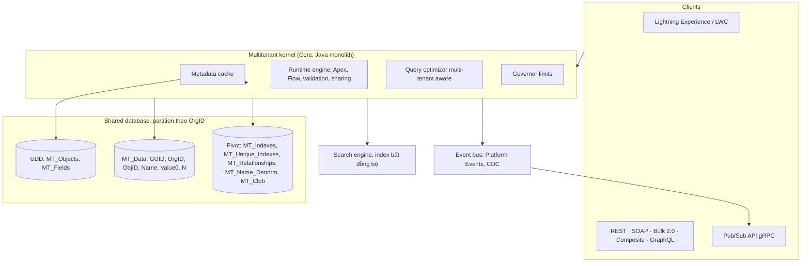

# Salesforce — báo cáo kiến trúc

- **Phiên bản khảo sát.** Winter '27 (API v68.0); đối chiếu với Summer '26 (API v67.0) ở những chỗ tài
  liệu chưa cập nhật. Bảng giá theo cấu trúc edition mới công bố ngày 2026-09-03.
- **Ngày research.** 2026-09-22.
- **Vai trò trong bộ research.** Đối chứng cho phần _platform_: metadata-driven, multi-tenant, custom
  object, phân quyền nhiều tầng, event bus, packaging — xem [`00-erp-overview.md`](00-erp-overview.md) §2.

## 1. Tóm tắt

- **Định vị.** Salesforce là một _business platform_ (PaaS, trước gọi là Force.com, nay là Salesforce
  Platform / Agentforce 360 Platform) mà CRM là ứng dụng đầu tiên chạy trên đó. Sales Cloud, Service
  Cloud, Revenue Cloud, Industries đều là ứng dụng dựng trên cùng một kernel metadata-driven
  ([Salesforce Architects — Platform Multitenant Architecture][arch-mt]).
- **Không phải ERP.** Salesforce không có sổ cái kế toán (GL), kho hay sản xuất gốc. Ngay cả Revenue
  Cloud Billing cũng được định vị là chạy song song với ERP: hoặc làm hệ billing chính rồi đồng bộ hoá
  đơn, thanh toán, bút toán sang ERP, hoặc làm sub-ledger đẩy journal entry sang ERP, còn ERP giữ vai
  system of record của GL ([Revenue Cloud Billing][rev-billing], [Salesforce Billing overview][blng]).
  ERP "trên Salesforce" đến từ đối tác AppExchange dựng native trên platform: **Certinia** (trước là
  FinancialForce — GL, AP/AR, tài sản cố định, PSA, mạnh ở công ty dịch vụ) ([Certinia][certinia],
  [Salesforce Ben — FinancialForce rebrands][certinia-rebrand]) và **Rootstock** (sản xuất, phân phối,
  chuỗi cung ứng, MRP, dùng chung data model, UI, bảo mật và workflow engine của Salesforce)
  ([Rootstock][rootstock]).
- **Khách hàng mục tiêu.** Doanh nghiệp vừa đến rất lớn, có đội admin/dev Salesforce riêng hoặc thuê
  SI; bản Starter/Pro nhắm SMB.
- **License.** Độc quyền, SaaS thuần; tính theo seat/tháng, hợp đồng năm (chỉ Starter trả theo tháng).
- **Giá (list, USD/user/tháng, trả theo năm, Sales Cloud).** Ngày 2026-09-03 Salesforce thay bậc
  Enterprise / Unlimited / Agentforce 1 bằng **Core $195**, **Advanced $395**, **Max $550**; Free $0,
  Starter $25, Pro $100 vẫn giữ ([Sales Cloud pricing][pricing]). Mỗi bậc mới gộp Agentforce, Slack,
  analytics nhúng, gói bảo mật dữ liệu, Premier Success và một hạn mức Flex Credit (500k / 1M / 2,75M);
  so với giá cũ ($175 / $350) đây là mức tăng list 11–13%, hợp đồng Enterprise/Unlimited hiện có giữ
  nguyên tới kỳ gia hạn ([Salesforce Ben — 3 replacement editions][editions-news],
  [SalesforceDevops.net][editions-analysis]).
- **Triển khai.** Chỉ có cloud của Salesforce; hạ tầng hiện là **Hyperforce** trên public cloud (AWS,
  GCP từ cuối 2026), cuộc di chuyển khỏi data center tự vận hành gần xong ([Hyperforce FAQ][hf-faq],
  [Gearset — Hyperforce][hf-gearset]).

## 2. Phạm vi chức năng

| Domain (theo 00-overview §3) | Salesforce gốc                                                                                                | Qua đối tác / sản phẩm khác               |
| ---------------------------- | ------------------------------------------------------------------------------------------------------------- | ----------------------------------------- |
| CRM / Sales                  | Có — lead, account, contact, opportunity, forecast (Sales Cloud)                                              | —                                         |
| Service / Project            | Có — case, entitlement, knowledge, omni-channel (Service Cloud)                                               | PSA: Certinia                             |
| Order-to-Cash, quote         | Có — CPQ, order, contract (Revenue Cloud)                                                                     | —                                         |
| Subscription billing         | Có — Revenue Cloud Billing: hoá đơn, thanh toán, có thể làm sub-ledger ([Revenue Cloud Billing][rev-billing]) | —                                         |
| Finance / GL                 | **Không**                                                                                                     | Certinia, Accounting Seed; hoặc ERP ngoài |
| Inventory / Manufacturing    | **Không**                                                                                                     | Rootstock                                 |
| HR / Payroll                 | **Không**                                                                                                     | App AppExchange, hoặc Workday/SAP ngoài   |
| Marketing, commerce, CDP     | Có — Marketing Cloud, Commerce Cloud, Data 360                                                                | —                                         |

**Nhận định:** với Vexere, phần Salesforce thay được là CRM + quote + billing, tức đúng phạm vi mà
`@vxrerp/crm` và `@vxrerp/billing` đang nhắm; phần hoá đơn điện tử Việt Nam, GL và đối soát nhà xe vẫn
phải tích hợp hoặc tự viết như ở HubSpot.

## 3. Kiến trúc kỹ thuật

Salesforce **không** tạo bảng vật lý cho mỗi object của mỗi khách hàng. Một _multitenant kernel_ đọc
metadata của tenant (org) lúc runtime để dựng object, UI, logic và API ảo, còn dữ liệu của mọi org nằm
chung trong vài bảng lớn ([arch-mt]).

Các thành phần chính theo [arch-mt]:

- **Universal Data Dictionary (UDD).** `MT_Objects` giữ định nghĩa object (ObjID, OrgID, tên),
  `MT_Fields` giữ định nghĩa field (kiểu, cờ index, vị trí slot `FieldNum`).
- **MT_Data và flex column.** Một bảng dữ liệu chung cho mọi org, mỗi dòng có GUID, OrgID, ObjID, Name
  và dãy cột `Value0…ValueN` đều là **chuỗi độ dài thay đổi**; kiểu thật (số, ngày…) do metadata quyết
  và được chuyển đổi lúc đọc. Hai field của cùng một object không bao giờ dùng chung slot, nhưng một
  slot có thể chứa field của nhiều object khác nhau. Whitepaper 2008 thường được trích là 500 flex
  column — con số này **không kiểm chứng được** trong lần research này (PDF không tải được).
- **Pivot table.** Vì flex column là chuỗi, không index kiểu được, nên có bảng phụ: `MT_Indexes`
  (cột `StringValue` / `NumValue` / `DateValue` có kiểu, index thường), `MT_Unique_Indexes` (ép unique
  cho custom field), `MT_Relationships` (hai index composite để duyệt quan hệ hai chiều),
  `MT_Name_Denorm` (tên bản ghi để hiện parent/child nhanh), `MT_Fallback_Indexes`, `MT_Clob` (text dài
  tới 32.000 ký tự).
- **Partition theo OrgID.** Dữ liệu, metadata, pivot và index đều partition vật lý theo OrgID để
  optimizer chỉ quét partition của org đang gọi.
- **Query optimizer.** Giữ thống kê theo tenant, nhóm, user; chạy "pre-query" để chọn giữa bốn chiến
  lược (nested loop, indexed access, ordered hash join, indexed filter) tuỳ độ chọn lọc của filter và
  độ "nhìn thấy" dữ liệu của user theo sharing.
- **Metadata cache** lớn để khỏi đọc đĩa và khỏi biên dịch lại.
- **Search tách khỏi transaction engine**: ghi bản ghi thì chuyển dữ liệu sang index server chạy nền,
  có cache MRU để kết quả tìm kiếm không cũ.
- **Core là monolith Java.** Engineering blog của Salesforce mô tả codebase Core là monolith cần nhiều
  tháng onboarding, và tài liệu kiến trúc nói Core vẫn là system of record duy nhất cho metadata trong
  khi các năng lực khác tách thành service độc lập ([Salesforce Engineering — AI-driven refactoring][eng-mono],
  [Platform transformation][arch-transform]).

**Nhận định:** kiến trúc này tối ưu cho một bài toán vxrerp không có — hàng trăm nghìn tenant tuỳ biến
schema mà không được DDL. Cái giá (kiểu dữ liệu mất ở tầng lưu trữ, cần pivot table để index, cần
governor limit để một tenant không làm nghẽn tenant khác) là cái giá chỉ đáng trả khi multi-tenant là
sản phẩm.

## 4. Data model & extensibility

- **sObject.** Mọi thực thể là một sObject: standard (Account, Contact, Opportunity, Case…) hoặc custom
  (hậu tố `__c`). Field custom cũng mang `__c`; managed package thêm namespace prefix
  (`ns__Field__c`). Id là khoá 15/18 ký tự, ba ký tự đầu là key prefix của object.
- **Quan hệ.**
  - _Lookup_: liên kết lỏng, xoá parent không xoá child; custom object tối đa 40 lookup
    ([Considerations for Object Relationships][rel-help], [Xappex — master-detail][rel-xappex]).
  - _Master-detail_: child không tồn tại thiếu master, kế thừa owner và sharing của master, xoá master
    là xoá cascade; một object tối đa 2 master-detail; master có thể có **roll-up summary field** (tối
    đa 40 mỗi object), lookup thì không ([rel-xappex], [Traction — roll-up limits][rollup]).
  - Quan hệ n-n qua _junction object_ có hai master-detail.
- **Giới hạn theo edition.** Unlimited cho tới 2.000 custom object; số field custom cũng có trần theo
  edition ([Help — Increase the custom object limit][obj-limit], [Enterprise Edition allocations][ee-alloc]).
- **Custom Metadata Types.** Kiểu "cấu hình như dữ liệu" mà bản ghi của nó **deploy được** cùng
  package (khác Custom Settings, nơi chỉ định nghĩa được deploy còn bản ghi thì không); Apex không
  ghi trực tiếp được vào Custom Metadata ([Trailhead — Custom Metadata Types][cmdt]).
- **Big Objects** cho dữ liệu tới hàng tỷ dòng với hiệu năng ổn định; **External Objects** (Salesforce
  Connect, OData) map dữ liệu ngoài thành object đọc được, không copy vào org
  ([Help — External Objects][ext-obj]).
- **Mọi thứ là metadata.** Object, field, layout, Flow, Apex, permission set đều là metadata component
  deploy qua Metadata API; đây là cơ sở của sandbox, package và DevOps Center (§10).

**Nhận định:** điểm đáng giá nhất ở đây không phải "người dùng tự tạo field" mà là **một mô hình
thống nhất cho mọi thứ tuỳ biến được** — object, field, quyền, automation đều là metadata có type, có
version, deploy được. Chính sự thống nhất đó cho phép phân quyền field-level, report type, API và UI tự
sinh từ cùng một định nghĩa.

## 5. Workflow / automation / business logic

- **Flow là công cụ low-code duy nhất còn được đầu tư.** Workflow Rules và Process Builder hết support
  từ 2025-12-31: chúng vẫn chạy nhưng không còn bug fix hay hỗ trợ; Salesforce cung cấp công cụ
  "Migrate to Flow" ([Help — WFR & PB end of support][wfr-eos], [Salesforce Ben][wfr-ben]). Flow có
  record-triggered (before-save / after-save), scheduled, platform-event-triggered, screen flow và
  autolaunched.
- **Apex** là ngôn ngữ kiểu Java chạy trong kernel; trigger chạy theo lô (200 bản ghi mỗi lô với
  trigger thường, tới 2.000 với trigger platform event, cấu hình được)
  ([Salesforce Geek — Platform Events][pe-geek]).
- **Validation rule** là công thức khai báo; **duplicate rule** chặn hoặc cảnh báo trùng.
- **Order of execution khi lưu** (rút gọn) ([Salesforce Ben — Order of Execution][ooe-ben],
  [Apex Hours][ooe-apexhours]):
  1. System validation (layout, kiểu, độ dài)
  2. Before-save record-triggered flow
  3. Before trigger Apex (nếu cùng sửa một field, giá trị của trigger thắng)
  4. System validation lần hai + custom validation rule
  5. Duplicate rule (chặn thì dừng hẳn)
  6. Ghi DB, chưa commit
  7. After trigger
  8. Assignment / auto-response / workflow rule / escalation (legacy), rồi after-save flow
  9. Roll-up summary lên parent và criteria-based sharing tính lại
  10. Commit, rồi mới tới post-commit: gửi email, publish-after-commit event, async Apex
- **Governor limits** là hợp đồng của mọi logic: mỗi transaction đồng bộ tối đa 100 SOQL (200 bất
  đồng bộ), 150 DML, 10.000 dòng DML, 50.000 dòng đọc, 10 giây CPU (60 giây bất đồng bộ); vượt là
  `LimitException` không bắt được và toàn bộ transaction rollback ([Apex Hours — Governor limits][gov-apexhours],
  [SalesforceTrails — Summer '26][gov-trails]). Winter '27 nâng heap đồng bộ lên 10 MB và bất đồng bộ
  lên 25 MB ([Salesforce Ben — Winter '27 dev features][w27-dev]). Lý do tồn tại, theo tài liệu kiến
  trúc, là chặn một tenant độc chiếm tài nguyên chung ([arch-mt]).
- **Deploy lên production** yêu cầu unit test phủ tối thiểu 75% Apex, và deploy chạy như một
  transaction chạy lại test, lỗi là rollback toàn bộ ([arch-mt]).

**Nhận định:** order of execution là tài liệu mà mọi đội Salesforce phải thuộc lòng, vì Flow, trigger,
validation, roll-up và sharing cùng can thiệp vào một lần lưu. Đó là hệ quả trực tiếp của việc cho
nhiều "tay" (admin click, dev code, package cài vào) cùng gắn logic lên một object. vxrerp chỉ có một
"tay" — service trong code — và nên giữ như vậy.

## 6. Phân quyền & bảo mật

Salesforce tách ba câu hỏi và trả lời bằng ba lớp cơ chế riêng.

| Câu hỏi                          | Cơ chế                                                                                                                   |
| -------------------------------- | ------------------------------------------------------------------------------------------------------------------------ |
| User làm được gì với **object**? | Profile (một mỗi user, bắt buộc) + Permission Set / Permission Set Group (cộng dồn)                                      |
| User thấy **field** nào?         | Field-level security trên profile/permission set                                                                         |
| User thấy **bản ghi** nào?       | Org-Wide Defaults → role hierarchy → sharing rule → team / manual share / Apex managed sharing; restriction rule thu hẹp |

- **Profile vs Permission Set.** Salesforce từng công bố gỡ quyền khỏi profile từ Spring '26, rồi hoãn
  vô thời hạn vì phản hồi khách hàng và thiếu tính năng; hướng khuyến nghị vẫn là mô hình
  "permission-set-led" — profile chỉ giữ tối thiểu, quyền cộng thêm bằng permission set gom thành
  Permission Set Group, và profile không được cải tiến thêm ([Salesforce Ben — backtracks][perm-back],
  [Salesforce Ben — latest updates][perm-latest]).
- **Org-Wide Defaults (OWD)** đặt mức truy cập mặc định mỗi object — Private, Public Read Only, Public
  Read/Write — ở mức chặt nhất cần có; mọi cơ chế sau chỉ **mở thêm**, không thu hẹp được dưới OWD
  ([Help — OWD][owd], [Trailhead — record access][th-records]).
- **Role hierarchy** cho manager thấy bản ghi của cấp dưới; role phản ánh mức truy cập dữ liệu, không
  nhất thiết là sơ đồ tổ chức ([th-records]).
- **Sharing rule** theo owner hoặc theo tiêu chí; **manual share**; **team**; **Apex managed sharing**
  với lý do chia sẻ tuỳ biến ([Platform Sharing Architecture][arch-sharing]).
- **Cách cài đặt.** Mỗi object có bảng `__Share` ghi (bản ghi, user/group, mức truy cập, _row cause_);
  group lồng tối đa 5 cấp; implicit sharing giữa Account và child chuẩn (không áp cho custom object).
  Hiệu năng suy giảm khi một parent có trên 10.000 child hoặc một user sở hữu trên 10.000 bản ghi
  (data/ownership skew); thay đổi lớn (hơn 2 triệu bản ghi) cần bật deferred sharing calculation qua
  support. **Restriction rule** (2 mỗi object, 5 ở bậc cao) là cơ chế ngược, thu hẹp truy cập
  ([arch-sharing]).
- **Audit.** Field history tracking chuẩn: 20 field mỗi object, giữ khoảng 18–24 tháng. **Shield**
  (add-on trả thêm) gồm Platform Encryption (AES-256, BYOK, deterministic/probabilistic), Event
  Monitoring (log hoạt động user) và Field Audit Trail (giữ lịch sử tới 10 năm, tới 60 field — một số
  nguồn mới hơn nói 200) ([Salesforce Ben — Shield][shield-ben], [Flosum — Field Audit Trail][fat]).

**Nhận định:** giá trị kiến trúc là **mô hình "khoá chặt mặc định rồi mở dần"** và việc record-level
access được **vật chất hoá thành bảng share có row cause** — hỏi "vì sao user này thấy bản ghi này" luôn
có câu trả lời truy vết được. Cái giá cũng thấy rõ trong tài liệu: skew, recalculation, deferred
sharing đều là vấn đề vận hành sinh ra từ chính bảng share.

## 7. Integration

- **API đồng bộ.** REST, SOAP, GraphQL, Bulk API 2.0 (job bất đồng bộ cho khối lớn), Composite (tối
  đa 25 subrequest mỗi call, tối đa 10 là query; `allOrNone` quyết định rollback toàn bộ hay chỉ
  bỏ subrequest phụ thuộc), sObject Tree (tối đa 200 bản ghi, 5 cấp, luôn all-or-nothing)
  ([Composite request body][composite], [Apex Hours — Composite][composite-apexhours]).
- **Hạn mức API.** Enterprise có 100.000 request / 24 giờ cộng 1.000 mỗi license
  ([API request limits][api-limits]).
- **Versioning theo release.** Mỗi release (3 lần/năm) ra một API version mới — Summer '26 là v67.0,
  Winter '27 là v68.0 ([conemis — Summer '26][v67]); mỗi version được hỗ trợ tối thiểu 3 năm, báo trước
  ít nhất 1 năm trước khi retire, version đã retire trả `410 GONE` ([REST API EOL policy][eol]). Thực tế:
  v21.0–30.0 bị retire ở Summer '25 sau hai lần hoãn ([Help — API 21–30 retirement][api-retire]); v31.0–40.0
  được báo retire vào 2028 ([Vantagepoint][api-retire-31]). Winter '27 cho phép dùng `latest` thay số
  version trong URI REST ([w27-dev]).
- **App / OAuth.** Connected App đang bị thay bằng **External Client App (ECA)**: từ Spring '26 không
  tạo Connected App mới được qua UI lẫn Metadata API (trừ khi cài từ package; tạm mở qua support và
  sẽ bỏ hẳn), Connected App hiện có vẫn chạy ([Help — New connected apps can no longer be created][eca]).
- **Event.**
  - _Platform Events_: event tự định nghĩa (hậu tố `__e`), publish từ Apex/Flow/API; hai chế độ
    **Publish Immediately** (thoát khỏi transaction, gửi dù transaction lỗi) và **Publish After
    Commit** (rollback theo transaction) ([Trailhead — Define and publish platform events][pe-th],
    [pe-geek]).
  - _Change Data Capture_: event tự sinh khi bản ghi tạo/sửa/xoá/khôi phục.
  - _Pub/Sub API_: gRPC + HTTP/2, payload Avro, mô hình pull có flow control; event high-volume (PE,
    CDC) giữ **72 giờ** và replay được bằng replay ID ([Pub/Sub — event durability][pubsub-dur],
    [Pub/Sub — expanded event bus][pubsub-bus]).
  - _Outbound Message_: SOAP gửi ra từ workflow/flow, retry lùi dần (15 giây tới 60 phút) trong 24 giờ
    cho tới khi nhận `<Ack>true</Ack>` ([Apex Hours — Outbound message][om]).

**Nhận định:** "publish after commit" chính là bài toán outbox mà vxrerp giải bằng bảng outbox trong
cùng transaction; Salesforce chỉ đóng gói nó thành một cờ trên định nghĩa event. Còn "publish
immediately" là lối thoát cho log/telemetry cần sống sót qua rollback — một nhu cầu có thật nhưng hiếm.

## 8. Reporting / analytics

- **Reports & Dashboards** chạy trực tiếp trên dữ liệu org, dựng qua _report type_ (object chính + quan
  hệ). UI và Analytics API chỉ trả tối đa 2.000 dòng mỗi lần chạy; export thủ công không bị giới hạn
  ([Help — Reports and Dashboards limits][rd-limits], [Xappex — 2000-row limit][rd-2000]).
- **CRM Analytics** (trước là Tableau CRM / Einstein Analytics) dùng dataset riêng, không truy vấn trực
  tiếp DB giao dịch, nâng trần lên hàng tỷ dòng ([Metrica — reporting limitations][rd-metrica]); các
  edition mới gộp analytics nhúng và Tableau Next ([pricing]).
- **Data 360** (đổi tên từ Data Cloud tại Dreamforce 2025-10-14) là tầng dữ liệu hợp nhất, "zero copy"
  với lakehouse ngoài, và là nguồn ngữ cảnh cho Agentforce ([Salesforce Ben — Data 360][data360]).

**Nhận định:** Salesforce tự giới hạn report trên DB giao dịch (2.000 dòng, governor) và đẩy phân
tích nặng sang kho riêng. Đó đúng là rủi ro mà 00-overview §4 nêu cho resource `reporting` của vxrerp.

## 9. UI/UX shell

- **Lightning Experience** với **App Launcher** để chuyển giữa các Lightning app; mỗi app có thanh
  điều hướng riêng (object, list view, dashboard, bản ghi cụ thể), branding và utility bar ở chân màn
  hình ([Trailhead — Custom Lightning apps][th-apps], [Trailhead — navigation][th-nav],
  [Help — utility bar][utility]).
- **Lightning App Builder** dựng app page, home page, **record page**; **Dynamic Forms** tách khối
  Record Detail thành từng field/section đặt tự do và hiện theo điều kiện
  ([Trailhead — Lightning App Builder][th-lab], [Trailhead — record page customization][th-rec]).
- **Lightning Web Components (LWC)** là framework component dựa trên web standard; Winter '27 GA
  template expression phức tạp và `lwc:external` cho web component bên thứ ba ([w27-dev]).

**Nhận định:** App Launcher + "mỗi app một điều hướng riêng" giống hệt lựa chọn của erp-ui (ADR 0025,
0030 §7), nên đây là xác nhận chứ không phải bài học mới. Khác biệt là ở Salesforce người dùng tự ghép
app từ metadata; ở vxrerp app là `FeatureDefinition` trong code.

## 10. Deploy, vận hành, multi-tenancy, hiệu năng/giới hạn

- **Tenancy.** Org là đơn vị tenant; dữ liệu mọi org chung schema, partition theo OrgID (§3). Trên
  Hyperforce mỗi khách được cấp tài nguyên riêng trong một region public cloud, có operating zone cho
  yêu cầu lưu trú dữ liệu (ví dụ EU) ([arch-mt], [hf-gearset]).
- **Release 3 lần/năm** (Spring, Summer, Winter), nâng cấp đồng loạt mọi org, sandbox được preview
  trước; mỗi release kèm một API version (§7). Kiến trúc Hyperforce dùng blue/green deploy, cửa sổ bảo
  trì mục tiêu khoảng một phút mỗi năm ([arch-mt]).
- **Sandbox.** Developer (1 GB, refresh mỗi ngày, chỉ metadata), Developer Pro (1 GB, mỗi ngày), Partial
  Copy (5 GB, mẫu dữ liệu, 5 ngày), Full (bản sao production, 29 ngày); Full sandbox chỉ có sẵn từ
  bậc Advanced/Max ([Flosum — sandbox types][sandbox], [pricing]).
- **Packaging.** Unlocked package (dùng nội bộ, sửa được sau khi cài), 2GP managed package (cho ISV,
  code bị khoá, namespace, nâng cấp đẩy được); 2GP lấy version control làm nguồn sự thật, cần Dev Hub,
  một namespace dùng chung được cho nhiều package; managed package lên AppExchange phải qua security
  review ([2GP developer guide][2gp], [Salesforce Ben — Unlocked packages][unlocked]).
- **DevOps Center** (GA 2022-12-15) quản work item, pipeline gắn sandbox theo stage, đồng bộ metadata
  với GitHub cho người không quen Git; hiện chỉ hỗ trợ GitHub cloud
  ([Salesforce news — DevOps Center GA][devops-ga], [Salesforce Ben — DevOps Center][devops-ben]).
- **Giới hạn là một phần của sản phẩm**: governor limit (§5), hạn mức API/24h (§7), sharing skew (§6),
  report 2.000 dòng (§8), số object/field theo edition (§4).

## 11. Điểm mạnh / điểm yếu / anti-pattern

**Điểm mạnh**

- Một mô hình metadata thống nhất cho object, field, quyền, automation, UI, API — tuỳ biến nhanh mà
  không cần deploy code ([arch-mt]).
- Phân quyền record-level trưởng thành nhất trong ba hệ khảo sát, có row cause truy vết được
  ([arch-sharing]).
- Event bus có replay 72 giờ, chọn được ngữ nghĩa publish trong/ngoài transaction ([pubsub-dur], [pe-th]).
- Chính sách version API rõ ràng, có số, có thời hạn ([eol]).
- Ecosystem AppExchange đủ lớn để có cả ERP (Certinia, Rootstock) chạy native.

**Điểm yếu**

- Không có ERP lõi; GL và kho phải mua thêm hoặc tích hợp ([rev-billing]).
- Chi phí cao và tăng: bậc phổ biến lên $195–$395/user/tháng từ 2026-09, Shield, Data 360, sandbox Full
  là add-on hoặc chỉ có ở bậc cao ([editions-news], [pricing]).
- Lock-in sâu: Apex, Flow, metadata, SOQL chỉ chạy trên Salesforce; dữ liệu lấy ra được qua API nhưng
  logic thì không mang đi được. **Nhận định.**
- Nền tảng tự đổi hướng và bắt khách chạy theo: Workflow Rules/Process Builder hết support
  ([wfr-eos]), Connected App bị khoá tạo mới ([eca]), API version bị retire ([api-retire]), kế hoạch
  gỡ quyền khỏi profile rồi rút lại ([perm-back]).

**Anti-pattern (có dẫn chứng)**

- _Nhiều tầng automation trên cùng object_ — Flow before-save, trigger, validation, workflow legacy,
  roll-up cùng chạy theo một thứ tự khó nhớ; trigger ghi đè kết quả của Flow nếu cùng field
  ([ooe-ben]).
- _Code không bulkify_ — SOQL/DML trong vòng lặp đụng governor limit và rollback cả transaction
  ([gov-apexhours]).
- _Data/ownership skew_ — một account có trên 10.000 child hoặc một user sở hữu trên 10.000 bản ghi
  làm sharing recalculation chậm và lock ([arch-sharing]).
- _Profile-per-persona_ — nhân bản profile cho từng nhóm người dùng, lý do Salesforce đẩy sang
  permission set ([perm-latest]).

## 12. Bài học áp dụng cho vxrerp

Baseline là 00-overview §7 và ADR 0030. Mỗi mục: nên học gì, không nên học gì, và vì sao.

### 12.1 Metadata-driven kernel vs enum đóng — **không học phần kernel**

- **Không học.** Kernel đọc metadata lúc runtime, MT_Data với flex column chuỗi, pivot table, partition
  theo OrgID. Chúng giải bài toán nhiều tenant cùng tuỳ biến schema mà không có DDL. vxrerp là
  single-tenant, schema do đội dev sở hữu, có migration Drizzle theo từng module (ADR 0030 §3–4): mỗi
  thay đổi schema đã là một migration được review, có type TypeScript và có ràng buộc Postgres thật.
  Chuyển sang flex column là mất kiểu, mất FK, mất index thường — đổi lấy một tính năng không ai cần.
- **Học.** Ý tưởng "mọi thứ khai báo có một định nghĩa duy nhất rồi mọi tầng sinh ra từ đó". vxrerp đã
  làm điều này ở quy mô nhỏ: `PermissionEnum`, `DomainEventTypeEnum` là danh mục đóng ở shared kernel,
  `openapi.json` và type SDK sinh từ schema route (sdk-convention). Giữ enum đóng là đúng — chính
  Salesforce cũng dùng danh mục đóng cho standard object; chỉ phần _custom_ mới là metadata động.

### 12.2 Custom field — **học có giới hạn**

- **Nhận định:** nhu cầu thật của vận hành Vexere (thêm một thuộc tính cho nhà xe, một tag cho khách)
  không đòi hỏi custom object; tối đa là custom field trên vài entity CRM.
- **Nếu cần**, dựng theo tinh thần Custom Metadata Types, không theo MT_Data: một bảng định nghĩa field
  (key, kiểu thuộc enum đóng, entity áp dụng) trong schema của module sở hữu entity, giá trị lưu
  `jsonb` trên chính bảng entity và validate theo định nghĩa ở service. Định nghĩa field là dữ liệu của
  module `crm`, không phải của platform — để không vi phạm "platform không biết khái niệm nghiệp vụ"
  (erp-module-convention).
- **Không học** custom object do người dùng tạo, formula field, roll-up khai báo: đó là con đường dẫn tới
  order of execution ở §5.

### 12.3 Sharing model / record-level permission — **học mạnh nhất**

Đây là khoảng trống 00-overview gọi là "thường gặp nhất khi tự xây", và Salesforce là mẫu tham chiếu
tốt nhất.

- **Học nguyên lý OWD:** mỗi entity cần phân quyền theo bản ghi khai một mức mặc định (private /
  read / read-write) là hằng số trong module, và mọi cơ chế khác chỉ mở thêm. Khớp với nguyên tắc fail
  closed đang có ở tầng route (auth-convention).
- **Học owner + scope đơn giản trước:** phần lớn nhu cầu (sales chỉ thấy khách mình phụ trách, trưởng
  nhóm thấy khách của nhóm) giải được bằng `ownerId` + một cây team — tương đương role hierarchy tối
  giản — lọc ở repository qua `filters`, không cần bảng share.
- **Học row cause nếu phải có bảng share:** khi xuất hiện chia sẻ ngoại lệ (share tay một khách cho
  người khác), dùng một bảng grant có `reason` enum đóng, để trả lời được "vì sao thấy".
- **Không học** sharing rule theo tiêu chí, recalculation, deferred sharing, restriction rule: chúng
  sinh ra từ quy mô hàng triệu bản ghi mỗi org và nhu cầu admin tự cấu hình; ở quy mô nội bộ chúng là chi
  phí vận hành không có lợi ích tương xứng.
- Ghi chú: record-level phải áp cho cả API key lẫn session, cùng một chỗ như `authorizeRequest` (ADR
  0028 §3), nếu không nó sẽ bị đi vòng qua SDK.

### 12.4 Permission set vs role cố định — **học hướng đi, chưa cần cơ chế**

- `ROLE_PERMISSIONS` là hằng số — tương đương "profile cố định". Bài học từ việc Salesforce đẩy sang
  permission-set-led ([perm-latest]) là: **đơn vị cấp quyền nên là tập quyền có tên, cộng dồn được**,
  còn role chỉ là tổ hợp mặc định.
- **Đề xuất nhận định:** khi số role bắt đầu nhân bản chỉ để thêm một quyền (anti-pattern
  profile-per-persona ở §11), chuyển sang user mang `role` + danh sách _permission set_ hằng số (vẫn
  là enum đóng trong platform, không phải metadata người dùng tạo). Chưa làm khi chưa có triệu chứng
  đó.
- Đã đúng và nên giữ: `ADMIN_PERMISSIONS` liệt kê tường minh thay vì `Object.values` — cùng tinh thần
  với việc Salesforce không cấp quyền machine cho user.

### 12.5 Platform Events / CDC vs outbox + domain event — **baseline đã đúng**

- Outbox + `registerDomainEventHandler` (ADR 0030 §6) tương đương **Publish After Commit**: event chỉ
  tồn tại khi transaction commit. Giữ nguyên; không cần chế độ "publish immediately".
- **Học replay window:** Pub/Sub cho subscriber ngoài đọc lại event trong 72 giờ theo replay ID. Webhook
  của vxrerp hiện đẩy (push). Nếu có consumer nội bộ cần bắt kịp sau downtime (data warehouse, hệ vận
  hành), một endpoint đọc event log theo cursor (`after`, đúng quy ước cursor đã có) là cách rẻ để có
  "pull + replay" mà không cần gRPC.
- **Không học CDC generic:** event "bản ghi X đổi field Y" làm lộ schema ra ngoài và trói consumer vào
  bảng. Domain event đặt tên theo nghiệp vụ (`DomainEventTypeEnum`) là hợp đồng ổn định hơn. **Nhận
  định.**
- Outbound Message (SOAP, retry 24h, cần ack) là mẫu cũ; cơ chế retry lùi dần của webhook hiện tại đã
  bao được.

### 12.6 API versioning — **học chính sách, không học nhịp**

- vxrerp chỉ có `/v1` và SDK kiểu Stripe. Salesforce cho thấy giá trị của **chính sách có số**: tối
  thiểu N năm hỗ trợ, báo trước M tháng, version retire trả mã lỗi rõ ([eol]). Nên ghi một ADR về chính
  sách thay đổi phá vỡ của `/v1` trước khi có consumer ngoài Vexere.
- **Không học** một version mới mỗi release: với vài consumer nội bộ, ba version một năm là chi phí
  duy trì thuần. Nếu cần version chi tiết hơn `/v1`, mô hình version theo ngày ở header của Stripe hợp
  với SDK hiện có hơn. **Nhận định.**

### 12.7 Packaging vs module — **không học packaging**

- Unlocked/2GP package, namespace, AppExchange giải bài toán phân phối code của nhiều bên vào org của
  khách. Module của vxrerp là package pnpm trong một monorepo, một đội, một deploy; ranh giới đã được
  lint và Postgres schema giữ (ADR 0030 §3, §8). Namespace prefix (`ns__`) tương ứng là prefix schema
  (`billing.`, `crm.`) và prefix id — đã có.
- **Học một điểm nhỏ:** unlocked package khai phụ thuộc giữa package tường minh; bảng "thêm một module"
  trong erp-module-convention đang làm vai trò đó bằng checklist. Giữ checklist, không cần manifest.

### 12.8 Những điểm khác

- **Governor limits — học tinh thần, không học cơ chế:** giới hạn cứng mỗi request (số query, thời gian)
  chỉ cần ở dạng timeout + giới hạn `limit` phân trang + rate limit đang có. Không cần tự đo CPU mỗi
  transaction khi không có tenant lạ chạy code trên hệ.
- **Audit — học việc tách tầng:** Salesforce tách field history (rẻ, ngắn hạn) khỏi Field Audit Trail
  (dài hạn, trả tiền). Với dữ liệu tài chính của billing, audit log của platform nên có chính sách lưu
  giữ tường minh thay vì giữ vô hạn trong DB giao dịch.
- **Reporting — học ranh giới:** giống Salesforce, báo cáo trên DB giao dịch nên có trần cứng; phân tích
  nặng đi sang kho riêng.
- **Order of execution — học bằng cách tránh:** giữ logic nghiệp vụ ở một chỗ (service), không mở
  automation do người dùng cấu hình chạy trong transaction ghi.

## 13. Nguồn

Truy cập ngày 2026-09-22.

- [arch-mt]: https://architect.salesforce.com/docs/architect/fundamentals/guide/platform-multitenant-architecture.html — Salesforce Architects, Platform Multitenant Architecture
- [arch-sharing]: https://architect.salesforce.com/fundamentals/platform-sharing-architecture — Salesforce Architects, Platform Sharing Architecture
- [arch-transform]: https://architect.salesforce.com/fundamentals/platform-transformation — Salesforce Architects, The Salesforce Platform — Transformed for Tomorrow
- [eng-mono]: https://engineering.salesforce.com/how-ai-driven-refactoring-cut-a-2-year-legacy-code-migration-to-4-months/ — Salesforce Engineering
- [pricing]: https://www.salesforce.com/sales/pricing/ — Sales Cloud pricing
- [editions-news]: https://www.salesforceben.com/salesforce-announces-3-replacement-editions-bundling-ai-slack-and-security/ — Salesforce Ben
- [editions-analysis]: https://salesforcedevops.net/index.php/2026/09/14/salesforce-core-advanced-max-editions-value/ — SalesforceDevops.net
- [rev-billing]: https://www.salesforce.com/sales/revenue-cloud-billing/ — Revenue Cloud Billing
- [blng]: https://help.salesforce.com/s/articleView?language=en_US&id=sf.blng_overview.htm&type=5 — Salesforce Billing Overview
- [certinia]: https://www.certinia.com/ — Certinia
- [certinia-rebrand]: https://www.salesforceben.com/financialforce-rebrands-as-certinia-beyond-erp/ — Salesforce Ben
- [rootstock]: https://www.rootstock.com/salesforce-for-manufacturing/ — Rootstock
- [hf-faq]: https://help.salesforce.com/s/articleView?id=000388902&language=en_US&type=1 — Hyperforce FAQ
- [hf-gearset]: https://gearset.com/blog/salesforce-hyperforce/ — Gearset
- [rel-help]: https://help.salesforce.com/HTViewHelpDoc?id=relationships_considerations.htm — Considerations for Object Relationships
- [rel-xappex]: https://www.xappex.com/glossary/master-detail-relationship-salesforce/ — Xappex
- [rollup]: https://tractioncomplete.com/articles/salesforce-rollup-summary-field-limitations/ — Traction Complete
- [obj-limit]: https://help.salesforce.com/s/articleView?language=en_US&id=000386653&type=1 — Increase the Custom Object Limit
- [ee-alloc]: https://help.salesforce.com/s/articleView?language=en_US&id=xcloud.overview_limits_enterprise.htm&type=5 — Enterprise Edition Allocations
- [cmdt]: https://trailhead.salesforce.com/content/learn/modules/custom_metadata_types_dec/cmt_overview — Trailhead, Custom Metadata Types
- [ext-obj]: https://help.salesforce.com/s/articleView?id=sf.connect_external_objects.htm&language=en_US&type=5 — External Objects
- [wfr-eos]: https://help.salesforce.com/s/articleView?id=001096524&language=en_US&type=1 — Workflow Rules & Process Builder End of Support
- [wfr-ben]: https://www.salesforceben.com/salesforce-announces-end-of-support-for-workflow-rules-process-builder/ — Salesforce Ben
- [ooe-ben]: https://www.salesforceben.com/learn-salesforce-order-of-execution/ — Salesforce Ben, Order of Execution
- [ooe-apexhours]: https://www.apexhours.com/order-of-execution-salesforce/ — Apex Hours
- [gov-apexhours]: https://www.apexhours.com/governor-limits-in-salesforce/ — Apex Hours, Governor limits
- [gov-trails]: https://salesforcetrails.com/guides/apex-governor-limits/ — SalesforceTrails (Summer '26)
- [w27-dev]: https://www.salesforceben.com/top-10-salesforce-winter-27-features-for-developers/ — Salesforce Ben, Winter '27 developer features
- [v67]: https://www.conemis.com/news/salesforce-summer-26-release-api-updates-version-67-0 — conemis
- [perm-back]: https://www.salesforceben.com/salesforce-backtracks-on-permission-retirement-in-profiles/ — Salesforce Ben
- [perm-latest]: https://www.salesforceben.com/salesforce-permissions-profiles-the-latest-retirement-updates/ — Salesforce Ben
- [owd]: https://help.salesforce.com/s/articleView?language=en_US&id=platform.security_sharing_owd_about.htm&type=5 — Organization-Wide Sharing Defaults
- [th-records]: https://trailhead.salesforce.com/content/learn/modules/data_security/data_security_records — Trailhead, record access
- [shield-ben]: https://www.salesforceben.com/salesforce-shield/ — Salesforce Ben, Shield
- [fat]: https://www.flosum.com/blog/salesforce-field-audit-trail — Flosum, Field Audit Trail
- [composite]: https://developer.salesforce.com/docs/platform/api-rest/guide/requests-composite.html — REST API, Composite request body
- [composite-apexhours]: https://www.apexhours.com/salesforce-composite-resources/ — Apex Hours
- [api-limits]: https://developer.salesforce.com/docs/atlas.en-us.salesforce_app_limits_cheatsheet.meta/salesforce_app_limits_cheatsheet/salesforce_app_limits_platform_api.htm — API Request Limits and Allocations
- [eol]: https://developer.salesforce.com/docs/platform/api-rest/guide/api-rest-eol.html — REST API End-of-Life Policy
- [api-retire]: https://help.salesforce.com/s/articleView?id=000389618&language=en_US&type=1 — API 21.0–30.0 Retirement
- [api-retire-31]: https://vantagepoint.io/blog/sf/salesforce-api-versions-31-40-retirement — Vantagepoint
- [eca]: https://help.salesforce.com/s/articleView?id=005228017&language=en_US&type=1 — New Connected Apps Can No Longer Be Created in Spring '26
- [pe-th]: https://trailhead.salesforce.com/content/learn/modules/platform_events_basics/platform_events_define_publish — Trailhead, Define and publish platform events
- [pe-geek]: https://salesforcegeek.in/platform-events-in-salesforce/ — Salesforce Geek
- [pubsub-dur]: https://developer.salesforce.com/docs/platform/pub-sub-api/guide/event-message-durability.html — Pub/Sub API, Event Message Durability
- [pubsub-bus]: https://developer.salesforce.com/docs/platform/pub-sub-api/guide/expanded-event-bus.html — Pub/Sub API and the Expanded Event Bus
- [om]: https://www.apexhours.com/outbound-message-in-salesforce/ — Apex Hours, Outbound message
- [rd-limits]: https://help.salesforce.com/s/articleView?id=rd_reports_dashboards_limits.htm&language=en_US&type=5 — Reports and Dashboards Limits
- [rd-2000]: https://www.xappex.com/blog/salesforce-report-2000-row-limit/ — Xappex
- [rd-metrica]: https://metricasoftware.com/salesforce-reporting-limitations-row-caps-object-constraints-and-workarounds/ — Metrica
- [data360]: https://www.salesforceben.com/salesforce-data-cloud-renamed-to-data-360-as-part-of-agentforce-360/ — Salesforce Ben, Data 360
- [th-apps]: https://trailhead.salesforce.com/content/learn/modules/lex_customization/lex_customization_apps — Trailhead, Custom Lightning apps
- [th-nav]: https://trailhead.salesforce.com/content/learn/modules/lex_migration_whatsnew/lex_migration_whatsnew_nav_setup — Trailhead, navigation
- [utility]: https://help.salesforce.com/apex/HTViewHelpDoc?id=dev_apps_lightning_utilities.htm&language=en_us — Utility bar
- [th-lab]: https://trailhead.salesforce.com/content/learn/modules/lightning_app_builder/lightning_app_builder_intro — Trailhead, Lightning App Builder
- [th-rec]: https://trailhead.salesforce.com/content/learn/modules/lex_customization/lex_customization_page_layouts — Trailhead, record page customization
- [sandbox]: https://www.flosum.com/blog/salesforce-sandbox-environment-types — Flosum, sandbox types
- [2gp]: https://developer.salesforce.com/docs/atlas.en-us.pkg2_dev.meta/pkg2_dev/sfdx_dev_dev2gp.htm — Second-Generation Managed Packages
- [unlocked]: https://www.salesforceben.com/unlocked-packages-in-salesforce-a-comprehensive-guide-for-developers/ — Salesforce Ben, Unlocked packages
- [devops-ga]: https://www.salesforce.com/uk/news/stories/salesforce-devops-center-announcement/ — Salesforce newsroom, DevOps Center GA
- [devops-ben]: https://www.salesforceben.com/salesforce-devops-center/ — Salesforce Ben, DevOps Center
- Whitepaper gốc (không tải được trong lần research này): https://www.developerforce.com/media/ForcedotcomBookLibrary/Force.com_Multitenancy_WP_101508.pdf

[arch-mt]: https://architect.salesforce.com/docs/architect/fundamentals/guide/platform-multitenant-architecture.html
[arch-sharing]: https://architect.salesforce.com/fundamentals/platform-sharing-architecture
[arch-transform]: https://architect.salesforce.com/fundamentals/platform-transformation
[eng-mono]: https://engineering.salesforce.com/how-ai-driven-refactoring-cut-a-2-year-legacy-code-migration-to-4-months/
[pricing]: https://www.salesforce.com/sales/pricing/
[editions-news]: https://www.salesforceben.com/salesforce-announces-3-replacement-editions-bundling-ai-slack-and-security/
[editions-analysis]: https://salesforcedevops.net/index.php/2026/09/14/salesforce-core-advanced-max-editions-value/
[rev-billing]: https://www.salesforce.com/sales/revenue-cloud-billing/
[blng]: https://help.salesforce.com/s/articleView?language=en_US&id=sf.blng_overview.htm&type=5
[certinia]: https://www.certinia.com/
[certinia-rebrand]: https://www.salesforceben.com/financialforce-rebrands-as-certinia-beyond-erp/
[rootstock]: https://www.rootstock.com/salesforce-for-manufacturing/
[hf-faq]: https://help.salesforce.com/s/articleView?id=000388902&language=en_US&type=1
[hf-gearset]: https://gearset.com/blog/salesforce-hyperforce/
[rel-help]: https://help.salesforce.com/HTViewHelpDoc?id=relationships_considerations.htm
[rel-xappex]: https://www.xappex.com/glossary/master-detail-relationship-salesforce/
[rollup]: https://tractioncomplete.com/articles/salesforce-rollup-summary-field-limitations/
[obj-limit]: https://help.salesforce.com/s/articleView?language=en_US&id=000386653&type=1
[ee-alloc]: https://help.salesforce.com/s/articleView?language=en_US&id=xcloud.overview_limits_enterprise.htm&type=5
[cmdt]: https://trailhead.salesforce.com/content/learn/modules/custom_metadata_types_dec/cmt_overview
[ext-obj]: https://help.salesforce.com/s/articleView?id=sf.connect_external_objects.htm&language=en_US&type=5
[wfr-eos]: https://help.salesforce.com/s/articleView?id=001096524&language=en_US&type=1
[wfr-ben]: https://www.salesforceben.com/salesforce-announces-end-of-support-for-workflow-rules-process-builder/
[ooe-ben]: https://www.salesforceben.com/learn-salesforce-order-of-execution/
[ooe-apexhours]: https://www.apexhours.com/order-of-execution-salesforce/
[gov-apexhours]: https://www.apexhours.com/governor-limits-in-salesforce/
[gov-trails]: https://salesforcetrails.com/guides/apex-governor-limits/
[w27-dev]: https://www.salesforceben.com/top-10-salesforce-winter-27-features-for-developers/
[v67]: https://www.conemis.com/news/salesforce-summer-26-release-api-updates-version-67-0
[perm-back]: https://www.salesforceben.com/salesforce-backtracks-on-permission-retirement-in-profiles/
[perm-latest]: https://www.salesforceben.com/salesforce-permissions-profiles-the-latest-retirement-updates/
[owd]: https://help.salesforce.com/s/articleView?language=en_US&id=platform.security_sharing_owd_about.htm&type=5
[th-records]: https://trailhead.salesforce.com/content/learn/modules/data_security/data_security_records
[shield-ben]: https://www.salesforceben.com/salesforce-shield/
[fat]: https://www.flosum.com/blog/salesforce-field-audit-trail
[composite]: https://developer.salesforce.com/docs/platform/api-rest/guide/requests-composite.html
[composite-apexhours]: https://www.apexhours.com/salesforce-composite-resources/
[api-limits]: https://developer.salesforce.com/docs/atlas.en-us.salesforce_app_limits_cheatsheet.meta/salesforce_app_limits_cheatsheet/salesforce_app_limits_platform_api.htm
[eol]: https://developer.salesforce.com/docs/platform/api-rest/guide/api-rest-eol.html
[api-retire]: https://help.salesforce.com/s/articleView?id=000389618&language=en_US&type=1
[api-retire-31]: https://vantagepoint.io/blog/sf/salesforce-api-versions-31-40-retirement
[eca]: https://help.salesforce.com/s/articleView?id=005228017&language=en_US&type=1
[pe-th]: https://trailhead.salesforce.com/content/learn/modules/platform_events_basics/platform_events_define_publish
[pe-geek]: https://salesforcegeek.in/platform-events-in-salesforce/
[pubsub-dur]: https://developer.salesforce.com/docs/platform/pub-sub-api/guide/event-message-durability.html
[pubsub-bus]: https://developer.salesforce.com/docs/platform/pub-sub-api/guide/expanded-event-bus.html
[om]: https://www.apexhours.com/outbound-message-in-salesforce/
[rd-limits]: https://help.salesforce.com/s/articleView?id=rd_reports_dashboards_limits.htm&language=en_US&type=5
[rd-2000]: https://www.xappex.com/blog/salesforce-report-2000-row-limit/
[rd-metrica]: https://metricasoftware.com/salesforce-reporting-limitations-row-caps-object-constraints-and-workarounds/
[data360]: https://www.salesforceben.com/salesforce-data-cloud-renamed-to-data-360-as-part-of-agentforce-360/
[th-apps]: https://trailhead.salesforce.com/content/learn/modules/lex_customization/lex_customization_apps
[th-nav]: https://trailhead.salesforce.com/content/learn/modules/lex_migration_whatsnew/lex_migration_whatsnew_nav_setup
[utility]: https://help.salesforce.com/apex/HTViewHelpDoc?id=dev_apps_lightning_utilities.htm&language=en_us
[th-lab]: https://trailhead.salesforce.com/content/learn/modules/lightning_app_builder/lightning_app_builder_intro
[th-rec]: https://trailhead.salesforce.com/content/learn/modules/lex_customization/lex_customization_page_layouts
[sandbox]: https://www.flosum.com/blog/salesforce-sandbox-environment-types
[2gp]: https://developer.salesforce.com/docs/atlas.en-us.pkg2_dev.meta/pkg2_dev/sfdx_dev_dev2gp.htm
[unlocked]: https://www.salesforceben.com/unlocked-packages-in-salesforce-a-comprehensive-guide-for-developers/
[devops-ga]: https://www.salesforce.com/uk/news/stories/salesforce-devops-center-announcement/
[devops-ben]: https://www.salesforceben.com/salesforce-devops-center/
