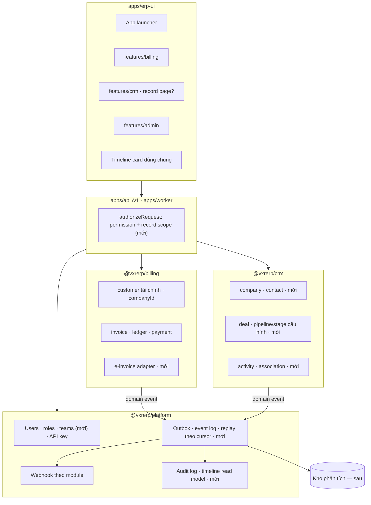

# Kiến trúc ERP nội bộ (vxrerp) — kiểm chứng và đề xuất

- **Ngày.** 2026-09-22.
- **Baseline.** Kiến trúc hiện tại của repo: ADR 0024, 0025, 0028, 0030 và các rule trong
  `.claude/rules/local/`. File này **kiểm chứng** từng quyết định bằng ba báo cáo
  ([`01-odoo.md`](01-odoo.md), [`02-hubspot.md`](02-hubspot.md), [`03-salesforce.md`](03-salesforce.md))
  và ma trận [`04-comparison.md`](04-comparison.md), rồi đề xuất **giữ / sửa / thêm**.
- **Phạm vi.** Đề xuất kiến trúc, không phải thiết kế chi tiết. Mỗi mục "thêm" cần một ADR riêng
  trước khi làm (danh sách ở §5).

Mỗi quyết định viết theo cùng một khuôn: **Hiện trạng → Ba hệ làm thế nào → Đề xuất → Lý do → Ưu →
Nhược → Khi nào xem lại.**

## 1. Tóm tắt đề xuất

| #   | Quyết định                                                           | Đề xuất                                                                                                  | Ưu tiên    |
| --- | -------------------------------------------------------------------- | -------------------------------------------------------------------------------------------------------- | ---------- |
| D1  | Modular monolith, một API / worker / DB                              | **Giữ**                                                                                                  | —          |
| D2  | Mỗi module một Postgres schema, không FK chéo module                 | **Giữ**                                                                                                  | —          |
| D3  | Shared kernel là enum đóng                                           | **Giữ**                                                                                                  | —          |
| D4  | Tuỳ biến bởi người dùng (custom field/object)                        | **Không làm mặc định**; chỉ pipeline/stage là cấu hình, custom field CRM có giới hạn nếu có nhu cầu thật | Trung bình |
| D5  | Giao tiếp module qua outbox + domain event                           | **Giữ**, thêm đọc lại event theo cursor                                                                  | Thấp       |
| D6  | Phân quyền: role hằng số, permission theo route                      | **Sửa**: thêm record-level (owner / team scope) trước khi CRM có dữ liệu thật                            | **Cao**    |
| D7  | API `/v1` + SDK, API key và webhook theo module                      | **Giữ**, ghi chính sách version                                                                          | Trung bình |
| D8  | Logic trong service + BullMQ, không có automation cho người vận hành | **Giữ**, thêm rule có cấu trúc trên trigger đã biết khi có nhu cầu                                       | Thấp       |
| D9  | Reporting trên DB giao dịch                                          | **Giữ có trần**, chuẩn bị đường sang kho phân tích                                                       | Thấp       |
| D10 | UI: app launcher + list + drawer                                     | **Giữ launcher**; **thêm** activity timeline; **quyết định** record page cho CRM                         | Cao        |
| D11 | Đa công ty, tiền tệ, thuế, e-invoice                                 | **Thêm** e-invoice qua adapter; **quyết định sớm** multi-company                                         | **Cao**    |
| D12 | Dữ liệu gốc về khách hàng / công ty                                  | **Quyết định**: CRM sở hữu company/contact, billing giữ customer tài chính, nối bằng id + event          | **Cao**    |
| D13 | Phạm vi tự xây vs tích hợp (CRM, kế toán tổng hợp)                   | **Quyết định** bằng số liệu, xem §4                                                                      | **Cao**    |

**Nhận định tổng:** ba báo cáo xác nhận phần xương sống (D1–D3, D5, D7) — đó là những chỗ repo đã đi
khác Odoo đúng ở điểm Odoo trả giá, và không sa vào những thứ Salesforce/HubSpot chỉ cần vì là
multi-tenant SaaS. Khoảng trống thật nằm ở **tầng nghiệp vụ dùng chung**: phân quyền theo bản ghi,
timeline, e-invoice, multi-company, và ai sở hữu dữ liệu khách hàng.

## 2. Từng quyết định

### D1. Modular monolith — một API, một worker, một Postgres

- **Hiện trạng.** `@vxrerp/platform` + `@vxrerp/billing` + `@vxrerp/crm`; một `apps/api`, một
  `apps/worker`, một DB (ADR 0030 §1).
- **Ba hệ.** Odoo: monolith addon, một process, một DB mỗi tenant. HubSpot: rất nhiều service, ~800
  cluster Vitess, Kafka, nhân bản theo vùng. Salesforce: kernel monolith Java + service tách dần,
  multi-tenant.
- **Đề xuất.** Giữ.
- **Lý do.** Một đội nhỏ, single-tenant, tải nội bộ. Kiến trúc phân tán của HubSpot/Salesforce giải
  bài toán hàng trăm nghìn tenant — vxrerp không có. Odoo cho thấy một DB + một transaction là lợi thế
  lớn nhất của ERP (đơn bán → kho → bút toán nhất quán) và monolith giữ được nó.
- **Ưu.** Vận hành đơn giản; giao dịch xuyên module vẫn có thể cùng DB; deploy một lần.
- **Nhược.** Không scale độc lập từng module; một module lỗi nặng ảnh hưởng cả API.
- **Xem lại khi.** Một module có tải khác hẳn phần còn lại (ví dụ metering ingestion — `docs/RESEARCH.md`
  đã gọi tên), hoặc có đội thứ hai làm một module riêng.

### D2. Mỗi module một Postgres schema, không FK chéo module

- **Hiện trạng.** Schema `platform`, `billing`, `crm`; migration riêng từng package; tham chiếu chéo
  module là id thuần (ADR 0030 §3–4, `erp-module-convention.md`).
- **Ba hệ.** Odoo: một schema `public`, module thêm cột vào bảng của module khác qua `_inherit` —
  không bảng nào có owner. Salesforce: namespace tách tên, nhưng mọi dữ liệu nằm trong kernel chung.
  HubSpot: vendor quyết, khách không thấy.
- **Đề xuất.** Giữ; không nới.
- **Lý do.** Đây là điểm vxrerp khác Odoo mạnh nhất, và đúng ở chỗ Odoo đắt nhất: chi phí nâng cấp
  custom module đến từ việc module vá bảng và method của nhau (01 §11).
- **Ưu.** Biết bảng nào thuộc ai; rút hay tách một module được; lint + schema giữ ranh giới mà không
  cần kỷ luật cá nhân.
- **Nhược.** Tích hợp xuyên module chậm hơn khi dựng (phải qua event hoặc id thuần); không có join
  FK để DB kiểm toàn vẹn chéo module; báo cáo xuyên module phải tự ghép.
- **Xem lại khi.** Không có điều kiện nới dự kiến. Nếu hai module luôn cần nhất quán mạnh với nhau,
  đó là dấu hiệu ranh giới vẽ sai, không phải lý do thêm FK.

### D3. Shared kernel là enum đóng

- **Hiện trạng.** `PermissionEnum`, `DomainEventTypeEnum`, `ErpModuleEnum`, `ObjectPrefixEnum`… nằm ở
  platform và liệt kê giá trị của mọi module (ADR 0030 §2).
- **Ba hệ.** Odoo và Salesforce: registry metadata runtime (`ir.model`, UDD). HubSpot: property và
  object là metadata. Nhưng phần _chuẩn_ của cả ba đều là danh mục đóng; chỉ phần tuỳ biến mới động.
- **Đề xuất.** Giữ.
- **Lý do.** Type của SDK và `openapi.json` giữ enum đóng; thêm module chỉ là thêm chuỗi. Registry
  runtime chỉ đáng khi bên thứ ba cài module vào hệ — vxrerp không có bên thứ ba.
- **Ưu.** Compiler bắt thiếu case; không có cơ chế đăng ký runtime để hỏng.
- **Nhược.** Platform phải được sửa mỗi khi thêm module; platform "biết tên" của mọi module.
- **Xem lại khi.** Có module do đội khác phát hành độc lập với platform.

### D4. Tuỳ biến bởi người dùng

- **Hiện trạng.** Không có. Mọi field, object, stage là code + migration.
- **Ba hệ.** Odoo: Studio tạo cột SQL thật (`x_studio_*`). HubSpot: property là metadata, custom object
  chỉ Enterprise, pipeline/stage do admin cấu hình. Salesforce: mọi thứ là metadata; Custom Metadata
  Types cho cấu hình deploy được.
- **Đề xuất.**
  1. Không làm custom object, formula, roll-up, hay DDL runtime.
  2. **Pipeline và stage của CRM là dữ liệu cấu hình** (`crm.pipelines`, `crm.pipeline_stages`), sửa ở
     `/crm/settings`; ràng buộc stage (field bắt buộc, không nhảy stage) thực thi ở service.
  3. **Custom field chỉ khi có nhu cầu đo được**, và chỉ trên vài entity CRM: bảng định nghĩa trong
     schema `crm` (key, kiểu thuộc enum đóng, entity), giá trị `jsonb` trên bảng entity, validate ở
     service. Không đặt ở platform.
- **Lý do.** Cả ba hệ đều trả giá cho tuỳ biến bằng dữ liệu (04 §3.2). Với ERP có đội dev riêng, chỉ
  những thứ đổi hằng quý bởi người vận hành — pipeline, stage — mới đáng thành cấu hình.
- **Ưu.** Giữ type, FK, index; người vận hành vẫn tự đổi quy trình bán hàng.
- **Nhược.** Thêm một thuộc tính thường xuyên vẫn cần dev; kém HubSpot ở độ linh hoạt.
- **Xem lại khi.** Yêu cầu "thêm một field" cho CRM đến nhiều hơn vài lần mỗi quý.

### D5. Giao tiếp giữa module: outbox + domain event

- **Hiện trạng.** Module đăng ký handler vào `DomainEventDispatchService` (`registerDomainEventHandler`);
  outbox cùng transaction; webhook fan-out theo module (ADR 0030 §6–7).
- **Ba hệ.** Odoo: module gọi thẳng ORM của nhau. Salesforce: Platform Events "publish after commit",
  CDC, Pub/Sub replay 72 giờ. HubSpot: webhook push + journal v4 kéo theo offset, giữ 3 ngày.
- **Đề xuất.** Giữ. Thêm một endpoint đọc event log theo cursor (`after`, đúng quy ước cursor đang có)
  cho consumer nội bộ tự bắt kịp sau downtime. Không làm CDC generic.
- **Lý do.** Outbox là đúng ngữ nghĩa "publish after commit" của Salesforce. Replay là thứ cả Salesforce
  lẫn HubSpot đều thêm vì push-only không đủ cho data warehouse và hệ tích hợp.
- **Ưu.** Hợp đồng giữa module là tên nghiệp vụ, không phải bảng; consumer ngoài có đường bù dữ liệu.
- **Nhược.** Nhất quán cuối cùng (eventual) giữa module; debug luồng event khó hơn gọi hàm.
- **Xem lại khi.** Số handler lớn tới mức cần bus riêng (Kafka) — chưa thấy dấu hiệu.

### D6. Phân quyền — thêm record-level

- **Hiện trạng.** `UserRoleEnum` (admin / moderator / member), 16 permission, `ROLE_PERMISSIONS` hằng
  số; permission theo route qua `OPERATION_PERMISSIONS`, fail closed, áp cho cả session và API key
  (ADR 0028 §3, `auth-convention.md`). Không có record-level, không có field-level.
- **Ba hệ.** Cả ba có record-level: Odoo `ir.rule`, HubSpot All / Team / Owned / Unassigned, Salesforce
  OWD + role hierarchy + bảng share. HubSpot là ví dụ phản diện ở chỗ API vượt được field-level.
- **Đề xuất.**
  1. Thêm `owner_user_id` trên entity cần phân quyền theo bản ghi (bắt đầu từ CRM), và team + thành
     viên ở platform.
  2. Permission thành cặp `(permission, scope)` với `RecordScopeEnum` = `ALL` / `TEAM` / `OWNED`;
     `ROLE_PERMISSIONS` vẫn là hằng số, chỉ thêm scope.
  3. Scope resolve một lần ở server và đi vào `filters` của repository; áp cho cả API key (key mang
     `ALL` trong module của nó).
  4. Mặc định chặt (tinh thần OWD); chỉ khi có chia sẻ ngoại lệ mới thêm bảng grant có `reason` enum.
  5. Không làm sharing rule theo tiêu chí, recalculation, field-level cho tới khi có yêu cầu cụ thể.
- **Lý do.** Đây là khoảng trống rõ nhất so với cả ba hệ (04 §3.3) và rẻ nhất khi làm **trước** khi CRM
  có dữ liệu thật: thêm owner vào bảng rỗng rẻ hơn backfill.
- **Ưu.** Giải "sale chỉ thấy khách của mình" với độ phức tạp của HubSpot, không kéo theo chi phí vận
  hành của Salesforce; một đường authorize cho UI và API.
- **Nhược.** Mọi repository của entity có scope phải nhận scope; test phải phủ ba scope; list và báo
  cáo phải lọc đúng.
- **Xem lại khi.** Xuất hiện nhu cầu chia sẻ không theo owner/team (thêm bảng grant), hoặc số role
  bắt đầu nhân bản chỉ để thêm một quyền (chuyển sang permission set có tên, vẫn là hằng số).

### D7. API `/v1`, SDK, API key và webhook theo module

- **Hiện trạng.** Một cây `/v1`, `operationId` = method SDK, `openapi.json` sinh từ route; API key mang
  permission của một module, có `lastUsedAt`; webhook có chữ ký, retry có giới hạn, delivery log, rate
  limit theo endpoint (ADR 0028, `sdk-convention.md`, `webhook.service.ts`).
- **Ba hệ.** Odoo: API = ORM công khai, không version độc lập, giao thức cũ bị gỡ. HubSpot: version
  theo ngày, hỗ trợ 18 tháng, GA bất biến. Salesforce: version theo release, hỗ trợ ≥ 3 năm, `410 GONE`
  khi retire.
- **Đề xuất.** Giữ. Ghi một ADR về chính sách thay đổi phá vỡ **trước khi có consumer ngoài Vexere**:
  cái gì là phá vỡ, báo trước bao lâu, hỗ trợ song song bao lâu, và cơ chế version (khuyến nghị version
  theo ngày ở header, hợp với SDK kiểu Stripe). Bổ sung xoay key không downtime (hai key song song).
- **Lý do.** Thiết kế hiện tại đã tốt hơn Odoo và ngang HubSpot về hình dạng; thứ còn thiếu là **chính
  sách**, và HubSpot cho thấy thiếu chính sách từ đầu dẫn tới ba thế hệ webhook song song.
- **Ưu.** Consumer biết trước luật chơi; SDK không phải giữ nhiều bản.
- **Nhược.** Cam kết hỗ trợ là chi phí thật khi đổi API.
- **Xem lại khi.** Có consumer bên ngoài (nhà xe, đối tác) gọi API trực tiếp.

### D8. Workflow và automation

- **Hiện trạng.** Logic trong service; job qua BullMQ; lịch chạy theo module (ADR 0030 §5).
- **Ba hệ.** Odoo: automation rule + server action + Studio. HubSpot: workflow no-code, custom code 20
  giây. Salesforce: Flow + Apex, order of execution nhiều tầng.
- **Đề xuất.** Giữ logic nghiệp vụ ở một chỗ (service). Khi người vận hành cần tự động hoá, chỉ mở
  **rule có cấu trúc** trên trigger đã biết (domain event, đổi stage) với tập hành động đóng: gán owner,
  tạo task, gửi thông báo. Không có code do người dùng viết, không chạy trong transaction ghi.
- **Lý do.** Salesforce và HubSpot cho thấy nhiều "tay" cùng gắn logic lên một lần lưu sinh ra thứ tự
  thực thi không ai nhớ nổi, và logic tiền trong workflow không có transaction, test, idempotency.
- **Ưu.** Hành vi hệ thống đọc được từ code; ledger và invoice không bị workflow can thiệp.
- **Nhược.** Người vận hành phụ thuộc dev cho mọi tự động hoá ngoài tập hành động đóng.
- **Xem lại khi.** Có nhiều yêu cầu tự động hoá CRM lặp lại cùng một dạng.

### D9. Reporting

- **Hiện trạng.** Resource `reporting` truy vấn DB giao dịch, cửa sổ thời gian qua `useReportWindow`.
- **Ba hệ.** Odoo: pivot trên mọi model + SQL view. HubSpot: report builder, yếu ở số tài chính.
  Salesforce: trần 2.000 dòng trên DB giao dịch, phân tích nặng sang CRM Analytics / Data 360.
- **Đề xuất.** Giữ report vận hành trên DB giao dịch **có trần** (giới hạn khoảng thời gian, `limit`,
  timeout). Phân tích nặng và báo cáo xuyên module đi sang kho phân tích, nạp từ event log (D5).
- **Lý do.** Cả ba hệ đều tách hai loại báo cáo; D2 làm báo cáo xuyên module trên DB giao dịch càng khó.
- **Ưu.** Bảo vệ DB giao dịch; báo cáo xuyên module không phá ranh giới schema.
- **Nhược.** Thêm một hệ (warehouse) để vận hành; dữ liệu phân tích trễ.
- **Xem lại khi.** Có báo cáo đầu tiên cần ghép billing với CRM hoặc với dữ liệu vận hành Vexere.

### D10. UI shell, timeline và record page

- **Hiện trạng.** Launcher kiểu Odoo, mỗi feature một sidebar, list + `EntityDrawer` cho tạo / sửa /
  chi tiết (ADR 0025, 0030 §7, `erp-ui-convention.md`). Chưa có timeline.
- **Ba hệ.** Odoo và Salesforce đều có launcher + điều hướng theo app (xác nhận lựa chọn). Cả ba đều có
  timeline / chatter trên bản ghi. HubSpot và Salesforce có record page toàn màn cho entity nhiều quan hệ.
- **Đề xuất.**
  1. Giữ launcher và sidebar theo feature.
  2. Thêm **activity timeline** như một read model ở platform: `subject` tham chiếu bằng GID
     (`ObjectPrefixEnum`), nạp từ domain event + `audit_logs` + activity người dùng tạo (note, call, task
     thuộc `crm`). Module khai field nào được track.
  3. **Quyết định bằng ADR** trước khi dựng `features/crm`: entity CRM (company, deal) dùng record page
     toàn màn hay vẫn drawer. Đây là thay đổi convention, không phải ngoại lệ lặng lẽ.
- **Lý do.** Timeline là thứ người dùng HubSpot hỏi đầu tiên (02 §9); drawer chật với company có
  contact, deal, invoice và timeline dài.
- **Ưu.** Một timeline chung cho mọi module, không lặp ở từng feature; tái dùng audit và event đã có.
- **Nhược.** Timeline là một read model phải giữ đồng bộ; thêm một kiểu màn nếu chọn record page.
- **Xem lại khi.** —

### D11. Đa công ty, tiền tệ, thuế, hoá đơn điện tử

- **Hiện trạng.** Đa tiền tệ theo customer; có model thuế trong billing; chưa có multi-company; **chưa
  tích hợp hoá đơn điện tử**.
- **Ba hệ.** Odoo: multi-company trong một DB (`company_id`, `check_company`), module chính thức tích
  hợp SInvoice. HubSpot và Salesforce: không có e-invoice VN.
- **Đề xuất.**
  1. **E-invoice** qua adapter theo nhà cung cấp: một client theo `sdk-client-convention` cho từng nhà
     cung cấp, gọi qua queue có idempotency, credential chỉ đọc ở plugin, template / ký hiệu hoá đơn là
     dữ liệu cấu hình. Thuộc module billing.
  2. **Multi-company: quyết định ngay** Vexere có xuất hoá đơn dưới nhiều pháp nhân không. Nếu có hoặc
     có khả năng, thêm pháp nhân phát hành (`issuer` / `company_id`) vào invoice và cấu hình e-invoice
     từ bây giờ; nếu không, ghi rõ trong ADR để không làm sẵn.
- **Lý do.** Hoá đơn điện tử là nghĩa vụ pháp lý (NĐ 123/2020, sửa đổi bởi NĐ 70/2025 — `docs/RESEARCH.md`)
  và là khoảng trống mà không hệ nào trong ba hệ SaaS lấp được. Thêm `company_id` sau khi có dữ liệu là
  migration lớn (01 §12).
- **Ưu.** Đổi nhà cung cấp e-invoice không chạm billing; không làm multi-company thừa.
- **Nhược.** Phải tự theo kịp thay đổi quy định và định dạng của từng nhà cung cấp.
- **Xem lại khi.** Quy định e-invoice thay đổi, hoặc Vexere lập pháp nhân mới.

### D12. Dữ liệu gốc về khách hàng / công ty

- **Hiện trạng.** `customers` thuộc billing; identity của portal (`portal_memberships`) có FK tới
  `customers`; ADR 0030 §5 đã dự tính chuyển khi membership trỏ tới `companyId` của CRM. CRM chưa có
  bảng.
- **Ba hệ.** Odoo: một `res.partner` chung cho khách, nhà cung cấp, contact — báo cáo Odoo coi đây là
  thứ **không nên** học (kernel gánh khái niệm nghiệp vụ). HubSpot và Salesforce: Company / Account và
  Contact là lõi của CRM; billing là object phụ trỏ tới account.
- **Đề xuất.** CRM sở hữu **company** (nhà xe, đối tác) và **contact**; billing giữ **customer** là hồ
  sơ tài chính (tiền tệ, phương thức thanh toán, số dư, thuế), mang `companyId` là id thuần, đồng bộ
  bằng domain event hai chiều. Không đưa khái niệm này lên platform. Portal identity chuyển theo hướng
  ADR 0030 §5 đã ghi.
- **Lý do.** Giữ D2 và tránh `res.partner`; khớp mô hình mà người dùng HubSpot đã quen (company là trung
  tâm, invoice hiện trên timeline của company).
- **Ưu.** Mỗi module sở hữu đúng phần của mình; billing không phình ra thành CRM.
- **Nhược.** Tạo khách hàng mới chạm hai module; phải xử lý trường hợp customer tồn tại trước company
  (dữ liệu billing hiện có cần backfill `companyId`).
- **Xem lại khi.** —

### D13. Phạm vi tự xây vs tích hợp

- **Hiện trạng.** Billing tự xây, đầy đủ; CRM mới là khung; kế toán tổng hợp (GL doanh nghiệp, AP,
  tài sản), kho, HR chưa có và chưa có kế hoạch.
- **Ba hệ.** Xem 04 §4: không hệ nào thay được billing; HubSpot thay được CRM; Odoo thay được kế toán
  tổng hợp và e-invoice.
- **Đề xuất.** Xem §4 dưới.

## 3. Kiến trúc đích

## 4. Chốt phạm vi tự xây — đề xuất cách quyết định

Đây là quyết định kinh doanh, không chỉ kiến trúc; đề xuất đưa cho stakeholder cùng số liệu:

| Domain                                                             | Đề xuất mặc định                                                                         | Điều kiện đổi hướng                                                                                                                                        | Số liệu cần có                                                                          |
| ------------------------------------------------------------------ | ---------------------------------------------------------------------------------------- | ---------------------------------------------------------------------------------------------------------------------------------------------------------- | --------------------------------------------------------------------------------------- |
| Billing, ledger, payment, e-invoice                                | **Tự xây** (đang làm)                                                                    | —                                                                                                                                                          | —                                                                                       |
| CRM                                                                | **Tự xây phạm vi hẹp**: company, contact, deal, pipeline, activity, timeline, owner/team | Nếu cần marketing automation, email campaign, help desk → giữ HubSpot cho phần đó và đồng bộ company qua API                                               | Chi phí seat HubSpot 3 năm × số người dùng; số tính năng HubSpot đội sales thực sự dùng |
| Kế toán tổng hợp (GL doanh nghiệp, AP, tài sản, báo cáo tài chính) | **Không tự xây**; billing đẩy bút toán sang phần mềm kế toán đang dùng                   | Nếu phần mềm kế toán hiện tại không nhận được dữ liệu → cân nhắc Odoo Accounting làm hệ kế toán, billing làm sub-ledger (mẫu của Salesforce Revenue Cloud) | Hệ kế toán hiện tại của Vexere; khối lượng bút toán; yêu cầu của kế toán trưởng         |
| Kho, sản xuất, HR                                                  | **Ngoài phạm vi**                                                                        | Không có nhu cầu đã biết                                                                                                                                   | —                                                                                       |

## 5. Roadmap và ADR đề xuất

Thứ tự theo phụ thuộc; mỗi bước bắt đầu bằng ADR.

| Bước | Nội dung                                                                          | ADR đề xuất                                             | Lý do thứ tự                                   |
| ---- | --------------------------------------------------------------------------------- | ------------------------------------------------------- | ---------------------------------------------- |
| 1    | Chốt phạm vi (§4) và dữ liệu gốc khách hàng (D12)                                 | ADR "Company/contact thuộc CRM, customer thuộc billing" | Quyết định bảng nào tồn tại trước khi dựng CRM |
| 2    | Chốt multi-company (D11.2)                                                        | ADR "Pháp nhân phát hành hoá đơn"                       | Rẻ nhất khi làm trước dữ liệu thật             |
| 3    | Record-level permission (D6)                                                      | ADR "Owner, team và record scope"                       | Phải có trước khi CRM có dữ liệu               |
| 4    | Record page CRM (D10.3)                                                           | ADR sửa `erp-ui-convention.md` nếu chọn record page     | Phải có trước `features/crm`                   |
| 5    | CRM tối thiểu: company, contact, deal, pipeline cấu hình, association (D4.2, D12) | — (theo checklist `erp-module-convention.md`)           | Dùng kết quả bước 1–4                          |
| 6    | Timeline read model (D10.2)                                                       | ADR "Activity timeline ở platform"                      | Cần CRM để có giá trị                          |
| 7    | E-invoice adapter (D11.1)                                                         | ADR "Hoá đơn điện tử"                                   | Song song với 5–6 được; phụ thuộc bước 2       |
| 8    | Chính sách version API (D7)                                                       | ADR "Chính sách thay đổi phá vỡ của /v1"                | Trước consumer ngoài đầu tiên                  |
| 9    | Replay event theo cursor, kho phân tích (D5, D9)                                  | ADR khi có báo cáo xuyên module đầu tiên                | Theo nhu cầu                                   |

**Chưa làm trong đợt này:** viết các ADR trên. Đây là danh sách đề xuất để stakeholder duyệt.

## 6. Câu hỏi mở cho stakeholder

1. Vexere có xuất hoá đơn dưới nhiều pháp nhân không (D11)?
2. Đội sales đang dùng những phần nào của HubSpot ngoài CRM cơ bản (marketing, sequence, help desk)?
   Chi phí seat hiện tại và dự kiến 3 năm (D13)?
3. Phần mềm kế toán hiện tại là gì, có nhận bút toán qua API/file không (§4)?
4. Nhà cung cấp hoá đơn điện tử đang dùng hoặc dự định dùng (D11)?
5. Có yêu cầu pháp lý về lưu trữ dữ liệu khách hàng trong nước không (liên quan HubSpot, 02 §10)?
