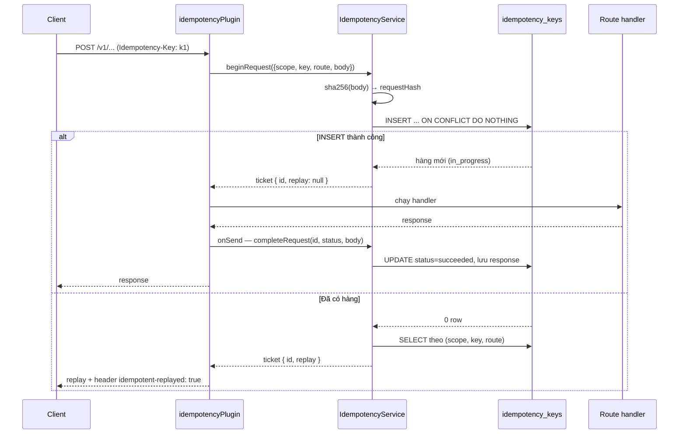

# Idempotency — cách vận hành và cách dùng

Một request tạo hoá đơn bị timeout ở phía client không nói lên điều gì: có thể server chưa nhận,
có thể đã tạo xong và chỉ mất response. Client buộc phải chọn — thử lại và chấp nhận rủi ro tính
tiền hai lần, hoặc không thử lại và chấp nhận rủi ro mất lệnh. Idempotency key là cách bỏ lựa chọn
đó đi: client gắn một định danh cho **ý định**, server đảm bảo mỗi ý định chỉ chạy đúng một lần và
những lần gọi sau nhận lại đúng kết quả của lần đầu.

Tài liệu này nói cơ chế hiện có làm được đến đâu, dùng thế nào, và hỏng ở những chỗ nào.

Code liên quan:

- [`apps/api/src/plugins/idempotency.plugin.ts`](../../apps/api/src/plugins/idempotency.plugin.ts) — hook vào vòng đời request
- [`packages/core/src/services/idempotency.service.ts`](../../packages/core/src/services/idempotency.service.ts) — toàn bộ quyết định
- [`packages/core/src/repositories/idempotency-key.repository.ts`](../../packages/core/src/repositories/idempotency-key.repository.ts) — truy cập bảng
- [`packages/core/src/database/schemas/idempotency-keys.schema.ts`](../../packages/core/src/database/schemas/idempotency-keys.schema.ts) — schema

Bối cảnh rộng hơn: [flow 01 — vòng đời request](../flows/01-request-lifecycle.md). Những giới hạn
đã biết được liệt kê cô đọng ở [PITFALLS §5](../PITFALLS.md#5-idempotency-bảo-vệ-đến-đâu); ở đây
nói kỹ vì sao.

## Định danh của một request

Bảng `idempotency_keys` có một unique index quyết định mọi thứ:

```
uniqueIndex('idempotency_keys_scope_key_route_idx').on(scope, key, route)
```

Ba cột đó là **danh tính** của request; `request_hash` không nằm trong index mà là **chữ ký** để
kiểm tra sau.

| Cột            | Từ đâu ra                                         | Ghi chú                                                                           |
| -------------- | ------------------------------------------------- | --------------------------------------------------------------------------------- |
| `scope`        | hằng `'default'` trong plugin                     | chỗ giữ sẵn cho multi-tenant; hiện **mọi caller dùng chung một scope**            |
| `key`          | header `Idempotency-Key` của client               | server không sinh, không kiểm tra định dạng                                       |
| `route`        | `request.routeOptions.url`                        | **route template**, ví dụ `/v1/invoices/:invoiceId/finalize`                      |
| `request_hash` | `sha256(JSON.stringify({ params, body }))`        | path param + body; không querystring, không header                                |
| `status`       | `in_progress` → `succeeded` \| `failed`           | [`IdempotencyStatusEnum`](../../packages/core/src/contracts/idempotency.types.ts) |
| `response_*`   | status code + body đã trả về                      | dùng để replay                                                                    |
| `expires_at`   | `now + IDEMPOTENCY_RETENTION_HOURS` (mặc định 24) | có index, nhưng xem [§ Dọn dẹp](#dọn-dẹp-hàng-hết-hạn)                            |

Hai điểm quan trọng đọc ra từ bảng trên:

1. **Route là template, không phải URL.** `POST /v1/invoices/in_A/finalize` và
   `POST /v1/invoices/in_B/finalize` có cùng `route` — đã kiểm chứng: `routeOptions.url` trả về
   `/v1/invoices/:invoiceId/finalize` cho cả hai. Cái phân biệt hai request đó là `request_hash`.
2. **Path param nằm trong hash, querystring thì không.** Đủ, vì không route mutating nào trong repo
   khai `querystring` — mọi `querystring` schema đều thuộc route `GET`. Ngày nào có route ghi đọc
   query thì phải đưa `request.query` vào hash cùng chỗ.

Trước khi `params` vào hash, cả hai `finalize` ở trên có cùng `request_hash` — vì route không có
body nên hash là hash của `null` ở mọi lần gọi. Hệ quả: dùng lại một key cho hai hoá đơn thì request
thứ hai **không chạy** và nhận nguyên response của hoá đơn thứ nhất, im lặng. Giờ hai `invoiceId`
khác nhau cho ra hai hash khác nhau, nên tình huống đó trả `400` thay vì replay nhầm — xem
[§ Cách chọn key](#cách-chọn-key).

## Một request đi qua những gì



Điểm cần chú ý về thứ tự: `idempotencyPlugin` đăng ký **sau** hook xác thực
([`v1.routes.ts:22-24`](../../apps/api/src/routes/v1/v1.routes.ts)), nên request sai API key bị chặn
trước, không bao giờ chiếm được một key.

Và `INSERT ... ON CONFLICT DO NOTHING` là toàn bộ cơ chế khoá — không có `SELECT` rồi `INSERT`, nên
không có khoảng hở giữa hai câu lệnh. Hai request đồng thời cùng key thì Postgres quyết định ai
thắng, người thua nhận 0 row và đi nhánh "đã có hàng".

## Năm nhánh của `beginRequest`

Đây là toàn bộ logic quyết định, theo đúng thứ tự kiểm tra trong
[`resolveReplay`](../../packages/core/src/services/idempotency.service.ts):

| #   | Tình huống                                             | Kết quả                                                     | Client thấy gì                              |
| --- | ------------------------------------------------------ | ----------------------------------------------------------- | ------------------------------------------- |
| 1   | Chưa có key → INSERT thành công                        | ticket mới, `replay: null`                                  | request chạy bình thường                    |
| 2   | INSERT trượt **và** SELECT cũng không thấy             | `IdempotencyInProgressError`                                | `409` — đua với một lệnh xoá                |
| 3   | Có key, `request_hash` khác (body **hoặc** path param) | `IdempotencyConflictError`                                  | `400`                                       |
| 4   | Có key, status `in_progress`                           | `IdempotencyInProgressError`                                | `409`                                       |
| 5   | Có key, status `succeeded` + có status code            | replay: trả lại `response_status_code` + `response_body`    | `200/201/...` + `idempotent-replayed: true` |
| 6   | Có key, status `failed`                                | ticket cũ, `replay: null` — **chạy lại trên chính hàng đó** | request chạy bình thường                    |

Thứ tự này có chủ đích: **hash được kiểm trước status**. Gửi lại cùng key với body khác trong lúc
request đầu còn đang chạy sẽ nhận `400` (sai body) chứ không phải `409` (đang bận) — lỗi nói đúng
nguyên nhân thật. Cùng lý do đó áp cho path param: nhắm vào một đối tượng khác là một request khác,
không phải một lần thử lại.

Nhánh 6 là đường retry sau lỗi server: `onSend` thấy status ≥ 500 thì gọi `releaseRequest`, đặt
`status = failed` và `locked_at = null`. Hàng vẫn còn nên key vẫn "thuộc về" ý định đó, nhưng không
còn chặn lần thử lại — và lần chạy lại cập nhật đúng hàng cũ thay vì tạo hàng mới.

## Cách dùng — phía client

Gắn header `Idempotency-Key` vào request ghi. Không có header thì **không có bảo vệ nào** — plugin
chỉ chạy khi method thuộc `POST/PUT/PATCH/DELETE` **và** header có mặt.

```bash
curl -X POST http://localhost:3000/v1/customers \
  -H "Authorization: Bearer $SECRET_API_KEY" \
  -H "Content-Type: application/json" \
  -H "Idempotency-Key: 8f1d2c7a-3b5e-4e9a-9c11-0a2b3c4d5e6f" \
  -d '{"email":"a@example.com","currency":"vnd"}'
```

Gọi lại đúng lệnh đó lần thứ hai trả về đúng response cũ, kèm `idempotent-replayed: true`.

### Cách chọn key

| Nên                                                                         | Không nên                            |
| --------------------------------------------------------------------------- | ------------------------------------ |
| UUID/GID sinh **một lần cho mỗi ý định**, lưu lại để dùng cho mọi lần retry | sinh key mới mỗi lần retry           |
| Key phát sinh từ dữ liệu nghiệp vụ, ví dụ `finalize:in_01m2...`             | dùng lại một key cho hai đối tượng   |
| Một key cho một (route, đối tượng)                                          | một key dùng cho cả create và update |

Với các route hành động theo id mà không có body — `finalize`, `void`, `cancel`, `confirm` — nên cho
id của đối tượng vào key. Không bắt buộc nữa kể từ khi `params` vào hash: dùng lại key cho hoá đơn
khác giờ trả `400` chứ không replay nhầm. Nhưng một key nói rõ nó thuộc về cái gì thì lỗi đọc ra
được ngay từ log, không phải đi tra hàng `idempotency_keys`.

### Xử lý các mã lỗi

| Mã                        | Nghĩa                              | Client nên làm gì                                            |
| ------------------------- | ---------------------------------- | ------------------------------------------------------------ |
| `409`                     | key đang được xử lý                | đợi rồi thử lại **cùng key** — backoff, đừng đổi key         |
| `400` `idempotency_error` | cùng key, body hoặc đối tượng khác | lỗi lập trình phía client: sinh key mới cho ý định mới       |
| `5xx`                     | server hỏng                        | thử lại cùng key; hàng đã được release nên lần sau chạy thật |
| `4xx` khác                | request sai                        | **sửa body thì phải đổi key** — xem giới hạn 2 bên dưới      |

Lỗi idempotency trả về theo hình dạng Stripe từ
[`error-handler.plugin.ts`](../../apps/api/src/plugins/error-handler.plugin.ts), với
`type: "idempotency_error"`.

## Cách dùng — phía server

Không cần làm gì trong route handler hay service: idempotency là một tầng bọc ngoài, hoàn toàn nằm ở
plugin. Thêm route mới vào `/v1` hoặc `/api/v1/admin` là tự động được bảo vệ.

Thêm **một nhóm route mới** thì phải đăng ký plugin cho nhóm đó, sau hook xác thực:

```ts
export async function systemRoutes(fastify: FastifyInstance): Promise<void> {
  fastify.addHook('preHandler', verifySystemRequest);

  await fastify.register(idempotencyPlugin);
}
```

Hiện chỉ `/v1` và `/api/v1/admin` có đăng ký. `/api/v1/system` và `/api/v1/management` thì **không**
— nên `POST /api/v1/management/outbox/relay` chạy tay hai lần là relay hai lần.

Gọi `beginRequest` trực tiếp (ngoài plugin, ví dụ trong test hay một entry không phải HTTP) thì phải
tự truyền `params` — trường này bắt buộc trong `BeginIdempotentRequestPayload`, và bỏ sót nó là hai
request nhắm vào hai đối tượng khác nhau lại có chung một hash. Không có `params` thì truyền `{}`.

Tham số vận hành duy nhất là `IDEMPOTENCY_RETENTION_HOURS`
([`env.schema.ts:56`](../../packages/core/src/config/env.schema.ts), mặc định `24`), nạp vào service
ở [`service-registry.plugin.ts:27`](../../packages/core/src/plugins/service-registry.plugin.ts).

## Bốn giới hạn phải biết

1. **Không gửi header thì không có gì cả.** Không phải mặc định bật. Một client quên header sẽ chạy
   lệnh hai lần mà không có dấu hiệu gì.
2. **Response 4xx cũng bị cache.** `onSend` gọi `completeRequest` cho mọi status dưới 500, kể cả
   `400` và `422`. Client sửa payload rồi thử lại với **cùng key** sẽ nhận `IdempotencyConflictError`
   mãi mãi — vì hash mới khác hash đã lưu — và không bao giờ chạy được lệnh đã sửa. Sửa body là phải
   đổi key.
3. **Hàng `in_progress` không bao giờ được reclaim.** Tiến trình chết giữa request để lại
   `status = in_progress` vĩnh viễn: `onSend` không chạy nên không có ai release. Cột `locked_at`
   được ghi lúc `beginRequest` nhưng **không code nào đọc**, nên không có cơ chế "khoá quá hạn thì
   coi như bỏ". Key đó nhiễm độc cho tới khi có người xoá tay.
4. **`scope` hardcode `'default'`.** Hai caller không liên quan dùng trùng chuỗi key trên cùng một
   route, với cùng params và cùng body, sẽ nhận **response đã cache của nhau** — khác body hay khác
   đối tượng thì nay đã ra `400`, nhưng trùng cả thì vẫn lọt. Cột `scope` tồn tại để sau này gắn
   account/tenant; cho tới lúc đó, key phải duy nhất trên toàn hệ thống. ADR 0001 §8 ghi nhận đây là
   chỗ giữ sẵn.

Hai chi tiết nhỏ nhưng có thật:

- **Hash nhạy với thứ tự khoá JSON.** `JSON.stringify` giữ nguyên thứ tự khoá của object đã parse,
  nên `{"a":1,"b":2}` và `{"b":2,"a":1}` cho ra hai hash khác nhau. Lần retry bình thường gửi lại
  đúng payload cũ nên không chạm phải; client tự dựng lại body từ một map không có thứ tự ổn định
  thì có thể ăn `400`. Muốn miễn nhiễm thì phải canonical hoá (sắp khoá đệ quy) trước khi hash.
- **Body không phải chuỗi thì không lưu được.** `completeRequest` chỉ parse được body khi payload là
  chuỗi JSON. Route trả về stream hoặc buffer sẽ lưu `response_body = null`, và lần replay trả về
  body rỗng với đúng status code cũ.

## Dọn dẹp hàng hết hạn

`expires_at` được ghi đúng và có index, `deleteExpiredRequests` đã viết sẵn — nhưng **không caller
nào trong toàn repo**. Không có cron, không có worker nào gọi. Bảng `idempotency_keys` hiện lớn dần
vô hạn.

Cho tới khi có job dọn, dọn tay bằng SQL:

```sql
DELETE FROM idempotency_keys WHERE expires_at < now();
```

Và để gỡ một key kẹt ở `in_progress`:

```sql
DELETE FROM idempotency_keys
WHERE scope = 'default' AND key = '<idempotency-key>' AND route = '/v1/...';
```

Xoá chứ không `UPDATE status`: xoá trả key về trạng thái chưa từng thấy, còn đổi status sang `failed`
thì giữ lại `request_hash` cũ và request tiếp theo với body khác vẫn bị `400`.

## Idempotency ở những tầng khác

Header `Idempotency-Key` chỉ bảo vệ **biên HTTP**. Bên trong, mỗi tầng tự chống lặp theo cách riêng:

| Tầng              | Cơ chế                                                                                                      | Ở đâu                                                                                                                                                        |
| ----------------- | ----------------------------------------------------------------------------------------------------------- | ------------------------------------------------------------------------------------------------------------------------------------------------------------ |
| Cổng thanh toán   | `idempotencyKey` gửi kèm sang PSP, dẫn xuất từ id nội bộ: `charge:${paymentIntentId}`, `refund:${refundId}` | [`payment.service.ts:99`](../../packages/core/src/services/payment.service.ts), [`refund.service.ts:55`](../../packages/core/src/services/refund.service.ts) |
| Meter event       | `identifier` duy nhất cho mỗi meter, chặn bằng Redis trong cửa sổ `dedupWindowDays`                         | [`meter-event.service.ts`](../../packages/core/src/services/meter-event.service.ts)                                                                          |
| Sổ cái            | `external_id` có unique index — bút toán cho cùng một sự kiện chỉ ghi một lần                               | [`ledger.service.ts`](../../packages/core/src/services/ledger.service.ts)                                                                                    |
| Outbox → consumer | **at-least-once**: consumer phải tự idempotent                                                              | [flow 02](../flows/02-event-pipeline.md)                                                                                                                     |

Chỗ chưa kín ở tầng cuối: `webhook_deliveries` **không** có unique index trên `(endpoint_id, event_id)`,
mà `handleDomainEvent` sinh id delivery mới cho mỗi lần chạy. Job domain-event retry vì thế tạo thêm
một bộ delivery mới cho cùng một event, và khách nhận webhook trùng.

Nguyên tắc rút ra: **idempotency ở biên không thay thế idempotency ở tầng dưới.** Một service mới có
ghi dữ liệu phải tự hỏi "chạy hai lần thì sao", chứ không dựa vào việc caller có gửi header hay không.

## Test

[`tests/idempotency.integration.test.ts`](../../packages/core/tests/idempotency.integration.test.ts)
phủ sáu trường hợp: lần đầu không replay, lặp lại cùng body thì replay, lặp lại khác body thì `400`,
lặp lại khi đang chạy thì `409`, và hai case cho `params` — cùng key nhắm vào path param khác thì
`400`, cùng path param mà không có body thì replay. Chạy bằng:

```bash
pnpm --filter @pinstripe/core test:integration
```

Hai nhánh chưa có test và đáng thêm khi động vào khu vực này: đường retry sau `failed` (nhánh 6), và
hành vi khi hai request thật sự chạy song song.
