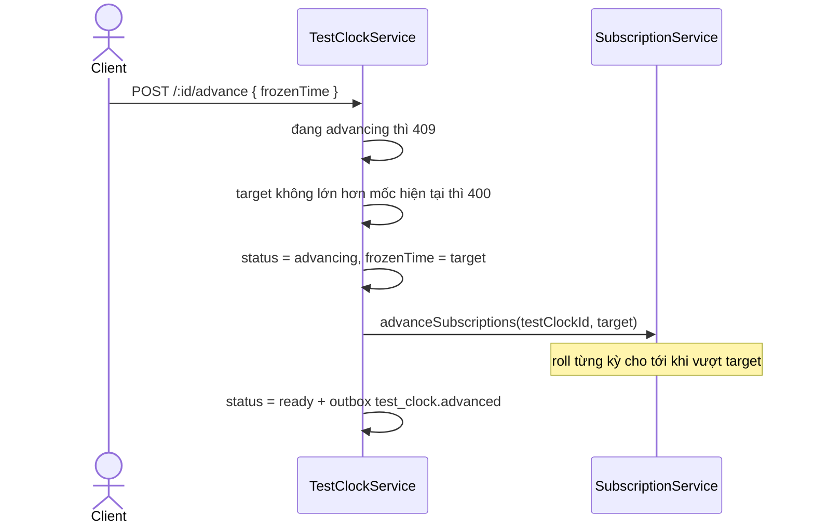

# Test clock — điều khiển thời gian trong một hệ tính tiền

Phần lớn hành vi đáng tiền của hệ này không xảy ra khi ai đó bấm nút, mà khi thời gian trôi qua một
mốc: trial hết hạn, kỳ cũ đóng, kỳ mới mở, hợp đồng "huỷ cuối kỳ" thực sự kết thúc. Test clock là
cách nhìn thấy những hành vi đó ngay bây giờ, trên một tập dữ liệu, mà không đụng tới giờ của máy
hay của những khách khác.

Code: [`clock.ts`](../../packages/core/src/utils/clock.ts),
[`test-clock.service.ts`](../../packages/core/src/services/test-clock.service.ts),
`resolveNow` trong [`subscription.service.ts`](../../packages/core/src/services/subscription.service.ts).
Cơ chế từng bước ở [flow 12](../flows/12-test-clock.md); tài liệu này nói **vì sao** nó có hình dạng
như vậy và cách dùng.

## Vấn đề

| Hành vi muốn thấy                            | Chờ giờ thật mất bao lâu |
| -------------------------------------------- | ------------------------ |
| Trial 7 ngày kết thúc → `active`             | 7 ngày                   |
| Kỳ tháng đóng, phát `subscription.renewed`   | 30 ngày                  |
| Huỷ cuối kỳ thực sự thành `canceled`         | tới hết kỳ đang chạy     |
| Ba kỳ liên tiếp để xem kỳ có trôi ngày không | 3 tháng                  |

Ba cách quen thuộc đều không giải được:

| Cách                          | Hỏng ở đâu                                                                                             |
| ----------------------------- | ------------------------------------------------------------------------------------------------------ |
| Sửa giờ máy hoặc giờ database | đổi giờ của **tất cả** — mọi khách trong cùng DB, mọi worker đang chạy, cả log và index theo thời gian |
| `vi.useFakeTimers()`          | chỉ sống bên trong một process test; không bấm tay được trên admin-ui, không demo được, không QA được  |
| `sleep` trong test            | chậm, và không có cách nào tới được mốc "40 ngày sau"                                                  |

Thứ cần là một trục thời gian **riêng cho một nhóm dữ liệu**, tua được, còn phần còn lại của hệ
thống vẫn chạy giờ thật. Đó là định nghĩa của test clock ở đây.

## Quy ước nền: code nghiệp vụ không gọi `new Date()`

Kỹ thuật này chỉ hoạt động khi không còn chỗ nào tự ý lấy giờ. Nên "giờ hiện tại" là một dependency
được tiêm vào, không phải một lời gọi toàn cục:

```ts
export interface Clock {
  now(): Date;
}

export class SystemClock implements Clock {
  now(): Date {
    return new Date();
  }
}
```

[`clock.ts:1-9`](../../packages/core/src/utils/clock.ts). Decorate đúng **một lần** ở
[`config.plugin.ts:34`](../../packages/core/src/plugins/config.plugin.ts), khai báo kiểu trên
`FastifyInstance` ở [`fastify.augmentation.ts:52`](../../packages/core/src/plugins/fastify.augmentation.ts),
và từ đó mọi service đọc giờ qua `this.fastify.clock.now()`.

Một service quên quy ước này thì **không lỗi biên dịch, không lỗi test** — chỉ là nhánh đó lặng lẽ
nằm ngoài tầm với của test clock. Xem [PITFALLS §1](../PITFALLS.md).

`new Date()` còn sót lại đúng năm chỗ, đều là ghi metadata chứ không phải quyết định nghiệp vụ:

| Vị trí                                                                                                      | Vì sao chấp nhận được                                  |
| ----------------------------------------------------------------------------------------------------------- | ------------------------------------------------------ |
| [`clock.ts:7`](../../packages/core/src/utils/clock.ts)                                                      | chính là nơi được phép                                 |
| [`idempotency-key.repository.ts:53,60`](../../packages/core/src/repositories/idempotency-key.repository.ts) | `updated_at` của hàng khoá, không ai đọc để quyết định |
| [`entitlement.repository.ts:63`](../../packages/core/src/repositories/entitlement.repository.ts)            | fallback `updatedAt` khi caller không truyền           |
| [`ledger.service.ts:464`](../../packages/core/src/services/ledger.service.ts)                               | fallback khi dựng response                             |
| [`test-clock-form.ts:20`](../../apps/admin-ui/src/forms/test-clock-form.ts)                                 | form admin-ui mặc định mốc "bây giờ"                   |

## Hai tầng thời gian — đừng lẫn

| Tầng                                             | Đổi giờ của gì        | Trạng thái trong repo                                               |
| ------------------------------------------------ | --------------------- | ------------------------------------------------------------------- |
| `Clock` tiêm vào (`SystemClock` / `FrozenClock`) | **cả process**        | `FrozenClock` **chưa được wire vào app**, chỉ unit test của nó dùng |
| Hàng `test_clocks` + `resolveNow`                | **một nhóm thực thể** | đây là cơ chế đang chạy thật, cả API lẫn admin-ui                   |

`FrozenClock` ([`clock.ts:11-32`](../../packages/core/src/utils/clock.ts)) có `advanceTo` /
`advanceBy` và từ chối đi lùi, nhưng người dùng duy nhất của nó là
[`clock.test.ts`](../../packages/core/src/utils/clock.test.ts). Đây là chỗ dễ hiểu nhầm nhất: thấy
`FrozenClock` rồi tưởng đó là test clock của hệ thống.

Vì sao tầng hai mới là cơ chế chính: một database dùng chung, nhiều khách cùng tồn tại, nhiều worker
cùng chạy. Đóng băng cả process nghĩa là đóng băng giờ của mọi khách khác — thứ chấp nhận được trong
một unit test, không chấp nhận được trên môi trường dev hay sandbox.

Chọn giữa hai nguồn giờ nằm gọn trong một hàm:

```ts
private async resolveNow(testClockId: string | null): Promise<Date> {
  if (!testClockId) {
    return this.fastify.clock.now();
  }

  const clock = await this.fastify.testClockRepository.findTestClock(testClockId);

  if (!clock) {
    throw new NotFoundError(`No such test clock: ${testClockId}`);
  }

  return clock.frozenTime;
}
```

[`subscription.service.ts:398-410`](../../packages/core/src/services/subscription.service.ts).

## Mô hình dữ liệu

Bảng `test_clocks` ([`test-clocks.schema.ts`](../../packages/core/src/database/schemas/test-clocks.schema.ts)):
`id` (prefix `clock_`), `name`, `frozen_time`, `status` — hai giá trị `ready` | `advancing`
([`TestClockStatusEnum`](../../packages/core/src/contracts/test-clocks.types.ts)).

Đồng hồ lan xuống dữ liệu theo một chiều duy nhất:

```
test_clocks.id
  └── customers.test_clock_id      (gắn lúc tạo customer, cột không có FK)
        └── subscriptions.test_clock_id   (kế thừa từ customer lúc tạo subscription, có FK)
```

Kế thừa xảy ra ở [`subscription.service.ts:83`](../../packages/core/src/services/subscription.service.ts):
`testClockId: customer.testClockId`. Không có API nào gắn đồng hồ vào một customer đã tồn tại —
**phải gắn ngay lúc tạo khách**. Migration:
[`0006_subscriptions_entitlements.sql:44,53,60`](../../packages/core/migrations/0006_subscriptions_entitlements.sql).

## Advance làm gì



`advanceSubscriptions` lấy mọi subscription của đồng hồ có `currentPeriodEnd <= target`, tối đa
`ADVANCE_BATCH_SIZE = 500`, rồi cuốn từng cái qua `rollPeriod` cho tới khi vượt mốc, tối đa
`MAX_PERIOD_ROLLS = 120` lần mỗi subscription
([`subscription.service.ts:31-32,276-311`](../../packages/core/src/services/subscription.service.ts)).

Mỗi lần roll đi vào đúng một trong ba nhánh
([`subscription.service.ts:313-348`](../../packages/core/src/services/subscription.service.ts)):

| Điều kiện                  | Kết quả                         | Event                      |
| -------------------------- | ------------------------------- | -------------------------- |
| `cancelAtPeriodEnd = true` | `canceled`, `endedAt` = cuối kỳ | `subscription.canceled`    |
| đang `trialing`            | `active`, mở kỳ mới             | `subscription.trial_ended` |
| còn lại                    | `active`, mở kỳ mới             | `subscription.renewed`     |

Kỳ mới neo vào `currentPeriodEnd` cũ, **không** neo vào `now` — nên tua nhảy hai tháng trong một
lệnh vẫn ra đúng lưới ngày, không trôi dần.

## Cách dùng

### Khi viết code nghiệp vụ

```ts
// CORRECT — giờ lấy từ clock được tiêm
const now = this.fastify.clock.now();

// CORRECT — thực thể có thể gắn đồng hồ thì hỏi resolveNow
const now = await this.resolveNow(customer.testClockId);

// WRONG — nhánh này vĩnh viễn nằm ngoài tầm test clock
const now = new Date();
```

Viết service mới mà hành vi phụ thuộc thời gian và thực thể có `testClockId`: phải đi qua
`resolveNow`, không mặc định `clock.now()`. Hiện chỉ `SubscriptionService` làm điều này — xem
[§ Giới hạn](#giới-hạn-phải-biết).

### Khi viết test

Integration test dựng đồng hồ ngay trong `buildScenario()` rồi tua bằng chính API thật —
[`subscriptions.integration.test.ts:32-52,104-148`](../../packages/core/tests/subscriptions.integration.test.ts).
Hai lối đặt mốc bắt đầu, đang tồn tại song song:

| Lối                                         | Dùng khi                                            | Đánh đổi                                                        |
| ------------------------------------------- | --------------------------------------------------- | --------------------------------------------------------------- |
| Mốc tuyệt đối, `CLOCK_START = '2026-01-01'` | test có assert mốc ngày cụ thể                      | assert đọc được bằng mắt, nhưng phải tự tính lưới ngày          |
| Mốc tương đối, `Date.now() - 2 ngày`        | chỉ cần dữ liệu "đã có từ trước", không assert ngày | không cần tính, nhưng không assert được `currentPeriodEnd` cứng |

`FrozenClock` dành cho unit test của code thuần thời gian, không đụng DB.

## Step by step — trial 7 ngày kết thúc rồi gia hạn

Chạy được trên môi trường dev đã `docker compose -f docker/compose.yml up -d` và API ở
`localhost:3000`.

```bash
set -a && . ./.env && set +a
API=http://localhost:3000
AUTH="Authorization: Bearer $SECRET_API_KEY"
JSON='content-type: application/json'
```

**Bước 1 — Đồng hồ đóng băng ở 01/01/2026.** Mốc tuyệt đối để mọi con số dưới đây kiểm chứng được
bằng mắt:

```bash
CLOCK=$(curl -s -X POST $API/v1/test_helpers/test_clocks -H "$AUTH" -H "$JSON" \
  -H "Idempotency-Key: $(uuidgen)" \
  -d '{"name":"Trial 7 ngay","frozenTime":"2026-01-01T00:00:00.000Z"}' | jq -r '.id')
```

**Bước 2 — Khách gắn đồng hồ.** Bắt buộc dùng curl: form tạo khách trên admin-ui không có trường
`testClockId`, và không có API gắn sau.

```bash
CUS=$(curl -s -X POST $API/v1/customers -H "$AUTH" -H "$JSON" \
  -H "Idempotency-Key: $(uuidgen)" \
  -d "{\"email\":\"trial@congty.vn\",\"name\":\"Khach test clock\",\"currency\":\"vnd\",\"testClockId\":\"$CLOCK\"}" \
  | jq -r '.id')
```

**Bước 3 — Product + price recurring monthly.** Hai thứ này không gắn đồng hồ, chúng không có hành
vi theo thời gian:

```bash
PROD=$(curl -s -X POST $API/v1/products -H "$AUTH" -H "$JSON" \
  -H "Idempotency-Key: $(uuidgen)" -d '{"name":"Goi Pro"}' | jq -r '.id')

PRICE=$(curl -s -X POST $API/v1/prices -H "$AUTH" -H "$JSON" \
  -H "Idempotency-Key: $(uuidgen)" \
  -d "{\"productId\":\"$PROD\",\"lookupKey\":\"pro_monthly_clock\",\"currency\":\"vnd\",
       \"unitAmount\":200000,\"billingScheme\":\"per_unit\",
       \"recurring\":{\"interval\":\"month\",\"intervalCount\":1,\"usageType\":\"licensed\"}}" \
  | jq -r '.id')
```

**Bước 4 — Subscription trial 7 ngày.**

```bash
SUB=$(curl -s -X POST $API/v1/subscriptions -H "$AUTH" -H "$JSON" \
  -H "Idempotency-Key: $(uuidgen)" \
  -d "{\"customerId\":\"$CUS\",\"items\":[{\"priceId\":\"$PRICE\"}],\"trialPeriodDays\":7}" \
  | jq -r '.id')

curl -s $API/v1/subscriptions/$SUB -H "$AUTH" \
  | jq '{status, currentPeriodStart, currentPeriodEnd}'
```

Mong đợi: `trialing`, kỳ `2026-01-01 → 2026-01-08`. **Đây là bằng chứng quan trọng nhất của cả bài**
— `currentPeriodStart` là giờ của đồng hồ chứ không phải hôm nay, nghĩa là `resolveNow` đã chọn
`frozenTime` thay vì `clock.now()`.

**Bước 5 — Tua qua ngày hết trial.**

```bash
curl -s -X POST $API/v1/test_helpers/test_clocks/$CLOCK/advance -H "$AUTH" -H "$JSON" \
  -H "Idempotency-Key: $(uuidgen)" \
  -d '{"frozenTime":"2026-01-09T00:00:00.000Z"}' | jq '{frozenTime, status}'

curl -s $API/v1/subscriptions/$SUB -H "$AUTH" | jq '{status, currentPeriodStart, currentPeriodEnd}'
```

Mong đợi: `active`, kỳ `2026-01-08 → 2026-02-08`, một event `subscription.trial_ended` vào outbox.
Kỳ mới bắt đầu tại `2026-01-08` — cuối kỳ cũ — chứ không phải `2026-01-09` là mốc vừa tua tới.

**Bước 6 — Tua hai kỳ trong một lệnh.**

```bash
curl -s -X POST $API/v1/test_helpers/test_clocks/$CLOCK/advance -H "$AUTH" -H "$JSON" \
  -H "Idempotency-Key: $(uuidgen)" \
  -d '{"frozenTime":"2026-03-15T00:00:00.000Z"}' | jq '.frozenTime'

curl -s $API/v1/subscriptions/$SUB -H "$AUTH" | jq '{status, currentPeriodStart, currentPeriodEnd}'
```

Mong đợi: kỳ `2026-03-08 → 2026-04-08` — `rollPeriod` chạy hai lần, hai event
`subscription.renewed`, và ngày mùng 8 vẫn giữ nguyên qua cả tháng 2 lẫn tháng 3.

### Mốc thời gian

| Sau bước | `frozenTime` | `status`   | Kỳ hiện tại                 | Event phát ra          |
| -------- | ------------ | ---------- | --------------------------- | ---------------------- |
| 4        | `2026-01-01` | `trialing` | `2026-01-01` → `2026-01-08` | `subscription.created` |
| 5        | `2026-01-09` | `active`   | `2026-01-08` → `2026-02-08` | `trial_ended`          |
| 6        | `2026-03-15` | `active`   | `2026-03-08` → `2026-04-08` | `renewed` ×2           |

### Kiểm chứng bằng SQL

Chuỗi event sinh ra, đọc từ dưới lên là đúng thứ tự thời gian:

```bash
docker compose -f docker/compose.yml exec -T postgres psql -U pinstripe -d pinstripe -c \
"select event_type, occurred_at from outbox_events
 where aggregate_type in ('subscription','test_clock') order by occurred_at desc limit 10"
```

Hai trục thời gian tồn tại song song — `period_in_future = t` là lý do billing run không chạm tới
subscription này:

```bash
docker compose -f docker/compose.yml exec -T postgres psql -U pinstripe -d pinstripe -c \
"select current_period_end, now() as real_now, current_period_end > now() as period_in_future
 from subscriptions where test_clock_id is not null"
```

## Giới hạn phải biết

Chỉ `SubscriptionService` có `resolveNow`. Mọi service khác gọi thẳng `clock.now()`, nên với cùng
một khách đã gắn đồng hồ:

| Thành phần                                                                                                                                                                                   | Chạy theo      |
| -------------------------------------------------------------------------------------------------------------------------------------------------------------------------------------------- | -------------- |
| Subscription: trial, roll kỳ, huỷ cuối kỳ                                                                                                                                                    | **frozenTime** |
| Invoice, payment, refund, credit note                                                                                                                                                        | giờ thật       |
| Dunning, rating, metering                                                                                                                                                                    | giờ thật       |
| Billing run ([`billing.workflow.ts:61`](../../apps/worker/src/workflows/billing.workflow.ts)), dunning run ([`dunning.workflow.ts:61`](../../apps/worker/src/workflows/dunning.workflow.ts)) | giờ thật       |

Hệ quả thực tế: đẩy đồng hồ ra tương lai rồi ngồi chờ billing run tạo hoá đơn sẽ **không** ra kết
quả, vì với giờ thật kỳ đó còn nằm ở tương lai. Muốn thấy hoá đơn thì gọi `POST /v1/invoices` thẳng.

Trạng thái kẹt duy nhất: bước ghi `frozenTime` và gọi `advanceSubscriptions` nằm **ngoài**
transaction cuối ([`test-clock.service.ts:94-103`](../../packages/core/src/services/test-clock.service.ts)).
Tiến trình chết giữa chừng thì `frozenTime` đã nhảy nhưng `status` kẹt ở `advancing`, và mọi lần tua
sau đó bị 409. Gỡ bằng tay:

```bash
docker compose -f docker/compose.yml exec -T postgres psql -U pinstripe -d pinstripe -c \
"update test_clocks set status = 'ready' where status = 'advancing'"
```

Nhánh `catch` cũng chỉ hoàn nguyên `status`, **không** hoàn nguyên `frozenTime` — đồng hồ vẫn đứng ở
mốc mới dù việc cuốn kỳ hỏng giữa chừng.

## Điều kiện phải giữ

- **Không `new Date()` trong code nghiệp vụ.** Giờ đi qua `fastify.clock`, hoặc qua `resolveNow` nếu
  thực thể có `testClockId`. Phá quy ước này không có gì báo lỗi.
- **Đồng hồ chỉ đi tới.** Lùi hoặc bằng mốc hiện tại là `BadRequestError` — đi lùi sẽ để lại
  subscription ở kỳ tương lai mà không cách nào cuốn ngược.
- **Gắn đồng hồ ngay lúc tạo customer.** Không có API gắn sau, và subscription chỉ kế thừa tại thời
  điểm được tạo.
- **Không gắn test clock lên dữ liệu thật.** Đây là công cụ của môi trường dev và sandbox; một khách
  production mang `testClockId` là một khách mà giờ của họ do người khác bấm.
- **Service mới có hành vi theo thời gian phải nhận `testClockId`**, không mặc định `clock.now()` —
  nếu không, bảng giới hạn ở trên lại dài thêm một dòng.

## Đọc tiếp

- [flow 12 — Test clock](../flows/12-test-clock.md) — sáu bước của `advance`, từng dòng code
- [UC-11 — Diễn lại một chu kỳ](../usecases/11-simulate-a-billing-cycle.md) — kịch bản dài hơn, có cả nhánh huỷ cuối kỳ
- [flow 04 — Subscription](../flows/04-subscription-entitlement.md) — `rollPeriod`, `advancePeriod`
- [ADR 0005](../adr/0005-phase-3-subscription-entitlement.md) — quyết định gốc
- [PITFALLS §1](../PITFALLS.md) — vì sao `new Date()` trong service là lỗi âm thầm
