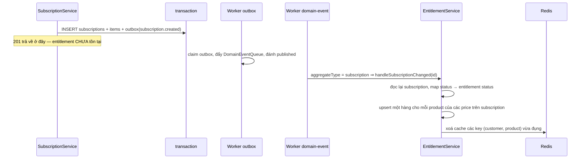

# Entitlement — tách quyền dùng khỏi trạng thái thanh toán

Câu hỏi mà mọi ứng dụng bán subscription phải trả lời hàng nghìn lần mỗi ngày là "khách này còn được
dùng tính năng kia không". Câu hỏi mà hệ tính tiền trả lời là "hợp đồng này đang ở trạng thái nào,
đã thu được tiền chưa". Hai câu nghe giống nhau nhưng không phải một, và `entitlements` là bảng giữ
câu trả lời cho câu thứ nhất để phía tiêu thụ không bao giờ phải tự suy ra từ câu thứ hai.

Code: [`entitlement.service.ts`](../../packages/core/src/services/entitlement.service.ts),
[`entitlement.repository.ts`](../../packages/core/src/repositories/entitlement.repository.ts),
[`entitlements.schema.ts`](../../packages/core/src/database/schemas/entitlements.schema.ts),
[`domain-event-dispatch.processor.ts`](../../apps/worker/src/workflows/processors/domain-event-dispatch.processor.ts).
Cơ chế từng bước ở [flow 04](../flows/04-subscription-entitlement.md); tài liệu này nói **vì sao** nó
tồn tại, mang ý nghĩa gì và dùng ra sao.

## Entitlement là gì

Một hàng `entitlements` là một mệnh đề: _khách `customer_id` được dùng sản phẩm `product_id`, ở
trạng thái `status`, cấp từ `granted_at`_. Không hơn.

Nó **không phải dữ liệu gốc** — mọi thông tin trong đó đều suy ra được từ `subscriptions` +
`subscription_items` + `prices`. Nó là một **projection**: một câu trả lời đã tính sẵn, ghi bởi
worker, tối ưu cho việc đọc. Đó cũng là lý do nó được phép trễ so với dữ liệu gốc — xem
[§ Ai ghi và khi nào](#ai-ghi-và-khi-nào).

## Vấn đề

Bỏ bảng này đi, mỗi lần app tiêu thụ cần gate một tính năng nó phải tự viết:

```sql
select p.product_id
  from subscriptions s
  join subscription_items i on i.subscription_id = s.id and i.deleted_at is null
  join prices p on p.id = i.price_id
 where s.customer_id = $1
   and s.status in (???)
```

Bốn bảng cho một câu hỏi thuộc hot path đã đủ tệ, nhưng chỗ hỏng thật là `???`. Nó **không** phải
`= 'active'`:

| `subscription.status` | → entitlement | vì sao                                                                            |
| --------------------- | ------------- | --------------------------------------------------------------------------------- |
| `incomplete`          | `blocked`     | chưa trả tiền lần đầu                                                             |
| `trialing`            | `active`      | đang dùng thử vẫn phải được dùng                                                  |
| `active`              | `active`      | —                                                                                 |
| `past_due`            | **`active`**  | trễ hạn lần đầu vẫn cho dùng — grace period thuộc về dunning, không phải về quyền |
| `unpaid`              | `blocked`     | dunning đã thất bại hết, chặn tạm                                                 |
| `canceled`            | `revoked`     | kết thúc hẳn                                                                      |

Bảng này khai báo ở
[`entitlement.service.ts:18-25`](../../packages/core/src/services/entitlement.service.ts) dưới dạng
`Record<SubscriptionStatus, EntitlementStatus>`, nên thêm một trạng thái subscription mà quên ánh xạ
là lỗi biên dịch.

Nếu không có bảng `entitlements`, **chính sách grace period sẽ nằm rải rác trong code của phía tiêu
thụ**, mỗi nơi đoán một kiểu `status in (...)`. Ngày đổi "past_due vẫn dùng được" thành "past_due
chặn sau 7 ngày", bạn phải đi tìm tất cả những nơi đó — và không có gì báo cho bạn biết đã tìm đủ
chưa.

## Bốn lý do cần một bảng riêng

| Lý do                       | Nội dung                                                                                                                                                                                                                                              |
| --------------------------- | ----------------------------------------------------------------------------------------------------------------------------------------------------------------------------------------------------------------------------------------------------- |
| Chính sách nằm một chỗ      | Ánh xạ trạng thái là một bảng duy nhất trong một file duy nhất. Phía tiêu thụ không cần biết `dunning`, `trial`, `proration` là gì                                                                                                                    |
| Hot path đọc được cache     | Khoá phẳng `(customer, product)` cache được trong Redis với TTL 300 giây và xoá đúng key khi đổi ([`entitlement.service.ts:115-129`](../../packages/core/src/services/entitlement.service.ts)). Một câu JOIN bốn bảng thì không biết khi nào phải xoá |
| Quyền không chỉ đến từ tiền | Admin cấp tay, đền bù sau sự cố, gói dùng thử không gắn subscription, mua lẻ một lần — tất cả chỉ cần ghi thêm hàng, không phải giả vờ tạo một hợp đồng                                                                                               |
| Có dấu vết                  | `granted_at` / `revoked_at` trả lời "mất quyền lúc nào". `subscriptions.status` chỉ nói _bây giờ_                                                                                                                                                     |

Đây là công thức của Kill Bill, ghi trong [RESEARCH §1.3](../RESEARCH.md): _"Subscription =
Entitlement + Billing Information"_. Người dùng có thể được cấp quyền **trước** khi bị tính tiền, và
có thể bị thu quyền ngay **trong khi** vẫn tiếp tục bị bill tới hết kỳ để tránh hoàn tiền proration.
Hai trục đó không đồng pha, nên không thể dùng chung một cột trạng thái. Bài học của Pleo trong cùng
tài liệu nói đúng một câu: phải tách billing engine khỏi entitlement engine.

## Mô hình dữ liệu

Bảng [`entitlements`](../../packages/core/src/database/schemas/entitlements.schema.ts), id mang
prefix `ent_`:

| Cột                         | Ý nghĩa                                                              |
| --------------------------- | -------------------------------------------------------------------- |
| `customer_id`, `product_id` | mệnh đề "khách này dùng được sản phẩm này"                           |
| `subscription_id`           | nguồn cấp quyền — hiện tại luôn là một subscription                  |
| `status`                    | `active` \| `blocked` \| `revoked`                                   |
| `granted_at`                | thời điểm cấp                                                        |
| `revoked_at`                | `null` khi còn quyền — một trạng thái thật, không phải giá trị thiếu |

Unique index đặt trên `(subscription_id, product_id)`
([`entitlements.schema.ts:34-37`](../../packages/core/src/database/schemas/entitlements.schema.ts)),
không phải trên `(customer_id, product_id)`. Nghĩa là **một khách có thể có hai hàng cho cùng một
product** nếu quyền đến từ hai subscription khác nhau — cố ý, vì huỷ một hợp đồng không được làm mất
quyền do hợp đồng kia cấp.

Ba trạng thái, và sự khác nhau giữa hai cái cuối là thứ phía tiêu thụ phải thể hiện khác nhau:

| `status`  | Nghĩa                                     | App nên làm gì                                        |
| --------- | ----------------------------------------- | ----------------------------------------------------- |
| `active`  | đang có quyền                             | mở tính năng                                          |
| `blocked` | **tạm** mất quyền, còn cứu được bằng tiền | giữ nguyên dữ liệu, hiện banner "cập nhật thanh toán" |
| `revoked` | đã kết thúc                               | chuyển về gói miễn phí, mời mua lại                   |

Gộp `blocked` và `revoked` làm một là mất khả năng phân biệt "khách đang gặp trục trặc thẻ" với
"khách đã rời đi" — hai nhóm cần hai cách đối xử hoàn toàn khác.

## Ai ghi và khi nào

Không bao giờ là request.



Điểm rẽ nằm ở
[`domain-event-dispatch.processor.ts:21-30`](../../apps/worker/src/workflows/processors/domain-event-dispatch.processor.ts):
mọi event có `aggregateType = subscription` — `created`, `updated`, `canceled`, `trial_ended`,
`renewed` — đều gọi cùng một hàm. `handleSubscriptionChanged`
([`entitlement.service.ts:30-73`](../../packages/core/src/services/entitlement.service.ts)) không
quan tâm event nào; nó đọc lại trạng thái hiện tại và đồng bộ. Nhờ vậy handler **idempotent**: chạy
lại hai lần cho cùng một event ra cùng kết quả, đúng yêu cầu của một persistent bus có thể giao trùng.

Hàm rẽ hai nhánh:

| Trạng thái ánh xạ được | Việc làm                                                                                                                                                                                         |
| ---------------------- | ------------------------------------------------------------------------------------------------------------------------------------------------------------------------------------------------ |
| `revoked`              | `revokeEntitlements(subscriptionId, …)` — một câu UPDATE cho **mọi** hàng của subscription ([`entitlement.repository.ts:71-83`](../../packages/core/src/repositories/entitlement.repository.ts)) |
| `active` / `blocked`   | upsert từng product của các price hiện có, `onConflictDoUpdate` theo unique index ([`entitlement.repository.ts:50-69`](../../packages/core/src/repositories/entitlement.repository.ts))          |

Cái giá của thiết kế này là **eventual consistency**: giữa lúc API trả 201 và lúc hàng entitlement
xuất hiện có một khoảng trễ bằng `OUTBOX_RELAY_INTERVAL_MS` (mặc định 5000ms) cộng thời gian xử lý.
Luồng đăng ký của app tiêu thụ phải chịu được khoảng đó.

Đổi lại: mọi biến động — trial hết hạn, thanh toán fail, dunning, huỷ, tua test clock — đều chảy qua
một hàm duy nhất, và không service nào cần join từ subscription sang entitlement.

## Hai đường đọc

| Đường                                         | Trả về                       | Cache                   | Ai gọi                          |
| --------------------------------------------- | ---------------------------- | ----------------------- | ------------------------------- |
| `GET /v1/entitlements?customerId=&productId=` | danh sách, phân trang        | **không**, đọc thẳng DB | admin-ui và mọi client hiện nay |
| `getEntitlementStatus(customerId, productId)` | đúng một `EntitlementStatus` | Redis, TTL 300s         | **chưa route nào gọi**          |

`getEntitlementStatus`
([`entitlement.service.ts:76-97`](../../packages/core/src/services/entitlement.service.ts)) là hàm
đúng cho hot path: một khách, một product, có cache, không tìm thấy hàng `active` thì trả `revoked`
và cache luôn kết quả phủ định. Nhưng route duy nhất của module là `GET /` dạng list
([`entitlements.routes.ts`](../../apps/api/src/routes/v1/entitlements/entitlements.routes.ts)), nên
toàn bộ lớp cache hiện nằm im — xem [§ Giới hạn phải biết](#giới-hạn-phải-biết).

## Cách dùng

Phía tiêu thụ đọc entitlement, map `product_id` sang gói của mình, rồi quyết định:

```ts
// CORRECT — hỏi quyền, không hỏi hợp đồng
const entitlements = await getEntitlements({ customerId });
const entitlement = _.find(entitlements.data, { productId: PREMIUM_PRODUCT_ID });

if (entitlement?.status === EntitlementStatusEnum.ACTIVE) {
  return renderPremium();
}

// WRONG — suy quyền từ trạng thái thanh toán: past_due sẽ bị chặn oan,
// và chính sách grace period vừa bị sao chép thêm một bản
const subscription = await getSubscription(subscriptionId);

if (subscription.status === 'active') {
  return renderPremium();
}
```

Ba quy ước đi kèm:

- **Gói loại trừ nhau thì mỗi gói là một product.** Entitlement khoá theo product, nên ba gói nằm
  chung một product sẽ cho ra ba khách không phân biệt được. Chi tiết ở
  [flow 03](../flows/03-catalog-and-customer.md).
- **Đừng cache lại ở phía app lâu hơn ở đây.** Nguồn đã có TTL 300s và invalidate đúng key; chồng
  thêm một tầng cache dài hơn là tự tạo ra trạng thái không ai xoá được.
- **Xử `blocked` khác `revoked`.** Xem bảng ở [§ Mô hình dữ liệu](#mô-hình-dữ-liệu).

## Step by step — cấp quyền rồi thu hồi

Chạy được trên môi trường dev đã `pnpm docker:up`, `pnpm db:migrate` và `pnpm dev`.

```bash
set -a && . ./.env && set +a
API=http://localhost:3000
AUTH="Authorization: Bearer $SECRET_API_KEY"
JSON='content-type: application/json'
```

**Bước 1 — Khách, sản phẩm, bảng giá.** Price phải `recurring` và cùng currency với khách, nếu
không `POST /v1/subscriptions` trả 400:

```bash
CUS=$(curl -s -X POST $API/v1/customers -H "$AUTH" -H "$JSON" \
  -H "Idempotency-Key: $(uuidgen)" \
  -d '{"email":"ent@congty.vn","name":"Khach entitlement","currency":"vnd"}' | jq -r '.id')

PROD=$(curl -s -X POST $API/v1/products -H "$AUTH" -H "$JSON" \
  -H "Idempotency-Key: $(uuidgen)" \
  -d '{"name":"Goi Premium","metadata":{"tier":"premium"}}' | jq -r '.id')

PRICE=$(curl -s -X POST $API/v1/prices -H "$AUTH" -H "$JSON" \
  -H "Idempotency-Key: $(uuidgen)" \
  -d "{\"productId\":\"$PROD\",\"lookupKey\":\"premium_monthly_ent\",\"currency\":\"vnd\",
       \"unitAmount\":799000,\"billingScheme\":\"per_unit\",
       \"recurring\":{\"interval\":\"month\",\"intervalCount\":1,\"usageType\":\"licensed\"}}" \
  | jq -r '.id')
```

**Bước 2 — Đăng ký, rồi đọc quyền ngay lập tức.**

```bash
SUB=$(curl -s -X POST $API/v1/subscriptions -H "$AUTH" -H "$JSON" \
  -H "Idempotency-Key: $(uuidgen)" \
  -d "{\"customerId\":\"$CUS\",\"items\":[{\"priceId\":\"$PRICE\"}]}" | jq -r '.id')

curl -s "$API/v1/entitlements?customerId=$CUS" -H "$AUTH" | jq '.data'
```

Mong đợi: `[]`. **Đây là bằng chứng quan trọng nhất của cả bài** — subscription đã `active` nhưng
quyền chưa tồn tại, vì nó thuộc về worker chứ không thuộc về request.

**Bước 3 — Kích relay thay vì ngồi chờ scheduler.**

```bash
curl -s -X POST $API/api/v1/management/outbox/relay \
  -H "Authorization: Bearer $MANAGEMENT_API_KEY" | jq

curl -s "$API/v1/entitlements?customerId=$CUS" -H "$AUTH" \
  | jq '.data[] | {productId, status, grantedAt, revokedAt}'
```

Mong đợi: một hàng `status: "active"`, `revokedAt: null`.

**Bước 4 — Huỷ ngay, không huỷ cuối kỳ.**

```bash
curl -s -X DELETE $API/v1/subscriptions/$SUB -H "$AUTH" -H "$JSON" \
  -H "Idempotency-Key: $(uuidgen)" -d '{}' | jq '{status, canceledAt, endedAt}'

curl -s -X POST $API/api/v1/management/outbox/relay \
  -H "Authorization: Bearer $MANAGEMENT_API_KEY" | jq

curl -s "$API/v1/entitlements?customerId=$CUS" -H "$AUTH" \
  | jq '.data[] | {productId, status, revokedAt}'
```

Mong đợi: subscription `canceled`, và sau relay thì entitlement `revoked` với `revokedAt` có giá
trị. Gửi `{"cancelAtPeriodEnd": true}` thay vì `{}` sẽ cho thấy nửa còn lại của công thức Kill Bill:
subscription vẫn `active`, entitlement vẫn `active`, và chỉ mất quyền khi kỳ thực sự đóng.

### Mốc thời gian

| Sau bước | `subscriptions.status` | Hàng `entitlements`         | Vì sao                              |
| -------- | ---------------------- | --------------------------- | ----------------------------------- |
| 2        | `active`               | **chưa có**                 | outbox còn `pending`                |
| 3        | `active`               | `active`, `revoked_at` null | worker domain-event đã chạy         |
| 4        | `canceled`             | `revoked`, `revoked_at` có  | nhánh revoke, một UPDATE cho cả sub |

### Kiểm chứng bằng SQL

Ba mốc của chuỗi bất đồng bộ trong một câu:

```bash
docker compose -f docker/compose.yml exec -T postgres psql -U pinstripe -d pinstripe -c \
"select event_type, status, occurred_at, published_at from outbox_events
 where aggregate_type = 'subscription' order by occurred_at desc limit 5"
```

Quyền và hợp đồng cạnh nhau — hai cột trạng thái, hai ý nghĩa:

```bash
docker compose -f docker/compose.yml exec -T postgres psql -U pinstripe -d pinstripe -c \
"select e.product_id, e.status as entitlement, s.status as subscription, e.granted_at, e.revoked_at
 from entitlements e join subscriptions s on s.id = e.subscription_id
 order by e.created_at desc limit 5"
```

## Giới hạn phải biết

- **Bỏ một sản phẩm khỏi subscription không thu hồi quyền của nó.** `handleSubscriptionChanged` chỉ
  upsert theo các price **hiện tại**; nhánh revoke chỉ chạy khi cả subscription mất quyền
  ([`entitlement.service.ts:40-50`](../../packages/core/src/services/entitlement.service.ts)). Mà
  `replaceSubscriptionItems` thay trọn bộ item, nên nâng gói Starter → Premium để lại một hàng
  Starter `active` mồ côi. Với mô hình các gói loại trừ nhau, đây là lỗ hổng thật —
  [PITFALLS §6](../PITFALLS.md).
- **Lớp cache đang nằm im.** `getEntitlementStatus` có cache nhưng không route nào gọi; mọi lần gate
  hiện nay đi qua `GET /v1/entitlements` đọc thẳng DB. Hai đường còn có thể trả lời khác nhau trong
  vòng 300 giây sau một lần ghi nếu về sau có route dùng cache — [PITFALLS §8](../PITFALLS.md).
- **`blocked` gần như chưa xuất hiện.** Nó chỉ đến từ `incomplete` và `unpaid`, mà hiện chưa có
  đường nào đẩy subscription tới `unpaid`. Đừng kết luận "hệ thống không bao giờ block" từ dữ liệu
  dev.
- **Quyền luôn chậm hơn một nhịp.** Ghi bởi worker, không bao giờ trong request. Test hay UI assert
  ngay sau khi tạo subscription sẽ đọc phải trạng thái rỗng — [PITFALLS §10.5](../PITFALLS.md).

## Điều kiện phải giữ

- **Không suy quyền từ `subscriptions.status`** ở bất kỳ đâu ngoài
  `ENTITLEMENT_BY_SUBSCRIPTION_STATUS`. Một chỗ khác làm việc đó là một bản sao của chính sách grace
  period, và nó sẽ lệch.
- **Đổi chính sách thì đổi bảng ánh xạ**, không đổi điều kiện ở nơi tiêu thụ.
- **Mọi đường ghi entitlement phải `invalidateCache`.** Ghi mà không xoá key là cấp quyền xong khách
  vẫn bị chặn tới 5 phút, và không có gì báo lỗi.
- **Nguồn cấp quyền mới phải ghi vào bảng này**, không tạo bảng quyền thứ hai — nếu không, câu hỏi
  "khách này được dùng gì" lại có hai câu trả lời.
- **Phía tiêu thụ phải chịu được độ trễ.** Thiết kế luồng đăng ký quanh việc quyền đến sau, không
  quanh việc nó đến ngay.

## Đọc tiếp

- [flow 04 — Subscription và entitlement](../flows/04-subscription-entitlement.md) — máy trạng thái, từng dòng code, cache
- [flow 02 — Event pipeline](../flows/02-event-pipeline.md) — vì sao phải qua outbox thay vì ghi thẳng
- [UC-02 — Đăng ký một khách vào plan](../usecases/02-subscribe-to-plan.md) — kịch bản đầy đủ trên admin-ui
- [ADR 0005](../adr/0005-phase-3-subscription-entitlement.md) — quyết định gốc: đồng bộ qua event, không join
- [PITFALLS §6, §8](../PITFALLS.md) — entitlement mồ côi và độ trễ một nhịp
