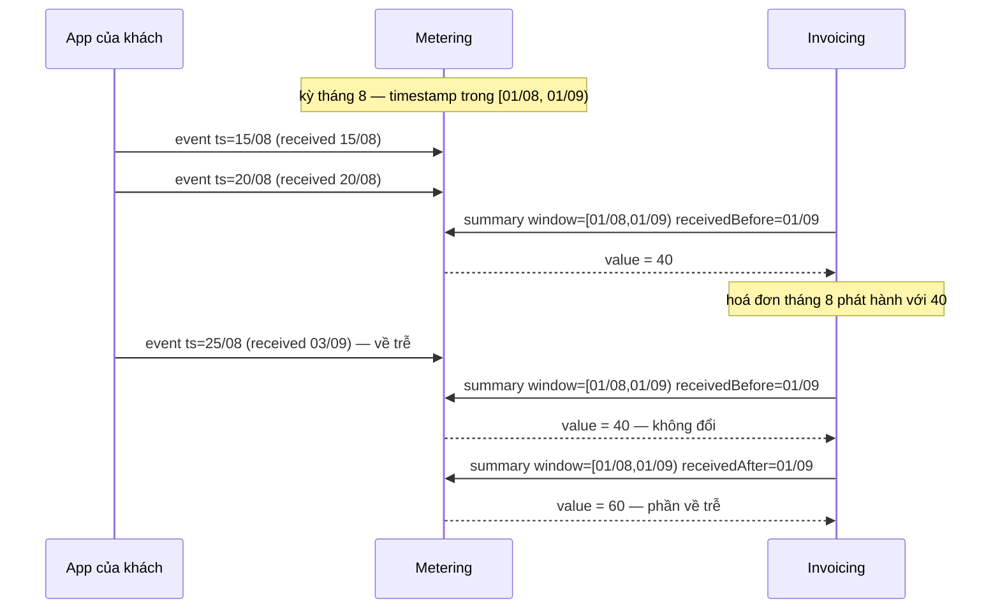
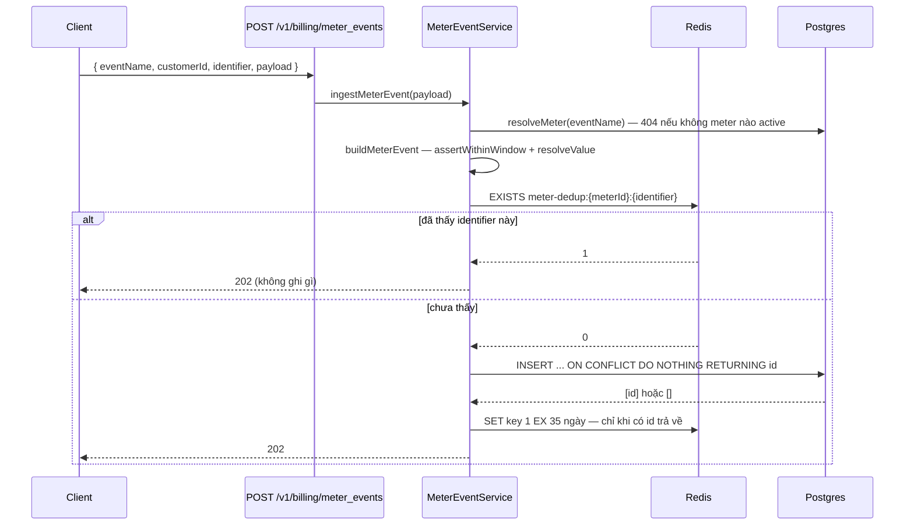
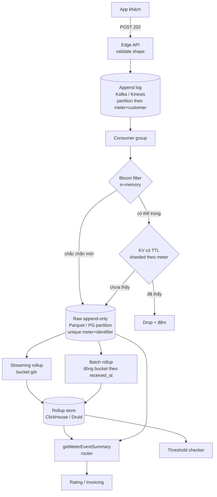

# Metering — đo cái khách dùng, trước khi biết nó đáng bao nhiêu tiền

Một subscription "500.000đ mỗi tháng" tự nói được giá của nó: tới ngày chốt kỳ, số tiền đã nằm sẵn
trong hợp đồng. Một dòng "1.000đ cho mỗi 1.000 token" thì không. Số tiền của nó chỉ tồn tại sau khi
cộng hàng trăm nghìn việc đã xảy ra rải rác suốt ba mươi ngày — và mỗi việc trong số đó đến từ một
request HTTP có thể bị retry, có thể về trễ, có thể về hai lần.

Metering là tầng giữ lại những việc đó. Nó không tính tiền; nó trả lời đúng một câu — **khách này đã
dùng bao nhiêu, trong cửa sổ nào** — theo cách mà hỏi lại lần thứ hai vẫn ra đúng con số cũ. Rating
(phase 5) mới là chỗ biến con số đó thành tiền.

Code:
[`meters.schema.ts`](../../packages/modules/billing/src/database/schemas/meters.schema.ts),
[`meter-events.schema.ts`](../../packages/modules/billing/src/database/schemas/meter-events.schema.ts),
[`meter.service.ts`](../../packages/modules/billing/src/services/meter.service.ts),
[`meter-event.service.ts`](../../packages/modules/billing/src/services/meter-event.service.ts),
[`meter-event.repository.ts`](../../packages/modules/billing/src/repositories/meter-event.repository.ts),
[`meters.types.ts`](../../packages/modules/billing/src/contracts/meters.types.ts),
migration [`0000_baseline.sql`](../../packages/modules/billing/migrations/0000_baseline.sql),
[`0001_triggers_view_seed.sql`](../../packages/modules/billing/migrations/0001_triggers_view_seed.sql),
[`0000_baseline.sql`](../../packages/modules/billing/migrations/0000_baseline.sql).

Quyết định và các phương án bị loại nằm ở [ADR 0007](../adr/0007-phase-4-metering.md); đường đi của
một request ở [flow 05](../flows/05-metering-and-rating.md); cách bấm thử ở
[UC-03](../usecases/03-record-usage.md). Tài liệu này nói **hai khái niệm là gì, sinh ra để giải
quyết gì, bản hiện tại hỏng ở đâu, và ở quy mô lớn thì thay bằng cái gì**.

## Meter và meter event là hai thứ khác nhau

Đây là chỗ hay bị gộp lại, và gộp lại thì không hiểu được phần còn lại của hệ.

|                | `meters`                                           | `meter_events`                             |
| -------------- | -------------------------------------------------- | ------------------------------------------ |
| Là gì          | **định nghĩa** của một phép đo                     | **một lần** việc được đo đã xảy ra         |
| Ví dụ          | "đếm tổng `tokens` của event `llm.usage`"          | "khách `cus_A` dùng 500 token lúc 14:03"   |
| Vòng đời       | mutable — có `updated_at`, có `deleted_at`         | append-only — DB **chặn** UPDATE/DELETE    |
| Số lượng       | vài chục, do người vận hành tạo                    | vài triệu tới vài tỷ, do app của khách bắn |
| Khoá nghiệp vụ | `event_name` unique (khi `deleted_at is null`)     | `(meter_id, identifier)` unique            |
| Ai đọc         | `resolveMeter` lúc ingest, `PriceForm` lúc gắn giá | `aggregateMeterEventTotals` lúc tổng hợp   |

Nói gọn: **meter là schema, meter event là data.**

Tách ra vì hai lý do cụ thể, không phải vì sạch sẽ:

1. **Ingest phải resolve được cách tính ngay tại lúc nhận.** Một event chỉ mang `eventName` và một
   `payload` tự do. `meters` là chỗ nói `eventName` đó cộng theo kiểu gì (`aggregation`) và đọc số ở
   khoá nào (`value_key`) — [`resolveValue`](../../packages/modules/billing/src/services/meter-event.service.ts).
   Không có bảng định nghĩa thì mỗi consumer tự đoán, và hai consumer sẽ đoán khác nhau.
2. **Price trỏ vào meter, không trỏ vào một cách cộng.** Migration `0009` thêm `prices.meter_id` kèm
   ràng buộc:

   ```sql
   ALTER TABLE "prices" ADD CONSTRAINT "prices_metered_shape"
     CHECK (coalesce(usage_type = 'metered', false) = (meter_id is not null));
   ```

   Một price `metered` **buộc phải** có meter, và một price không metered **buộc phải không** có. Nhờ
   vậy `rating.service` không bao giờ phải đoán lượng dùng ở đâu ra.

`meters.aggregation` có bốn giá trị
([`MeterAggregationEnum`](../../packages/modules/billing/src/contracts/meters.types.ts)) và chúng dịch trực tiếp
sang SQL — xem [§ Tổng hợp tính lúc đọc](#tổng-hợp-tính-lúc-đọc). `meter_events` **không có** cột
trạng thái: một event không có vòng đời, nó chỉ có hoặc không có.

## Sinh ra để giải quyết vấn đề gì

Bốn vấn đề. Không có tầng metering thì cả bốn đều rơi xuống hoá đơn của khách.

| Vấn đề                       | Nếu không có gì đỡ                                             | Cơ chế trong repo                                             |
| ---------------------------- | -------------------------------------------------------------- | ------------------------------------------------------------- |
| Client retry một request     | một lần retry mạng = một lần tính tiền thêm                    | `identifier` + unique `(meter_id, identifier)` + bộ lọc Redis |
| Event về trễ, về lệch thứ tự | con số của kỳ **đã phát hành hoá đơn** tự đổi sau lưng kế toán | hai trục thời gian `timestamp` / `received_at`                |
| Cộng sai mà không phát hiện  | một counter cộng dồn không có gì để đối chiếu lại              | raw append-only, tổng hợp tính lúc đọc                        |
| Đổi giá cho lịch sử          | không repricing được — dữ liệu gốc đã bị cộng mất              | raw còn nguyên, rating đọc lại được bất kỳ lúc nào            |

Hai dòng đầu là chuyện **không tính sai**. Hai dòng sau là chuyện **chứng minh được là không tính
sai** — và đó là lý do ADR 0007 §1 từ chối counter cộng sẵn: một con số sống song song với raw thì
sớm muộn cũng lệch, và lúc lệch thì không ai biết bên nào đúng.

## Hai trục thời gian — chỗ quan trọng nhất của thiết kế

Mỗi event mang hai mốc:

- **`timestamp`** — lúc việc xảy ra, do client khai. Đây là trục quyết định event thuộc **kỳ nào**.
- **`received_at`** — lúc hệ thống biết, do `clock.now()` đặt. Đây là **watermark**.

Tổng hợp lọc cửa sổ theo `timestamp` (`[windowStart, windowEnd)`), và nhận thêm hai tham số tuỳ ý
trên trục thứ hai — `receivedBefore`, `receivedAfter`. Hai tham số đó là toàn bộ cách hệ này xử lý
event về trễ:



Hai lời hứa đọc ra từ sơ đồ:

- **Kỳ đã chốt hỏi kèm `receivedBefore = thời điểm chốt` thì con số không bao giờ đổi**, bất kể sau
  đó có bao nhiêu event về trễ. Hoá đơn đã phát hành vẫn tái tạo lại được nguyên vẹn.
- **Kỳ sau hỏi kèm `receivedAfter = thời điểm chốt kỳ trước` thì nhận đúng phần còn thiếu**, không
  trùng không thiếu.

**Hệ quả kế toán phải nói trước với team tài chính:** usage về sau khi hoá đơn đã phát hành **không
sửa hoá đơn cũ**. Nó thành một dòng bù ở kỳ kế tiếp. Đây là quyết định của ADR 0007 §4, không phải
giới hạn kỹ thuật — sửa hoá đơn đã phát hành là việc của credit note, không phải của metering.

Và cửa sổ dedup là một **ràng buộc**, không phải tham số tinh chỉnh. Event có `timestamp` cũ hơn
`METER_DEDUP_WINDOW_DAYS` ([`env.schema.ts:57`](../../packages/platform/src/config/env.schema.ts), mặc
định `35`) bị từ chối `400`:
quá cửa sổ thì hệ thống không còn khẳng định được event đó đã nhận hay chưa, và âm thầm nhận là cách
tính trùng tiền của khách.

## Đường đi của một event



Hai chi tiết đáng nhớ trong sơ đồ này:

- **Thứ tự DB-trước-Redis là có chủ đích, không phải tình cờ.** Nếu claim Redis trước rồi mới ghi DB,
  một lần crash giữa hai bước sẽ khoá `identifier` đó suốt 35 ngày và event **mất hẳn**. Với thứ tự
  hiện tại, crash chỉ làm mất bộ lọc nhanh — lần sau event vẫn tới DB, và unique index vẫn nhận diện
  đúng. **DB là nguồn sự thật, Redis chỉ là bộ lọc** (ADR 0007 §2).
- **`ON CONFLICT DO NOTHING RETURNING id` làm luôn việc đếm.** Số id trả về **chính là** số event
  được nhận, nên không cần một câu đếm thứ hai và không có khoảng hở giữa hai câu lệnh.

Đường batch — `POST /v1/billing/meter_event_batches`, tối đa **1000** event mỗi lần
([`meters.types.ts:92`](../../packages/modules/billing/src/contracts/meters.types.ts)) — là đúng cùng logic gộp
lại: một `MGET` cho cả lô, **một** `INSERT` cho phần chưa biết, một Redis pipeline cho phần đã ghi
được. Trả về `{ accepted, duplicates }` để caller tự đối soát.

Cả hai route trả `202`, không phải `201`: nhận và ghi xong thì trả ngay, tổng hợp là việc của lúc
đọc. Meter event cũng là use case **duy nhất** trong hệ không đi qua outbox — không phát domain
event cho từng lần dùng, vì một sự kiện mỗi token là một cái ống không ai tiêu thụ nổi.

## Tổng hợp tính lúc đọc

Không có bảng summary, không có counter, không có job nền. `aggregateMeterEventTotals` dịch
`meters.aggregation` thành một biểu thức SQL —
[`meter-event.repository.ts:25-30`](../../packages/modules/billing/src/repositories/meter-event.repository.ts):

```ts
const VALUE_EXPRESSIONS: Record<MeterAggregation, SQL<number>> = {
  [MeterAggregationEnum.SUM]: sql<number>`coalesce(sum(${meterEvents.value}), 0)`,
  [MeterAggregationEnum.COUNT]: sql<number>`count(*)`,
  [MeterAggregationEnum.MAX]: sql<number>`coalesce(max(${meterEvents.value}), 0)`,
  [MeterAggregationEnum.UNIQUE_COUNT]: sql<number>`count(distinct ${meterEvents.value})`,
};
```

`count` bỏ qua `value_key` hoàn toàn (`resolveValue` trả `1`). Ba aggregation còn lại đọc
`payload[valueKey]`; thiếu khoá đó thì `400` kèm tên khoá trong message, **không âm thầm tính 0**.

Đường từ con số vào tiền đi qua rating
([`rating.service.ts`](../../packages/modules/billing/src/services/rating.service.ts)):

```
getMeterEventSummary(meterId, { customerId, windowStart, windowEnd })
  → summary.value
  → quantity của một RatingLine type USAGE
  → invoice_line_items
```

Một chi tiết dễ bỏ sót ở `buildLine`: dòng metered đặt `usageStart` / `usageEnd` = `null`, nên
`resolveProrationFactor` trả `1` và dòng đó **không bị nhân hệ số proration**. Lý do: cửa sổ đo đã
hẹp đúng bằng lát hợp đồng rồi — nhân thêm lần nữa là cắt hai lần. Xem
[technique 06 § Điều kiện phải giữ](./06-proration.md).

Đọc trực tiếp qua HTTP: `GET /v1/billing/meters/:meterId/event_summaries` với `customerId`,
`windowStart`, `windowEnd` bắt buộc, `receivedBefore` / `receivedAfter` tuỳ ý.

## Chín giới hạn của bản hiện tại

Bản này là demo-level một cách có chủ đích — ADR 0007 § "Không làm trong phase này" từ chối
aggregation job và nói rõ "dựng khi phép đo nói cần". Nhưng "có chủ đích" không có nghĩa là an toàn,
nên đây là danh sách cái gì hỏng và hỏng ra sao.

1. **`202` là cosmetic.** Trước khi response ra khỏi tiến trình, `ingestMeterEvent` đã làm xong 1
   `SELECT` (`resolveMeter`), 1 Redis `EXISTS`, 1 `INSERT`, 1 Redis `SET`. Không queue, không buffer,
   không backpressure, không rate limit ở bất kỳ đâu. Một khách bắn nhanh hơn Postgres ghi được thì
   nhận timeout, không nhận `429`.
2. **Tổng hợp quét raw không giới hạn.** Mỗi `event_summaries` và mỗi lần rating đều scan
   `meter_events` cho cả cửa sổ. Benchmark duy nhất từng chạy là 100.000 event của **một** customer
   trên **một** meter (ADR 0007 § Kiểm chứng). Không có số nào cho một bảng vài trăm triệu hàng, và
   `meter_events_meter_id_customer_id_timestamp_idx` không cứu được một `SUM` phải đọc hết partition.
3. **`resolveMeter` dùng một list query để lấy một hàng.** `findMeters({ eventName, status }, 1)`
   trên hot path, không cache, dù định nghĩa meter gần như bất biến. Đường batch còn tệ hơn: một
   query riêng cho **mỗi** `eventName` riêng biệt, qua `Promise.all`.
4. **Thiếu `identifier` thì dedup im lặng tắt.** `identifier: payload.identifier ?? generateGid(...)`
   — client không gửi thì mỗi request tự sinh một khoá mới, nên một lần retry mạng thành một lần tính
   tiền thêm. Và chính admin UI là client đó
   ([`MetersPage.tsx:107-111`](../../apps/erp-ui/src/pages/MetersPage.tsx) gọi `createMeterEvent`
   không kèm `identifier`), nên bấm "bắn event" mười lần ra mười hàng.
5. **Response của bản trùng được dựng từ bộ nhớ, không đọc lại hàng đã lưu.** Cả nhánh Redis-hit lẫn
   nhánh `ON CONFLICT` đều `return MeterEventService.buildMeterEvent(event)` với `event` là candidate
   vừa dựng. Client nhận về một `mtrevt_...` **không tồn tại trong DB**, kèm `value` và `timestamp`
   mới chứ không phải của bản đã ghi.
6. **Ingest lẻ không bao giờ báo trùng.** Không cờ, không `409`, không phân biệt được với một lần ghi
   thật. Batch thì có `duplicates`, nhưng con số đó gộp ba nguyên nhân khác nhau: Redis nói đã biết,
   unique index từ chối, và trùng trong chính lô vừa gửi.
7. **Redis không có đường degradation.** `isIdentifierKnown` / `rejectKnownEvents` /
   `rememberIdentifiers` đều không bọc lỗi, nên một lần Redis chết là ingest chết — dù unique index
   một mình đã đủ để dedup đúng. Đây là chỗ mà "Redis chỉ là bộ lọc" đúng trên giấy nhưng sai trong
   code.
8. **`unique_count` đếm distinct trên `value`**, không phải trên một chiều nào của payload. Nên
   "unique users trong kỳ" **không đo được** bằng meter. `aggregateUsage`
   (`sum` / `last_during_period` / `last_ever` / `max`) hoãn sang
   [ROADMAP-V2 phase 22](../ROADMAP-V2.md).
9. **`meters.deleted_at` là cột chết.** Cột và partial unique index đều có, nhưng không service nào
   ghi vào nó — nên một `event_name` đã dùng thì không bao giờ trả lại được.

Ba chỗ nữa nằm ngoài code metering nhưng chạm vào cùng số liệu:

- **Price metered không vào MRR.** Báo cáo chỉ quy đổi `per_unit`; tiered và metered đóng góp `0`
  ([flow 11](../flows/11-reporting-reconciliation.md)).
- **Metering không theo test clock.** `received_at` lấy từ `clock.now()` toàn cục, nên muốn dựng một
  kỳ trong quá khứ phải truyền `timestamp` tường minh —
  [PITFALLS § 10](../PITFALLS.md#10-lưu-ý-khi-test).
- **Route HTTP có 0 test, ingest có đúng 1 test** dù là hot path —
  [PITFALLS § 10.7](../PITFALLS.md#107-lỗ-hổng-coverage).

## Kiến trúc ở large scale

Phần này là đề xuất, chưa phải phase đã chốt. Nguyên tắc xuyên suốt: **hợp đồng bên ngoài không đổi**
— `event_name`, `identifier`, hai trục thời gian, `202`, và signature của `getMeterEventSummary` giữ
nguyên. Chỉ ruột đổi. Đó chính là lời hứa ADR 0007 §1 đã đặt trước: "consumer không phải đổi vì đã đi
qua `getMeterEventSummary`".

### Ba mốc, và cái gì vỡ trước

| Mốc             | Bản hiện tại chịu được?    | Cái vỡ trước                                                     | Thay bằng                                     |
| --------------- | -------------------------- | ---------------------------------------------------------------- | --------------------------------------------- |
| ~10k event/ngày | Có, thoải mái              | không gì                                                         | không cần đổi                                 |
| ~10M event/ngày | Không                      | `SUM` lúc đọc; Redis đơn giữ 35 ngày identifier; ingest đồng bộ  | partition + rollup; Redis Cluster; tách queue |
| ~1B event/ngày  | Không, kể cả sau bước trên | Postgres là storage; dedup theo hàng; một tiến trình cộng tất cả | log + object store + OLAP; dedup theo tầng    |

Phép tính để con số có nghĩa. Một hàng `meter_events` chiếm cỡ **150–200 byte** (hai text id ~30 byte
mỗi cái, `double`, hai `timestamptz`, jsonb rỗng, cộng tuple header 24 byte) và ba index thêm cỡ
**100 byte** nữa:

```
10M event/ngày × 300 byte      ≈ 3 GB/ngày  ≈ 90 GB/tháng
1B  event/ngày × 300 byte      ≈ 300 GB/ngày ≈ 9 TB/tháng
```

Giữ 35 ngày dedup + lịch sử để repricing nghĩa là 90 GB đã là **bảng nóng nhỏ nhất** ở mốc giữa. Với
`SUM` trên một kỳ của một customer, Postgres phải đọc mọi hàng khớp `(meter_id, customer_id)` trong
cửa sổ — index chỉ giảm số hàng, không giảm số lần đọc heap. Ở 1.000 khách × 1.000 event/khách/ngày
× 30 ngày, một hoá đơn là 30M hàng phải quét. Đó là lúc rollup hết là tối ưu hoá và thành điều kiện.

### Sáu tầng



**1. Ingest — nhận rồi mới xử lý.** API chỉ validate hình dạng rồi append vào log; `202` trở thành
đúng nghĩa. Partition key là `(meter_id, customer_id)`, không phải random: mọi event thuộc cùng một
chuỗi tính tiền phải đi qua cùng một partition để giữ thứ tự và để consumer cộng được cục bộ. Đánh
đổi: dedup không còn đồng bộ với response, nên client không còn được biết ngay là mình gửi trùng —
đó là lý do phải có tầng 2.

**2. Dedup theo tầng.** Ba lớp, mỗi lớp chặn cái mà lớp sau không cần thấy:

| Lớp                           | Chặn gì                    | Sai thế nào thì vẫn đúng                                                         |
| ----------------------------- | -------------------------- | -------------------------------------------------------------------------------- |
| Bloom/cuckoo trong consumer   | ~99% trùng gần             | false-positive **phải đi tiếp**, không được loại — bloom chỉ nói "chắc chắn mới" |
| KV có TTL, shard theo `meter` | phần còn lại trong 35 ngày | mất KV chỉ mất tốc độ, không mất tính đúng                                       |
| Unique key trong raw storage  | tất cả                     | đây là nguồn sự thật cuối, không được bỏ                                         |

Thứ tự "DB trước, bộ lọc sau" của ADR 0007 §2 giữ nguyên ở lớp 2 và 3: chỉ ghi KV **sau khi** raw
nhận thành công. Và cửa sổ 35 ngày là cái quyết định dung lượng lớp 2 — ở 1B event/ngày, 35 ngày
identifier là 35 tỷ khoá, nên đây là lúc cửa sổ trở thành một con số tiền thật, không phải một hằng
số trong `env.schema.ts`.

**3. Storage — hai lớp, một sự thật.** Raw append-only là **nguồn sự thật duy nhất**: object store
dạng Parquet phân vùng theo `meter_id` / ngày `received_at`, hoặc Postgres partition theo
`received_at` nếu chưa muốn rời khỏi một database. Rollup là bản đọc nhanh, và điều kiện sống của nó
là **luôn dựng lại được từ raw**. Đây là cách materialize câu aggregate mà không phá lời hứa của ADR
0007 §1: một con số sống song song với raw chỉ chấp nhận được khi nó là **hàm** của raw, có thể xoá
và tính lại bất kỳ lúc nào.

Phân vùng theo `received_at` chứ không theo `timestamp` — vì `received_at` là trục **chỉ tăng**, nên
partition cũ không bao giờ phải mở ra ghi thêm.

**4. Rollup — streaming và batch, và batch là bên chịu trách nhiệm.** Hai đường cùng ghi vào một
rollup store:

- **Streaming** cộng dồn theo `(meter_id, customer_id, bucket giờ)` ngay khi event tới. Phục vụ
  preview, dashboard, threshold. Có thể sai trong vài giây.
- **Batch** chạy lại theo `received_at` để **đóng** bucket, và đó là con số được phép lên hoá đơn.

Watermark vẫn là `received_at` — đúng trục mà bản hiện tại đã chọn, nên không có gì phải dịch. Một
bucket đã đóng **chỉ được sửa bằng một bucket bù**, không sửa tại chỗ: hoá đơn đã trích số từ nó, và
sửa tại chỗ là làm một hoá đơn đã phát hành không tái tạo lại được. Backfill một khoảng lịch sử vì
thế là "tính lại rollup cho khoảng đó rồi ghi ra một thế hệ mới", không phải `UPDATE`.

**5. Serve — `getMeterEventSummary` thành router.** Signature không đổi, thân hàm rẽ ba:

| Câu hỏi                                      | Đọc từ đâu                       |
| -------------------------------------------- | -------------------------------- |
| Cửa sổ đã đóng, không có tham số `received*` | rollup, một hàng                 |
| Cửa sổ đang mở                               | rollup đã đóng + delta streaming |
| Có `receivedBefore` / `receivedAfter` tuỳ ý  | raw — chậm, đúng, và hiếm        |

Nhánh thứ ba là lý do raw không bao giờ bỏ được: đối soát một kỳ đã chốt là một câu hỏi theo watermark
bất kỳ, và rollup chỉ có các mốc nó đã chọn trước.

**6. Threshold và near-real-time.** [Phase 21](../ROADMAP-V2.md) cần `billingThresholds` theo usage,
và hook kiểm ngưỡng đọc rollup streaming. Nghĩa là nó **eventually-consistent**: có một độ trễ giữa
lúc khách vượt ngưỡng và lúc hệ thống biết. Độ trễ đó phải được công bố thành một con số trong hợp
đồng trước khi bán, không phải phát hiện ra lúc khách hỏi.

### Cái gì đổi, cái gì giữ

| Giữ nguyên                                          | Đổi                                        |
| --------------------------------------------------- | ------------------------------------------ |
| `event_name` → một meter                            | `resolveMeter` đọc cache thay vì query     |
| `identifier` là khoá chống trùng                    | chống trùng chuyển sang ba tầng            |
| `timestamp` / `received_at`, `receivedBefore/After` | nơi lưu và nơi cộng                        |
| `202` trên cả hai route ingest                      | `202` trở thành thật — nhận xong mới xử lý |
| Signature `getMeterEventSummary`                    | thân hàm rẽ ba nguồn                       |
| Raw là nguồn sự thật, append-only                   | định dạng và chỗ đặt raw                   |

Đọc bảng này từ phải sang trái là thứ tự triển khai: mỗi dòng bên phải làm được độc lập, và không
dòng nào buộc consumer phải sửa.

## Điều kiện phải giữ

- **Raw là nguồn sự thật duy nhất.** Mọi con số tổng hợp phải là hàm của raw — xoá đi và tính lại
  phải ra đúng con số cũ.
- **Ghi nguồn sự thật trước, ghi bộ lọc nhanh sau.** Không bao giờ ngược lại: crash giữa hai bước
  được phép mất tốc độ, không được phép mất event.
- **Event quá cửa sổ dedup bị từ chối,** không âm thầm nhận.
- **Kỳ đã chốt hỏi kèm `receivedBefore` thì con số không bao giờ đổi.**
- **Usage về trễ thành dòng bù kỳ sau,** không sửa hoá đơn cũ.
- **Dòng metered không nhân `prorationFactor`** — cửa sổ đo đã hẹp đúng bằng lát hợp đồng.
- **`meter_events.value` là lượng dùng, không phải tiền.** Nó là `double precision`; tiền luôn là số
  nguyên đơn vị nhỏ nhất qua [`money.ts`](../../packages/modules/billing/src/utils/money.ts).
- **Một bucket rollup đã đóng chỉ sửa bằng bucket bù,** không `UPDATE` tại chỗ.

## Đọc tiếp

- [ADR 0007 — Metering](../adr/0007-phase-4-metering.md) — bảy quyết định và cái đã cố ý không làm
- [ADR 0008 — Rating](../adr/0008-phase-5-rating.md) — usage thành tiền như thế nào
- [flow 05 — Metering và rating](../flows/05-metering-and-rating.md) — đường đi của một request, engine rating
- [flow 06 — Invoicing](../flows/06-invoicing.md) — nơi con số thành `invoice_line_items`
- [UC-03 — Ghi nhận usage](../usecases/03-record-usage.md) — curl và psql để tự thấy dedup chạy
- [UC-04 — Xem trước tiền](../usecases/04-preview-charges.md) — đọc summary rồi rate không ghi gì
- [UC-10 — Chốt kỳ](../usecases/10-close-the-period.md) — `receivedBefore` được dùng ở đâu trong thực tế
- [technique 02 — Idempotency](./02-idempotency.md) — § Idempotency ở những tầng khác, nơi `identifier` nằm trong bức tranh chung
- [technique 06 — Proration](./06-proration.md) — vì sao dòng metered không bị cắt lát lần hai
- [PITFALLS § 10.7](../PITFALLS.md#107-lỗ-hổng-coverage) — coverage của khu vực này
- [RESEARCH.md](../RESEARCH.md) §1 — vì sao metering, rating và invoicing là ba tầng tách rời
- [ROADMAP-V2.md](../ROADMAP-V2.md) — phase 21 (`billingThresholds`) và phase 22 (`aggregateUsage`)
