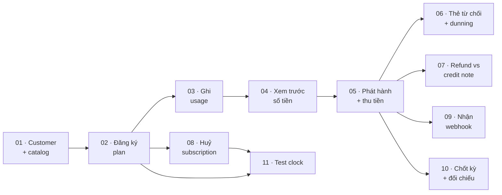

# Use case của Pinstripe

Mỗi file ở đây kể **một kịch bản, theo thứ tự thời gian, xuyên hết các tầng**: từ cú click trên
admin-ui → hook React Query → HTTP → service → transaction → worker nào bị kích hoạt → webhook đi ra.
Kèm phần tự diễn lại bằng UI hoặc curl, và câu SQL để tự thấy dữ liệu.

Nếu bạn mới vào project, **đọc ở đây trước** rồi mới sang `flows/`.

> **Cảnh báo: phần "tự chạy thử" của thư mục này đã lạc hậu.**
>
> [ADR 0028](../adr/0028-api-surface-consolidation.md) gộp mọi route về một cây `/v1` và xoá ba env
> key `ADMIN_API_KEY` / `SYSTEM_API_KEY` / `MANAGEMENT_API_KEY`. Mọi lệnh `curl` dưới đây còn dùng
> prefix `/api/v1/admin`, `/api/v1/management` và các key đó **sẽ trả 404 hoặc 401**. Phần mô tả cơ
> chế vẫn đúng; chỉ đường dẫn và khoá là sai. Admin đầu tiên nay tạo bằng
> `pnpm --filter @pinstripe/api bootstrap-admin`, không phải route management.
>
> Chỗ nói cổng nhà xe "chưa có đăng nhập" cũng đã sai kể từ
> [ADR 0026](../adr/0026-customer-portal-auth-and-bff.md) — cổng đăng nhập bằng link một lần gửi
> qua email.
>
> Cần một kịch bản **đọc-và-làm-theo** đã kiểm chứng trên code hiện tại: [`docs/demo/`](../demo/README.md).

## Năm loại tài liệu, đừng lẫn

| Thư mục                          | Trả lời                                         | Tổ chức theo                   |
| -------------------------------- | ----------------------------------------------- | ------------------------------ |
| [`usecases/`](./00-index.md)     | một kịch bản **diễn ra thế nào theo thời gian** | màn hình / việc người dùng làm |
| [`flows/`](../flows/00-index.md) | một cơ chế **chạy thế nào**                     | subsystem                      |
| [`adr/`](../adr/)                | **tại sao** chọn cách đó                        | phase                          |
| [`technique/`](../technique/)    | một **kỹ thuật** đào sâu                        | chủ đề                         |
| [`PITFALLS.md`](../PITFALLS.md)  | chỗ nào **dễ tự bắn vào chân**                  | loại lỗi                       |

Use case không giải thích lại nội bộ cơ chế — chỗ nào cần thì link sang `flows/`. Phần nó độc quyền
là: đường đi trên frontend, **mốc đồng bộ / bất đồng bộ**, dữ liệu để lại sau mỗi bước, nhánh thất
bại, và cách tự chạy.

## Một điều phải biết trước

**admin-ui là back-office nội bộ. Không có UI cho khách tự đăng ký.**

Nên "khách đăng ký một plan" trong project này thực chất là _người vận hành tạo subscription cho
khách_, hoặc _một hệ thống bên ngoài gọi `POST /v1/subscriptions`_. Portal khách hàng
(`apps/portal-ui`) **chỉ đọc**: xem gói và hoá đơn, không thao tác gì, và hiện **chưa có đăng nhập**.

Vài thao tác cũng chưa có trên UI, buộc phải dùng curl — mỗi use case nói rõ chỗ nào:

| Việc                                | Vì sao                                                                                    |
| ----------------------------------- | ----------------------------------------------------------------------------------------- |
| Chọn tiền tệ cho khách              | form customer thiếu input, luôn gửi `VND` — [UC-01](./01-onboard-customer-and-catalog.md) |
| Gắn test clock vào khách            | không có field trên form — [UC-11](./11-simulate-a-billing-cycle.md)                      |
| Đăng ký nhiều event webhook một lần | UI chỉ cho chọn một — [UC-09](./09-receive-webhooks.md)                                   |

## Thứ tự đọc

Mười một use case kể thành một mạch: dựng dữ liệu → đăng ký → dùng → tính tiền → thu → hỏng → sửa →
dừng → quan sát.



Bốn cái đầu (01 → 04) là chuỗi bắt buộc: use case sau cần dữ liệu của use case trước. Từ 05 trở đi
đọc theo nhu cầu.

## Bảng tra: use case ↔ màn hình ↔ flow

| Use case                                                         | Màn hình                           | Flow nền                                                                                               |
| ---------------------------------------------------------------- | ---------------------------------- | ------------------------------------------------------------------------------------------------------ |
| [01 — Customer và catalog](./01-onboard-customer-and-catalog.md) | `/customers` `/products` `/prices` | [03](../flows/03-catalog-and-customer.md)                                                              |
| [02 — Đăng ký plan](./02-subscribe-to-plan.md)                   | `/subscriptions`                   | [04](../flows/04-subscription-entitlement.md), [02](../flows/02-event-pipeline.md)                     |
| [03 — Ghi nhận usage](./03-record-usage.md)                      | `/meters`                          | [05](../flows/05-metering-and-rating.md)                                                               |
| [04 — Xem trước số tiền](./04-preview-charges.md)                | `/rating`                          | [05](../flows/05-metering-and-rating.md)                                                               |
| [05 — Phát hành và thu tiền](./05-issue-and-collect-invoice.md)  | `/invoices`                        | [06](../flows/06-invoicing.md), [07](../flows/07-payments-and-refunds.md), [10](../flows/10-ledger.md) |
| [06 — Thẻ bị từ chối](./06-handle-declined-card.md)              | `/invoices` `/payments`            | [09](../flows/09-dunning.md), [07](../flows/07-payments-and-refunds.md)                                |
| [07 — Refund vs credit note](./07-refund-vs-credit-note.md)      | `/payments` `/invoices`            | [06](../flows/06-invoicing.md), [07](../flows/07-payments-and-refunds.md)                              |
| [08 — Huỷ subscription](./08-cancel-subscription.md)             | `/subscriptions`                   | [04](../flows/04-subscription-entitlement.md)                                                          |
| [09 — Nhận webhook](./09-receive-webhooks.md)                    | `/webhooks`                        | [02](../flows/02-event-pipeline.md)                                                                    |
| [10 — Chốt kỳ](./10-close-the-period.md)                         | `/reports` `/ledger`               | [10](../flows/10-ledger.md), [11](../flows/11-reporting-reconciliation.md)                             |
| [11 — Test clock](./11-simulate-a-billing-cycle.md)              | `/test-clocks`                     | [12](../flows/12-test-clock.md)                                                                        |

## Một cú click chạm tới những gì

Nhìn ngang bảng này là thấy cái gì xong ngay và cái gì phải chờ. **Đây là thứ khó nhất khi đọc code
mà không thấy được từ code.**

| Hành động                      | Ghi ngay trong response                              | Phải chờ worker                             |
| ------------------------------ | ---------------------------------------------------- | ------------------------------------------- |
| Tạo customer / product / price | hàng dữ liệu + outbox                                | (không consumer nội bộ)                     |
| **Tạo subscription**           | `subscriptions`, `subscription_items`, outbox        | **`entitlements`** — quyền dùng đến muộn    |
| Bắn usage event                | `meter_events`, khoá dedup Redis                     | **không gì** — không qua outbox             |
| Xem trước số tiền              | **không gì cả**                                      | không gì                                    |
| Phát hành hoá đơn              | số hoá đơn, line items, **2 posting sổ cái**         | webhook                                     |
| Thu tiền                       | intent, attempt, **2 posting**, hoá đơn `paid`       | webhook                                     |
| Thẻ bị từ chối                 | intent `requires_payment_method`, attempt `declined` | **dunning thử lại theo lịch ngày**          |
| Credit note / refund           | hàng + 2 posting                                     | webhook                                     |
| Huỷ ngay                       | `status = canceled`                                  | **`entitlements` → `revoked`**              |
| Huỷ cuối kỳ                    | chỉ một cờ boolean                                   | không gì — cần test clock mới kết thúc thật |
| Đăng ký webhook endpoint       | endpoint + secret (**hiện một lần**)                 | mọi event sau đó                            |
| Tua test clock                 | `frozen_time`, subscription cuốn kỳ                  | `entitlements`, webhook                     |
| Đảo bút toán                   | giao dịch đảo + link hai chiều                       | worker `ledger` kiểm cân                    |

Hai hàng in đậm đáng nhớ nhất: **quyền dùng luôn đến muộn hơn thao tác**, còn **toàn bộ phần tiền
thì đồng bộ** — khi toast hiện, sổ cái đã cân.

## Chuẩn bị môi trường một lần

```bash
pnpm docker:up
pnpm db:migrate
pnpm dev
```

| Thứ       | Ở đâu                                                                   |
| --------- | ----------------------------------------------------------------------- |
| admin-ui  | http://localhost:5173                                                   |
| portal-ui | http://localhost:3100                                                   |
| API       | http://localhost:3000                                                   |
| 6 worker  | port 3001–3006: outbox, domain-event, ledger, billing, webhook, dunning |

Mọi mục "tự chạy thử" dùng chung hai đoạn mở đầu này:

```bash
set -a && . ./.env && set +a
API=http://localhost:3000
AUTH="Authorization: Bearer $SECRET_API_KEY"
JSON='content-type: application/json'
```

```bash
docker compose -f docker/compose.yml exec -T postgres psql -U pinstripe -d pinstripe -c "<câu SQL>"
```

Route `/api/v1/admin/*` ([UC-10](./10-close-the-period.md)) dùng `ADMIN_API_KEY`, không phải
`SECRET_API_KEY`.

## Bốn quy tắc gặp lại ở mọi use case

1. **Thời gian luôn qua `fastify.clock`** — cái làm test clock chạy được ([UC-11](./11-simulate-a-billing-cycle.md)).
2. **Ghi dữ liệu và ghi event trong cùng transaction** — lý do quyền dùng đến muộn ([UC-02](./02-subscribe-to-plan.md)).
3. **`find*` trả `null`, `get*` ném lỗi** — ranh giới repository ↔ service.
4. **Tiền là số nguyên đơn vị nhỏ nhất**, đi qua `Money` ([UC-04](./04-preview-charges.md)).

Chi tiết và cách chúng bị phá: [PITFALLS §1](../PITFALLS.md).

## Chỗ dễ mất thời gian nhất

Gom từ các use case, để không ai phải phát hiện lại:

| Hiện tượng                                   | Thật ra là                                                     | Ở đâu                                     |
| -------------------------------------------- | -------------------------------------------------------------- | ----------------------------------------- |
| Tạo subscription xong, entitlement trống     | phải chờ worker rồi F5                                         | [UC-02](./02-subscribe-to-plan.md)        |
| Bấm "Bắn 1 event" mười lần ra mười hàng      | UI không gửi `identifier` nên không bao giờ bị dedup           | [UC-03](./03-record-usage.md)             |
| Thẻ bị từ chối mà HTTP vẫn 200               | thất bại nghiệp vụ ≠ lỗi kỹ thuật                              | [UC-06](./06-handle-declined-card.md)     |
| Dunning không chạy                           | mặc định `INVOICE_DUE_DAYS = 7`, phải chờ 7 ngày               | [UC-06](./06-handle-declined-card.md)     |
| Hoá đơn `paid` mà `amount_paid = 0`          | credit note phủ hết phần còn lại                               | [UC-07](./07-refund-vs-credit-note.md)    |
| Refund trả 500                               | `MockPspClient` giữ charge trong RAM, `pnpm dev` reload là mất | [UC-07](./07-refund-vs-credit-note.md)    |
| "Hủy cuối kỳ" mãi không kết thúc             | `rollPeriod` chỉ chạy qua test clock                           | [UC-08](./08-cancel-subscription.md)      |
| Webhook không tới                            | đăng ký endpoint **sau** khi hành động đã xảy ra               | [UC-09](./09-receive-webhooks.md)         |
| MRR bằng 0 dù có subscription                | chỉ tính `active` + price `per_unit`                           | [UC-10](./10-close-the-period.md)         |
| Tua đồng hồ mà billing run không tạo hoá đơn | job nền dùng giờ thật                                          | [UC-11](./11-simulate-a-billing-cycle.md) |

## Ba khe hở kiến trúc đã biết

| Vấn đề                                                                                                   | Ở đâu                                                                                        |
| -------------------------------------------------------------------------------------------------------- | -------------------------------------------------------------------------------------------- |
| Confirm payment và ghi nhận trả tiền ở hai transaction khác nhau                                         | [UC-05](./05-issue-and-collect-invoice.md), phát hiện bằng [UC-10](./10-close-the-period.md) |
| Dunning không bao giờ chuyển subscription sang `past_due`/`unpaid` — nhánh chặn entitlement là code chết | [UC-06](./06-handle-declined-card.md)                                                        |
| Hàng outbox kẹt ở `publishing`/`failed` không có cơ chế tự cứu                                           | [flow 02](../flows/02-event-pipeline.md)                                                     |

Danh sách đầy đủ những gì chặn production: [ROADMAP.md](../ROADMAP.md).
