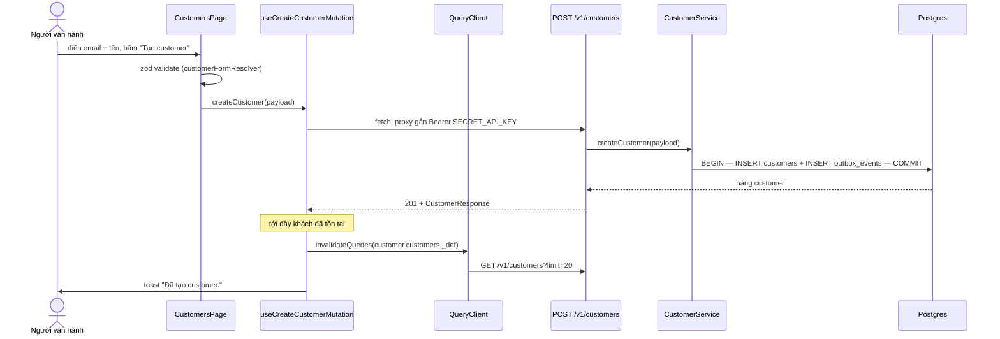

# UC-01 — Dựng khách hàng và bảng giá

## Ai, muốn gì

Người vận hành mở erp-ui lần đầu, cần tạo đủ dữ liệu nền để mọi use case sau chạy được: một
**customer**, một **product**, và một **price** gắn vào product đó.

## Điều kiện trước

| Cần có                        | Cách có                                                                                    |
| ----------------------------- | ------------------------------------------------------------------------------------------ |
| Hạ tầng chạy                  | `pnpm docker:up`, rồi `pnpm db:migrate` — [README](../../README.md)                        |
| API + worker chạy             | `pnpm dev`                                                                                 |
| `SECRET_API_KEY` trong `.env` | Vite proxy tự gắn vào mọi request từ erp-ui — [flow 13](../flows/13-frontend-data-flow.md) |

Không phụ thuộc use case nào khác. Đây là điểm bắt đầu.

## Sơ đồ



## Kịch bản chính — tạo customer

| #   | Ở đâu                                                                                      | Chuyện gì xảy ra                                                             | Quan sát được gì                    |
| --- | ------------------------------------------------------------------------------------------ | ---------------------------------------------------------------------------- | ----------------------------------- |
| 1   | UI [CustomerForm/index.tsx:16-35](../../apps/erp-ui/src/components/CustomerForm/index.tsx) | `<form onSubmit={onSave}>` với đúng **hai** input: email và tên              | —                                   |
| 2   | UI [CustomersPage.tsx:27](../../apps/erp-ui/src/pages/CustomersPage.tsx)                   | `form.handleSubmit` chạy zod resolver; lỗi thì dừng tại đây, hiện dưới input | không có request nào đi ra          |
| 3   | UI [customer-form.ts:22-28](../../apps/erp-ui/src/forms/customer-form.ts)                  | `customerFormDataToPayload` gom `{ email, name, currency }`                  | —                                   |
| 4   | Hook [mutations.ts:12](../../apps/erp-ui/src/reactquery/customers/mutations.ts)            | `mutationFn` gọi `createCustomer(payload)`                                   | nút chuyển `disabled` (`isSaving`)  |
| 5   | API [request.ts:30](../../apps/erp-ui/src/api/customers/request.ts)                        | `Request(Endpoint('/v1/customers'), Method('POST'), Payload(payload))`       | —                                   |
| 6   | API [client.ts:88-126](../../apps/erp-ui/src/api/client.ts)                                | dựng `fetch`, ném `VxrErpApiError` nếu không 2xx                             | —                                   |
| 7   | Backend                                                                                    | Chuỗi hook + validate schema — [flow 01](../flows/01-request-lifecycle.md)   | —                                   |
| 8   | Service [customer.service.ts:42-78](../../packages/core/src/services/customer.service.ts)  | một transaction: INSERT `customers` + `customer.created` vào `outbox_events` | hai hàng trong DB                   |
| 9   | Hook [mutations.ts:16](../../apps/erp-ui/src/reactquery/customers/mutations.ts)            | `invalidateQueries(queries.customer.customers._def)`                         | bảng tự nạp lại, hàng mới xuất hiện |
| 10  | Hook [mutations.ts:19](../../apps/erp-ui/src/reactquery/customers/mutations.ts)            | `toast.show('Đã tạo customer.')`                                             | toast xanh góc phải                 |
| 11  | UI [CustomersPage.tsx:29](../../apps/erp-ui/src/pages/CustomersPage.tsx)                   | `form.reset(...)` sau khi `mutateAsync` resolve                              | form trống, sẵn cho lần sau         |

Bước 9 dùng `._def` chứ không phải một key cụ thể: đó là prefix của **mọi** biến thể danh sách, nên
mọi trang và bộ lọc đang cache đều bị làm mới cùng lúc — [flow 13](../flows/13-frontend-data-flow.md).

## Mốc thời gian

| Xong ngay khi 201 trả về                  | Xảy ra sau đó                                                                                             |
| ----------------------------------------- | --------------------------------------------------------------------------------------------------------- |
| hàng `customers`                          | worker `outbox` relay `customer.created` → `DomainEventQueue`                                             |
| hàng `outbox_events` trạng thái `pending` | worker `domain-event` **không có consumer** cho `customer` → chỉ log `debug`                              |
| response chứa `id` dạng `cus_...`         | nếu có webhook endpoint đăng ký `customer.created` thì delivery đi ra ([UC-09](./09-receive-webhooks.md)) |

Không có gì nghiệp vụ phụ thuộc vào phần bất đồng bộ ở use case này — customer dùng được ngay.

## Dữ liệu để lại

| Bảng            | Hàng | Giá trị đáng chú ý                                      |
| --------------- | ---- | ------------------------------------------------------- |
| `customers`     | 1    | `currency` NOT NULL; `balance = 0`; `deleted_at = null` |
| `outbox_events` | 1    | `event_type = 'customer.created'`, `status = 'pending'` |

## Nhánh phụ và thất bại

| Tình huống                         | Hệ quả                                                                                                                                            |
| ---------------------------------- | ------------------------------------------------------------------------------------------------------------------------------------------------- |
| Email trùng một khách chưa xoá     | `ConflictError` với `param: 'email'` → toast đỏ, không ghi gì — [customer.service.ts:79-88](../../packages/core/src/services/customer.service.ts) |
| Email của một khách **đã xoá mềm** | tạo được — unique index chỉ áp khi `deleted_at is null`                                                                                           |
| Email sai định dạng                | zod chặn ở client, không có request                                                                                                               |
| Thiếu `Authorization`              | 401, toast hiện message của server                                                                                                                |

## Hai chỗ hổng của màn hình này

**1. Form customer không có input tiền tệ.** Zod schema đòi `currency`
([customer-form.ts:9](../../apps/erp-ui/src/forms/customer-form.ts)) nhưng
[CustomerForm](../../apps/erp-ui/src/components/CustomerForm/index.tsx) chỉ render email và tên —
nên mọi khách tạo từ UI đều mang `vnd`, lấy từ default `CurrencyEnum.VND`
([customer-form.ts:19](../../apps/erp-ui/src/forms/customer-form.ts)). Muốn khách dùng tiền khác
thì phải gọi API.

Điều này quan trọng vì subscription bắt buộc price cùng currency với khách — [UC-02](./02-subscribe-to-plan.md).

**2. `/products` tạo được nhưng không sửa được** (`useUpdateProductMutation` tồn tại mà không trang
nào gọi).

`/prices` thì đã đủ: [PriceForm](../../apps/erp-ui/src/components/PriceForm/index.tsx) tạo được cả
ba dạng — per_unit, tiered, metered — và mỗi hàng có nút bật/tắt `active`. Cái nó **không** có là
đường sửa số tiền, và đó là thiết kế chứ không phải thiếu sót: giá đã phát hành là bất biến, tăng
giá là tạo price mới cùng `lookupKey` ([technique 05](../technique/05-product-and-price.md)).

## Tự chạy thử

### Trên màn hình

1. `/customers` → điền email + tên → **Tạo customer**. Hàng mới hiện ngay ở bảng dưới.
2. `/products` → điền tên → **Tạo product**.
3. `/prices` → chọn product, điền lookup key + đơn giá, chọn chu kỳ → **Tạo price**. Submit lại đúng
   lookup key đó với số tiền khác thì ra `v2`, và `v1` vẫn nằm nguyên trong bảng. Bấm **Ngừng bán**
   ở `v1` để nó rụng khỏi dropdown của `/subscriptions` mà hợp đồng cũ không bị đụng.

### Bằng curl

```bash
set -a && . ./.env && set +a
API=http://localhost:3000
AUTH="Authorization: Bearer $SECRET_API_KEY"
JSON='content-type: application/json'
```

```bash
curl -s -X POST $API/v1/customers -H "$AUTH" -H "$JSON" \
  -H "Idempotency-Key: $(uuidgen)" \
  -d '{"email":"ke.toan@congty.vn","name":"Công ty ABC","currency":"vnd"}' | jq '{id, email, currency}'
```

```bash
curl -s -X POST $API/v1/products -H "$AUTH" -H "$JSON" \
  -H "Idempotency-Key: $(uuidgen)" \
  -d '{"name":"Gói Pro"}' | jq '{id, name}'
```

Tạo price — thay `prod_...` bằng id vừa nhận:

```bash
curl -s -X POST $API/v1/prices -H "$AUTH" -H "$JSON" \
  -H "Idempotency-Key: $(uuidgen)" \
  -d '{
    "productId": "prod_...",
    "lookupKey": "pro_monthly",
    "currency": "vnd",
    "unitAmount": 200000,
    "billingScheme": "per_unit",
    "recurring": { "interval": "month", "intervalCount": 1, "usageType": "licensed" }
  }' | jq '{id, lookupKey, version, unitAmount}'
```

Gửi lại đúng lệnh price ở trên (cùng `lookupKey`) thì được `version: 2`, không phải lỗi — mỗi lần
tạo là một version mới, version cũ vẫn phục vụ hợp đồng cũ. Đó chính là dòng chú thích trên trang
`/prices` ([PricesPage.tsx:18-20](../../apps/erp-ui/src/pages/PricesPage.tsx)).

Thử `Idempotency-Key` lặp lại: gửi hai lần cùng key **và** cùng body thì lần hai trả về nguyên
response cũ kèm header `idempotent-replayed: true`, không tạo bản ghi thứ hai.

### Kiểm chứng bằng SQL

```bash
docker compose -f docker/compose.yml exec -T postgres psql -U vxrerp -d vxrerp -c \
"select id, email, currency, balance from customers order by created_at desc limit 3"
```

```bash
docker compose -f docker/compose.yml exec -T postgres psql -U vxrerp -d vxrerp -c \
"select event_type, status, published_at from outbox_events order by occurred_at desc limit 5"
```

Câu thứ hai là chỗ thấy rõ chuỗi bất đồng bộ: ngay sau khi tạo, `status` là `pending`; sau
`OUTBOX_RELAY_INTERVAL_MS` thì thành `published` và `published_at` có giá trị. Nếu nó đứng ở
`publishing` hoặc `failed` thì đang gặp trạng thái kẹt — [PITFALLS §4](../PITFALLS.md).

## Đọc sâu hơn

- [flow 03 — Customer và catalog](../flows/03-catalog-and-customer.md) — khuôn CRUD, phân trang con trỏ, 6 quy tắc hình dạng của price
- [flow 01 — Request lifecycle](../flows/01-request-lifecycle.md) — idempotency, vỏ lỗi
- [technique 05 — Product và price](../technique/05-product-and-price.md) — vì sao tách hai bảng, ví dụ catalog Go / Plus / Pro
- [technique 01 — GID](../technique/01-identifier-gid-uuidv7-typeid.md) — vì sao id là `cus_01m2...`
- [ADR 0002](../adr/0002-phase-1-customer-catalog.md) — vì sao price bất biến và có version
