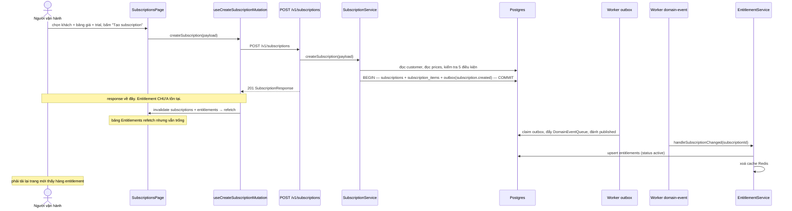

# UC-02 — Đăng ký một khách vào plan

## Ai, muốn gì

Người vận hành gắn một khách hàng vào một bảng giá định kỳ, để từ đó khách có **quyền dùng**
(entitlement) và hệ thống bắt đầu đếm chu kỳ tính tiền.

Đây là use case cho thấy rõ nhất đặc trưng kiến trúc của Pinstripe: **quyền dùng không được ghi
trong request**. Response 201 trả về khi subscription đã tồn tại, nhưng entitlement chỉ xuất hiện
vài giây sau, do worker.

## Điều kiện trước

| Cần có                                                             | Từ đâu                                                             |
| ------------------------------------------------------------------ | ------------------------------------------------------------------ |
| Một customer                                                       | [UC-01](./01-onboard-customer-and-catalog.md)                      |
| Một product                                                        | [UC-01](./01-onboard-customer-and-catalog.md)                      |
| Một price `type: recurring`, `active`, **cùng currency với khách** | [UC-01](./01-onboard-customer-and-catalog.md) — phải tạo bằng curl |
| Worker `outbox` và `domain-event` đang chạy                        | `pnpm dev`                                                         |

Điều kiện cuối là thứ hay bị bỏ qua: tắt worker thì subscription vẫn tạo được, nhưng bảng
Entitlements dưới trang sẽ trống mãi.

## Sơ đồ



## Kịch bản chính

| #   | Ở đâu                                                                                                                            | Chuyện gì xảy ra                                                                                                    | Quan sát được gì                                              |
| --- | -------------------------------------------------------------------------------------------------------------------------------- | ------------------------------------------------------------------------------------------------------------------- | ------------------------------------------------------------- |
| 1   | UI [SubscriptionsPage.tsx:29-30](../../apps/admin-ui/src/pages/SubscriptionsPage.tsx)                                            | trang nạp sẵn 100 khách và 100 price để làm dropdown                                                                | hai `<select>` có dữ liệu                                     |
| 2   | UI [SubscriptionsPage.tsx:55-67](../../apps/admin-ui/src/pages/SubscriptionsPage.tsx)                                            | `priceOptions` lọc `filter(prices?.data, { type: 'recurring' })`                                                    | price một lần (`one_time`) **không xuất hiện** trong dropdown |
| 3   | UI [SubscriptionForm/index.tsx:34-53](../../apps/admin-ui/src/components/SubscriptionForm/index.tsx)                             | ba field: khách hàng, bảng giá, trial (ngày)                                                                        | nhãn currency in kèm tên khách và tên price để tự đối chiếu   |
| 4   | UI [subscription-form.ts:7-15](../../apps/admin-ui/src/forms/subscription-form.ts)                                               | zod: phải chọn khách, phải chọn price, trial 0–730 ngày                                                             | lỗi hiện dưới field, không có request                         |
| 5   | UI [subscription-form.ts:27-35](../../apps/admin-ui/src/forms/subscription-form.ts)                                              | `priceId` được bọc thành `items: [{ priceId }]`; `trialPeriodDays` bị **bỏ hẳn** khi bằng 0                         | payload gọn, không gửi `trialPeriodDays: 0`                   |
| 6   | Hook [mutations.ts:15-17](../../apps/admin-ui/src/reactquery/subscriptions/mutations.ts)                                         | `mutationFn` → `createSubscription(payload)`                                                                        | nút `disabled`                                                |
| 7   | API [request.ts:31-39](../../apps/admin-ui/src/api/subscriptions/request.ts)                                                     | `POST /v1/subscriptions`                                                                                            | —                                                             |
| 8   | Service [subscription.service.ts:43](../../packages/core/src/services/subscription.service.ts)                                   | `customerService.getCustomer` — lấy `currency` và `testClockId` của khách                                           | 404 nếu khách không tồn tại                                   |
| 9   | Service [subscription.service.ts:44](../../packages/core/src/services/subscription.service.ts)                                   | `resolvePrices` — thiếu price nào là 404                                                                            | —                                                             |
| 10  | Service [subscription.service.ts:45](../../packages/core/src/services/subscription.service.ts)                                   | `resolveNow(customer.testClockId)` — giờ thật, hoặc giờ đóng băng nếu khách gắn test clock                          | quyết định mọi mốc thời gian phía dưới                        |
| 11  | Service [assertPricesUsable:467-510](../../packages/core/src/services/subscription.service.ts)                                   | 5 kiểm tra: active, recurring, cùng currency, có ít nhất một price, mọi price cùng chu kỳ                           | mỗi vi phạm là 400 kèm `param: 'items'`                       |
| 12  | Service [subscription.service.ts:50-53](../../packages/core/src/services/subscription.service.ts)                                | tính `trialEnd`, rồi `anchor = billingCycleAnchor ?? trialEnd ?? now`                                               | —                                                             |
| 13  | Service [subscription.service.ts:71-76](../../packages/core/src/services/subscription.service.ts)                                | status `trialing` nếu có trial, ngược lại `active`; `currentPeriodEnd` = `trialEnd` hoặc `advancePeriod(anchor, …)` | cột "Kỳ hiện tại" và "Hết trial" trên bảng                    |
| 14  | Service [subscription.service.ts:66-103](../../packages/core/src/services/subscription.service.ts)                               | một transaction: `subscriptions` + `subscription_items` + `subscription.created`                                    | ba nhóm hàng cùng commit                                      |
| 15  | Hook [mutations.ts:19-20](../../apps/admin-ui/src/reactquery/subscriptions/mutations.ts)                                         | invalidate **cả** `subscriptions` và `entitlements`                                                                 | bảng trên có hàng mới; bảng dưới refetch nhưng chưa có gì     |
| 16  | Worker                                                                                                                           | chuỗi outbox → domain event — [flow 02](../flows/02-event-pipeline.md)                                              | `outbox_events.status` thành `published`                      |
| 17  | Worker [domain-event-dispatch.processor.ts:21-30](../../apps/worker/src/workflows/processors/domain-event-dispatch.processor.ts) | `aggregateType = subscription` → `entitlementService.handleSubscriptionChanged`                                     | —                                                             |
| 18  | Service [entitlement.service.ts:52-73](../../packages/core/src/services/entitlement.service.ts)                                  | upsert một hàng `entitlements` cho mỗi `productId` của các price trên subscription                                  | hàng hiện ra sau khi tải lại trang                            |

## Mốc thời gian

Mục quan trọng nhất của use case này.

| Xong ngay khi 201 trả về                                           | Xảy ra sau, do worker                                                                            |
| ------------------------------------------------------------------ | ------------------------------------------------------------------------------------------------ |
| hàng `subscriptions` — status `trialing`/`active`, kỳ đã tính xong | `outbox_events` chuyển `pending` → `published` (worker `outbox`, mỗi `OUTBOX_RELAY_INTERVAL_MS`) |
| hàng `subscription_items`                                          | hàng `entitlements` status `active` (worker `domain-event`)                                      |
| hàng `outbox_events` `subscription.created` trạng thái `pending`   | cache Redis entitlement bị xoá                                                                   |
| response đủ để render bảng Subscriptions                           | webhook `subscription.created` nếu có endpoint đăng ký — [UC-09](./09-receive-webhooks.md)       |

Hệ quả thấy được trên màn hình: [mutations.ts:20](../../apps/admin-ui/src/reactquery/subscriptions/mutations.ts)
invalidate `entitlements` **ngay** trong `onSuccess`, nên bảng Entitlements refetch tại thời điểm
hàng đó còn chưa được ghi. Nó vẫn trống. Phải chờ vài giây rồi tải lại trang.

Đây không phải bug ở UI — nó là bản chất của outbox: không có cách nào biết chắc worker đã xử lý
xong để mà chờ. Muốn UI đúng hơn thì phải poll hoặc đẩy realtime, cả hai đều chưa có.

## Dữ liệu để lại

| Bảng                 | Hàng                     | Giá trị đáng chú ý                                                                                             |
| -------------------- | ------------------------ | -------------------------------------------------------------------------------------------------------------- |
| `subscriptions`      | 1                        | `current_period_start/end`, `trial_start/end`, `charged_through_date = null`, `test_clock_id` kế thừa từ khách |
| `subscription_items` | 1 mỗi price              | `quantity` mặc định 1                                                                                          |
| `outbox_events`      | 1                        | `subscription.created`, payload `{ id, customerId, status }`                                                   |
| `entitlements`       | 1 mỗi product — **muộn** | `status = 'active'`, `granted_at`, `revoked_at = null`                                                         |

## Nhánh phụ và thất bại

| Tình huống                                    | Hệ quả                                                                                                                                         |
| --------------------------------------------- | ---------------------------------------------------------------------------------------------------------------------------------------------- |
| Price khác currency với khách                 | 400 `Price ... is in X but the customer bills in Y` — hay gặp nhất, vì UI luôn tạo khách `vnd` ([UC-01](./01-onboard-customer-and-catalog.md)) |
| Price `one_time`                              | 400 — nhưng UI đã lọc nên chỉ xảy ra khi gọi API trực tiếp                                                                                     |
| Price `active: false`                         | 400 `... is archived`                                                                                                                          |
| Hai price khác chu kỳ trong cùng subscription | 400 `Every price on a subscription must share the same billing period`                                                                         |
| Trial > 0                                     | status `trialing`, `currentPeriodEnd = trialEnd` — kỳ đầu **là** kỳ trial                                                                      |
| Tắt worker `domain-event`                     | subscription vẫn tạo được, entitlement không bao giờ có                                                                                        |
| Outbox kẹt ở `publishing`                     | như trên, và không có cơ chế tự cứu — [PITFALLS §4](../PITFALLS.md)                                                                            |

## Tự chạy thử

### Trên màn hình

1. `/subscriptions` → chọn khách, chọn bảng giá, để trial `0` → **Tạo subscription**.
2. Hàng mới hiện ngay ở bảng trên, status `active`, kỳ hiện tại đã có ngày.
3. Bảng **Entitlements** phía dưới: vẫn trống.
4. Chờ ~5 giây, tải lại trang (F5) → hàng entitlement `active` xuất hiện.

Bước 3 → 4 chính là điều use case này muốn cho thấy. Làm lại với trial `7` để thấy status `trialing`
và cột "Hết trial" có ngày.

### Bằng curl

```bash
set -a && . ./.env && set +a
API=http://localhost:3000
AUTH="Authorization: Bearer $SECRET_API_KEY"
JSON='content-type: application/json'
```

```bash
curl -s -X POST $API/v1/subscriptions -H "$AUTH" -H "$JSON" \
  -H "Idempotency-Key: $(uuidgen)" \
  -d '{ "customerId": "cus_...", "items": [{ "priceId": "price_..." }], "trialPeriodDays": 7 }' \
  | jq '{id, status, currentPeriodStart, currentPeriodEnd, trialEnd}'
```

Ngay sau đó, đọc entitlement — sẽ **rỗng**:

```bash
curl -s "$API/v1/entitlements?customerId=cus_..." -H "$AUTH" | jq '.data'
```

Chờ vài giây rồi gọi lại đúng lệnh trên: giờ có một hàng `status: "active"`. Đó là toàn bộ nội dung
của mục "Mốc thời gian", quan sát được trong hai lệnh.

Không muốn chờ scheduler thì kích relay bằng tay:

```bash
curl -s -X POST $API/api/v1/management/outbox/relay \
  -H "Authorization: Bearer $MANAGEMENT_API_KEY" | jq
```

### Kiểm chứng bằng SQL

```bash
docker compose -f docker/compose.yml exec -T postgres psql -U pinstripe -d pinstripe -c \
"select s.id, s.status, s.current_period_end, count(i.id) as items
 from subscriptions s left join subscription_items i on i.subscription_id = s.id
 group by s.id, s.status, s.current_period_end order by s.created_at desc limit 3"
```

Theo dõi đúng ba mốc của chuỗi bất đồng bộ trong một câu:

```bash
docker compose -f docker/compose.yml exec -T postgres psql -U pinstripe -d pinstripe -c \
"select event_type, status, occurred_at, published_at from outbox_events
 where aggregate_type = 'subscription' order by occurred_at desc limit 5"
```

```bash
docker compose -f docker/compose.yml exec -T postgres psql -U pinstripe -d pinstripe -c \
"select customer_id, product_id, status, granted_at from entitlements order by created_at desc limit 5"
```

Chạy ba lệnh này ngay sau khi tạo, rồi chạy lại sau 10 giây: `published_at` chuyển từ `null` sang có
giá trị, và hàng `entitlements` từ không có thành có.

## Đọc sâu hơn

- [flow 04 — Subscription và entitlement](../flows/04-subscription-entitlement.md) — máy trạng thái, bảng ánh xạ status → entitlement, cache Redis
- [flow 02 — Event pipeline](../flows/02-event-pipeline.md) — vì sao phải qua outbox thay vì ghi entitlement luôn
- [UC-11](./11-simulate-a-billing-cycle.md) — đẩy thời gian để thấy trial kết thúc và kỳ mới bắt đầu
- [technique 04 — Entitlement](../technique/04-entitlement.md) — khái niệm: quyền dùng là gì, vì sao không suy ra từ trạng thái subscription
- [ADR 0005](../adr/0005-phase-3-subscription-entitlement.md) — vì sao tách quyền dùng khỏi chu kỳ tính tiền
