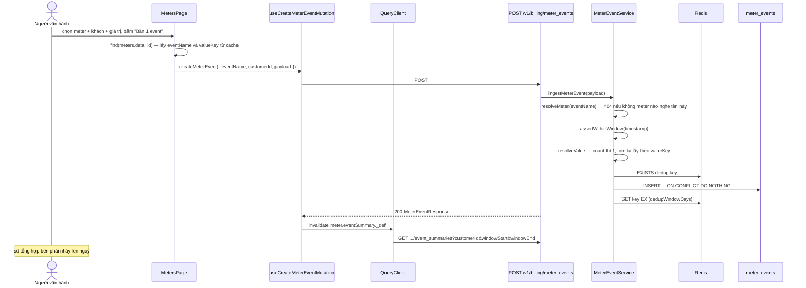

# UC-03 — Ghi nhận lượng dùng của khách

## Ai, muốn gì

Người vận hành khai báo một **meter** (định nghĩa "event tên X thì gom theo cách Y"), rồi bắn thử
event dùng để thấy số tổng hợp thay đổi. Trong hệ thống thật, event do sản phẩm của khách tự gửi
lên; trang này là chỗ giả lập một event bằng tay.

## Điều kiện trước

| Cần có       | Từ đâu                                                                             |
| ------------ | ---------------------------------------------------------------------------------- |
| Một customer | [UC-01](./01-onboard-customer-and-catalog.md)                                      |
| —            | Không cần subscription; meter event ghi theo `customerId`, không theo subscription |

Muốn số usage này **thành tiền** thì cần thêm một price `usageType: metered` gắn `meterId` — xem
[UC-04](./04-preview-charges.md).

## Sơ đồ



## Kịch bản chính — tạo meter

| #   | Ở đâu                                                                                            | Chuyện gì xảy ra                                                                             |
| --- | ------------------------------------------------------------------------------------------------ | -------------------------------------------------------------------------------------------- |
| 1   | UI [meter-form.ts:6-11](../../apps/erp-ui/src/forms/meter-form.ts)                               | bốn field: `displayName`, `eventName`, `aggregation` (từ `MeterAggregationEnum`), `valueKey` |
| 2   | UI [meter-form.ts:17-22](../../apps/erp-ui/src/forms/meter-form.ts)                              | default: `aggregation = SUM`, `valueKey = 'value'`                                           |
| 3   | Hook [mutations.ts:13-23](../../packages/sdk/src/react/meters/mutations.ts)                      | `useCreateMeterMutation` → `vxrErp.meters.create(payload)`                                   |
| 4   | SDK [meters.resource.ts:41-47](../../packages/sdk/src/resources/billing/meters.resource.ts)      | `POST /v1/billing/meters`                                                                    |
| 5   | Service [meter.service.ts:92-125](../../packages/modules/billing/src/services/meter.service.ts)  | transaction: INSERT `meters` + `meter.created` vào outbox                                    |
| 6   | Service [meter.service.ts:126-135](../../packages/modules/billing/src/services/meter.service.ts) | `eventName` trùng một meter chưa xoá → `ConflictError` với `param: 'eventName'`              |

`eventName` là khoá nghiệp vụ: một tên event chỉ có đúng một meter đang nghe
([meters.schema.ts:21-23](../../packages/modules/billing/src/database/schemas/meters.schema.ts)).

## Kịch bản chính — bắn một event

| #   | Ở đâu                                                                                                      | Chuyện gì xảy ra                                                                                                             | Quan sát được gì                                                   |
| --- | ---------------------------------------------------------------------------------------------------------- | ---------------------------------------------------------------------------------------------------------------------------- | ------------------------------------------------------------------ |
| 1   | UI [MetersPage.tsx:100-105](../../apps/erp-ui/src/pages/MetersPage.tsx)                                    | tìm meter trong **cache của bảng phía trên**, thiếu meter hoặc khách thì `return` im lặng                                    | bấm nút mà không chọn đủ thì không có gì xảy ra, cũng không có lỗi |
| 2   | UI [MetersPage.tsx:107-111](../../apps/erp-ui/src/pages/MetersPage.tsx)                                    | payload dựng từ chính meter: `{ eventName: meter.eventName, customerId, payload: { [meter.valueKey]: Number(eventValue) } }` | UI phải biết `valueKey` để đặt đúng khoá                           |
| 3   | SDK [meter-events.resource.ts:15-21](../../packages/sdk/src/resources/billing/meter-events.resource.ts)    | `POST /v1/billing/meter_events`                                                                                              | —                                                                  |
| 4   | Service [meter-event.service.ts:29](../../packages/modules/billing/src/services/meter-event.service.ts)    | `resolveMeter(eventName)`                                                                                                    | tên chưa khai báo meter → 404, **không** âm thầm bỏ qua            |
| 5   | Service [buildMeterEvent:124-144](../../packages/modules/billing/src/services/meter-event.service.ts)      | `timestamp` = client gửi hoặc `receivedAt`; `identifier` = client gửi hoặc **id sinh mới**                                   | xem mục cảnh báo dưới                                              |
| 6   | Service [assertWithinWindow:186-201](../../packages/modules/billing/src/services/meter-event.service.ts)   | `timestamp` cũ hơn `METER_DEDUP_WINDOW_DAYS` → 400                                                                           | —                                                                  |
| 7   | Service [resolveValue:203-218](../../packages/modules/billing/src/services/meter-event.service.ts)         | `count` → luôn 1; ngược lại lấy `payload[valueKey]`, không phải số → 400                                                     | lỗi này hiện thành toast đỏ                                        |
| 8   | Service [meter-event.service.ts:32-36](../../packages/modules/billing/src/services/meter-event.service.ts) | Redis `EXISTS` — đã thấy identifier thì trả về luôn, **không** ghi                                                           | —                                                                  |
| 9   | Service [meter-event.service.ts:38](../../packages/modules/billing/src/services/meter-event.service.ts)    | INSERT với `onConflictDoNothing` trên `(meter_id, identifier)`                                                               | chốt chặn thật                                                     |
| 10  | Hook [mutations.ts:60](../../packages/sdk/src/react/meters/mutations.ts)                                   | invalidate `meter.eventSummary._def`                                                                                         | query summary tự chạy lại                                          |
| 11  | UI [MetersPage.tsx:171-180](../../apps/erp-ui/src/pages/MetersPage.tsx)                                    | số tổng hợp và số event render lại                                                                                           | **một cú click = 1 ghi + 1 đọc lại**, thấy ngay                    |

## Mốc thời gian

| Xong ngay khi 200 trả về                              | Xảy ra sau                                               |
| ----------------------------------------------------- | -------------------------------------------------------- |
| hàng `meter_events` (nếu không trùng)                 | —                                                        |
| khoá dedup trong Redis, TTL `METER_DEDUP_WINDOW_DAYS` | —                                                        |
| —                                                     | **không có event outbox, không worker nào bị kích hoạt** |

Đây là use case duy nhất trong tài liệu này **không** đi qua outbox. Nạp usage là đường ghi nóng,
tần suất cao; không phát domain event cho từng event dùng là chủ ý.

Việc tạo meter thì vẫn phát `meter.created`.

## Dữ liệu để lại

| Bảng            | Hàng                    | Giá trị đáng chú ý                                                                                                 |
| --------------- | ----------------------- | ------------------------------------------------------------------------------------------------------------------ |
| `meters`        | 1 mỗi lần tạo           | `event_name` unique khi `deleted_at is null`                                                                       |
| `outbox_events` | 1 khi tạo meter         | `meter.created`                                                                                                    |
| `meter_events`  | 1 mỗi event không trùng | `value` là `double precision` (lượng dùng, **không** phải tiền); `timestamp` vs `received_at` là hai mốc khác nhau |

`meter_events` là **append-only** ở tầng DB — trigger trong migration
[`0001_triggers_view_seed.sql`](../../packages/modules/billing/migrations/0001_triggers_view_seed.sql)
chặn UPDATE và DELETE. Số liệu sai thì ghi event bù, không sửa lịch sử.

## Chỗ dễ hiểu sai: nút này không bao giờ bị dedup

[MetersPage.tsx:107-111](../../apps/erp-ui/src/pages/MetersPage.tsx) **không gửi `identifier`**.
Server thấy thiếu thì sinh một id mới
([meter-event.service.ts:135](../../packages/modules/billing/src/services/meter-event.service.ts)), nên mỗi cú
click là một identifier khác nhau và luôn được ghi.

Nghĩa là: bấm "Bắn 1 event" mười lần thì có mười hàng và `eventCount` tăng mười. Cơ chế chống trùng
**không** được UI này thử tới. Muốn thấy nó hoạt động thì phải gửi cùng một `identifier` hai lần bằng
curl — mục dưới có lệnh.

Đây là điểm quan trọng khi tích hợp thật: chống trùng chỉ có ý nghĩa nếu bên gửi tự cấp
`identifier` ổn định (ví dụ id của bản ghi nguồn). Không gửi thì mất hẳn lớp bảo vệ, và một lần
retry mạng thành một lần tính tiền thêm.

## Nhánh phụ và thất bại

| Tình huống                                                | Hệ quả                                                                         |
| --------------------------------------------------------- | ------------------------------------------------------------------------------ |
| `eventName` chưa có meter                                 | 404 `No active meter listens for event ...`                                    |
| `payload` thiếu khoá `valueKey`, meter không phải `count` | 400 nói rõ meter gom gì trên khoá nào                                          |
| `timestamp` quá cũ                                        | 400 — ngoài cửa sổ dedup thì không còn cách biết đã nhận hay chưa, thà từ chối |
| Cùng `identifier`, gửi lại                                | trả về response bình thường, **không** ghi hàng thứ hai, `accepted` không tăng |
| Redis trống (vừa restart)                                 | lớp Redis mất, unique index vẫn giữ — không nhân đôi                           |
| Chưa chọn meter hoặc khách                                | nút không làm gì, không toast                                                  |

## Tự chạy thử

### Trên màn hình

1. `/meters` → tạo meter: tên `API calls`, event `api.call`, tổng hợp `sum`, khoá `value`.
2. Phần **Usage 30 ngày gần nhất**: chọn meter, chọn khách → số tổng hợp hiện ra (0 lúc đầu).
3. Điền giá trị `5` → **Bắn 1 event**. Số nhảy lên 5, `1 event`.
4. Bấm thêm hai lần nữa → 15, `3 event`.

### Bằng curl — thấy dedup hoạt động

```bash
set -a && . ./.env && set +a
API=http://localhost:3000
AUTH="Authorization: Bearer $SECRET_API_KEY"
JSON='content-type: application/json'
```

```bash
curl -s -X POST $API/v1/billing/meters -H "$AUTH" -H "$JSON" \
  -H "Idempotency-Key: $(uuidgen)" \
  -d '{"displayName":"API calls","eventName":"api.call","aggregation":"sum","valueKey":"value"}' \
  | jq '{id, eventName, aggregation}'
```

Gửi **cùng một `identifier`** hai lần:

```bash
for i in 1 2; do
  curl -s -X POST $API/v1/billing/meter_events -H "$AUTH" -H "$JSON" \
    -d '{"eventName":"api.call","customerId":"cus_...","identifier":"evt-fixed-001","payload":{"value":10}}' \
    | jq -c '{id, identifier, value}'
done
```

Cả hai lần đều trả 200, nhưng chỉ một hàng được ghi — kiểm bằng SQL dưới đây.

Nạp cả lô, có phần tử trùng:

```bash
curl -s -X POST $API/v1/billing/meter_event_batches -H "$AUTH" -H "$JSON" \
  -d '{"events":[
    {"eventName":"api.call","customerId":"cus_...","identifier":"evt-fixed-001","payload":{"value":10}},
    {"eventName":"api.call","customerId":"cus_...","identifier":"evt-b","payload":{"value":7}}
  ]}' | jq
```

Trả về `{ accepted: 1, duplicates: 1 }` — `evt-fixed-001` đã có từ lệnh trước.

### Kiểm chứng bằng SQL

```bash
docker compose -f docker/compose.yml exec -T postgres psql -U vxrerp -d vxrerp -c \
"select identifier, value, timestamp, received_at from billing.meter_events order by received_at desc limit 10"
```

Đúng **một** hàng `evt-fixed-001` dù đã gửi ba lần (hai lần đơn + một lần trong batch).

Tổng hợp giống hệt cách server tính:

```bash
docker compose -f docker/compose.yml exec -T postgres psql -U vxrerp -d vxrerp -c \
"select customer_id, count(*) as events, sum(value) as total from billing.meter_events group by customer_id"
```

Thử chạm vào lịch sử để thấy trigger chặn:

```bash
docker compose -f docker/compose.yml exec -T postgres psql -U vxrerp -d vxrerp -c \
"update billing.meter_events set value = 999 where identifier = 'evt-fixed-001'"
```

Postgres trả lỗi `append-only`. Đó là tầng phòng thủ cuối cùng cho số liệu tính tiền.

## Đọc sâu hơn

- [technique 07 — Metering](../technique/07-metering.md) — khái niệm: meter là schema, meter event là data; vì sao hai trục thời gian
- [flow 05 — Metering và rating](../flows/05-metering-and-rating.md) — chống trùng hai lớp, cửa sổ tổng hợp, `receivedBefore`
- [UC-04](./04-preview-charges.md) — biến số usage này thành tiền
- [ADR 0007](../adr/0007-phase-4-metering.md) — vì sao append-only và vì sao tổng hợp lúc đọc
