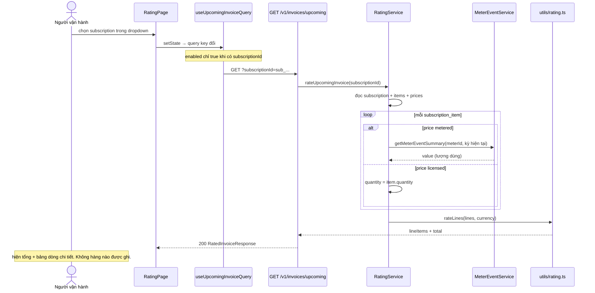

# UC-04 — Xem trước số tiền của kỳ hiện tại

## Ai, muốn gì

Người vận hành muốn biết **nếu chốt hoá đơn ngay lúc này thì khách phải trả bao nhiêu**, và con số
đó từ đâu ra: dòng nào là phí định kỳ, dòng nào là usage, dòng nào bị chia tỷ lệ.

Use case này không ghi bất cứ thứ gì. Nó là cửa sổ nhìn vào bộ tính giá, và là cách đối chiếu trước
khi phát hành hoá đơn ở [UC-05](./05-issue-and-collect-invoice.md).

## Điều kiện trước

| Cần có                     | Từ đâu                                                                                      |
| -------------------------- | ------------------------------------------------------------------------------------------- |
| Một subscription           | [UC-02](./02-subscribe-to-plan.md)                                                          |
| Muốn thấy dòng `usage`     | price `usageType: metered` gắn `meterId`, cộng event đã nạp — [UC-03](./03-record-usage.md) |
| Muốn thấy dòng `proration` | một `subscription_item` được thêm **giữa kỳ**                                               |

## Sơ đồ



## Kịch bản chính

| #   | Ở đâu                                                                                 | Chuyện gì xảy ra                                                                                                  | Quan sát được gì                                |
| --- | ------------------------------------------------------------------------------------- | ----------------------------------------------------------------------------------------------------------------- | ----------------------------------------------- |
| 1   | UI [RatingPage.tsx:13](../../apps/admin-ui/src/pages/RatingPage.tsx)                  | nạp 100 subscription để làm dropdown, nhãn là `id · status`                                                       | —                                               |
| 2   | UI [RatingPage.tsx:28-30](../../apps/admin-ui/src/pages/RatingPage.tsx)               | chọn một cái → `setSelectedSubscriptionId`                                                                        | —                                               |
| 3   | Hook [queries.ts:10-13](../../apps/admin-ui/src/reactquery/invoices/queries.ts)       | `enabled: enabled && Boolean(subscriptionId)` — chưa chọn thì **không** có request                                | mở trang lần đầu: không thấy gì, cũng không lỗi |
| 4   | API [request.ts:17-23](../../apps/admin-ui/src/api/invoices/request.ts)               | `GET /v1/invoices/upcoming?subscriptionId=...`                                                                    | —                                               |
| 5   | Service [rating.service.ts:14-21](../../packages/core/src/services/rating.service.ts) | đọc subscription, items, prices tương ứng                                                                         | 404 nếu subscription không tồn tại              |
| 6   | Service [buildLine:59-83](../../packages/core/src/services/rating.service.ts)         | mỗi item thành một `RatingLine`; quyết định `quantity` và có chia tỷ lệ hay không                                 | —                                               |
| 7   | Service [resolveUsage:85-104](../../packages/core/src/services/rating.service.ts)     | price metered → gọi lại chính `getMeterEventSummary` của [UC-03](./03-record-usage.md), cửa sổ = đúng kỳ hiện tại | usage vừa bắn sẽ xuất hiện ở đây                |
| 8   | Util [rateLines:203-208](../../packages/core/src/utils/rating.ts)                     | tính từng dòng rồi `Money.sum`                                                                                    | —                                               |
| 9   | UI [RatingPage.tsx:49-59](../../apps/admin-ui/src/pages/RatingPage.tsx)               | tổng + khoảng thời gian kỳ, bên phải                                                                              | —                                               |
| 10  | UI [RatedLineItem.tsx:11-33](../../apps/admin-ui/src/components/RatedLineItem.tsx)    | mỗi dòng: loại, priceId, số lượng, **sau quy đổi**, **tỷ lệ kỳ** (%), thành tiền                                  | ba cột giữa là chỗ đọc ra cách tính             |

## Đọc sáu cột của bảng

Đây là phần đáng giá nhất của trang: nó phơi ra toàn bộ phép tính.

| Cột             | Nghĩa                                                  | Từ đâu                                                                            |
| --------------- | ------------------------------------------------------ | --------------------------------------------------------------------------------- |
| **Loại**        | `subscription` / `usage` / `proration`                 | [resolveLineItemType:115-125](../../packages/core/src/services/rating.service.ts) |
| **Bảng giá**    | `priceId` đã dùng                                      | bản chụp — hoá đơn sau này trỏ đúng id này                                        |
| **Số lượng**    | lượng thô: `item.quantity` hoặc tổng usage             | [buildLine:68-70](../../packages/core/src/services/rating.service.ts)             |
| **Sau quy đổi** | sau `transformQuantity` — chia `divideBy` rồi làm tròn | [transformQuantity:65-79](../../packages/core/src/utils/rating.ts)                |
| **Tỷ lệ kỳ**    | `prorationFactor × 100`                                | [resolveProrationFactor:165-182](../../packages/core/src/utils/rating.ts)         |
| **Thành tiền**  | `ratePrice(...) × prorationFactor`, làm tròn HALF_UP   | [rateLine:184-201](../../packages/core/src/utils/rating.ts)                       |

Ba điều đọc ra được ngay từ bảng:

- **Số lượng ≠ Sau quy đổi** → price có `transformQuantity`. Bán theo lô (1000 request = 1 đơn vị)
  thì cột hai luôn nhỏ hơn cột một.
- **Tỷ lệ kỳ < 100%** → item được thêm giữa kỳ, chỉ tính phần thời gian thực dùng.
- **Loại `usage` luôn có tỷ lệ kỳ 100%** — và đó là chủ ý: usage đã tự nó chỉ đếm phần thực dùng,
  chia thêm lần nữa là trừ hai lần. Chỉ dòng **không** metered mới có `usageStart/usageEnd`
  ([buildLine:79-80](../../packages/core/src/services/rating.service.ts)).

## Mốc thời gian

| Xong ngay khi 200 trả về | Xảy ra sau      |
| ------------------------ | --------------- |
| toàn bộ con số           | **không gì cả** |

Không transaction, không outbox, không worker, không hàng nào được ghi. Gọi lại một trăm lần vẫn
sạch — nhưng cũng nghĩa là kết quả **không được giữ lại**: gọi hai lần cách nhau một ngày có thể ra
hai số khác nhau, vì usage đã tăng hoặc kỳ đã sang.

Đúng như dòng chú thích trên trang: _"Đây là kết quả tính, chưa phải hóa đơn — chưa có số, chưa
chốt, hỏi lại lúc nào cũng tính lại từ đầu"_
([RatingPage.tsx:36-39](../../apps/admin-ui/src/pages/RatingPage.tsx)).

Thời điểm con số được **đóng băng** là lúc finalize ở [UC-05](./05-issue-and-collect-invoice.md) —
khi đó `rateUpcomingInvoice` chạy một lần nữa và kết quả được ghi thành `invoice_line_items` bất
biến.

## Dữ liệu để lại

Không có. Đây là use case duy nhất trong tài liệu này không ghi gì.

## Nhánh phụ và thất bại

| Tình huống                          | Hệ quả                                                                                                |
| ----------------------------------- | ----------------------------------------------------------------------------------------------------- |
| Chưa chọn subscription              | không có request, trang trống                                                                         |
| Subscription không tồn tại          | 404, message hiện dưới dropdown ([RatingPage.tsx:62](../../apps/admin-ui/src/pages/RatingPage.tsx))   |
| Price metered nhưng không gắn meter | 400 `Metered price ... is not attached to a meter` — ràng buộc DB lẽ ra đã chặn từ lúc tạo price      |
| Chưa có usage nào trong kỳ          | dòng `usage` có số lượng 0 → thành tiền 0, không lỗi                                                  |
| Bậc giá `tiered`                    | `ratedQuantity` vẫn hiện, nhưng bảng **không** phơi ra bậc nào đã áp — phải đọc lại `tiers` của price |
| Subscription đã `canceled`          | vẫn tính được, vì service không kiểm status — con số có thể vô nghĩa về nghiệp vụ                     |

Hàng cuối đáng lưu ý: trang này sẵn sàng trả về số tiền cho một subscription đã huỷ. Nó không phải
lỗi kỹ thuật, nhưng đừng đọc con số đó như một khoản sẽ thu.

## Tự chạy thử

### Trên màn hình

1. `/rating` → chọn subscription vừa tạo ở [UC-02](./02-subscribe-to-plan.md).
2. Thấy tổng và **một** dòng loại `subscription`, tỷ lệ kỳ `100.0%`.
3. Muốn thấy dòng `usage`: cần một price metered — xem phần curl.
4. Sau khi bắn thêm event ở `/meters` ([UC-03](./03-record-usage.md)), quay lại `/rating` chọn lại
   subscription → số lượng của dòng `usage` tăng theo.

### Bằng curl — dựng một dòng usage

```bash
set -a && . ./.env && set +a
API=http://localhost:3000
AUTH="Authorization: Bearer $SECRET_API_KEY"
JSON='content-type: application/json'
```

Price metered, gắn vào meter đã tạo ở [UC-03](./03-record-usage.md):

```bash
curl -s -X POST $API/v1/prices -H "$AUTH" -H "$JSON" \
  -H "Idempotency-Key: $(uuidgen)" \
  -d '{
    "productId": "prod_...",
    "lookupKey": "api_calls_metered",
    "currency": "vnd",
    "unitAmount": 50,
    "billingScheme": "per_unit",
    "meterId": "mtr_...",
    "recurring": { "interval": "month", "intervalCount": 1, "usageType": "metered" }
  }' | jq '{id, usageType: .recurring.usageType, meterId}'
```

Subscription hai dòng — một licensed, một metered (phải **cùng chu kỳ**, xem
[UC-02](./02-subscribe-to-plan.md)):

```bash
curl -s -X POST $API/v1/subscriptions -H "$AUTH" -H "$JSON" \
  -H "Idempotency-Key: $(uuidgen)" \
  -d '{"customerId":"cus_...","items":[{"priceId":"price_licensed_..."},{"priceId":"price_metered_..."}]}' \
  | jq '{id, status}'
```

Xem trước:

```bash
curl -s "$API/v1/invoices/upcoming?subscriptionId=sub_..." -H "$AUTH" \
  | jq '{total, periodStart, periodEnd, lineItems: [.lineItems[] | {type, quantity, ratedQuantity, prorationFactor, amount}]}'
```

Bắn thêm usage rồi gọi lại đúng lệnh trên: `quantity` của dòng `usage` và `total` đều tăng. Đó là
cách tự chứng minh rating đọc từ meter thật chứ không từ một con số lưu sẵn.

### Kiểm chứng bằng SQL

Tự tính lại usage bằng tay, so với `quantity` mà API trả về:

```bash
docker compose -f docker/compose.yml exec -T postgres psql -U pinstripe -d pinstripe -c \
"select s.id as subscription, s.current_period_start, s.current_period_end,
        (select coalesce(sum(e.value), 0) from meter_events e
          where e.customer_id = s.customer_id
            and e.timestamp >= s.current_period_start
            and e.timestamp < s.current_period_end) as usage_in_period
 from subscriptions s order by s.created_at desc limit 3"
```

Xác nhận không có gì được ghi — chạy trước và sau khi gọi `/upcoming`, hai số phải bằng nhau:

```bash
docker compose -f docker/compose.yml exec -T postgres psql -U pinstripe -d pinstripe -c \
"select count(*) as invoices, (select count(*) from invoice_line_items) as line_items from invoices"
```

## Đọc sâu hơn

- [flow 05 — Metering và rating](../flows/05-metering-and-rating.md) — `ratePrice`, bậc `volume` vs `graduated`, chính sách làm tròn
- [UC-05](./05-issue-and-collect-invoice.md) — chốt con số này thành hoá đơn có số
- [ADR 0008](../adr/0008-phase-5-rating.md) — các quyết định về bậc giá, kèm một deviation so với Stripe đang chờ chốt
- [PITFALLS §2](../PITFALLS.md) — tiền và làm tròn
