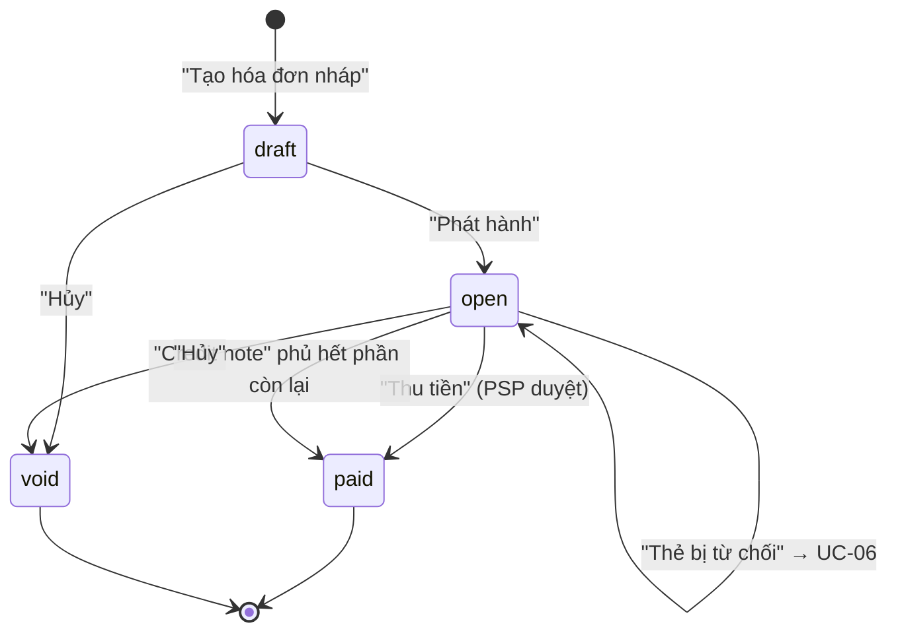
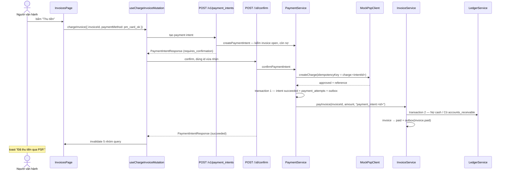

# UC-05 — Phát hành hoá đơn và thu tiền

## Ai, muốn gì

Người vận hành chốt số tiền của kỳ thành một hoá đơn có số, rồi thu tiền qua nhà xử lý thanh toán.
Đây là use case sinh ra nhiều bút toán sổ cái nhất, và là chỗ duy nhất trong erp-ui mà **một cú
click gửi hai request**.

## Điều kiện trước

| Cần có                                 | Từ đâu                             |
| -------------------------------------- | ---------------------------------- |
| Một subscription còn trong kỳ hiện tại | [UC-02](./02-subscribe-to-plan.md) |
| Biết trước số tiền sẽ ra               | [UC-04](./04-preview-charges.md)   |

## Vòng đời trên một dòng bảng

Trang `/invoices` hiện các nút **theo status**, nên bảng tự dạy thứ tự hợp lệ —
[InvoiceItem.tsx:54-55](../../apps/erp-ui/src/components/InvoiceItem.tsx):



| Status                            | Nút hiện ra                                   |
| --------------------------------- | --------------------------------------------- |
| `draft`                           | Phát hành · Hủy                               |
| `open`                            | Thu tiền · Thẻ bị từ chối · Credit note · Hủy |
| `paid` / `void` / `uncollectible` | không nút nào                                 |

`isBusy` — [InvoicesPage.tsx:105](../../apps/erp-ui/src/pages/InvoicesPage.tsx) — gộp bốn cờ
`isPending` lại, nên trong lúc một hành động đang chạy thì **mọi** nút trên **mọi** dòng đều bị vô
hiệu. Tránh bấm chồng trên một hoá đơn, đổi lại cả bảng đứng im một nhịp.

## Sơ đồ — bước "Thu tiền"



## Kịch bản chính

### Bước 1 — tạo nháp

| #   | Ở đâu                                                                                    | Chuyện gì xảy ra                                                                    | Quan sát được gì                           |
| --- | ---------------------------------------------------------------------------------------- | ----------------------------------------------------------------------------------- | ------------------------------------------ |
| 1   | UI [InvoicesPage.tsx:60-64](../../apps/erp-ui/src/pages/InvoicesPage.tsx)                | `handleOnDraft` — chưa chọn subscription thì `if` không vào, nút cũng đã `disabled` | —                                          |
| 2   | API [request.ts:40-42](../../apps/erp-ui/src/api/invoices/request.ts)                    | `POST /v1/invoices` body `{ subscriptionId }`                                       | —                                          |
| 3   | Service [ensureDraftInvoice:53-110](../../packages/core/src/services/invoice.service.ts) | **idempotent theo kỳ**: đã có hoá đơn cho `currentPeriodStart` thì trả về cái cũ    | bấm hai lần không ra hai hoá đơn           |
| 4   | Service [invoice.service.ts:67-98](../../packages/core/src/services/invoice.service.ts)  | transaction: `invoices` (total 0, `number = null`) + `invoice.created`              | dòng mới, cột Số hiện **id** vì chưa có số |

### Bước 2 — phát hành

| #   | Ở đâu                                                                                     | Chuyện gì xảy ra                                                      | Quan sát được gì                                                                                                                                    |
| --- | ----------------------------------------------------------------------------------------- | --------------------------------------------------------------------- | --------------------------------------------------------------------------------------------------------------------------------------------------- |
| 5   | UI [InvoiceItem.tsx:34-36](../../apps/erp-ui/src/components/InvoiceItem.tsx)              | nút **Phát hành** chỉ hiện khi `draft`                                | —                                                                                                                                                   |
| 6   | API [request.ts:44-50](../../apps/erp-ui/src/api/invoices/request.ts)                     | `POST /v1/invoices/:id/finalize`, body `{}`                           | —                                                                                                                                                   |
| 7   | Service [invoice.service.ts:123-127](../../packages/core/src/services/invoice.service.ts) | `subscription.currentPeriodStart` phải còn khớp `invoice.periodStart` | lệch → 409, chặn dán số của kỳ mới vào hoá đơn kỳ cũ                                                                                                |
| 8   | Service [invoice.service.ts:129](../../packages/core/src/services/invoice.service.ts)     | `rateUpcomingInvoice` chạy lại — **con số chốt tại thời điểm này**    | phải khớp cái đã xem ở [UC-04](./04-preview-charges.md)                                                                                             |
| 9   | Service [invoice.service.ts:149-156](../../packages/core/src/services/invoice.service.ts) | `claimNumberSequence` trong transaction → `INV-000001`                | cột Số đổi từ id sang số hoá đơn                                                                                                                    |
| 10  | Service [invoice.service.ts:158](../../packages/core/src/services/invoice.service.ts)     | INSERT `invoice_line_items` — bản chụp bất biến                       | —                                                                                                                                                   |
| 11  | Service [postReceivable:336-362](../../packages/core/src/services/invoice.service.ts)     | bút toán **Nợ** `accounts_receivable` (theo khách) / **Có** `revenue` | trang `/ledger` có giao dịch mới                                                                                                                    |
| 12  | Service [invoice.service.ts:169](../../packages/core/src/services/invoice.service.ts)     | `nextAttemptAt = dueAt` (`now + INVOICE_DUE_DAYS`)                    | đây là thứ khiến dunning nhặt hoá đơn này về sau — [UC-06](./06-handle-declined-card.md). **Hai cột này không có trong response**, chỉ thấy qua SQL |
| 13  | Hook [mutations.ts:56](../../apps/erp-ui/src/reactquery/invoices/mutations.ts)            | toast in chính `invoice.number`                                       | `Đã phát hành INV-000001.`                                                                                                                          |

### Bước 3 — thu tiền

| #   | Ở đâu                                                                                     | Chuyện gì xảy ra                                                                                              | Quan sát được gì                                                                 |
| --- | ----------------------------------------------------------------------------------------- | ------------------------------------------------------------------------------------------------------------- | -------------------------------------------------------------------------------- |
| 14  | UI [InvoicesPage.tsx:73-78](../../apps/erp-ui/src/pages/InvoicesPage.tsx)                 | `handleOnCharge` gửi `paymentMethod: 'pm_card_ok'` — thẻ giả lập luôn duyệt                                   | hằng số ở [InvoicesPage.tsx:21-22](../../apps/erp-ui/src/pages/InvoicesPage.tsx) |
| 15  | Hook [mutations.ts:24-28](../../apps/erp-ui/src/reactquery/payments/mutations.ts)         | **hai request trong một `mutationFn`**: `createPaymentIntent` rồi `confirmPaymentIntent(paymentIntent.id, …)` | nếu request đầu lỗi thì request sau không chạy                                   |
| 16  | Service [payment.service.ts:35-54](../../packages/core/src/services/payment.service.ts)   | invoice phải `open`, `amountRemaining > 0`, `amount <= owed`                                                  | —                                                                                |
| 17  | Service [payment.service.ts:95-100](../../packages/core/src/services/payment.service.ts)  | `psp.createCharge` với `idempotencyKey: charge:<intentId>`                                                    | confirm lại cùng intent không trừ tiền lần nữa                                   |
| 18  | Service [payment.service.ts:110-148](../../packages/core/src/services/payment.service.ts) | transaction: intent `succeeded` + `payment_attempts` + `payment_intent.succeeded`                             | —                                                                                |
| 19  | Service [payment.service.ts:150-154](../../packages/core/src/services/payment.service.ts) | `payInvoice(..., 'payment_intent:<id>')` — **transaction thứ hai**                                            | xem mục rủi ro dưới                                                              |
| 20  | Service [postCashReceipt:364-391](../../packages/core/src/services/invoice.service.ts)    | bút toán **Nợ** `cash` / **Có** `accounts_receivable`                                                         | `/ledger` có giao dịch thứ hai                                                   |
| 21  | Service [invoice.service.ts:211](../../packages/core/src/services/invoice.service.ts)     | `isSettled` → status `paid`, `paidAt`, outbox `invoice.paid`                                                  | cột Còn lại về 0, status `paid`                                                  |
| 22  | Hook [mutations.ts:8-18](../../apps/erp-ui/src/reactquery/payments/mutations.ts)          | invalidate **5 nhóm**: paymentIntents, refunds, invoices, ledger.accounts, ledger.transactions                | trang `/payments` và `/ledger` cũng mới theo                                     |

## Mốc thời gian

| Xong ngay khi request cuối trả về                     | Xảy ra sau, do worker                                                                           |
| ----------------------------------------------------- | ----------------------------------------------------------------------------------------------- |
| `invoices` status `paid`, `amount_paid`, `paid_at`    | outbox relay `invoice.created`, `invoice.finalized`, `payment_intent.succeeded`, `invoice.paid` |
| `invoice_line_items` (bất biến)                       | webhook delivery cho từng event có endpoint đăng ký — [UC-09](./09-receive-webhooks.md)         |
| hàng `number_sequences` đã tăng                       | worker `ledger` kiểm sổ cân ở chu kỳ tới                                                        |
| `payment_intents` + `payment_attempts`                | —                                                                                               |
| **hai** giao dịch `ledger_transactions` với 4 posting | —                                                                                               |

Toàn bộ phần tiền là **đồng bộ**: khi toast hiện, sổ cái đã cân. Không có gì về tiền phải chờ worker.
Điểm này khác hẳn [UC-02](./02-subscribe-to-plan.md).

## Dữ liệu để lại

Theo đúng thứ tự ghi, cho một vòng draft → finalize → charge:

| #   | Bảng                                      | Hàng              | Giá trị đáng chú ý                                        |
| --- | ----------------------------------------- | ----------------- | --------------------------------------------------------- |
| 1   | `invoices`                                | 1                 | `draft`, `total = 0`, `number = null`                     |
| 2   | `outbox_events`                           | 1                 | `invoice.created`                                         |
| 3   | `number_sequences`                        | cập nhật          | `next_value` tăng 1                                       |
| 4   | `invoice_line_items`                      | 1 mỗi dòng rating | append-only, trigger `0011_invoice_immutability`          |
| 5   | `invoices`                                | cập nhật          | `open`, có `number`, `total`, `due_at`, `next_attempt_at` |
| 6   | `ledger_transactions` + `ledger_postings` | 1 + 2             | `external_id = invoice:<id>`                              |
| 7   | `payment_intents`                         | 1                 | `requires_confirmation` → `succeeded`, có `psp_reference` |
| 8   | `payment_attempts`                        | 1                 | `outcome = succeeded`, append-only                        |
| 9   | `ledger_transactions` + `ledger_postings` | 1 + 2             | `external_id = payment_intent:<id>`                       |
| 10  | `invoices`                                | cập nhật          | `paid`, `amount_paid`, `paid_at`                          |

`external_id` ở bước 6 và 9 là khoá chống ghi sổ hai lần, và cũng là khoá mà đối chiếu ở
[UC-10](./10-close-the-period.md) dùng để so khớp. Đổi định dạng chuỗi này là làm hỏng đối chiếu, mà
không có test nào bắt — [PITFALLS §3](../PITFALLS.md).

## Nhánh phụ và thất bại

| Tình huống                                    | Hệ quả                                                                                |
| --------------------------------------------- | ------------------------------------------------------------------------------------- |
| Bấm "Tạo hóa đơn nháp" hai lần cùng kỳ        | trả về hoá đơn cũ, không tạo thêm — `isCreated: false`                                |
| Subscription đã sang kỳ mới khi bấm Phát hành | 409 `covers a period the subscription has already left`                               |
| Phát hành hoá đơn có `total = 0`              | vẫn phát hành, nhưng **không** có bút toán — `postReceivable` bỏ qua khi `total <= 0` |
| Thu tiền một hoá đơn `draft`                  | nút không hiện; gọi API trực tiếp thì 409                                             |
| Thẻ bị từ chối                                | **không phải HTTP error** — xem [UC-06](./06-handle-declined-card.md)                 |
| Hủy hoá đơn đã trả tiền                       | 409, buộc dùng credit note hoặc refund — [UC-07](./07-refund-vs-credit-note.md)       |
| Hủy hoá đơn `open`                            | đảo bút toán: **Nợ** `revenue` / **Có** `accounts_receivable`                         |
| Hủy hoá đơn `draft`                           | không đảo gì, vì chưa từng ghi sổ                                                     |

### Rủi ro kiến trúc: hai transaction

Bước 18 và bước 19 nằm ở **hai transaction khác nhau**. Tiến trình chết giữa chúng thì payment intent
là `succeeded` (tiền đã trừ ở PSP) mà hoá đơn chưa được ghi nhận trả tiền — và **không có cơ chế tự
vá**.

Công cụ phát hiện là đối chiếu ở [UC-10](./10-close-the-period.md): trường hợp này hiện thành
`missing_in_ledger`. Việc sửa là thủ công.

## Đường thứ hai mà UI không dùng

`POST /v1/invoices/:id/pay` tồn tại và có cả hook
([usePayInvoiceMutation:65-83](../../apps/erp-ui/src/reactquery/invoices/mutations.ts)) nhưng
**không trang nào gọi**. Nó ghi nhận tiền vào **mà không qua PSP** — dùng cho chuyển khoản tay,
đối trừ ngoài hệ thống.

Gọi nó thì có bút toán `cash` nhưng **không** có `payment_intents`, nên đối chiếu ở
[UC-10](./10-close-the-period.md) sẽ báo `missing_in_processor`. Đó là hành vi đúng, không phải lỗi —
nhưng cần biết trước để không đi tìm bug.

## Tự chạy thử

### Trên màn hình

1. `/invoices` → chọn subscription → **Tạo hóa đơn nháp**. Dòng mới, status `draft`, Tổng `0`.
2. **Phát hành** → status `open`, cột Số thành `INV-000001`, Tổng có số tiền, Còn lại bằng Tổng.
3. **Thu tiền** → status `paid`, Đã trả = Tổng, Còn lại `0`, toast "Đã thu tiền qua PSP.".
4. Mở `/ledger` → hai giao dịch mới, mỗi cái hai posting cân nhau.
5. Mở `/payments` → payment intent `succeeded` với một attempt `succeeded`.

### Bằng curl

```bash
set -a && . ./.env && set +a
API=http://localhost:3000
AUTH="Authorization: Bearer $SECRET_API_KEY"
JSON='content-type: application/json'
```

```bash
INV=$(curl -s -X POST $API/v1/invoices -H "$AUTH" -H "$JSON" \
  -H "Idempotency-Key: $(uuidgen)" \
  -d '{"subscriptionId":"sub_..."}' | jq -r '.id')
echo "$INV"
```

Gửi lại đúng lệnh trên với `Idempotency-Key` **mới**: vẫn trả về cùng `id`, vì `ensureDraftInvoice`
idempotent theo kỳ — không phải nhờ idempotency key.

```bash
curl -s -X POST $API/v1/invoices/$INV/finalize -H "$AUTH" -H "$JSON" \
  -H "Idempotency-Key: $(uuidgen)" -d '{}' \
  | jq '{number, status, total, finalizedAt}'
```

`due_at` và `next_attempt_at` **không** nằm trong response — `invoiceSchema` không khai hai trường
đó, nên chúng là cột nội bộ chỉ đọc được qua SQL:

```bash
docker compose -f docker/compose.yml exec -T postgres psql -U vxrerp -d vxrerp -c \
"select number, status, due_at, next_attempt_at from invoices order by created_at desc limit 3"
```

Thu tiền — đúng hai lệnh mà UI gộp làm một:

```bash
PI=$(curl -s -X POST $API/v1/payment_intents -H "$AUTH" -H "$JSON" \
  -H "Idempotency-Key: $(uuidgen)" \
  -d "{\"invoiceId\":\"$INV\",\"paymentMethod\":\"pm_card_ok\"}" | jq -r '.id')

curl -s -X POST $API/v1/payment_intents/$PI/confirm -H "$AUTH" -H "$JSON" \
  -H "Idempotency-Key: $(uuidgen)" -d '{}' \
  | jq '{id, status, pspReference, attempts: [.attempts[].outcome]}'
```

Confirm **lần thứ hai** cùng intent đó: trả về 409 `cannot move from succeeded to succeeded`, tức là
máy trạng thái chặn trước cả khi chạm tới PSP.

```bash
curl -s $API/v1/invoices/$INV -H "$AUTH" \
  | jq '{number, status, total, amountPaid, amountRemaining}'
```

### Kiểm chứng bằng SQL

Bốn posting, hai giao dịch, sổ phải cân:

```bash
docker compose -f docker/compose.yml exec -T postgres psql -U vxrerp -d vxrerp -c \
"select t.external_id, a.code, p.direction, p.amount
 from ledger_postings p
 join ledger_transactions t on t.id = p.transaction_id
 join ledger_accounts a on a.id = p.account_id
 order by t.created_at desc, p.direction limit 8"
```

Mỗi `external_id` phải có tổng debit = tổng credit:

```bash
docker compose -f docker/compose.yml exec -T postgres psql -U vxrerp -d vxrerp -c \
"select t.external_id,
        sum(case when p.direction = 'debit' then p.amount else -p.amount end) as must_be_zero
 from ledger_postings p join ledger_transactions t on t.id = p.transaction_id
 group by t.external_id order by t.external_id"
```

Thử sửa hoá đơn đã phát hành để thấy trigger chặn:

```bash
docker compose -f docker/compose.yml exec -T postgres psql -U vxrerp -d vxrerp -c \
"update invoices set total = 1 where status <> 'draft'"
```

Postgres trả `invoice ... has been issued and its billed content is immutable`.

### Test tự động phủ kịch bản này

`packages/core/tests/invoices.integration.test.ts` (20 test) và `payments.integration.test.ts`
(12 test) đi đúng chuỗi trên, kể cả các nhánh 409. Chạy:

```bash
set -a && . ./.env && set +a && pnpm --filter @vxrerp/core test:integration
```

## Đọc sâu hơn

- [flow 06 — Invoicing](../flows/06-invoicing.md) — máy trạng thái, `number_sequences`, công thức `owed`
- [flow 07 — Payments](../flows/07-payments-and-refunds.md) — máy trạng thái intent, PSP giả lập
- [flow 10 — Ledger](../flows/10-ledger.md) — bốn bút toán chi tiết
- [UC-06](./06-handle-declined-card.md) — cùng nút, thẻ khác
- [ADR 0009](../adr/0009-phase-6-invoicing.md), [ADR 0010](../adr/0010-phase-7-payments.md)
