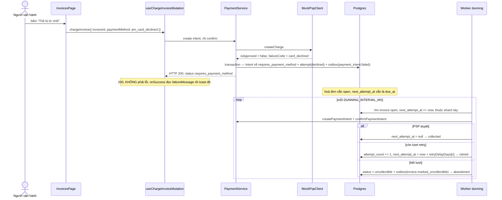

# UC-06 — Thẻ bị từ chối và vòng thu hồi nợ

## Ai, muốn gì

Người vận hành muốn thấy hệ thống xử lý gì khi thu tiền thất bại: lần thử đó được ghi ở đâu, hoá đơn
đi về đâu, và **worker nào** tự động thử lại — cho tới khi bỏ cuộc.

Đây là use case duy nhất mà phần lớn diễn biến xảy ra **sau khi bạn rời màn hình**.

## Điều kiện trước

| Cần có                                      | Từ đâu                                              |
| ------------------------------------------- | --------------------------------------------------- |
| Một hoá đơn `open` (đã phát hành, chưa trả) | [UC-05](./05-issue-and-collect-invoice.md) bước 1–2 |
| Worker `dunning` đang chạy                  | `pnpm dev`                                          |

## Sơ đồ



## Kịch bản chính — cú click

| #   | Ở đâu                                                                                           | Chuyện gì xảy ra                                                                                                                                                | Quan sát được gì                            |
| --- | ----------------------------------------------------------------------------------------------- | --------------------------------------------------------------------------------------------------------------------------------------------------------------- | ------------------------------------------- |
| 1   | UI [InvoicesPage.tsx:80-85](../../apps/erp-ui/src/pages/InvoicesPage.tsx)                       | `handleOnDecline` — **cùng** mutation với "Thu tiền", chỉ khác `paymentMethod: 'pm_card_declined'`                                                              | hai nút, một đường code                     |
| 2   | Client [mock-psp.client.ts:15-19](../../packages/core/src/clients/mock-psp.client.ts)           | PSP giả lập tra `paymentMethod` trong bảng lỗi → `card_declined`                                                                                                | —                                           |
| 3   | Service [payment.service.ts:103-108](../../packages/core/src/services/payment.service.ts)       | `charge.isApproved` false → `recordDeclinedAttempt`                                                                                                             | —                                           |
| 4   | Service [recordDeclinedAttempt:222-268](../../packages/core/src/services/payment.service.ts)    | transaction: intent về `requires_payment_method` + `failureCode`/`failureMessage`, INSERT `payment_attempts` outcome `declined`, outbox `payment_intent.failed` | —                                           |
| 5   | HTTP                                                                                            | trả **200** với `status: requires_payment_method`                                                                                                               | không có mã lỗi HTTP nào                    |
| 6   | Hook [mutations.ts:29-41](../../apps/erp-ui/src/reactquery/payments/mutations.ts)               | `onSuccess` kiểm `paymentIntent.failureMessage` → toast **đỏ**, `return` sớm để không toast thành công                                                          | toast "The card was declined by the issuer" |
| 7   | UI [InvoiceItem.tsx:90-104](../../apps/erp-ui/src/components/InvoiceItem.tsx)                   | hoá đơn vẫn `open` → ba nút vẫn đó                                                                                                                              | bấm lại được ngay                           |
| 8   | UI [PaymentIntentItem.tsx:40-42, 48-56](../../apps/erp-ui/src/components/PaymentIntentItem.tsx) | trang `/payments`: `failureCode` in đỏ dưới status; cột "Các lần thử" hiện chip cho từng attempt                                                                | mỗi lần bấm thêm một chip `declined`        |

### Thất bại nghiệp vụ ≠ lỗi kỹ thuật

Đây là điểm quan trọng nhất của use case: **thẻ bị từ chối là một kết quả, không phải một lỗi.**
Server trả 200, `onError` không chạy, mutation coi là thành công. Chỉ có
[mutations.ts:32](../../apps/erp-ui/src/reactquery/payments/mutations.ts) đọc `failureMessage` và
tự quyết định hiện toast đỏ.

Lý do: từ chối là thông tin nghiệp vụ cần lưu lại (`payment_attempts`), không phải sự cố cần retry.
Nếu trả 4xx/5xx thì BullMQ và mọi lớp retry sẽ hiểu sai và thử lại vô nghĩa.

Hệ quả khi tích hợp: **không** thể chỉ dựa vào HTTP status. Phải đọc `status` và `failureCode` của
payment intent.

## Kịch bản chính — worker dunning

Mọi hoá đơn `open` đều có `next_attempt_at` đặt từ lúc finalize (`= due_at`, tức
`now + INVOICE_DUE_DAYS`, mặc định **7 ngày** —
[env.schema.ts:64](../../packages/core/src/config/env.schema.ts)). Đó là đồng hồ duy nhất của dunning.

| #   | Ở đâu                                                                                       | Chuyện gì xảy ra                                                                                                |
| --- | ------------------------------------------------------------------------------------------- | --------------------------------------------------------------------------------------------------------------- |
| 9   | Worker [dunning.workflow.ts:47-57](../../apps/worker/src/workflows/dunning.workflow.ts)     | scheduler `dunning-run-scheduler`, chu kỳ `DUNNING_INTERVAL_MS` (mặc định 60s)                                  |
| 10  | Worker [dunning.workflow.ts:59-77](../../apps/worker/src/workflows/dunning.workflow.ts)     | quạt ra N shard, mỗi shard delay ngẫu nhiên tới `DUNNING_JITTER_MS`                                             |
| 11  | Service [dunning.service.ts:34-42](../../packages/core/src/services/dunning.service.ts)     | tìm invoice `open`, `next_attempt_at <= runAt`, băm shard theo **`customerId`**                                 |
| 12  | Service [dunning.service.ts:70-79](../../packages/core/src/services/dunning.service.ts)     | `amountRemaining <= 0` → `next_attempt_at = null`, kết quả `settled` (đã trả ở đường khác)                      |
| 13  | Service [resolvePaymentMethod:120-124](../../packages/core/src/services/dunning.service.ts) | đọc `customer.metadata.defaultPaymentMethod`, không có thì `pm_card_ok`                                         |
| 14  | Service [dunning.service.ts:82-86](../../packages/core/src/services/dunning.service.ts)     | gọi **đúng** `createPaymentIntent` + `confirmPaymentIntent` như UI — [UC-05](./05-issue-and-collect-invoice.md) |
| 15  | Service [dunning.service.ts:88-95](../../packages/core/src/services/dunning.service.ts)     | duyệt → `next_attempt_at = null`, `collected`                                                                   |
| 16  | Service [dunning.service.ts:97-110](../../packages/core/src/services/dunning.service.ts)    | còn lượt → `attempt_count += 1`, `next_attempt_at = runAt + delay ngày`, `retried`                              |
| 17  | Service [abandonInvoice:126-160](../../packages/core/src/services/dunning.service.ts)       | hết lượt → `uncollectible`, outbox `invoice.marked_uncollectible`, log `warn`                                   |

### Lịch retry

`DUNNING_RETRY_DELAY_DAYS` mặc định `'1,3,5,7'` —
[env.schema.ts:68](../../packages/core/src/config/env.schema.ts). Tra bằng
`retryDelayDays[attemptCount]` với `attemptCount` là số lần đã thử **sau** lần này:

| Lần thử | `attemptCount` | Tra `[attemptCount]` | Kết quả                       |
| ------- | -------------- | -------------------- | ----------------------------- |
| 1       | 1              | `3`                  | hẹn sau 3 ngày                |
| 2       | 2              | `5`                  | hẹn sau 5 ngày                |
| 3       | 3              | `7`                  | hẹn sau 7 ngày                |
| 4       | 4              | `undefined`          | **bỏ cuộc** → `uncollectible` |

Phần tử `[0]` (`1`) không bao giờ được đọc — lần hẹn đầu do `due_at` quyết định. Số lần thử tối đa
bằng độ dài mảng.

Băm shard theo `customerId` thay vì `invoiceId` là chủ ý: mọi hoá đơn của một khách rơi vào cùng
shard, nên không có hai shard cùng quẹt thẻ của một khách tại cùng thời điểm.

## Mốc thời gian

| Xong ngay khi 200 trả về                                          | Xảy ra sau, do worker                                                 |
| ----------------------------------------------------------------- | --------------------------------------------------------------------- |
| `payment_intents` về `requires_payment_method`, có `failure_code` | outbox relay `payment_intent.failed`                                  |
| một hàng `payment_attempts` outcome `declined`                    | worker `dunning` thử lại khi tới `next_attempt_at`                    |
| hoá đơn **không đổi** — vẫn `open`, `next_attempt_at` vẫn nguyên  | mỗi lần thất bại tiếp: `attempt_count` tăng, `next_attempt_at` đẩy xa |
| **không** có bút toán sổ cái nào                                  | sau lần cuối: `uncollectible` + `invoice.marked_uncollectible`        |

Không có tiền nào chuyển động, nên **không có bút toán**. Sổ cái chỉ ghi khi tiền thật sự vào hoặc
ra — [flow 10](../flows/10-ledger.md).

Lưu ý mốc thời gian thực tế: với mặc định `INVOICE_DUE_DAYS = 7`, dunning **không** chạm vào hoá đơn
vừa phát hành trong 7 ngày đầu. Muốn thấy nó chạy ngay thì phải hạ `INVOICE_DUE_DAYS` hoặc sửa
`next_attempt_at` trong DB — xem phần tự chạy thử.

## Dữ liệu để lại

| Bảng               | Hàng                           | Giá trị đáng chú ý                                                           |
| ------------------ | ------------------------------ | ---------------------------------------------------------------------------- |
| `payment_intents`  | 1 mỗi lần bấm                  | `status = requires_payment_method`, `failure_code`, `psp_reference = null`   |
| `payment_attempts` | 1 mỗi lần thử                  | `outcome = declined`, **append-only** (migration `0013_payment_append_only`) |
| `outbox_events`    | 1 mỗi lần                      | `payment_intent.failed`                                                      |
| `invoices`         | cập nhật, chỉ khi dunning chạy | `attempt_count`, `next_attempt_at`, có thể `uncollectible`                   |

Mỗi lần thử để lại đúng một hàng attempt, thành công hay thất bại. Lịch sử quẹt thẻ không bao giờ
mất — cần cho tranh chấp và cho đối chiếu.

## Nhánh phụ và thất bại

| Tình huống                                                    | Hệ quả                                                                                   |
| ------------------------------------------------------------- | ---------------------------------------------------------------------------------------- |
| Bấm "Thẻ bị từ chối" nhiều lần                                | mỗi lần một `payment_intents` **mới** + một attempt; hoá đơn không đổi                   |
| Bấm "Thu tiền" sau khi bị từ chối                             | thành công bình thường — intent `requires_payment_method` **không** phải trạng thái cuối |
| Confirm lại một intent đã bị từ chối                          | hợp lệ: `requires_payment_method → succeeded` nằm trong máy trạng thái                   |
| Khách có `metadata.defaultPaymentMethod = 'pm_card_declined'` | dunning sẽ thất bại mọi lần và đi hết lịch retry                                         |
| Hoá đơn được trả bằng đường khác trong lúc chờ                | dunning thấy `amountRemaining <= 0` → `settled`, không quẹt thẻ thừa                     |
| `uncollectible` rồi khách trả muộn                            | vẫn chuyển sang `paid` được — không phải trạng thái cuối                                 |

### Khoảng trống đã biết: subscription không bao giờ `past_due`

Dunning chỉ đổi trạng thái **hoá đơn**. Không có chỗ nào trong codebase ghi `past_due` hay `unpaid`
lên `subscriptions` — hai trạng thái đó chỉ tồn tại trong enum và trong bảng chuyển trạng thái.

Hệ quả: nhánh `unpaid → entitlement blocked` ở [UC-02](./02-subscribe-to-plan.md) **hiện là code
chết**. Khách nợ bao nhiêu lâu vẫn giữ nguyên quyền dùng. Đây là việc còn thiếu, không phải thiết kế
— [PITFALLS §6](../PITFALLS.md).

### Chưa có thông báo cho khách

`NotificationQueue` được khai báo trong `QueueNameEnum` nhưng không có worker nào tiêu thụ. Dunning
thử thu lại **im lặng** — khách không nhận email nào. Đó là lý do Mailpit có trong `docker-compose`
mà chưa được dùng tới.

## Tự chạy thử

### Trên màn hình

1. `/invoices` → có một hoá đơn `open` → bấm **Thẻ bị từ chối**.
2. Toast **đỏ**: "The card was declined by the issuer". Hoá đơn vẫn `open`.
3. `/payments` → payment intent mới, status `requires_payment_method`, dưới status có chữ đỏ
   `card_declined`, cột "Các lần thử" có một chip `declined`.
4. Về `/invoices` bấm **Thẻ bị từ chối** lần nữa → `/payments` có intent thứ hai.
5. Bấm **Thu tiền** → intent thứ ba, `succeeded`, hoá đơn `paid`.

### Bằng curl — thấy 200 chứ không phải lỗi

```bash
set -a && . ./.env && set +a
API=http://localhost:3000
AUTH="Authorization: Bearer $SECRET_API_KEY"
JSON='content-type: application/json'
```

```bash
PI=$(curl -s -X POST $API/v1/payment_intents -H "$AUTH" -H "$JSON" \
  -H "Idempotency-Key: $(uuidgen)" \
  -d '{"invoiceId":"in_...","paymentMethod":"pm_card_declined"}' | jq -r '.id')

curl -s -o /tmp/pi.json -w 'HTTP %{http_code}\n' \
  -X POST $API/v1/payment_intents/$PI/confirm -H "$AUTH" -H "$JSON" \
  -H "Idempotency-Key: $(uuidgen)" -d '{}'

jq '{status, failureCode, failureMessage, attempts: [.attempts[].outcome]}' /tmp/pi.json
```

In ra `HTTP 200` kèm `failureCode: "card_declined"`. Đúng điều mục trên nói.

Ba mã thẻ giả lập — [mock-psp.client.ts:15-19](../../packages/core/src/clients/mock-psp.client.ts):

| `paymentMethod`              | `failureCode`        |
| ---------------------------- | -------------------- |
| `pm_card_declined`           | `card_declined`      |
| `pm_card_insufficient_funds` | `insufficient_funds` |
| `pm_card_error`              | `processing_error`   |

### Buộc dunning chạy ngay

Mặc định phải chờ 7 ngày. Đẩy `next_attempt_at` về quá khứ:

```bash
docker compose -f docker/compose.yml exec -T postgres psql -U vxrerp -d vxrerp -c \
"update invoices set next_attempt_at = now() - interval '1 day' where status = 'open'"
```

Cho khách luôn bị từ chối, để thấy nhánh retry thay vì `collected`:

```bash
docker compose -f docker/compose.yml exec -T postgres psql -U vxrerp -d vxrerp -c \
"update customers set metadata = '{\"defaultPaymentMethod\":\"pm_card_declined\"}'::jsonb where id = 'cus_...'"
```

Trong vòng `DUNNING_INTERVAL_MS` (60s), log của worker `dunning` in
`[DunningService] runDunningShard() completed` kèm `{ scanned, collected, retried, abandoned, settled }`.

Lặp lại lệnh đẩy `next_attempt_at` bốn lần là đi hết lịch retry và thấy hoá đơn thành
`uncollectible`.

### Kiểm chứng bằng SQL

Đồng hồ dunning và số lần đã thử:

```bash
docker compose -f docker/compose.yml exec -T postgres psql -U vxrerp -d vxrerp -c \
"select number, status, attempt_count, due_at, next_attempt_at from invoices order by created_at desc limit 5"
```

Lịch sử mọi lần quẹt thẻ:

```bash
docker compose -f docker/compose.yml exec -T postgres psql -U vxrerp -d vxrerp -c \
"select a.outcome, a.failure_code, a.payment_method, i.status as intent_status
 from payment_attempts a join payment_intents i on i.id = a.payment_intent_id
 order by a.created_at desc limit 10"
```

Xác nhận **không** có bút toán nào sinh ra từ các lần thất bại:

```bash
docker compose -f docker/compose.yml exec -T postgres psql -U vxrerp -d vxrerp -c \
"select count(*) from ledger_transactions where external_id like 'payment_intent:%'"
```

Số này chỉ tăng khi có lần thu **thành công**.

### Test tự động phủ kịch bản này

`packages/core/tests/dunning.integration.test.ts` (13 test) đi hết lịch retry, kể cả nhánh
`abandoned` và `settled`, mà không cần chờ ngày thật.

## Đọc sâu hơn

- [flow 09 — Dunning](../flows/09-dunning.md) — mẫu scheduler + shard, chi tiết lịch retry
- [flow 07 — Payments](../flows/07-payments-and-refunds.md) — máy trạng thái payment intent
- [UC-07](./07-refund-vs-credit-note.md) — khi cần xoá nợ thay vì thu tiếp
- [ADR 0011](../adr/0011-phase-8-dunning-webhooks.md)
