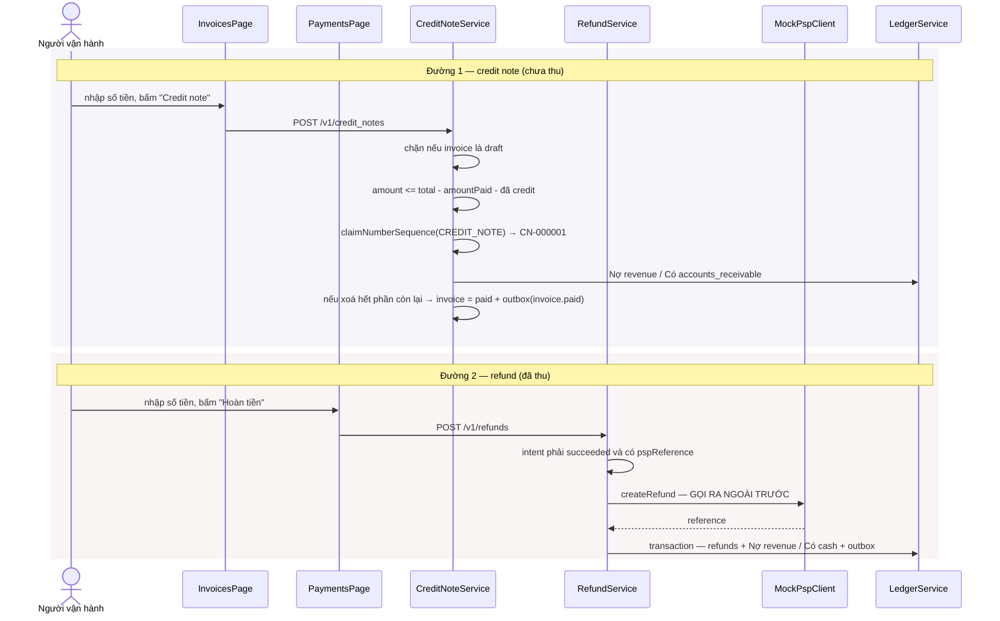

# UC-07 — Trả lại tiền: credit note hay refund

## Ai, muốn gì

Người vận hành cần giảm số tiền khách phải trả, hoặc trả lại tiền đã thu. Hai việc đó là **hai công
cụ khác nhau**, và chọn sai thì hệ thống chặn.

Một câu để nhớ: **chưa thu thì credit note, đã thu thì refund.**

## Chọn công cụ nào

|              | Credit note                             | Refund                                               |
| ------------ | --------------------------------------- | ---------------------------------------------------- |
| Xoá phần nào | phần **chưa trả** của hoá đơn           | phần **đã trả** qua PSP                              |
| Màn hình     | `/billing/invoices`, nút "Credit note"  | `/billing/payments`, nút "Hoàn tiền"                 |
| Điều kiện    | hoá đơn **không** phải `draft`          | payment intent phải `succeeded` và có `pspReference` |
| Trần số tiền | `total − amountPaid − đã credit`        | `paymentIntent.amount − đã hoàn`                     |
| Gọi ra PSP   | **không**                               | **có** — `psp.createRefund`                          |
| Bút toán     | Nợ `revenue` / Có `accounts_receivable` | Nợ `revenue` / Có `cash`                             |
| Có số riêng  | có — `CN-000001`                        | không, chỉ có id `re_...`                            |
| Event        | `credit_note.created`                   | `refund.created`                                     |

Cả hai đều ghi **Nợ `revenue`** — doanh thu giảm trong cả hai trường hợp. Khác nhau ở vế Có: credit
note xoá một khoản **phải thu**, refund làm **tiền mặt** đi ra.

## Điều kiện trước

| Muốn thử    | Cần có                                                                                     |
| ----------- | ------------------------------------------------------------------------------------------ |
| Credit note | một hoá đơn `open` còn nợ — [UC-05](./05-issue-and-collect-invoice.md) bước 1–2            |
| Refund      | một hoá đơn đã thu tiền thành công — [UC-05](./05-issue-and-collect-invoice.md) đủ ba bước |

## Sơ đồ



## Kịch bản chính — credit note

| #   | Ở đâu                                                                                                      | Chuyện gì xảy ra                                                                                                             | Quan sát được gì                                                                        |
| --- | ---------------------------------------------------------------------------------------------------------- | ---------------------------------------------------------------------------------------------------------------------------- | --------------------------------------------------------------------------------------- |
| 1   | UI [InvoicesPage.tsx:127-133](../../apps/erp-ui/src/pages/InvoicesPage.tsx)                                | ô "Số tiền credit note" nằm ở **đầu trang**, dùng chung cho mọi dòng                                                         | mặc định `100000` — [InvoicesPage.tsx:20](../../apps/erp-ui/src/pages/InvoicesPage.tsx) |
| 2   | UI [InvoiceItem.tsx:100-104](../../apps/erp-ui/src/components/InvoiceItem.tsx)                             | nút "Credit note" chỉ hiện khi status `open`                                                                                 | —                                                                                       |
| 3   | UI [InvoicesPage.tsx:94-103](../../apps/erp-ui/src/pages/InvoicesPage.tsx)                                 | `handleOnCredit` gửi `{ invoiceId, amount: Number(creditAmount), reason: 'Điều chỉnh từ admin' }`                            | `reason` **hard-code**                                                                  |
| 4   | API [request.ts:22-24](../../apps/erp-ui/src/api/credit-notes/request.ts)                                  | `POST /v1/credit_notes`                                                                                                      | —                                                                                       |
| 5   | Service [credit-note.service.ts:28-32](../../packages/modules/billing/src/services/credit-note.service.ts) | hoá đơn `draft` → 409 "still a draft and should be edited rather than credited"                                              | —                                                                                       |
| 6   | Service [credit-note.service.ts:34-42](../../packages/modules/billing/src/services/credit-note.service.ts) | `creditable = total − amountPaid − đã credit`; vượt → 400 với thông điệp nói rõ "money already paid is returned by a refund" | lỗi tự dạy công cụ đúng                                                                 |
| 7   | Service [credit-note.service.ts:48-55](../../packages/modules/billing/src/services/credit-note.service.ts) | `claimNumberSequence(CREDIT_NOTE)` → `CN-000001`                                                                             | dãy số riêng, độc lập với `INV-`                                                        |
| 8   | Service [postCredit:147-169](../../packages/modules/billing/src/services/credit-note.service.ts)           | Nợ `revenue` / Có `accounts_receivable`                                                                                      | `/billing/ledger` có giao dịch mới                                                      |
| 9   | Service [credit-note.service.ts:79-81](../../packages/modules/billing/src/services/credit-note.service.ts) | credit **vừa đúng** phần còn lại → `settleInvoice`                                                                           | hoá đơn thành `paid` **mà không có đồng nào vào**                                       |
| 10  | Hook [mutations.ts:116](../../apps/erp-ui/src/reactquery/invoices/mutations.ts)                            | toast in `creditNote.number`                                                                                                 | `Đã tạo CN-000001.`                                                                     |
| 11  | UI [InvoiceItem.tsx:74-82](../../apps/erp-ui/src/components/InvoiceItem.tsx)                               | cột "Đã credit" tăng, "Còn lại" giảm                                                                                         | ba cột tiền cập nhật cùng lúc                                                           |

Bước 9 hay gây bất ngờ: hoá đơn `paid` **không** nghĩa là đã thu được tiền. Nó nghĩa là không còn gì
phải thu. Muốn biết tiền thật vào bao nhiêu thì đọc `amount_paid`, không đọc `status`.

## Kịch bản chính — refund

| #   | Ở đâu                                                                                            | Chuyện gì xảy ra                                                                 | Quan sát được gì                            |
| --- | ------------------------------------------------------------------------------------------------ | -------------------------------------------------------------------------------- | ------------------------------------------- |
| 1   | UI [PaymentIntentItem.tsx:29, 60-65](../../apps/erp-ui/src/components/PaymentIntentItem.tsx)     | nút "Hoàn tiền" **chỉ** hiện khi intent `succeeded`                              | intent bị từ chối không có nút              |
| 2   | UI [PaymentsPage.tsx:28-37](../../apps/erp-ui/src/pages/PaymentsPage.tsx)                        | `handleOnRefund` gửi `{ paymentIntentId, amount, reason: 'Hoàn tiền từ admin' }` | ô số tiền ở đầu trang, dùng chung           |
| 3   | Service [refund.service.ts:25-37](../../packages/modules/billing/src/services/refund.service.ts) | intent phải `succeeded`, phải có `pspReference`                                  | hai 409 khác nhau                           |
| 4   | Service [refund.service.ts:39-48](../../packages/modules/billing/src/services/refund.service.ts) | `refundable = paymentIntent.amount − đã hoàn`                                    | hoàn nhiều lần được, tới hết                |
| 5   | Service [refund.service.ts:51-56](../../packages/modules/billing/src/services/refund.service.ts) | `psp.createRefund` — **gọi ra ngoài trước khi ghi DB**                           | xem mục rủi ro                              |
| 6   | Service [refund.service.ts:59-84](../../packages/modules/billing/src/services/refund.service.ts) | transaction: `refunds` + bút toán + outbox `refund.created`                      | —                                           |
| 7   | Service [postRefund:122-143](../../packages/modules/billing/src/services/refund.service.ts)      | Nợ `revenue` / Có `cash`                                                         | tiền mặt giảm trên `/billing/ledger`        |
| 8   | Hook [mutations.ts:8-18](../../apps/erp-ui/src/reactquery/payments/mutations.ts)                 | invalidate 5 nhóm query                                                          | `/billing/invoices` cột "Đã hoàn" tăng theo |

### Rủi ro: gọi PSP trước, ghi DB sau

[refund.service.ts:51-59](../../packages/modules/billing/src/services/refund.service.ts) gọi PSP rồi mới mở
transaction. Thứ tự này đúng ở một nửa: PSP lỗi thì không hàng nào được ghi. Nhưng nếu DB lỗi **sau
khi** PSP đã hoàn tiền thì tiền đã đi mà không có bản ghi — cùng loại khe hở như ở
[UC-05](./05-issue-and-collect-invoice.md).

Đối chiếu ở [UC-10](./10-close-the-period.md) là công cụ phát hiện.

## Mốc thời gian

Cả hai đường đều **đồng bộ toàn bộ phần tiền**.

| Xong ngay khi response trả về                                                      | Xảy ra sau, do worker                                                        |
| ---------------------------------------------------------------------------------- | ---------------------------------------------------------------------------- |
| **Credit note**: hàng `credit_notes`, số `CN-…`, bút toán, có thể `invoice = paid` | outbox relay `credit_note.created` (+ `invoice.paid` nếu tất toán)           |
| **Refund**: hàng `refunds`, `psp_reference`, bút toán                              | outbox relay `refund.created`                                                |
| ba cột tiền trên `/billing/invoices` đều đúng ngay                                 | webhook delivery nếu có endpoint đăng ký — [UC-09](./09-receive-webhooks.md) |

## Dữ liệu để lại

| Bảng                                      | Đường nào                 | Giá trị đáng chú ý                                                               |
| ----------------------------------------- | ------------------------- | -------------------------------------------------------------------------------- |
| `credit_notes`                            | credit note               | `number` `CN-…`, `reason`; **append-only** (trigger `0011_invoice_immutability`) |
| `number_sequences`                        | credit note               | hàng `credit_note` tăng 1                                                        |
| `invoices`                                | credit note, nếu tất toán | `status = paid`, `paid_at`, `next_attempt_at = null`                             |
| `refunds`                                 | refund                    | `psp_reference` **unique**, `reason`                                             |
| `ledger_transactions` + `ledger_postings` | cả hai                    | `external_id` = `credit_note:<id>` hoặc `refund:<id>`                            |

Ba cột `amountCredited`, `amountRefunded`, `amountRemaining` trên `/billing/invoices` **không** được lưu — ba
truy vấn tổng hợp mỗi lần đọc
([invoice.service.ts:495-509](../../packages/modules/billing/src/services/invoice.service.ts)), nên không bao
giờ lệch với bảng nguồn.

## Nhánh phụ và thất bại

| Tình huống                         | Hệ quả                                                                                  |
| ---------------------------------- | --------------------------------------------------------------------------------------- |
| Credit note cho hoá đơn `draft`    | 409 — nháp thì sửa thẳng                                                                |
| Credit note vượt phần chưa trả     | 400, message chỉ sang refund                                                            |
| Credit note đúng bằng phần còn lại | hoá đơn thành `paid`, `invoice.paid` phát ra                                            |
| Refund một intent chưa `succeeded` | 409 "never took money and has nothing to refund"; UI cũng không hiện nút                |
| Refund vượt số đã thu              | 400                                                                                     |
| Refund nhiều lần, tổng ≤ số đã thu | hợp lệ, mỗi lần một hàng `refunds`                                                      |
| PSP không tìm thấy charge          | `MockPspChargeNotFoundError` → **500**, vì client khai lỗi riêng, không phải `AppError` |
| PSP restart (mất `Map` trong RAM)  | mọi refund cho charge cũ đều 500 — [PITFALLS §9](../PITFALLS.md)                        |

Hàng cuối là bẫy hay gặp khi phát triển: `MockPspClient` giữ toàn bộ charge trong bộ nhớ, `pnpm dev`
reload là mất. Hoá đơn vẫn `paid` trong DB nhưng không refund được nữa. Cách xử lý: diễn lại từ
[UC-05](./05-issue-and-collect-invoice.md) sau khi API đã khởi động xong.

## Tự chạy thử

### Trên màn hình

**Credit note** — dựng một hoá đơn `open`, ghi rõ số tiền để đối chiếu:

1. `/billing/invoices` → tạo nháp → **Phát hành**. Ghi lại cột Tổng, ví dụ `200.000`.
2. Sửa ô "Số tiền credit note" thành `50000` → bấm **Credit note** trên dòng đó.
3. Cột "Đã credit" = `50.000`, "Còn lại" = `150.000`, status vẫn `open`.
4. Sửa ô thành `150000` → bấm **Credit note** lần nữa → status thành `paid`, "Còn lại" `0`, mà
   "Đã trả" vẫn `0`. Đúng như mục trên nói.
5. Bảng **Credit notes** dưới trang có hai hàng `CN-000001`, `CN-000002`.

**Refund** — cần một hoá đơn đã thu tiền thật:

1. Dựng và thu tiền một hoá đơn khác ([UC-05](./05-issue-and-collect-invoice.md)).
2. `/billing/payments` → sửa "Số tiền hoàn" thành một phần số đã thu → **Hoàn tiền**.
3. Bảng **Refunds** có hàng mới; về `/billing/invoices` cột "Đã hoàn" tăng.
4. Bấm **Hoàn tiền** tiếp cho tới khi vượt trần → toast đỏ 400.

### Bằng curl

```bash
set -a && . ./.env && set +a
API=http://localhost:3000
AUTH="Authorization: Bearer $SECRET_API_KEY"
JSON='content-type: application/json'
```

Credit note:

```bash
curl -s -X POST $API/v1/credit_notes -H "$AUTH" -H "$JSON" \
  -H "Idempotency-Key: $(uuidgen)" \
  -d '{"invoiceId":"in_...","amount":50000,"reason":"Khách báo sai số lượng"}' \
  | jq '{number, amount, invoiceId}'
```

Thử vượt trần để đọc thông điệp lỗi — nó chính là câu trả lời cho câu hỏi của use case này:

```bash
curl -s -X POST $API/v1/credit_notes -H "$AUTH" -H "$JSON" \
  -d '{"invoiceId":"in_...","amount":999999999,"reason":"thử"}' | jq '.error.message'
```

Refund:

```bash
curl -s -X POST $API/v1/refunds -H "$AUTH" -H "$JSON" \
  -H "Idempotency-Key: $(uuidgen)" \
  -d '{"paymentIntentId":"pi_...","amount":50000,"reason":"Khách yêu cầu"}' \
  | jq '{id, amount, pspReference}'
```

Thử refund một intent bị từ chối ([UC-06](./06-handle-declined-card.md)):

```bash
curl -s -X POST $API/v1/refunds -H "$AUTH" -H "$JSON" \
  -d '{"paymentIntentId":"pi_declined_...","amount":1000,"reason":"thử"}' | jq '.error'
```

Xem lại hoá đơn sau tất cả:

```bash
curl -s $API/v1/invoices/in_... -H "$AUTH" \
  | jq '{number, status, total, amountPaid, amountCredited, amountRefunded, amountRemaining}'
```

### Kiểm chứng bằng SQL

Ba con số trên UI, tự tính lại từ bảng nguồn:

```bash
docker compose -f docker/compose.yml exec -T postgres psql -U vxrerp -d vxrerp -c \
"select i.number, i.status, i.total, i.amount_paid,
        coalesce((select sum(c.amount) from billing.credit_notes c where c.invoice_id = i.id), 0) as credited,
        coalesce((select sum(r.amount) from billing.refunds r where r.invoice_id = i.id), 0) as refunded,
        i.total - i.amount_paid - coalesce((select sum(c.amount) from billing.credit_notes c where c.invoice_id = i.id), 0) as remaining
 from billing.invoices i order by i.created_at desc limit 5"
```

Phân biệt hai loại bút toán:

```bash
docker compose -f docker/compose.yml exec -T postgres psql -U vxrerp -d vxrerp -c \
"select t.external_id, a.code, p.direction, p.amount
 from billing.ledger_postings p
 join billing.ledger_transactions t on t.id = p.transaction_id
 join billing.ledger_accounts a on a.id = p.account_id
 where t.external_id like 'credit_note:%' or t.external_id like 'refund:%'
 order by t.created_at desc"
```

Credit note đi với `accounts_receivable`, refund đi với `cash`. Đó là toàn bộ khác biệt kế toán giữa
hai công cụ, hiện ra trong một câu truy vấn.

### Test tự động phủ kịch bản này

`packages/modules/billing/tests/invoices.integration.test.ts` phủ credit note kể cả nhánh tất toán;
`payments.integration.test.ts` phủ refund một phần và toàn bộ.

## Đọc sâu hơn

- [flow 06 — Invoicing](../flows/06-invoicing.md) — credit note, công thức `owed`
- [flow 07 — Payments](../flows/07-payments-and-refunds.md) — refund, PSP giả lập
- [flow 10 — Ledger](../flows/10-ledger.md) — vì sao cả hai đều Nợ `revenue`
- [UC-10](./10-close-the-period.md) — đối chiếu phát hiện refund lệch sổ
