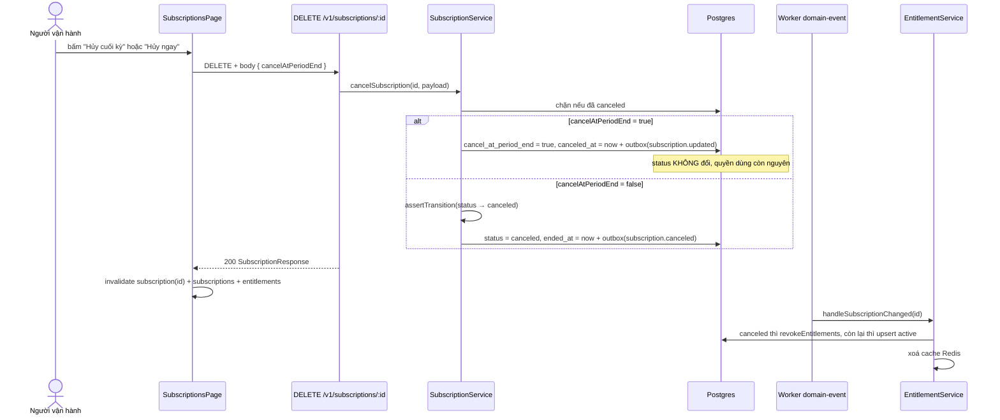

# UC-08 — Huỷ subscription: cuối kỳ hay ngay lập tức

## Ai, muốn gì

Khách xin dừng dịch vụ. Người vận hành phải chọn giữa hai cách, và hai cách đó khác nhau ở một điều
duy nhất mà khách quan tâm: **còn được dùng tới hết kỳ đã trả tiền hay mất quyền ngay.**

Đúng như dòng chú thích trên trang: _"Quyền dùng tách khỏi chu kỳ tính tiền: hủy cuối kỳ thì khách
vẫn dùng tới hết kỳ"_ — [SubscriptionsPage.tsx:85-87](../../apps/erp-ui/src/pages/SubscriptionsPage.tsx).

## Điều kiện trước

| Cần có                                | Từ đâu                             |
| ------------------------------------- | ---------------------------------- |
| Một subscription chưa `canceled`      | [UC-02](./02-subscribe-to-plan.md) |
| Worker `outbox` + `domain-event` chạy | để entitlement được cập nhật       |

## Hai nút, một request

Cả hai nút gọi **cùng một** `DELETE /v1/subscriptions/:id`, chỉ khác một boolean trong body —
[SubscriptionItem.tsx:20-26](../../apps/erp-ui/src/components/SubscriptionItem.tsx):

| Nút             | Body                           | Status sau đó                       | Khách còn dùng được        |
| --------------- | ------------------------------ | ----------------------------------- | -------------------------- |
| **Hủy cuối kỳ** | `{ cancelAtPeriodEnd: true }`  | **không đổi** (`active`/`trialing`) | có, tới `currentPeriodEnd` |
| **Hủy ngay**    | `{ cancelAtPeriodEnd: false }` | `canceled`                          | không                      |

Hai nút biến mất khi status là `canceled` —
[SubscriptionItem.tsx:52-53](../../apps/erp-ui/src/components/SubscriptionItem.tsx).

## Sơ đồ



## Kịch bản chính

| #   | Ở đâu                                                                                               | Chuyện gì xảy ra                                                                                                                   | Quan sát được gì                                         |
| --- | --------------------------------------------------------------------------------------------------- | ---------------------------------------------------------------------------------------------------------------------------------- | -------------------------------------------------------- |
| 1   | UI [SubscriptionsPage.tsx:74-79](../../apps/erp-ui/src/pages/SubscriptionsPage.tsx)                 | `handleOnCancel(subscriptionId, cancelAtPeriodEnd)`                                                                                | một handler cho cả hai nút                               |
| 2   | API [request.ts:52-61](../../apps/erp-ui/src/api/subscriptions/request.ts)                          | `DELETE` **có body** — hiếm, nhưng hợp lệ                                                                                          | —                                                        |
| 3   | Service [subscription.service.ts:223-225](../../packages/core/src/services/subscription.service.ts) | đã `canceled` → 409 `is already canceled`                                                                                          | —                                                        |
| 4   | Service [subscription.service.ts:227](../../packages/core/src/services/subscription.service.ts)     | `resolveNow(testClockId)` — mốc thời gian theo test clock nếu có                                                                   | [UC-11](./11-simulate-a-billing-cycle.md)                |
| 5a  | Service [subscription.service.ts:229-247](../../packages/core/src/services/subscription.service.ts) | **cuối kỳ**: chỉ set `cancelAtPeriodEnd = true` + `canceledAt`, event `subscription.updated`                                       | status không đổi                                         |
| 5b  | Service [subscription.service.ts:249-271](../../packages/core/src/services/subscription.service.ts) | **ngay**: `assertTransition`, rồi `status = canceled`, `endedAt = now`, `cancelAtPeriodEnd = false`, event `subscription.canceled` | —                                                        |
| 6   | Hook [mutations.ts:39-46](../../apps/erp-ui/src/reactquery/subscriptions/mutations.ts)              | invalidate 3 nhóm, toast "Đã hủy subscription."                                                                                    | toast **giống nhau** cho cả hai nhánh                    |
| 7   | UI [SubscriptionItem.tsx:37-41](../../apps/erp-ui/src/components/SubscriptionItem.tsx)              | nhánh cuối kỳ hiện thêm chip vàng "hủy cuối kỳ" bên cạnh status                                                                    | đây là **cách duy nhất** trên UI để phân biệt hai nhánh  |
| 8   | Worker [entitlement.service.ts:40-50](../../packages/core/src/services/entitlement.service.ts)      | `canceled` → `revokeEntitlements` cho cả subscription, xoá cache                                                                   | bảng Entitlements đổi sang `revoked` **sau khi tải lại** |

Bước 6 đáng lưu ý: toast không nói rõ đã huỷ kiểu nào. Muốn chắc thì xem có chip "hủy cuối kỳ" hay
status đã thành `canceled`.

## Điều gì thực sự xảy ra khi tới cuối kỳ

"Hủy cuối kỳ" **không** tự động huỷ khi tới ngày. Việc chuyển status xảy ra trong `rollPeriod` —
[subscription.service.ts:320-332](../../packages/core/src/services/subscription.service.ts):

```
cancelAtPeriodEnd = true  →  status = canceled, endedAt = periodEnd, event subscription.canceled
```

Nhưng `rollPeriod` chỉ chạy từ `advanceSubscriptions`, và hàm đó **chỉ được gọi khi test clock nhảy
giờ** ([test-clock.service.ts:96](../../packages/core/src/services/test-clock.service.ts)).

Nghĩa là với một khách **không** gắn test clock, subscription đã đánh dấu "hủy cuối kỳ" sẽ nằm ở
`active` mãi mãi, kể cả khi `currentPeriodEnd` đã qua. Đây là khoảng trống đã biết — cùng gốc với
việc kỳ không tự gia hạn ([flow 04](../flows/04-subscription-entitlement.md)).

Muốn thấy nhánh này hoạt động thì phải dùng test clock — [UC-11](./11-simulate-a-billing-cycle.md).

## Mốc thời gian

| Xong ngay khi 200 trả về                                                   | Xảy ra sau, do worker                                         |
| -------------------------------------------------------------------------- | ------------------------------------------------------------- |
| `subscriptions` cập nhật (`cancel_at_period_end` hoặc `status = canceled`) | outbox relay `subscription.updated` / `subscription.canceled` |
| `outbox_events` trạng thái `pending`                                       | `entitlements` chuyển `revoked` — **chỉ** ở nhánh huỷ ngay    |
| bảng trên trang cập nhật ngay                                              | cache Redis entitlement bị xoá                                |

Giống [UC-02](./02-subscribe-to-plan.md): hook invalidate `entitlements` ngay trong `onSuccess`, tại
thời điểm worker còn chưa chạy. Bảng Entitlements vẫn hiện `active` cho tới khi tải lại trang sau vài
giây. **Quyền dùng bị thu hồi chậm hơn thao tác huỷ** — quan trọng nếu sản phẩm gác cổng bằng
entitlement.

Ở nhánh huỷ cuối kỳ thì entitlement **không đổi gì**: status subscription vẫn `active` nên
`handleSubscriptionChanged` upsert lại đúng `active`. Đúng như thiết kế.

## Dữ liệu để lại

| Bảng                 | Huỷ cuối kỳ                                                                                       | Huỷ ngay                                                                             |
| -------------------- | ------------------------------------------------------------------------------------------------- | ------------------------------------------------------------------------------------ |
| `subscriptions`      | `cancel_at_period_end = true`, `canceled_at = now`; `status` **không đổi**; `ended_at` vẫn `null` | `status = canceled`, `canceled_at`, `ended_at = now`, `cancel_at_period_end = false` |
| `outbox_events`      | `subscription.updated`                                                                            | `subscription.canceled`                                                              |
| `entitlements`       | không đổi                                                                                         | `status = revoked`, `revoked_at`                                                     |
| `subscription_items` | giữ nguyên                                                                                        | giữ nguyên                                                                           |

Không hàng nào bị xoá. `subscription_items` vẫn còn để hoá đơn cũ tra được đã bán gì.

## Khách thấy gì trên portal

`/customers/<customerId>` của operator-portal đọc trực tiếp từ API và render trên server —
[page.tsx:27-31](../../apps/operator-portal/src/app/customers/[customerId]/page.tsx), ba GET song song,
`cache: 'no-store'`.

| Sau khi huỷ | Bảng "Gói đang dùng"                                                             |
| ----------- | -------------------------------------------------------------------------------- |
| cuối kỳ     | vẫn hiện, status `active` màu xanh — **khách không thấy dấu hiệu nào là đã huỷ** |
| ngay        | status `canceled` màu xám                                                        |

Cột `cancelAtPeriodEnd` **không** được portal render
([page.tsx:48-54](../../apps/operator-portal/src/app/customers/[customerId]/page.tsx) chỉ có 4 cột: Mã,
Trạng thái, Kỳ hiện tại, Hết trial). Nên một khách đã xin huỷ cuối kỳ vào portal vẫn thấy gói
"active" bình thường. Đáng sửa nếu portal ra thật.

Portal cũng **không có đăng nhập** — [UC-09](./09-receive-webhooks.md) và
[PITFALLS §7](../PITFALLS.md).

## Nhánh phụ và thất bại

| Tình huống                           | Hệ quả                                                                                                                                                     |
| ------------------------------------ | ---------------------------------------------------------------------------------------------------------------------------------------------------------- |
| Huỷ một subscription đã `canceled`   | 409 `is already canceled`; UI đã ẩn nút                                                                                                                    |
| Huỷ ngay một subscription `trialing` | hợp lệ — `trialing → canceled` có trong bảng chuyển trạng thái                                                                                             |
| Bấm "Hủy cuối kỳ" hai lần            | lần hai vẫn 200, chỉ ghi lại `canceled_at` mới                                                                                                             |
| "Hủy cuối kỳ" rồi "Hủy ngay"         | hợp lệ, thành `canceled` luôn                                                                                                                              |
| "Hủy ngay" rồi muốn mở lại           | **không có đường nào** — `canceled` là trạng thái cuối, danh sách đích rỗng. Phải tạo subscription mới                                                     |
| Hoá đơn `open` của kỳ đang chạy      | **không bị huỷ theo** — dunning vẫn thu tiếp ([UC-06](./06-handle-declined-card.md)). Muốn xoá nợ thì credit note ([UC-07](./07-refund-vs-credit-note.md)) |

Hai hàng cuối là những thứ dễ gây bất ngờ nhất: huỷ là không thể hoàn tác, và huỷ subscription không
xoá nợ đã phát hành.

## Tự chạy thử

### Trên màn hình

1. `/subscriptions` → chọn một dòng `active` → **Hủy cuối kỳ**.
2. Status **vẫn** `active`, bên cạnh có chip vàng "hủy cuối kỳ". Hai nút vẫn còn.
3. Bảng Entitlements: vẫn `active` — đúng, vì quyền dùng chưa mất.
4. Trên một dòng khác → **Hủy ngay** → status `canceled`, ô Thao tác thành "đã kết thúc".
5. Chờ ~5 giây, F5 → entitlement của dòng đó thành `revoked`.
6. Mở portal `http://localhost:3100/customers/<customerId>` → so sánh hai subscription.

### Bằng curl

```bash
set -a && . ./.env && set +a
API=http://localhost:3000
AUTH="Authorization: Bearer $SECRET_API_KEY"
JSON='content-type: application/json'
```

Huỷ cuối kỳ — để ý `status` trong response **không** phải `canceled`:

```bash
curl -s -X DELETE $API/v1/subscriptions/sub_... -H "$AUTH" -H "$JSON" \
  -H "Idempotency-Key: $(uuidgen)" \
  -d '{"cancelAtPeriodEnd":true}' \
  | jq '{status, cancelAtPeriodEnd, canceledAt, endedAt, currentPeriodEnd}'
```

Huỷ ngay:

```bash
curl -s -X DELETE $API/v1/subscriptions/sub_... -H "$AUTH" -H "$JSON" \
  -H "Idempotency-Key: $(uuidgen)" \
  -d '{"cancelAtPeriodEnd":false}' \
  | jq '{status, canceledAt, endedAt}'
```

Huỷ lần nữa để thấy máy trạng thái chặn:

```bash
curl -s -X DELETE $API/v1/subscriptions/sub_... -H "$AUTH" -H "$JSON" \
  -d '{"cancelAtPeriodEnd":false}' | jq '.error.message'
```

Theo dõi entitlement chuyển sang `revoked`:

```bash
curl -s "$API/v1/entitlements?customerId=cus_..." -H "$AUTH" | jq '.data[] | {productId, status}'
```

Gọi ngay sau khi huỷ thì vẫn `active`; gọi lại sau vài giây thì `revoked`.

### Kiểm chứng bằng SQL

Bốn cột phân biệt hai nhánh, nhìn cạnh nhau:

```bash
docker compose -f docker/compose.yml exec -T postgres psql -U vxrerp -d vxrerp -c \
"select id, status, cancel_at_period_end, canceled_at is not null as has_canceled_at,
        ended_at is not null as has_ended_at, current_period_end
 from subscriptions order by updated_at desc limit 5"
```

Một subscription "hủy cuối kỳ" có `cancel_at_period_end = t`, `has_canceled_at = t`,
`has_ended_at = f`, `status = active`. Huỷ ngay thì cả ba cột đầu ngược lại.

Entitlement theo từng subscription:

```bash
docker compose -f docker/compose.yml exec -T postgres psql -U vxrerp -d vxrerp -c \
"select s.id, s.status as sub_status, e.status as ent_status, e.revoked_at
 from subscriptions s left join entitlements e on e.subscription_id = s.id
 order by s.updated_at desc limit 5"
```

Tìm những subscription đã quá kỳ mà chưa tự huỷ — chính là khoảng trống nói ở trên:

```bash
docker compose -f docker/compose.yml exec -T postgres psql -U vxrerp -d vxrerp -c \
"select id, status, cancel_at_period_end, current_period_end
 from subscriptions
 where cancel_at_period_end = true and current_period_end < now() and status <> 'canceled'"
```

Có hàng ở đây nghĩa là khách đã xin huỷ, kỳ đã hết, mà hệ thống vẫn coi là đang dùng.

### Test tự động phủ kịch bản này

`packages/core/tests/subscriptions.integration.test.ts` (9 test) phủ cả hai nhánh huỷ và các 409.

## Đọc sâu hơn

- [flow 04 — Subscription và entitlement](../flows/04-subscription-entitlement.md) — máy trạng thái, `rollPeriod`, bảng ánh xạ entitlement
- [UC-11](./11-simulate-a-billing-cycle.md) — cách duy nhất để thấy "hủy cuối kỳ" thực sự kết thúc
- [ADR 0005](../adr/0005-phase-3-subscription-entitlement.md)
