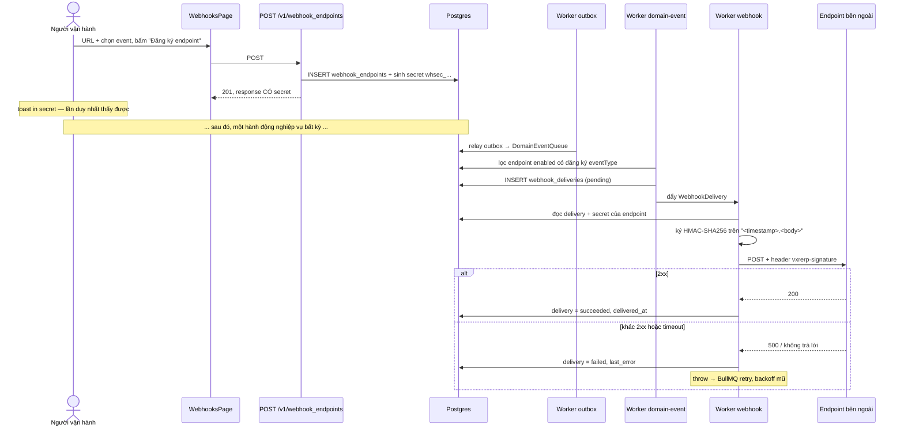

# UC-09 — Nhận webhook ở hệ thống bên ngoài

## Ai, muốn gì

Một hệ thống khác (CRM, kho, app của khách) cần biết khi có chuyện xảy ra trong VXR ERP. Người vận
hành đăng ký một URL, chọn loại event, rồi bên kia xác thực chữ ký và xử lý.

Đây là use case cho thấy **toàn bộ chuỗi bất đồng bộ** từ đầu đến cuối: một hành động nghiệp vụ →
outbox → hai worker → HTTP đi ra khỏi hệ thống.

## Điều kiện trước

| Cần có                                          | Từ đâu                                          |
| ----------------------------------------------- | ----------------------------------------------- |
| Một endpoint HTTP nhận được POST                | xem mục tự chạy thử — dựng bằng một dòng Python |
| Worker `outbox`, `domain-event`, `webhook` chạy | `pnpm dev`                                      |
| Một hành động sinh event                        | bất kỳ UC nào từ 01 đến 08                      |

## Sơ đồ



## Kịch bản chính — đăng ký endpoint

| #   | Ở đâu                                                                                       | Chuyện gì xảy ra                                                                            | Quan sát được gì                               |
| --- | ------------------------------------------------------------------------------------------- | ------------------------------------------------------------------------------------------- | ---------------------------------------------- |
| 1   | UI [WebhooksPage.tsx:40-44](../../apps/erp-ui/src/pages/WebhooksPage.tsx)                   | dropdown liệt kê **toàn bộ** `DomainEventTypeEnum` — 25 loại                                | `values(DomainEventTypeEnum)`, không hard-code |
| 2   | UI [WebhooksPage.tsx:54-56](../../apps/erp-ui/src/pages/WebhooksPage.tsx)                   | `handleOnCreate` gửi `{ url, enabledEvents: [selectedEvent], description: 'Tạo từ admin' }` | **một** event mỗi lần đăng ký từ UI            |
| 3   | UI [WebhooksPage.tsx:26](../../apps/erp-ui/src/pages/WebhooksPage.tsx)                      | URL mặc định `http://localhost:4100/hooks`                                                  | port 4100 không có gì chạy sẵn — phải tự dựng  |
| 4   | Service [webhook.service.ts:45-55](../../packages/platform/src/services/webhook.service.ts) | INSERT, secret sinh bằng `randomBytes(24)` với tiền tố `whsec_`                             | —                                              |
| 5   | Service [webhook.service.ts:61](../../packages/platform/src/services/webhook.service.ts)    | `buildEndpoint(..., { hasSecret: true })` — **chỉ** response này chứa secret                | mọi lần đọc sau đều trả `secret: null`         |
| 6   | Hook [mutations.ts:24](../../apps/erp-ui/src/reactquery/webhooks/mutations.ts)              | toast in thẳng secret: `Secret chỉ hiện một lần: whsec_...`                                 | **toast là load-bearing** — bỏ qua là mất      |

Bước 5–6 là điều quan trọng nhất của màn hình này: secret chỉ trả về đúng một lần, lúc tạo. Đóng
toast mà chưa copy thì phải tạo endpoint mới. Không có đường nào đọc lại
([webhook.service.ts:82, 88, 107](../../packages/platform/src/services/webhook.service.ts) đều
`hasSecret: false`).

## Kịch bản chính — một event đi ra

| #   | Ở đâu                                                                                                                     | Chuyện gì xảy ra                                                                                               |
| --- | ------------------------------------------------------------------------------------------------------------------------- | -------------------------------------------------------------------------------------------------------------- |
| 7   | bất kỳ service                                                                                                            | ghi `outbox_events` trong cùng transaction với nghiệp vụ — [flow 02](../flows/02-event-pipeline.md)            |
| 8   | Worker `outbox`                                                                                                           | claim bằng `FOR UPDATE SKIP LOCKED`, đẩy `DomainEventQueue` với `jobId = event.id`                             |
| 9   | Service [webhook.service.ts:130-136](../../packages/platform/src/services/webhook.service.ts)                             | lấy tối đa **200** endpoint `enabled`, lọc `enabledEvents` chứa `eventType`                                    |
| 10  | Service [webhook.service.ts:142-166](../../packages/platform/src/services/webhook.service.ts)                             | payload `{ id, type, createdAt, data: { object } }`; INSERT một `webhook_deliveries` cho **mỗi** endpoint khớp |
| 11  | Service [webhook.service.ts:177-188](../../packages/platform/src/services/webhook.service.ts)                             | đẩy job với `attempts: WEBHOOK_MAX_ATTEMPTS` (5), backoff mũ từ `WEBHOOK_BACKOFF_MS` (2s)                      |
| 12  | Service [webhook.service.ts:203](../../packages/platform/src/services/webhook.service.ts)                                 | ký **tại thời điểm gửi**, bằng secret hiện tại của endpoint                                                    |
| 13  | Util [webhook-signature.ts:10-15](../../packages/platform/src/utils/webhook-signature.ts)                                 | HMAC-SHA256 trên `<unix timestamp>.<body>`, header dạng `t=…,v1=<hex>`                                         |
| 14  | Processor [webhook-delivery.processor.ts:45-53](../../apps/worker/src/workflows/processors/webhook-delivery.processor.ts) | `fetch` POST, timeout `WEBHOOK_TIMEOUT_MS` (5s)                                                                |
| 15  | Service [webhook.service.ts:207-220](../../packages/platform/src/services/webhook.service.ts)                             | chỉ `response.ok` (2xx) là `succeeded` + `delivered_at`; còn lại `failed` + `last_error`                       |
| 16  | Processor [webhook-delivery.processor.ts:36](../../apps/worker/src/workflows/processors/webhook-delivery.processor.ts)    | thất bại thì `throw` để BullMQ retry                                                                           |

`attemptCount` lấy từ `job.attemptsMade + 1`, nên cột "Số lần thử" trên UI phản ánh đúng lần thứ mấy.

## Phía nhận cần làm gì

Ba việc, theo đúng thứ tự:

**1. Xác thực chữ ký.** Header `vxrerp-signature` có dạng `t=1736956800,v1=abc123…`. Tính lại
HMAC-SHA256 của `<t>.<raw body>` bằng secret, so bằng hàm chống timing attack. Logic tham chiếu:
[isWebhookSignatureValid:17-41](../../packages/platform/src/utils/webhook-signature.ts).

Phải dùng **raw body**, không phải JSON đã parse rồi serialize lại — thứ tự khoá và khoảng trắng đổi
là chữ ký sai.

**2. Chống trùng bằng `payload.id`.** Event id (`evt_...`) **giữ nguyên qua mọi lần thử** — nó là
`event.eventId` từ outbox, không sinh lại mỗi lần gửi
([webhook.service.ts:144](../../packages/platform/src/services/webhook.service.ts)). Bên nhận lưu id đã
xử lý và bỏ qua id trùng. Đúng như chú thích trên trang:
_"Mỗi event mang một `id` cố định qua mọi lần thử, nên bên nhận tự chặn trùng được"_
([WebhooksPage.tsx:70-71](../../apps/erp-ui/src/pages/WebhooksPage.tsx)).

**3. Trả 2xx nhanh.** Timeout là 5 giây. Xử lý nặng thì nhận rồi đưa vào queue của mình, đừng làm
xong mới trả lời.

## Mốc thời gian

| Xong ngay khi 201 trả về          | Xảy ra sau, do worker                                                 |
| --------------------------------- | --------------------------------------------------------------------- |
| hàng `webhook_endpoints` + secret | mỗi event khớp: một hàng `webhook_deliveries` (worker `domain-event`) |
| —                                 | HTTP POST ra ngoài (worker `webhook`)                                 |
| —                                 | cập nhật `status`, `attempt_count`, `response_status`, `last_error`   |

Không có gì về webhook là đồng bộ. Đăng ký endpoint xong thì **không** nhận được event của những
hành động đã xảy ra **trước** đó — `handleDomainEvent` chỉ nhìn endpoint đang có tại thời điểm event
được dispatch. Đăng ký rồi mới làm hành động.

## Dữ liệu để lại

| Bảng                 | Hàng                     | Giá trị đáng chú ý                                                      |
| -------------------- | ------------------------ | ----------------------------------------------------------------------- |
| `webhook_endpoints`  | 1                        | `secret` (đọc lại qua API không thấy), `enabled_events` jsonb, `status` |
| `webhook_deliveries` | 1 mỗi (event × endpoint) | giữ nguyên `payload` đã gửi — dựng lại được request y nguyên            |

`webhook_deliveries.payload` là bản chụp: đọc nó là biết chính xác bên kia đã nhận gì, không phải
đoán từ trạng thái hiện tại của hoá đơn.

## Nhánh phụ và thất bại

| Tình huống                                  | Hệ quả                                                                                                                              |
| ------------------------------------------- | ----------------------------------------------------------------------------------------------------------------------------------- |
| Endpoint trả 500                            | `failed`, BullMQ retry tới 5 lần, backoff mũ 2s → 4s → 8s…                                                                          |
| Endpoint không trả lời trong 5s             | `AbortSignal.timeout` cắt, `last_error` là chuỗi lỗi fetch                                                                          |
| Hết 5 lần                                   | job nằm ở failed set của queue, delivery đứng ở `failed` — **không có cơ chế gửi lại bằng tay**                                     |
| Endpoint `disabled`                         | bị lọc ra ngay ở bước 9, **không** sinh delivery                                                                                    |
| Endpoint đăng ký event không bao giờ xảy ra | không có delivery nào, không lỗi                                                                                                    |
| Hơn 200 endpoint `enabled`                  | các endpoint ngoài 200 đầu **bị bỏ qua âm thầm** ([webhook.service.ts:29](../../packages/platform/src/services/webhook.service.ts)) |
| Một đợt relay lớn                           | dội thẳng vào endpoint khách — **chưa có rate limit theo endpoint**, mục chặn production trong [ROADMAP](../ROADMAP.md)             |

Hàng "hết 5 lần" là hạn chế đáng biết nhất: bảng deliveries cho **thấy** đã thất bại nhưng không có
nút gửi lại. Cách duy nhất là tạo lại event từ phía nghiệp vụ.

## Tự chạy thử

### Dựng một endpoint nhận, in ra mọi thứ

Một file Python, không cần cài gì:

```bash
cat > /tmp/hook-server.py <<'PY'
from http.server import BaseHTTPRequestHandler, HTTPServer
import json

class Handler(BaseHTTPRequestHandler):
    def do_POST(self):
        body = self.rfile.read(int(self.headers.get('content-length', 0)))
        print('signature:', self.headers.get('vxrerp-signature'))
        print('body:', json.dumps(json.loads(body), indent=2, ensure_ascii=False))
        self.send_response(200)
        self.end_headers()
        self.wfile.write(b'ok')

    def log_message(self, *args):
        pass

HTTPServer(('127.0.0.1', 4100), Handler).serve_forever()
PY
python3 /tmp/hook-server.py
```

Đây là file script tạm ngoài repo nên viết bằng heredoc là đúng chỗ — khác với file trong repo,
[quy ước](../../.claude/rules/agentkit/core/agent-tooling-convention.md) yêu cầu dùng file tool.

### Trên màn hình

1. `/webhooks` → URL để nguyên `http://localhost:4100/hooks`, chọn event `invoice.finalized` →
   **Đăng ký endpoint**.
2. **Copy secret trong toast ngay** — dạng `whsec_...`. Đóng toast là mất.
3. Sang `/invoices`, phát hành một hoá đơn ([UC-05](./05-issue-and-collect-invoice.md)).
4. Trong vòng ~5 giây, terminal chạy `hook-server.py` in ra signature + payload.
5. Về `/webhooks`, bảng **Lần giao gần nhất**: một hàng `invoice.finalized`, status `succeeded`,
   Số lần thử `1`, HTTP `200`.
6. Bấm **Tắt** trên endpoint → phát hành hoá đơn khác → không có delivery nào mới.

Thử nhánh thất bại: dừng `hook-server.py` (Ctrl+C) rồi phát hành một hoá đơn. Bảng deliveries hiện
`failed`, Số lần thử tăng dần theo backoff, cột "Lỗi gần nhất" có chuỗi lỗi fetch.

### Xác thực chữ ký ở phía nhận

Lấy `signature` và `body` mà server in ra, rồi tự tính lại:

```bash
SECRET='whsec_...'
SIG='t=1736956800,v1=abc...'
BODY='{"id":"evt_...","type":"invoice.paid",...}'

TS=$(echo "$SIG" | sed -E 's/^t=([0-9]+).*/\1/')
V1=$(echo "$SIG" | sed -E 's/.*v1=([0-9a-f]+).*/\1/')
CALC=$(printf '%s.%s' "$TS" "$BODY" | openssl dgst -sha256 -hmac "$SECRET" -hex | sed 's/^.*= //')

[ "$V1" = "$CALC" ] && echo "chữ ký hợp lệ" || echo "KHÔNG khớp"
```

Đổi một ký tự trong `BODY` rồi chạy lại: không khớp. Đó là toàn bộ điều chữ ký bảo vệ.

### Bằng curl — đăng ký nhiều event một lần

UI chỉ cho chọn một event. API thì nhận cả mảng:

```bash
set -a && . ./.env && set +a
API=http://localhost:3000
AUTH="Authorization: Bearer $SECRET_API_KEY"
JSON='content-type: application/json'
```

```bash
curl -s -X POST $API/v1/webhook_endpoints -H "$AUTH" -H "$JSON" \
  -H "Idempotency-Key: $(uuidgen)" \
  -d '{
    "url": "http://localhost:4100/hooks",
    "enabledEvents": ["invoice.finalized","invoice.paid","payment_intent.succeeded","subscription.created"],
    "description": "Tích hợp CRM"
  }' | jq '{id, secret, enabledEvents}'
```

Đọc lại để thấy secret đã biến mất:

```bash
curl -s "$API/v1/webhook_endpoints?limit=5" -H "$AUTH" | jq '.data[] | {id, url, status, secret}'
```

Mọi hàng đều `"secret": null`.

Xem lịch sử giao:

```bash
curl -s "$API/v1/webhook_deliveries?limit=10" -H "$AUTH" \
  | jq '.data[] | {eventType, status, attemptCount, responseStatus, lastError}'
```

### Kiểm chứng bằng SQL

Theo dõi một event đi qua ba chặng — outbox, delivery, kết quả:

```bash
docker compose -f docker/compose.yml exec -T postgres psql -U vxrerp -d vxrerp -c \
"select o.event_type, o.status as outbox_status, o.published_at,
        d.status as delivery_status, d.attempt_count, d.response_status, d.delivered_at
 from platform.outbox_events o
 left join platform.webhook_deliveries d on d.event_id = o.id
 order by o.occurred_at desc limit 10"
```

Đọc đúng payload đã gửi ra ngoài:

```bash
docker compose -f docker/compose.yml exec -T postgres psql -U vxrerp -d vxrerp -c \
"select jsonb_pretty(payload) from platform.webhook_deliveries order by created_at desc limit 1"
```

Xem `event_id` giữ nguyên qua các lần thử (một delivery, `attempt_count` tăng, `event_id` không đổi):

```bash
docker compose -f docker/compose.yml exec -T postgres psql -U vxrerp -d vxrerp -c \
"select event_id, event_type, status, attempt_count, last_error from platform.webhook_deliveries
 where status = 'failed' order by created_at desc limit 5"
```

### Test tự động phủ phần này

`packages/platform/src/utils/webhook-signature.test.ts` (10 test) phủ ký và verify;
`packages/platform/tests/outbox.integration.test.ts` phủ chặng relay.

## Đọc sâu hơn

- [flow 02 — Event pipeline](../flows/02-event-pipeline.md) — bốn chặng chi tiết, `FOR UPDATE SKIP LOCKED`, bảng 25 loại event
- [PITFALLS §4](../PITFALLS.md) — trạng thái outbox kẹt
- [ADR 0011](../adr/0011-phase-8-dunning-webhooks.md) — quyết định về chữ ký và retry
