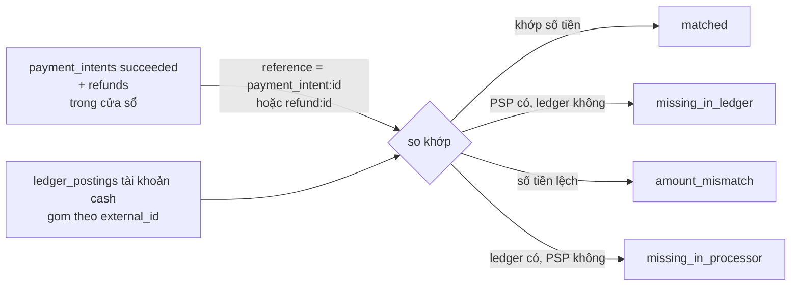

# UC-10 — Chốt kỳ: đọc báo cáo, đối chiếu, sửa sai

## Ai, muốn gì

Kế toán cuối kỳ cần ba việc: xem các chỉ số kinh doanh, **xác nhận tiền ở cổng thanh toán khớp với
tiền trên sổ**, và sửa một bút toán ghi sai — mà không được phép xoá gì.

Hai màn hình này là nơi duy nhất trong erp-ui dùng `ADMIN_API_KEY` thay vì `SECRET_API_KEY`.

## Điều kiện trước

| Cần có                                  | Từ đâu                                                                                           |
| --------------------------------------- | ------------------------------------------------------------------------------------------------ |
| Ít nhất một hoá đơn đã thu tiền         | [UC-05](./05-issue-and-collect-invoice.md)                                                       |
| Vài subscription `active` để MRR khác 0 | [UC-02](./02-subscribe-to-plan.md)                                                               |
| `ADMIN_API_KEY` trong `.env`            | Vite proxy gắn cho mọi đường `/api/*` — [vite.config.ts:17-21](../../apps/erp-ui/vite.config.ts) |

## Phần 1 — Reports

Trang `/reports` **không có thao tác nào**: hai query, sáu ô chỉ số, một khối đối chiếu. Cả hai dùng
chung một cửa sổ 30 ngày, `useMemo` một lần lúc mount
([ReportsPage.tsx:25-37](../../apps/erp-ui/src/pages/ReportsPage.tsx)) nên không đổi cho tới khi
tải lại trang.

### Sáu ô chỉ số

| Ô                              | Tính thế nào                                                              | Cạm bẫy khi đọc                                                                                                                      |
| ------------------------------ | ------------------------------------------------------------------------- | ------------------------------------------------------------------------------------------------------------------------------------ |
| **MRR**                        | tổng `buildMonthlyAmount(unitAmount × quantity, interval, intervalCount)` | chỉ tính subscription **`active`** (không `trialing`), và chỉ price có `unitAmount` — **giá theo bậc và giá metered không đóng góp** |
| **ARR**                        | `mrr × 12`                                                                | thừa hưởng mọi hạn chế của MRR                                                                                                       |
| Đang hoạt động / Đang dùng thử | đếm theo status                                                           | —                                                                                                                                    |
| **Churn trong kỳ**             | `canceled / (canceled + active)`                                          | mẫu số là **hiện tại**, không phải số đầu kỳ — xấp xỉ, không phải churn kế toán chuẩn                                                |
| **Còn phải thu**               | từ bảng `invoices`                                                        | —                                                                                                                                    |

Ba nguồn số tiền của trang này khác nhau, và đó là chủ ý:

| Số                                | Đọc từ                                                             |
| --------------------------------- | ------------------------------------------------------------------ |
| `invoicedInWindow`, `outstanding` | bảng `invoices`                                                    |
| `refundedInWindow`                | bảng `refunds`                                                     |
| `collectedInWindow`               | **sổ cái** (`aggregateCashMovement`), không phải `payment_intents` |

Sổ cái là nguồn sự thật về tiền đã vào — [flow 10](../flows/10-ledger.md).

### Khối đối chiếu

Câu hỏi nó trả lời: **những gì tầng thanh toán nói đã xảy ra, sổ cái có ghi đủ và đúng không.**



| Ngoại lệ               | Nghĩa là                                  | Nguyên nhân thường gặp                                                                                                        |
| ---------------------- | ----------------------------------------- | ----------------------------------------------------------------------------------------------------------------------------- |
| `missing_in_ledger`    | PSP đã trừ tiền, sổ chưa ghi              | tiến trình chết giữa hai transaction ở [UC-05](./05-issue-and-collect-invoice.md) hoặc [UC-07](./07-refund-vs-credit-note.md) |
| `missing_in_processor` | sổ có tiền vào, không có intent tương ứng | dùng `POST /invoices/:id/pay` — đường chuyển khoản tay ([UC-05](./05-issue-and-collect-invoice.md))                           |
| `amount_mismatch`      | cả hai có nhưng số lệch                   | ghi sổ sai số                                                                                                                 |

Khoá so khớp là chuỗi `external_id` mà invoice service và refund service đặt vào bút toán
(`payment_intent:<id>`, `refund:<id>`). Đây là **hợp đồng ngầm giữa ba service** — đổi định dạng ở
một nơi là làm hỏng đối chiếu ở nơi kia, và không test nào bắt được
([PITFALLS §3](../PITFALLS.md)).

### Hai giới hạn phải biết

**`SCAN_LIMIT = 1000`** — [reconciliation.service.ts:11](../../packages/modules/billing/src/services/reconciliation.service.ts).
Nó lấy 1000 hàng **mới nhất rồi mới lọc theo cửa sổ**, không phân trang. Với cửa sổ cũ hoặc dữ liệu
nhiều thì **có thể sót mà không báo gì**. Đừng dùng con số này làm bằng chứng kế toán khi dữ liệu đã
lớn.

**"Phía PSP" thực ra là bảng nội bộ.** `resolveProcessorMovements`
([reconciliation.service.ts:99-139](../../packages/modules/billing/src/services/reconciliation.service.ts)) đọc
`payment_intents` và `refunds` của chính hệ thống, **không** gọi ra PSP thật. Nó bắt được lệch giữa
_tầng thanh toán và sổ cái_, chưa bắt được lệch giữa _hệ thống và nhà cung cấp_.

UI còn cắt danh sách ngoại lệ ở 20 hàng
([ReportsPage.tsx:7](../../apps/erp-ui/src/pages/ReportsPage.tsx)).

## Phần 2 — Ledger và đảo bút toán

`/ledger` có hai phần: bảng số dư tài khoản, và danh sách bút toán gần đây với các posting của từng
cái.

### Số dư không được lưu

`ledger_account_balances` là một **view**, cộng từ `ledger_postings` mỗi lần đọc
([migration 0003](../../packages/modules/billing/migrations/0001_triggers_view_seed.sql)). Không có cột số dư,
nên không bao giờ lệch với các posting. Đổi lại: phải tính mỗi lần truy vấn.

### Đảo bút toán — thao tác hai bước

Đây là hành động duy nhất trong erp-ui cần **hai lần bấm có chủ ý**:

| #   | Ở đâu                                                                                              | Chuyện gì xảy ra                                                                     | Quan sát được gì                           |
| --- | -------------------------------------------------------------------------------------------------- | ------------------------------------------------------------------------------------ | ------------------------------------------ |
| 1   | UI [LedgerTransactionItem.tsx:36-39](../../apps/erp-ui/src/components/LedgerTransactionItem.tsx)   | bấm **Đảo bút toán** trên một giao dịch                                              | nút đổi sang `primary`                     |
| 2   | UI [LedgerPage.tsx:39-43](../../apps/erp-ui/src/pages/LedgerPage.tsx)                              | `handleOnTransactionSelect` toggle — bấm lại chính nó là bỏ chọn                     | —                                          |
| 3   | UI [LedgerPage.tsx:99-106](../../apps/erp-ui/src/pages/LedgerPage.tsx)                             | form lý do **chỉ mount khi đã chọn**                                                 | form xuất hiện phía trên danh sách         |
| 4   | UI [reverse-transaction-form.ts:5-7](../../apps/erp-ui/src/forms/reverse-transaction-form.ts)      | zod: `reason` **bắt buộc**, không được rỗng                                          | không có lý do thì không đảo được          |
| 5   | UI [LedgerPage.tsx:45-57](../../apps/erp-ui/src/pages/LedgerPage.tsx)                              | `handleOnSave` guard `selectedTransactionId` rồi gọi mutation, xong thì clear cả hai | —                                          |
| 6   | API [request.ts:41-50](../../apps/erp-ui/src/api/ledger/request.ts)                                | `POST /api/v1/admin/ledger/transactions/:id/reverse`                                 | —                                          |
| 7   | Service [ledger.service.ts:195-199](../../packages/modules/billing/src/services/ledger.service.ts) | đã bị đảo → 409                                                                      | —                                          |
| 8   | Service [ledger.service.ts:206-219](../../packages/modules/billing/src/services/ledger.service.ts) | sinh posting **đảo hướng** từng dòng gốc, cùng số tiền                               | —                                          |
| 9   | Service [ledger.service.ts:226](../../packages/modules/billing/src/services/ledger.service.ts)     | bản đảo có `externalId = null`                                                       | nếu không sẽ đụng unique index với bản gốc |
| 10  | Service [ledger.service.ts:270-276](../../packages/modules/billing/src/services/ledger.service.ts) | `linkLedgerReversal` ghi `reversed_by_transaction_id` lên bản gốc                    | —                                          |
| 11  | UI [LedgerTransactionItem.tsx:31-34](../../apps/erp-ui/src/components/LedgerTransactionItem.tsx)   | bản gốc hiện chip vàng "đã bị đảo", **mất** nút                                      | không đảo được hai lần                     |

Bước 8–10 là cách duy nhất "sửa" sổ: **không** UPDATE, không DELETE, mà thêm một giao dịch ngược
hướng. Sau khi đảo, cả hai giao dịch còn nguyên và nối với nhau qua
`reverses_transaction_id` / `reversed_by_transaction_id`.

`reversed_by_transaction_id` là **cột duy nhất** mà một giao dịch đã ghi được phép nhận thêm giá trị
— trigger trong [migration 0003](../../packages/modules/billing/migrations/0001_triggers_view_seed.sql) cho
phép riêng nó và chặn mọi cột khác.

## Mốc thời gian

| Xong ngay khi response trả về                              | Xảy ra sau, do worker                                                     |
| ---------------------------------------------------------- | ------------------------------------------------------------------------- |
| **Reports**: toàn bộ con số, không ghi gì                  | —                                                                         |
| **Đảo bút toán**: giao dịch đảo + posting + link hai chiều | outbox relay `ledger.transaction.reversed`                                |
| số dư trên view đổi ngay                                   | worker `ledger` kiểm sổ cân ở chu kỳ tới (`LEDGER_INTEGRITY_INTERVAL_MS`) |

Worker `ledger` chỉ **báo động, không tự sửa**: sổ lệch thì `log.error` kèm danh sách `transactionIds`
([ledger-integrity-check.processor.ts:19-22](../../apps/worker/src/workflows/processors/ledger-integrity-check.processor.ts)).
Đúng ra là vậy — sổ lệch là chuyện phải có người nhìn.

## Dữ liệu để lại

| Bảng                        | Reports         | Đảo bút toán                                                           |
| --------------------------- | --------------- | ---------------------------------------------------------------------- |
| —                           | **không gì cả** | —                                                                      |
| `ledger_transactions`       | —               | 1 hàng mới, `reverses_transaction_id` trỏ về gốc, `external_id = null` |
| `ledger_postings`           | —               | 1 hàng mỗi posting gốc, `direction` ngược lại                          |
| `ledger_transactions` (gốc) | —               | cập nhật **duy nhất** `reversed_by_transaction_id`                     |
| `outbox_events`             | —               | `ledger.transaction.reversed`                                          |

## Nhánh phụ và thất bại

| Tình huống                                 | Hệ quả                                                                                           |
| ------------------------------------------ | ------------------------------------------------------------------------------------------------ |
| Đảo một giao dịch đã bị đảo                | 409; UI đã ẩn nút                                                                                |
| Đảo bản đảo                                | **được** — nó chưa bị đảo, và kết quả đúng: về lại trạng thái ban đầu, ba giao dịch cùng tồn tại |
| Bỏ trống lý do                             | zod chặn, không có request                                                                       |
| Bấm **Đảo bút toán** rồi bấm lại cùng dòng | bỏ chọn, form biến mật                                                                           |
| Chọn dòng khác khi form đang mở            | form chuyển sang dòng mới, giữ nguyên lý do đang gõ                                              |
| `ADMIN_API_KEY` sai                        | 401 trên cả `/reports` và `/ledger`; `/v1` vẫn chạy bình thường                                  |
| MRR = 0 dù có subscription                 | thường vì subscription đang `trialing`, hoặc price là `tiered`/`metered`                         |

## Tự chạy thử

### Trên màn hình

1. Diễn xong [UC-05](./05-issue-and-collect-invoice.md) ít nhất một lần.
2. `/reports` → sáu ô chỉ số; khối đối chiếu có `matched` ≥ 1, `difference` = `0`, bảng ngoại lệ
   trống. Đó là trạng thái khoẻ.
3. `/ledger` → bảng số dư: `accounts_receivable` (theo khách), `cash`, `revenue`. Danh sách bút
   toán: hai giao dịch của UC-05, mỗi cái hai posting.
4. Bấm **Đảo bút toán** trên giao dịch `Invoice ... payment` → form lý do hiện ra → gõ lý do →
   **Xác nhận đảo**.
5. Giao dịch gốc có chip "đã bị đảo"; trên cùng danh sách có giao dịch mới `Reversal of ...`.
6. Bảng số dư: `cash` giảm về 0.
7. Quay lại `/reports`, **tải lại trang** → `collectedInWindow` giảm, và đối chiếu giờ báo
   `missing_in_ledger` cho `payment_intent:<id>` — vì intent vẫn `succeeded` mà sổ đã đảo.

Bước 7 là cách dựng một ngoại lệ đối chiếu có chủ ý, để thấy nó thực sự phát hiện được lệch.

### Tạo `missing_in_processor`

Dùng đường thanh toán tay mà UI không có
([UC-05](./05-issue-and-collect-invoice.md) § đường thứ hai):

```bash
set -a && . ./.env && set +a
API=http://localhost:3000
AUTH="Authorization: Bearer $SECRET_API_KEY"
JSON='content-type: application/json'
```

```bash
curl -s -X POST $API/v1/invoices/in_.../pay -H "$AUTH" -H "$JSON" \
  -H "Idempotency-Key: $(uuidgen)" -d '{}' \
  | jq '{number, status, amountPaid}'
```

Bút toán `cash` sinh ra với `external_id = invoice_payment:<id>:<amountPaid>` chứ không phải
`payment_intent:...`, nên đối chiếu báo `missing_in_processor`. Hành vi đúng, không phải lỗi.

### Bằng curl — hai route admin

Chú ý key khác:

```bash
ADMIN="Authorization: Bearer $ADMIN_API_KEY"
FROM=$(date -u -v-30d +%Y-%m-%dT%H:%M:%SZ 2>/dev/null || date -u -d '30 days ago' +%Y-%m-%dT%H:%M:%SZ)
TO=$(date -u -v+1d +%Y-%m-%dT%H:%M:%SZ 2>/dev/null || date -u -d '1 day' +%Y-%m-%dT%H:%M:%SZ)
```

```bash
curl -s "$API/api/v1/admin/reporting/revenue?windowStart=$FROM&windowEnd=$TO" -H "$ADMIN" \
  | jq '{mrr, arr, activeSubscriptions, trialingSubscriptions, churnRate, invoicedInWindow, collectedInWindow, refundedInWindow, outstanding}'
```

```bash
curl -s "$API/api/v1/admin/reporting/reconciliation?windowStart=$FROM&windowEnd=$TO" -H "$ADMIN" \
  | jq '{processorTotal, ledgerTotal, difference, matched, exceptions}'
```

Dùng `SECRET_API_KEY` cho hai lệnh này thì được 401 — đúng thiết kế phân tách key
([flow 01](../flows/01-request-lifecycle.md)).

Đảo bút toán:

```bash
curl -s -X POST $API/api/v1/admin/ledger/transactions/ltx_.../reverse -H "$ADMIN" -H "$JSON" \
  -H "Idempotency-Key: $(uuidgen)" \
  -d '{"reason":"Ghi sai kỳ, đảo lại"}' \
  | jq '{id, description, reversesTransactionId, postings: [.postings[] | {accountCode, direction, amount}]}'
```

### Kiểm chứng bằng SQL

Sổ có cân không — câu quan trọng nhất, phải trả về **rỗng**:

```bash
docker compose -f docker/compose.yml exec -T postgres psql -U vxrerp -d vxrerp -c \
"select transaction_id, sum(case when direction = 'debit' then amount else -amount end) as imbalance
 from billing.ledger_postings group by transaction_id having sum(case when direction = 'debit' then amount else -amount end) <> 0"
```

Số dư từng tài khoản, đúng như view mà UI đọc:

```bash
docker compose -f docker/compose.yml exec -T postgres psql -U vxrerp -d vxrerp -c \
"select a.code, a.customer_id, b.debits, b.credits, b.balance
 from billing.ledger_accounts a join billing.ledger_account_balances b on b.account_id = a.id order by a.code"
```

Cặp gốc ↔ đảo:

```bash
docker compose -f docker/compose.yml exec -T postgres psql -U vxrerp -d vxrerp -c \
"select id, description, external_id, reverses_transaction_id, reversed_by_transaction_id
 from billing.ledger_transactions order by created_at desc limit 6"
```

Tự làm đối chiếu bằng SQL, so với con số API trả về:

```bash
docker compose -f docker/compose.yml exec -T postgres psql -U vxrerp -d vxrerp -c \
"select t.external_id,
        sum(case when p.direction = 'debit' then p.amount else -p.amount end) as ledger_cash
 from billing.ledger_postings p
 join billing.ledger_transactions t on t.id = p.transaction_id
 join billing.ledger_accounts a on a.id = p.account_id
 where a.code = 'cash'
 group by t.external_id order by t.external_id"
```

Thử sửa sổ để thấy trigger chặn:

```bash
docker compose -f docker/compose.yml exec -T postgres psql -U vxrerp -d vxrerp -c \
"delete from billing.ledger_postings"
```

Postgres trả `ledger rows are append-only: DELETE on ledger_postings is not allowed, post a
reversing transaction instead`.

### Test tự động phủ phần này

`packages/modules/billing/tests/ledger.integration.test.ts` (9 test) — có một test dựng **một nghìn** giao dịch
ngẫu nhiên và kiểm mọi posting cộng về 0. `reporting.integration.test.ts` (10 test) phủ MRR, churn
và cả ba loại ngoại lệ đối chiếu.

## Đọc sâu hơn

- [flow 10 — Ledger](../flows/10-ledger.md) — 7 tài khoản, bất biến, `ensureAccount`
- [flow 11 — Reporting và reconciliation](../flows/11-reporting-reconciliation.md) — chi tiết từng truy vấn
- [PITFALLS §3](../PITFALLS.md) — hợp đồng ngầm `externalId`
- [ADR 0003](../adr/0003-phase-2-ledger.md), [ADR 0012](../adr/0012-phase-9-portal-reporting.md)
