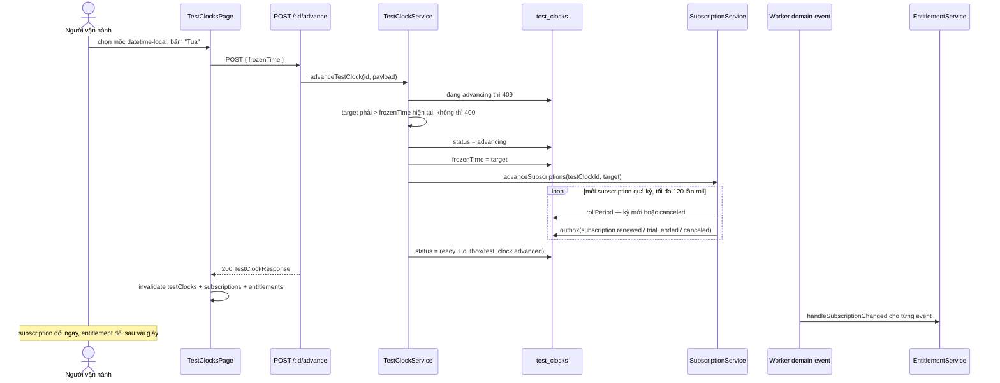

# UC-11 — Diễn lại một chu kỳ bằng test clock

## Ai, muốn gì

Người vận hành muốn thấy những thứ chỉ xảy ra **theo thời gian** — trial kết thúc, kỳ cuốn sang kỳ
mới, "hủy cuối kỳ" thực sự kết thúc — mà không phải chờ ngày thật.

Đây là use case dạy cách tự diễn lại mọi use case khác. Nó cũng là chỗ lộ ra rõ nhất **giới hạn** của
test clock trong codebase này: nó chỉ điều khiển được một service.

## Điều kiện trước

| Cần có                             | Từ đâu                                                              |
| ---------------------------------- | ------------------------------------------------------------------- |
| Một test clock                     | trang này                                                           |
| Một customer **gắn** `testClockId` | **phải dùng curl** — xem mục dưới                                   |
| Một subscription của khách đó      | [UC-02](./02-subscribe-to-plan.md) — kế thừa `testClockId` từ khách |

## Vì sao nó hoạt động

Không chỗ nào trong code nghiệp vụ gọi `new Date()` để lấy giờ hiện tại. Giờ luôn đi qua
`fastify.clock`, decorate một lần ở
[config.plugin.ts:34](../../packages/platform/src/plugins/config.plugin.ts).

`SubscriptionService` đi thêm một bước: `resolveNow` —
[subscription.service.ts:398-410](../../packages/modules/billing/src/services/subscription.service.ts) — không
có `testClockId` thì `clock.now()`, có thì đọc `frozenTime` của đồng hồ.

## Hai chỗ hổng phải biết trước

**1. Form tạo test clock luôn đóng băng ở "bây giờ".**
[test-clock-form.ts:17-22](../../apps/erp-ui/src/forms/test-clock-form.ts) chỉ có field `name`;
`frozenTime` bị hard-code `new Date().toISOString()`. Muốn đồng hồ bắt đầu ở một mốc quá khứ hoặc
tương lai thì phải gọi API.

**2. Không có UI gắn đồng hồ vào khách.** `customers` có cột `test_clock_id` và
`CreateCustomerPayload` nhận nó, nhưng form customer chỉ có email và tên
([UC-01](./01-onboard-customer-and-catalog.md)). Nên **bước bắt buộc phải làm bằng curl**, và không
có cách nào khác.

Hệ quả: trang `/billing/test-clocks` một mình không đủ để diễn kịch bản. Luôn cần curl ở giữa.

## Sơ đồ



## Kịch bản chính

| #   | Ở đâu                                                                                                       | Chuyện gì xảy ra                                                                      | Quan sát được gì                                                                                             |
| --- | ----------------------------------------------------------------------------------------------------------- | ------------------------------------------------------------------------------------- | ------------------------------------------------------------------------------------------------------------ |
| 1   | UI [TestClockItem.tsx:38-43](../../apps/erp-ui/src/components/TestClockItem.tsx)                            | mỗi dòng có một `<input type="datetime-local">` riêng                                 | mốc lưu trong `Record<id, string>` — [TestClocksPage.tsx:21](../../apps/erp-ui/src/pages/TestClocksPage.tsx) |
| 2   | UI [TestClocksPage.tsx:44-58](../../apps/erp-ui/src/pages/TestClocksPage.tsx)                               | `handleOnAdvance` — chưa chọn mốc thì `return` im lặng                                | bấm "Tua" khi input trống: không gì xảy ra                                                                   |
| 3   | Service [test-clock.service.ts:76-78](../../packages/modules/billing/src/services/test-clock.service.ts)    | đang `advancing` → 409                                                                | khoá chống chạy chồng                                                                                        |
| 4   | Service [test-clock.service.ts:82-87](../../packages/modules/billing/src/services/test-clock.service.ts)    | mốc mới phải **sau** mốc hiện tại, không thì 400                                      | đồng hồ chỉ đi tới, không lùi                                                                                |
| 5   | Service [test-clock.service.ts:89-96](../../packages/modules/billing/src/services/test-clock.service.ts)    | `status = advancing`, ghi `frozenTime`, rồi `advanceSubscriptions`                    | —                                                                                                            |
| 6   | Service [advanceSubscriptions:276-291](../../packages/modules/billing/src/services/subscription.service.ts) | lấy subscription **của đồng hồ này**, chưa huỷ, `currentPeriodEnd <= now`, tối đa 500 | —                                                                                                            |
| 7   | Service [rollPeriod:313-348](../../packages/modules/billing/src/services/subscription.service.ts)           | lặp tới khi `currentPeriodEnd > now`, tối đa `MAX_PERIOD_ROLLS = 120`                 | nhảy xa mấy cũng không treo                                                                                  |
| 8   | Service [test-clock.service.ts:105-129](../../packages/modules/billing/src/services/test-clock.service.ts)  | transaction cuối: `status = ready` + `test_clock.advanced`                            | —                                                                                                            |
| 9   | Hook [mutations.ts:36-38](../../apps/erp-ui/src/reactquery/test-clocks/mutations.ts)                        | invalidate testClocks + subscriptions + entitlements                                  | trang này và `/billing/subscriptions` đều mới theo                                                           |

### Ba nhánh của mỗi lần roll

[rollPeriod:313-348](../../packages/modules/billing/src/services/subscription.service.ts):

| Trạng thái trước           | Kết quả                           | Event                      |
| -------------------------- | --------------------------------- | -------------------------- |
| `cancelAtPeriodEnd = true` | `canceled`, `endedAt = periodEnd` | `subscription.canceled`    |
| `trialing`                 | `active`, kỳ mới                  | `subscription.trial_ended` |
| còn lại                    | `active`, kỳ mới                  | `subscription.renewed`     |

Mốc của kỳ mới là `periodEnd` **cũ**, không phải `now` — nên nhảy nhiều kỳ liền vẫn ra đúng lưới thời
gian, không trôi dần.

## Cái gì KHÔNG chạy theo đồng hồ

Đây là phần quan trọng nhất của use case, và là chỗ dễ mất thời gian nhất nếu không biết trước.

| Thành phần            | Dùng giờ nào                                           |
| --------------------- | ------------------------------------------------------ |
| `SubscriptionService` | **`frozenTime`** nếu có `testClockId`                  |
| `InvoiceService`      | giờ thật (`clock.now()`)                               |
| `PaymentService`      | giờ thật                                               |
| `DunningService`      | giờ thật                                               |
| Billing run (worker)  | giờ thật                                               |
| `RatingService`       | đọc kỳ từ subscription, nhưng cửa sổ usage theo mốc đó |

Hệ quả cụ thể:

- Đẩy đồng hồ tới **tháng sau** thì subscription sang kỳ mới, nhưng **billing run sẽ không tạo hoá
  đơn** cho kỳ đó — nó so `currentPeriodEnd <= runAt` với `runAt` là **giờ thật**, và kỳ mới lúc này
  nằm ở tương lai. Muốn có hoá đơn thì gọi `POST /v1/invoices` thẳng.
- Tương tự, dunning không bao giờ chạy theo đồng hồ giả. Muốn thử dunning thì sửa `next_attempt_at`
  trong DB — [UC-06](./06-handle-declined-card.md).

Nói gọn: **test clock điều khiển chu kỳ subscription, không điều khiển các job nền.**

## Mốc thời gian

| Xong ngay khi 200 trả về                               | Xảy ra sau, do worker                                                                 |
| ------------------------------------------------------ | ------------------------------------------------------------------------------------- |
| `test_clocks.frozen_time` = mốc mới, `status = ready`  | outbox relay `subscription.renewed`/`trial_ended`/`canceled` và `test_clock.advanced` |
| `subscriptions` đã cuốn kỳ, status đã đổi              | `entitlements` đồng bộ lại (worker `domain-event`)                                    |
| bảng `/billing/subscriptions` đúng ngay sau invalidate | webhook delivery nếu có endpoint đăng ký — [UC-09](./09-receive-webhooks.md)          |

## Trạng thái kẹt duy nhất trong hệ thống

Bước 5 — ghi `frozenTime` rồi gọi `advanceSubscriptions` — **không** nằm trong transaction cùng bước 8. Tiến trình chết giữa hai bước thì `frozenTime` đã nhảy nhưng `status` kẹt ở `advancing`, và **mọi
lần "Tua" sau đó đều 409**.

Nhánh `catch` ([test-clock.service.ts:97-103](../../packages/modules/billing/src/services/test-clock.service.ts))
chỉ hoàn nguyên `status`, **không** hoàn nguyên `frozenTime` — nên nếu `advanceSubscriptions` lỗi thì
đồng hồ vẫn ở mốc mới dù subscription chưa được cuốn kỳ.

Gỡ kẹt bằng tay:

```bash
docker compose -f docker/compose.yml exec -T postgres psql -U vxrerp -d vxrerp -c \
"update billing.test_clocks set status = 'ready' where status = 'advancing'"
```

## Dữ liệu để lại

| Bảng            | Hàng                                         | Giá trị đáng chú ý                                              |
| --------------- | -------------------------------------------- | --------------------------------------------------------------- |
| `test_clocks`   | 1 khi tạo, cập nhật khi tua                  | `frozen_time`, `status` (`ready`/`advancing`)                   |
| `subscriptions` | cập nhật mỗi lần roll                        | `current_period_start/end` dịch lên, có thể `status = canceled` |
| `outbox_events` | 1 mỗi lần roll + 1 cho `test_clock.advanced` | nhảy 3 kỳ = 3 event subscription                                |
| `entitlements`  | cập nhật — **muộn**                          | `revoked` nếu subscription đã huỷ cuối kỳ                       |

## Nhánh phụ và thất bại

| Tình huống                                 | Hệ quả                                                       |
| ------------------------------------------ | ------------------------------------------------------------ |
| Tua về mốc quá khứ hoặc trùng mốc hiện tại | 400 `A test clock only moves forward`                        |
| Tua khi đang `advancing`                   | 409                                                          |
| Input mốc để trống                         | nút không làm gì                                             |
| Khách **không** gắn `testClockId`          | tua đồng hồ không ảnh hưởng gì tới subscription của khách đó |
| Nhảy quá xa (ví dụ 20 năm)                 | dừng ở 120 lần roll, subscription có thể vẫn ở quá khứ       |
| Subscription đã `canceled`                 | bị loại khỏi truy vấn, không roll                            |

## Tự chạy thử

### Kịch bản đầy đủ: trial 7 ngày kết thúc, rồi gia hạn

```bash
set -a && . ./.env && set +a
API=http://localhost:3000
AUTH="Authorization: Bearer $SECRET_API_KEY"
JSON='content-type: application/json'
```

**1. Tạo đồng hồ** — trên UI (`/billing/test-clocks`, điền tên, **Tạo test clock**), hoặc bằng curl nếu muốn
mốc bắt đầu khác "bây giờ":

```bash
CLOCK=$(curl -s -X POST $API/v1/test_helpers/test_clocks -H "$AUTH" -H "$JSON" \
  -H "Idempotency-Key: $(uuidgen)" \
  -d '{"name":"Kịch bản trial","frozenTime":"2026-01-01T00:00:00.000Z"}' | jq -r '.id')
echo "$CLOCK"
```

**2. Khách gắn đồng hồ** — bước bắt buộc dùng curl:

```bash
CUS=$(curl -s -X POST $API/v1/customers -H "$AUTH" -H "$JSON" \
  -H "Idempotency-Key: $(uuidgen)" \
  -d "{\"email\":\"trial@congty.vn\",\"name\":\"Khách test clock\",\"currency\":\"vnd\",\"testClockId\":\"$CLOCK\"}" \
  | jq -r '.id')
```

**3. Subscription trial 7 ngày** — dùng price recurring từ [UC-01](./01-onboard-customer-and-catalog.md):

```bash
SUB=$(curl -s -X POST $API/v1/subscriptions -H "$AUTH" -H "$JSON" \
  -H "Idempotency-Key: $(uuidgen)" \
  -d "{\"customerId\":\"$CUS\",\"items\":[{\"priceId\":\"price_...\"}],\"trialPeriodDays\":7}" \
  | jq -r '.id')

curl -s $API/v1/subscriptions/$SUB -H "$AUTH" \
  | jq '{status, trialEnd, currentPeriodStart, currentPeriodEnd}'
```

Chú ý: `currentPeriodStart` là `2026-01-01` — **giờ của đồng hồ**, không phải hôm nay. Đó là bằng
chứng `resolveNow` hoạt động.

**4. Tua qua ngày hết trial:**

```bash
curl -s -X POST $API/v1/test_helpers/test_clocks/$CLOCK/advance -H "$AUTH" -H "$JSON" \
  -H "Idempotency-Key: $(uuidgen)" \
  -d '{"frozenTime":"2026-01-09T00:00:00.000Z"}' | jq '{frozenTime, status}'

curl -s $API/v1/subscriptions/$SUB -H "$AUTH" \
  | jq '{status, trialEnd, currentPeriodStart, currentPeriodEnd}'
```

Status từ `trialing` thành **`active`**, kỳ mới bắt đầu đúng tại `trialEnd`. Event
`subscription.trial_ended` đã vào outbox.

**5. Tua qua hai kỳ nữa:**

```bash
curl -s -X POST $API/v1/test_helpers/test_clocks/$CLOCK/advance -H "$AUTH" -H "$JSON" \
  -H "Idempotency-Key: $(uuidgen)" \
  -d '{"frozenTime":"2026-03-15T00:00:00.000Z"}' | jq '.frozenTime'

curl -s $API/v1/subscriptions/$SUB -H "$AUTH" | jq '{status, currentPeriodStart, currentPeriodEnd}'
```

Nhảy hai tháng trong **một** lệnh: `rollPeriod` chạy hai lần, sinh hai event `subscription.renewed`,
và kỳ cuối vẫn nằm đúng trên lưới ngày mùng 9 — không trôi.

**6. Xem "hủy cuối kỳ" thực sự kết thúc** — điều [UC-08](./08-cancel-subscription.md) nói là chỉ
thấy được ở đây:

```bash
curl -s -X DELETE $API/v1/subscriptions/$SUB -H "$AUTH" -H "$JSON" \
  -H "Idempotency-Key: $(uuidgen)" -d '{"cancelAtPeriodEnd":true}' \
  | jq '{status, cancelAtPeriodEnd}'

curl -s -X POST $API/v1/test_helpers/test_clocks/$CLOCK/advance -H "$AUTH" -H "$JSON" \
  -H "Idempotency-Key: $(uuidgen)" \
  -d '{"frozenTime":"2026-05-01T00:00:00.000Z"}' > /dev/null

curl -s $API/v1/subscriptions/$SUB -H "$AUTH" | jq '{status, endedAt}'
```

Status thành `canceled`, `endedAt` là **cuối kỳ** chứ không phải lúc bấm huỷ.

### Trên màn hình

Sau khi đã gắn đồng hồ bằng curl ở bước 2, phần còn lại làm được hết trên UI:

1. `/billing/test-clocks` → chọn mốc ở input `datetime-local` → **Tua**.
2. `/billing/subscriptions` → status và cột "Kỳ hiện tại" đã đổi.
3. Chờ vài giây, F5 → bảng Entitlements cập nhật theo.
4. `/billing/webhooks` → nếu đã đăng ký `subscription.renewed` ([UC-09](./09-receive-webhooks.md)) thì thấy
   delivery mới.

### Kiểm chứng bằng SQL

Đồng hồ và các subscription gắn nó:

```bash
docker compose -f docker/compose.yml exec -T postgres psql -U vxrerp -d vxrerp -c \
"select c.id, c.name, c.frozen_time, c.status, count(s.id) as subscriptions
 from billing.test_clocks c left join billing.subscriptions s on s.test_clock_id = c.id
 group by c.id, c.name, c.frozen_time, c.status order by c.created_at desc"
```

Chuỗi event sinh ra từ các lần tua — đọc từ dưới lên là đúng thứ tự thời gian:

```bash
docker compose -f docker/compose.yml exec -T postgres psql -U vxrerp -d vxrerp -c \
"select event_type, status, occurred_at from platform.outbox_events
 where aggregate_type in ('subscription','test_clock') order by occurred_at desc limit 15"
```

So giờ đồng hồ với giờ thật — thấy rõ hai trục thời gian tồn tại song song:

```bash
docker compose -f docker/compose.yml exec -T postgres psql -U vxrerp -d vxrerp -c \
"select s.id, s.current_period_end, now() as real_now,
        s.current_period_end > now() as period_in_future
 from billing.subscriptions s where s.test_clock_id is not null"
```

`period_in_future = t` giải thích tại sao billing run không chạm vào subscription này.

### Test tự động

`packages/modules/billing/src/utils/billing-period.test.ts` (6 test) phủ `advancePeriod` và
`countPeriodsElapsed`, kể cả ca 31/01 + 1 tháng.
`packages/modules/billing/tests/subscriptions.integration.test.ts` phủ cuốn kỳ qua test clock.

## Đọc sâu hơn

- [technique 03 — Test clock](../technique/03-test-clock.md) — kỹ thuật đứng sau: vấn đề, hai tầng thời gian, điều kiện phải giữ
- [flow 12 — Test clock](../flows/12-test-clock.md) — chi tiết `resolveNow`, trạng thái kẹt
- [flow 04 — Subscription](../flows/04-subscription-entitlement.md) — `rollPeriod`, `advancePeriod`, `MAX_PERIOD_ROLLS`
- [UC-08](./08-cancel-subscription.md) — nhánh "hủy cuối kỳ" mà use case này làm cho thấy được
- [PITFALLS §1](../PITFALLS.md) — vì sao `new Date()` trong service là lỗi âm thầm
